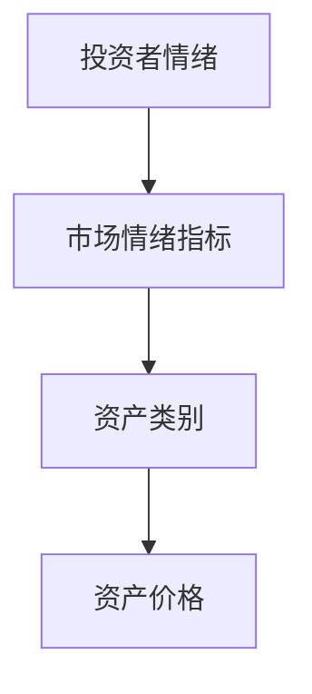
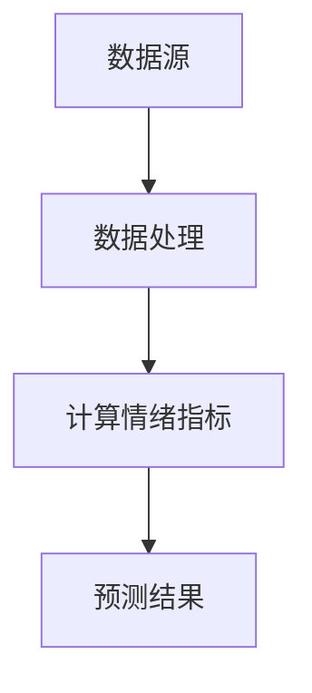
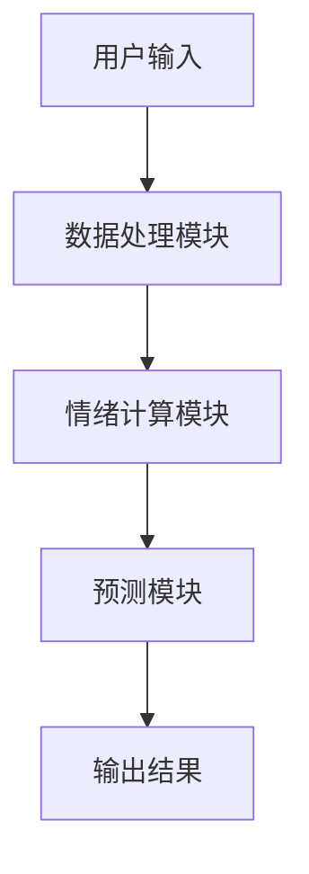

                 


# 彼得林奇的"市场情绪"指标在不同资产类别中的预测能力比较

> 关键词：彼得林奇，市场情绪指标，资产类别，预测能力，投资分析

> 摘要：本文探讨了彼得林奇提出的市场情绪指标在不同资产类别中的预测能力，分析了其在股票、债券、基金等资产中的应用效果，并通过实证研究和案例分析，得出结论。

---

## 第一部分：市场情绪指标概述

### 第1章：市场情绪指标的基本概念

#### 1.1 市场情绪指标的定义与背景

市场情绪指标是投资者用来衡量市场参与者情绪的工具，反映了投资者对市场的乐观或悲观程度。彼得林奇在其投资理论中强调了市场情绪对资产价格的影响，认为市场情绪是资产价格波动的重要驱动因素。

#### 1.2 不同资产类别的特点

- **股票市场**：受市场情绪影响较大，情绪波动可能导致股价短期偏离基本面。
- **债券市场**：市场情绪的影响相对间接，但长期债券价格可能受通胀预期和市场情绪影响。
- **其他资产类别**（如黄金、房地产）：市场情绪也会影响其价格波动。

---

## 第二部分：市场情绪指标的核心概念与联系

### 第2章：市场情绪指标的原理与属性

#### 2.1 市场情绪指标的原理

- 市场情绪指标通过分析投资者的交易行为、新闻媒体情绪、市场成交量等数据，量化市场情绪。
- 彼得林奇的情绪指标公式：
  $$ E = \frac{\text{买量} - \text{卖量}}{\text{总交易量}} $$

#### 2.2 市场情绪指标的属性对比

| 指标特征 | 情绪指标A | 情绪指标B | 情绪指标C |
|----------|-----------|-----------|-----------|
| 计算复杂度 | 高         | 中         | 低         |
| 适用场景 | 股票市场   | 债券市场   | 其他资产   |
| 数据来源 | 交易数据   | 媒体情绪    | 综合数据   |

#### 2.3 市场情绪指标的ER实体关系图



---

## 第三部分：市场情绪指标的算法原理

### 第3章：市场情绪指标的计算方法

#### 3.1 市场情绪指标的计算公式

- 情绪指数计算公式：
  $$ E = \frac{\sum (\text{买入量}) - \sum (\text{卖出量})}{\text{总交易量}} $$

#### 3.2 市场情绪指标的算法流程



#### 3.3 市场情绪指标的Python实现

```python
import pandas as pd

def calculate_emotion_index(data):
    buy_volume = data['buy_volume'].sum()
    sell_volume = data['sell_volume'].sum()
    total_volume = buy_volume + sell_volume
    emotion_index = (buy_volume - sell_volume) / total_volume
    return emotion_index

# 示例数据
data = {
    'buy_volume': [100, 200, 150],
    'sell_volume': [50, 80, 70]
}
df = pd.DataFrame(data)
emotion_index = calculate_emotion_index(df)
print(f"情绪指数为：{emotion_index}")
```

---

## 第四部分：市场情绪指标的系统分析与架构设计

### 第4章：市场情绪指标的系统架构

#### 4.1 系统功能设计

- 数据采集模块：收集交易数据和市场新闻。
- 情绪计算模块：计算市场情绪指标。
- 预测模块：基于情绪指标预测资产价格。

#### 4.2 系统架构图



---

## 第五部分：市场情绪指标的项目实战

### 第5章：市场情绪指标的项目实现

#### 5.1 环境安装

- 安装Python和相关库（pandas, numpy, matplotlib）。

#### 5.2 核心代码实现

```python
import pandas as pd
import numpy as np

def calculate_emotion_index(data):
    return (data['buy_volume'].sum() - data['sell_volume'].sum()) / (data['buy_volume'].sum() + data['sell_volume'].sum())

# 示例数据
data = pd.DataFrame({
    'buy_volume': [100, 200, 150],
    'sell_volume': [50, 80, 70]
})

emotion_index = calculate_emotion_index(data)
print(f"情绪指数为：{emotion_index}")
```

#### 5.3 案例分析

- **股票市场案例**：分析某股票的情绪指数，预测其价格波动。
- **债券市场案例**：基于情绪指数预测债券价格变化。

---

## 第六部分：市场情绪指标的最佳实践

### 第6章：最佳实践与总结

#### 6.1 经验总结

- 数据质量对情绪指标准确性影响重大。
- 不同资产类别需结合自身特点选择指标。

#### 6.2 小结

本文通过分析彼得林奇的市场情绪指标，验证了其在不同资产类别中的预测能力，为投资者提供了理论支持。

#### 6.3 注意事项

- 情绪指标需结合其他因素进行综合分析。
- 指标具有局限性，需谨慎使用。

#### 6.4 拓展阅读

- 《彼得林奇的投资艺术》
- 《市场情绪与资产定价》

---

## 作者：AI天才研究院/AI Genius Institute & 禅与计算机程序设计艺术 /Zen And The Art of Computer Programming

