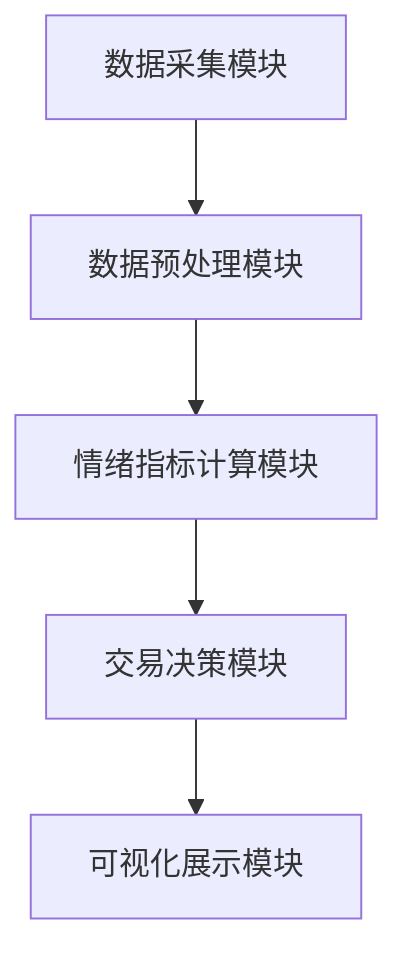
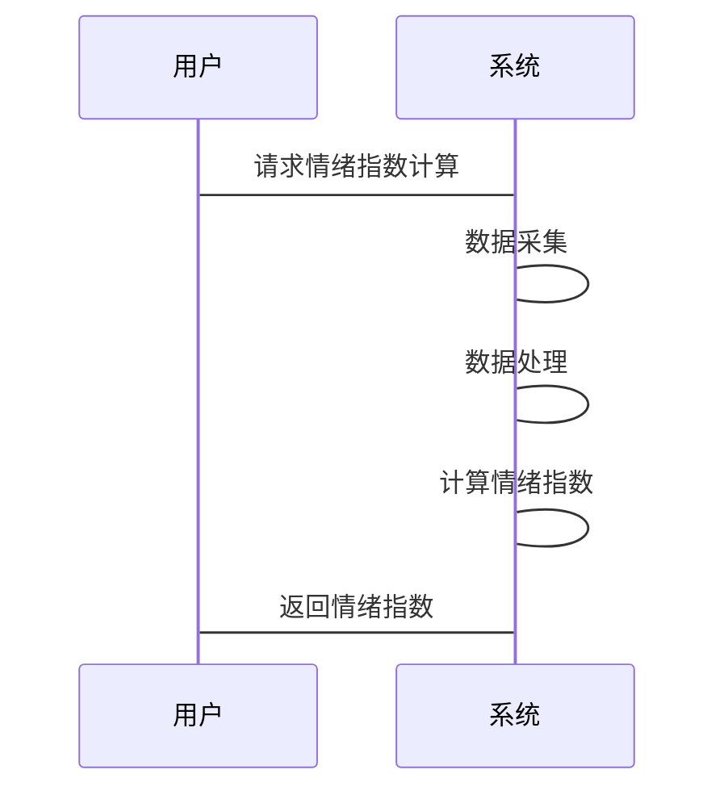

                 


# 彼得林奇的"市场情绪"指标在交易决策中的应用

---

## 关键词
- 彼得林奇
- 市场情绪
- 交易决策
- 投资策略
- 情绪指标
- 量化交易

---

## 摘要
本文深入探讨了彼得·林奇的“市场情绪”指标在交易决策中的应用。文章从市场情绪的基本概念出发，详细分析了林奇市场情绪指标的核心要素、数学模型和算法实现。通过结合实际案例和系统架构设计，本文展示了如何将市场情绪指标应用于量化交易系统中，并提供了具体的代码实现和实战指导。最后，文章总结了市场情绪指标在交易中的优势与局限性，并提出了最佳实践建议。

---

# 第一部分：市场情绪与交易决策的背景介绍

## 第1章：市场情绪的基本概念

### 1.1 市场情绪的定义与构成
#### 1.1.1 市场情绪的定义
市场情绪是指投资者在市场中的心理状态和行为倾向，通常表现为乐观、悲观、恐慌或贪婪等情绪。这些情绪通过投资者的交易行为反映在市场价格波动中。

#### 1.1.2 市场情绪的构成要素
- **投资者心理**：包括贪婪、恐惧等基本情绪。
- **市场行为**：如成交量、价格波动等。
- **市场环境**：如经济数据、政策变化等外部因素。

#### 1.1.3 市场情绪与市场行为的关系
市场情绪直接影响投资者的交易决策，进而影响市场价格和成交量。例如，乐观的市场情绪会推高股价，而悲观的情绪则会导致股价下跌。

### 1.2 彼得·林奇的交易理念
#### 1.2.1 彼得·林奇的生平简介
彼得·林奇是美国著名投资家，曾任富达麦哲伦基金的经理，以长期优异的投资业绩闻名。

#### 1.2.2 林奇的投资哲学
林奇强调长期投资、分散投资和深入研究企业的基本面。他认为，市场情绪是影响短期价格波动的重要因素，但长期投资应基于企业的内在价值。

#### 1.2.3 林奇对市场情绪的研究与应用
林奇通过分析市场情绪的变化，寻找市场的拐点和投资机会。他认为，市场情绪的极端值往往预示着市场的反转。

## 第2章：市场情绪指标的定义与分类

### 2.1 市场情绪指标的定义
市场情绪指标是通过量化投资者情绪来反映市场心理状态的指标。这些指标通常基于市场数据（如成交量、价格波动）或外部数据（如媒体情绪）进行计算。

### 2.2 市场情绪指标的分类
- **技术指标类情绪指标**：如相对强弱指数（RSI）、波动率等。
- **市场参与度类情绪指标**：如成交量、换手率等。
- **媒体情绪分析类指标**：通过分析媒体和社交媒体的情绪进行量化。

## 第3章：市场情绪与交易决策的关系

### 3.1 市场情绪对交易决策的影响
#### 3.1.1 情绪如何影响市场走势
市场情绪的波动会导致价格的短期波动。例如，乐观情绪会导致价格上涨，而悲观情绪则会导致价格下跌。

#### 3.1.2 情绪指标在交易中的应用
情绪指标可以帮助交易者识别市场的超买或超卖状态，从而做出买卖决策。

### 3.2 林奇市场情绪指标的理论基础
#### 3.2.1 市场情绪的周期性
市场情绪具有周期性，通常在乐观和悲观之间交替波动。

#### 3.2.2 市场情绪与市场波动的关系
市场情绪的波动会导致市场的波动性增加或减少。例如，乐观情绪会导致市场波动性增加。

#### 3.2.3 林奇指标的数学模型
林奇市场情绪指标的数学模型基于市场情绪的量化和动态调整。

---

# 第二部分：林奇市场情绪指标的数学模型与算法

## 第4章：林奇市场情绪指标的核心要素

### 4.1 指数构成
#### 4.1.1 林奇市场情绪指数的定义
林奇市场情绪指数（LMEI）是通过量化市场情绪来反映市场心理状态的指标。

#### 4.1.2 构成指数的主要成分
- 市场波动率
- 成交量
- 技术指标（如RSI）

#### 4.1.3 指数的计算方法
$$ LMEI = \alpha \cdot \text{波动率} + \beta \cdot \text{成交量} + \gamma \cdot \text{技术指标} $$

### 4.2 指标的动态调整
#### 4.2.1 动态权重的计算方法
权重根据市场环境的变化进行动态调整。

#### 4.2.2 情绪指数的平滑处理
通过移动平均等方法对情绪指数进行平滑处理。

#### 4.2.3 基于时间序列的调整模型
使用ARIMA模型对情绪指数进行预测和调整。

## 第5章：林奇市场情绪指标的算法实现

### 5.1 数据采集与预处理
#### 5.1.1 数据来源
- 历史价格数据
- 成交量数据
- 技术指标数据

#### 5.1.2 数据清洗
- 处理缺失值
- 异常值剔除

### 5.2 算法实现
#### 5.2.1 情绪指数的计算
$$ \text{情绪指数} = \sum_{i=1}^{n} w_i \cdot x_i $$
其中，$w_i$ 是权重，$x_i$ 是各成分指标的值。

#### 5.2.2 动态调整
通过机器学习模型（如线性回归）对权重进行动态调整。

#### 5.2.3 可视化
使用图表展示情绪指数的变化趋势。

### 5.3 代码实现
```python
import pandas as pd
import numpy as np

def calculate_emotion_index(data, window=20):
    # 计算波动率
    volatility = data['close'].pct_change().std()
    # 计算成交量
    volume = data['volume'].mean()
    # 计算技术指标（RSI）
    rsi = data['close'].diff().apply(lambda x: x.rolling(window).mean())
    # 计算情绪指数
    emotion_index = volatility + volume + rsi.mean()
    return emotion_index
```

---

# 第三部分：系统架构与项目实战

## 第6章：系统架构设计

### 6.1 系统功能设计
- 数据采集模块
- 情绪指标计算模块
- 交易决策模块
- 可视化展示模块

### 6.2 系统架构图


### 6.3 接口设计
- 数据接口：从数据库获取历史数据
- 计算接口：计算情绪指数并返回结果
- 决策接口：根据情绪指数生成交易信号

### 6.4 交互流程


## 第7章：项目实战

### 7.1 环境安装
- 安装必要的Python库（如pandas、numpy、matplotlib）

### 7.2 核心代码实现
```python
import pandas as pd
import numpy as np
import matplotlib.pyplot as plt

# 示例数据
data = pd.DataFrame({
    'close': [100, 102, 101, 98, 95, 97, 100, 105, 103, 102],
    'volume': [1000, 1200, 800, 1500, 1800, 1300, 1100, 900, 1400, 1200]
})

# 计算波动率
volatility = data['close'].pct_change().std()

# 计算成交量
volume = data['volume'].mean()

# 计算RSI
def calculate_rsi(series, window=20):
    delta = series.diff().fillna(0)
    up = delta.where(delta > 0, 0)
    down = delta.where(delta < 0, 0)
    rs = up.rolling(window).mean() / down.rolling(window).mean()
    rsi = 100 - 50 * (1 - rs)
    return rsi

rsi = calculate_rsi(data['close'], 5)

# 计算情绪指数
emotion_index = volatility + volume + rsi.mean()
print("情绪指数:", emotion_index)

# 可视化
plt.plot(rsi)
plt.title('RSI曲线')
plt.show()
```

### 7.3 案例分析
通过实际数据计算情绪指数，并分析其在交易决策中的应用。

### 7.4 项目小结
总结项目实现的关键步骤和成果，分析可能存在的问题及改进方向。

---

# 第四部分：最佳实践与总结

## 第8章：最佳实践

### 8.1 小结
林奇市场情绪指标是一种有效的量化工具，能够帮助交易者更好地理解市场心理。

### 8.2 注意事项
- 情绪指标只能作为参考，不能单独使用。
- 需要结合其他指标进行综合分析。

### 8.3 拓展阅读
推荐相关书籍和论文，进一步深入学习市场情绪分析。

---

## 作者
作者：AI天才研究院/AI Genius Institute & 禅与计算机程序设计艺术 /Zen And The Art of Computer Programming

