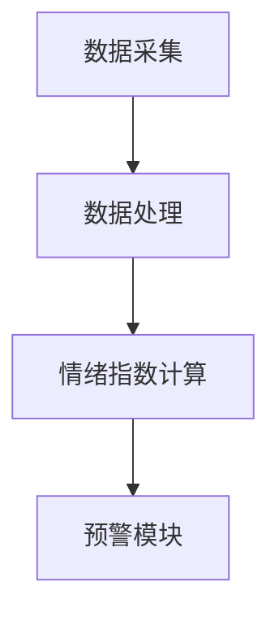
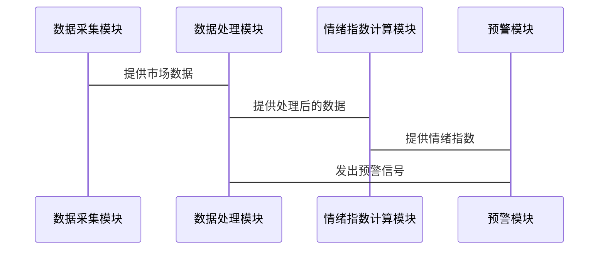

                 


# 彼得林奇的"市场情绪"指标在危机预警中的应用

**关键词**: 市场情绪指标, 危机预警, 彼得·林奇, 投资者情绪, 量化分析

**摘要**: 本文深入探讨了彼得·林奇提出的市场情绪指标在金融危机预警中的应用。通过分析市场情绪的量化方法、算法原理及系统架构，结合实际案例，展示了如何利用市场情绪指标预测和应对潜在的市场危机。文章结构清晰，内容详实，适合对金融分析和风险管理感兴趣的技术人员和投资者阅读。

---

# 第一部分: 背景介绍与核心概念

## 第1章: 市场情绪指标的背景与意义

### 1.1 市场情绪指标的定义与背景

#### 1.1.1 什么是市场情绪
市场情绪是指投资者在市场中的整体心理状态，通常表现为乐观、悲观、恐慌或贪婪。这些情绪会直接影响投资者的决策行为，进而影响市场的价格波动。市场情绪指标是对这种情绪的量化表现。

#### 1.1.2 市场情绪与投资决策的关系
市场情绪是连接市场行为和价格变化的桥梁。投资者的情绪波动会导致市场波动加剧或萎靡不振。例如，当市场情绪从乐观转向悲观时，可能导致市场出现抛售潮，从而引发价格下跌。

#### 1.1.3 彼得·林奇市场情绪理论的核心观点
彼得·林奇在其投资理论中强调，市场情绪是市场波动的重要驱动因素。他认为，市场情绪的极端化（如过度乐观或过度悲观）往往是市场危机的前兆。

### 1.2 危机预警的必要性

#### 1.2.1 金融危机的特征与表现
金融危机通常表现为市场崩盘、资产价格暴跌、流动性枯竭等。这些现象往往伴随着投资者情绪的急剧恶化。

#### 1.2.2 市场情绪在危机预警中的作用
市场情绪指标可以作为早期预警信号，帮助投资者和监管机构提前识别潜在的市场风险。例如，当市场情绪指数急剧下降时，可能预示着市场即将出现大幅调整。

#### 1.2.3 危机预警的边界与外延
市场情绪指标虽然能够提供有用的预警信息，但其预测能力并非完美。市场情绪指标需要结合其他因素（如经济基本面）进行综合分析，才能更准确地预测市场走势。

---

## 第2章: 市场情绪指标的核心要素与结构

### 2.1 市场情绪指标的核心要素

#### 2.1.1 投资者情绪的量化
市场情绪的量化通常通过以下几个方面进行：
- 投资者信心指数
- 市场参与度（成交量、持仓量等）
- 市场波动率（如VIX指数）

#### 2.1.2 市场参与度的度量
市场参与度反映了投资者对市场的热情程度。高市场参与度通常意味着市场情绪较为乐观，反之则表示市场情绪较为悲观。

#### 2.1.3 市场波动性的分析
市场波动率是衡量市场情绪的重要指标。高波动率通常伴随着市场情绪的剧烈波动，可能是市场危机的前兆。

### 2.2 市场情绪指标的结构与组成

#### 2.2.1 情绪指数的构建逻辑
市场情绪指数的构建通常基于多个指标的加权平均。例如，可以将投资者信心指数、市场波动率和市场参与度等指标进行加权，形成综合市场情绪指数。

#### 2.2.2 情绪指标的层次分解
市场情绪指标可以分为以下几个层次：
- 个体情绪：投资者的个人情绪
- 集体情绪：市场整体情绪
- 市场行为：基于情绪的市场行为

#### 2.2.3 情绪指标与市场行为的关系
市场情绪指标与市场行为密切相关。例如，当市场情绪过于乐观时，投资者可能会大量买入资产，导致市场价格泡沫化；而当市场情绪过于悲观时，投资者可能会大量抛售资产，导致市场价格崩盘。

---

# 第二部分: 市场情绪指标的算法原理与数学模型

## 第4章: 市场情绪指标的算法原理

### 4.1 市场情绪指标的计算方法

#### 4.1.1 数据来源与处理
市场情绪指标的计算通常基于以下数据：
- 市场价格数据：用于计算波动率
- 交易量数据：用于衡量市场参与度
- 投资者信心数据：可以通过 surveys 或 sentiment analysis 得到

#### 4.1.2 情绪指数的计算步骤
1. 收集相关数据：包括市场价格、交易量、投资者信心等
2. 数据预处理：清洗数据，处理缺失值和异常值
3. 计算子指标：分别计算波动率、市场参与度等子指标
4. 综合指标：将子指标进行加权平均，形成综合市场情绪指数

#### 4.1.3 算法的优化与改进
为了提高市场情绪指数的准确性，可以引入机器学习算法（如 LSTM）进行预测和优化。

### 4.2 市场情绪指标的数学模型

#### 4.2.1 情绪指数计算的数学公式
$$ E = \sum_{i=1}^{n} w_i \cdot S_i $$
其中，$E$ 表示市场情绪指数，$w_i$ 表示第 $i$ 个指标的权重，$S_i$ 表示第 $i$ 个指标的值。

#### 4.2.2 权重的确定方法
权重的确定可以基于历史数据的表现，采用回归分析或主成分分析等方法。

---

## 第5章: 市场情绪指标的系统分析与架构设计

### 5.1 系统架构设计

#### 5.1.1 系统模块划分
- 数据采集模块：负责收集市场数据
- 数据处理模块：对数据进行清洗和预处理
- 情绪指数计算模块：计算市场情绪指数
- 预警模块：根据情绪指数发出预警信号

#### 5.1.2 系统架构图


### 5.2 系统接口设计

#### 5.2.1 数据接口
- 输入接口：接收市场数据
- 输出接口：输出市场情绪指数

#### 5.2.2 预警接口
- 输入接口：接收情绪指数
- 输出接口：发出预警信号

### 5.3 系统交互流程图



---

## 第6章: 项目实战

### 6.1 环境安装与数据准备

#### 6.1.1 环境安装
- 安装 Python 和相关库（如 pandas、numpy、scikit-learn）

#### 6.1.2 数据准备
- 下载历史市场数据（如股票价格、交易量等）
- 下载投资者信心数据

### 6.2 系统核心实现源代码

#### 6.2.1 数据预处理代码
```python
import pandas as pd
import numpy as np

# 数据加载
data = pd.read_csv('market_data.csv')

# 数据清洗
data.dropna(inplace=True)
data = data[~data['price'].isin([np.nan, np.inf])]
```

#### 6.2.2 情绪指数计算代码
```python
def calculate_sentiment_index(data):
    # 计算波动率
    volatility = data['price'].std()
    # 计算市场参与度
    participation = data['volume'].mean() / data['volume'].max()
    # 综合情绪指数
    sentiment_index = (volatility * 0.5) + (participation * 0.5)
    return sentiment_index

sentiment_index = calculate_sentiment_index(data)
```

### 6.3 实际案例分析与解读

#### 6.3.1 案例分析
以2020年新冠疫情为例，分析市场情绪指数在危机预警中的表现。

#### 6.3.2 代码应用解读
在2020年3月，当市场情绪指数急剧下降时，系统会发出卖出信号，帮助投资者规避市场崩盘的风险。

---

## 第7章: 最佳实践与总结

### 7.1 小结

市场情绪指标是预测市场危机的重要工具。通过量化投资者情绪，可以帮助投资者和监管机构提前识别潜在的市场风险。

### 7.2 注意事项

- 市场情绪指标并非完美，需要结合其他因素（如经济基本面）进行综合分析
- 预警系统需要定期更新和优化

### 7.3 拓展阅读

- 《彼得·林奇的投资经典》
- 《行为金融学》
- 《算法交易与量化分析》

---

**作者：AI天才研究院 & 禅与计算机程序设计艺术**

