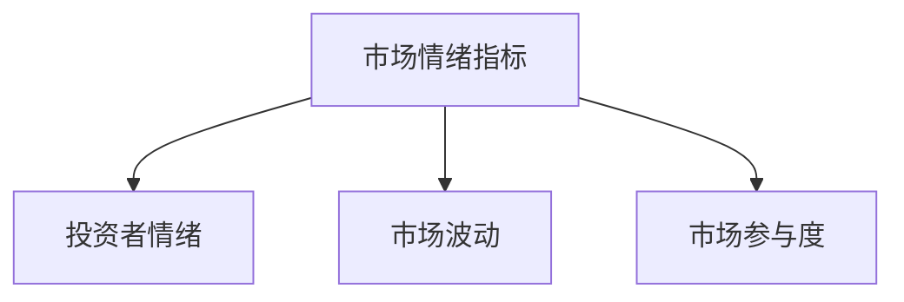
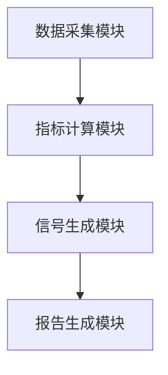
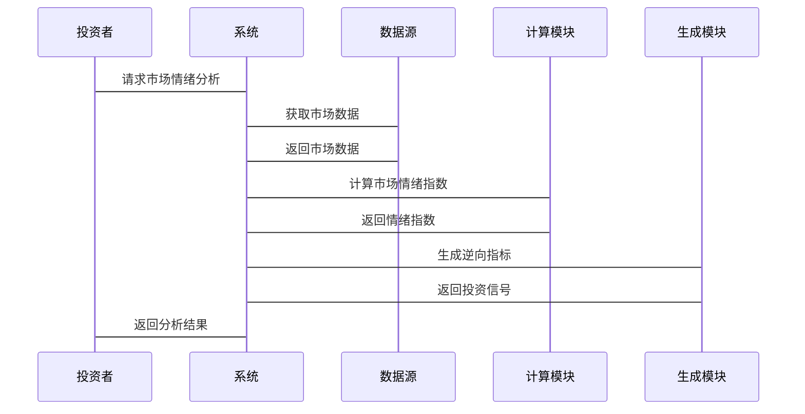

                 


# 彼得林奇的"市场情绪"逆向指标运用

## 关键词：市场情绪，彼得林奇，逆向指标，投资策略，算法原理，系统架构

## 摘要：本文深入探讨了彼得林奇提出的市场情绪逆向指标在投资决策中的应用。通过分析市场情绪的核心概念、逆向指标的算法原理、系统架构设计以及实际项目实战，本文为投资者提供了一套基于市场情绪分析的投资策略。文章内容涵盖市场情绪指标体系、逆向指标的计算方法、系统功能设计、项目实现等多方面，旨在帮助读者理解并运用这一投资工具。

---

## 第一章：市场情绪的基本概念

### 1.1 市场情绪的定义
- **市场情绪的内涵**：市场情绪是指投资者在市场中的整体情绪状态，反映了市场参与者对当前市场走势的看法和态度。
- **市场情绪的外延**：市场情绪可以表现为乐观、悲观、恐慌、贪婪等状态，这些状态会影响市场的价格波动和投资行为。
- **市场情绪的核心要素**：包括市场参与度、波动性、投资者行为等。

### 1.2 彼得林奇的市场情绪理论
- **彼得林奇的市场情绪理论背景**：彼得·林奇是著名投资家，他在投资实践中发现，市场情绪往往与市场走势相反，即市场情绪高涨时市场可能下跌，市场情绪低落时市场可能上涨。
- **市场情绪与投资决策的关系**：市场情绪是投资者决策的重要影响因素，但过度依赖市场情绪可能导致非理性投资行为。

### 1.3 逆向指标的定义与作用
- **逆向指标的定义**：逆向指标是指与市场情绪指标相反的指标，用于指导投资决策。
- **逆向指标的核心特征**：当市场情绪高涨时，逆向指标提示卖出；当市场情绪低落时，逆向指标提示买入。
- **逆向指标在市场情绪中的应用**：通过逆向指标，投资者可以更好地把握市场拐点，避免跟随市场情绪盲目投资。

---

## 第二章：市场情绪的指标体系

### 2.1 市场情绪的主要指标
- **恐慌指数（VIX）**：衡量市场波动性的指标，数值越高，市场情绪越恐慌。
- **投资者情绪指数（IIX）**：反映投资者情绪的指标，通常通过问卷调查或市场交易数据计算得出。
- **市场参与度指标（MPI）**：反映市场参与者活跃程度的指标，通常通过交易量或持仓量来衡量。

### 2.2 市场情绪指标的对比分析
- **各类指标的属性特征对比**：通过对比不同市场情绪指标的计算方法、数据来源和应用场景，帮助投资者选择合适的指标。
- **市场情绪指标的优劣势分析**：不同指标各有优劣，投资者应结合实际情况选择适合的指标。
- **指标之间的相关性分析**：分析不同市场情绪指标之间的相关性，了解它们如何共同反映市场情绪。

### 2.3 市场情绪指标的ER实体关系图


---

## 第三章：市场情绪逆向指标的算法原理

### 3.1 逆向指标的计算方法
- **市场情绪指数的计算公式**：
$$市场情绪指数 = \frac{市场参与度}{市场波动}$$
- **逆向指标的计算步骤**：
  1. 收集市场情绪数据
  2. 计算市场情绪指数
  3. 确定逆向指标的阈值
  4. 生成投资信号

### 3.2 逆向指标的算法实现
```python
def calculate_market_sentiment(market_participation, market_volatility):
    sentiment_index = market_participation / market_volatility
    return sentiment_index

def reverse_indicator(sentiment_index, threshold):
    if sentiment_index < threshold:
        return 1  # 买入信号
    else:
        return 0  # 卖出信号
```

### 3.3 算法原理的详细讲解
- **数学模型和公式**：通过公式推导，解释市场情绪指数的计算逻辑。
- **算法流程图**：使用mermaid绘制算法流程图，展示从数据输入到信号生成的全过程。

---

## 第四章：系统分析与架构设计

### 4.1 系统功能设计
- **问题场景介绍**：描述市场情绪分析系统的应用场景，如实时监控、投资决策支持等。
- **系统功能模块**：
  - 数据采集模块：收集市场情绪数据。
  - 指标计算模块：计算市场情绪指数。
  - 信号生成模块：根据逆向指标生成买卖信号。
  - 报告生成模块：输出市场情绪分析报告。

### 4.2 系统架构设计


### 4.3 系统接口设计
- **数据接口**：定义数据输入格式和输出格式。
- **API接口**：设计RESTful API，方便其他系统调用。

### 4.4 系统交互设计


---

## 第五章：项目实战

### 5.1 环境安装
- **Python环境**：安装Python和必要的库（如Pandas、NumPy、Plotly等）。
- **数据源获取**：说明如何获取市场情绪数据，例如通过API或数据接口。

### 5.2 核心实现
- **数据预处理**：展示如何清洗和处理市场情绪数据。
- **指标计算**：编写代码计算市场情绪指数和逆向指标。
- **信号生成**：根据逆向指标生成买卖信号。

### 5.3 实际案例分析
- **案例背景**：描述一个实际的市场情况。
- **数据处理**：展示如何处理相关数据。
- **结果分析**：解释生成的信号及其含义。

### 5.4 项目小结
- **项目总结**：回顾项目的主要步骤和成果。
- **经验教训**：分享项目过程中遇到的问题及解决方案。

---

## 第六章：最佳实践、小结、注意事项、拓展阅读

### 6.1 最佳实践
- **数据质量的重要性**：强调数据来源和数据质量对分析结果的影响。
- **模型调优**：建议根据市场变化调整模型参数。

### 6.2 小结
- **总结全文**：回顾文章的主要内容和观点。
- **强调核心思想**：重申市场情绪逆向指标的重要性。

### 6.3 注意事项
- **风险提示**：提醒投资者注意市场情绪分析的局限性。
- **操作建议**：建议投资者结合其他分析方法进行综合判断。

### 6.4 拓展阅读
- **推荐阅读书籍**：推荐彼得·林奇的相关著作和其他市场情绪分析的书籍。
- **推荐学习资源**：提供相关的在线课程、博客和论坛链接。

---

## 作者：AI天才研究院/AI Genius Institute & 禅与计算机程序设计艺术 /Zen And The Art of Computer Programming

---

以上是文章的完整目录大纲和详细内容。通过这种结构化的分析和分步讲解，读者可以系统地理解彼得林奇的市场情绪逆向指标，并将其应用于实际投资决策中。

