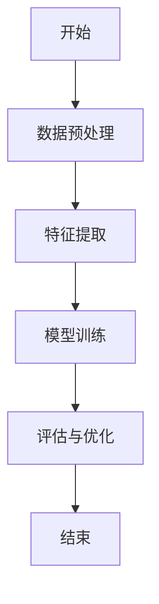

                 


# 彼得林奇的"市场机会"在跨境并购中的文化协同评估模型

> **关键词**：跨境并购、文化协同、市场机会、彼得林奇、评估模型

> **摘要**：本文探讨了彼得林奇的市场机会理论在跨境并购中的文化协同评估模型。通过分析文化协同的重要性，结合市场机会理论，提出了一种基于数学模型的文化协同评估方法，旨在帮助企业更好地识别和评估跨国并购中的文化风险。

---

## 第一部分: 背景介绍与核心概念

### 第1章: 背景介绍与问题背景

#### 1.1 跨境并购的定义与特点

跨境并购是指一家企业收购另一家位于不同国家或地区的企业的部分或全部股权。其特点是：

- **跨国性**：涉及不同国家和地区的法律、文化差异。
- **复杂性**：涉及多方面的利益协调和资源整合。
- **高风险性**：文化差异可能导致整合失败。

#### 1.2 文化协同的重要性

文化协同是指在并购后，双方企业在文化理念、管理风格、员工价值观等方面的协调程度。其重要性体现在：

- **整合效率**：文化协同良好的企业更容易实现组织整合。
- **绩效提升**：文化协同有助于提高并购后的经营绩效。
- **风险降低**：文化差异的提前识别可以降低并购失败的风险。

#### 1.3 彼得林奇的市场机会理论

彼得林奇是著名投资家，其市场机会理论强调：

- **市场机会的核心**：寻找被低估的市场机会。
- **市场机会的识别**：通过分析市场趋势和企业竞争优势。
- **市场机会的应用**：将市场机会与企业战略相结合。

#### 1.4 问题背景与研究意义

跨境并购中的文化协同问题：

- **文化冲突**：语言、管理风格差异可能导致摩擦。
- **整合困难**：文化差异影响组织整合。
- **绩效风险**：文化协同不佳可能导致并购失败。

研究意义：

- **理论价值**：丰富并购研究中的文化协同理论。
- **实践价值**：为企业提供文化协同评估工具。

---

## 第二部分: 核心概念与理论框架

### 第2章: 核心概念与联系

#### 2.1 文化协同评估模型的构成

模型构成要素：

- **输入**：企业文化特征、市场数据。
- **输出**：文化协同度评分。
- **核心算法**：协同度计算公式。

模型属性：

- **可量化**：将文化因素转化为量化指标。
- **动态性**：根据市场变化调整评估结果。

#### 2.2 彼得林奇市场机会理论与文化协同的关系

市场机会理论与文化协同的关系：

- **理论结合**：将市场机会分析与文化协同评估相结合。
- **相互影响**：市场机会的识别受文化协同的影响。

#### 2.3 模型的ER实体关系图

ER实体关系图展示：

- 实体：企业A、企业B、文化因素。
- 关系：文化因素影响企业文化的匹配度。

---

## 第三部分: 模型算法与数学原理

### 第3章: 算法原理与流程

#### 3.1 模型算法概述

算法总体思路：

- 数据预处理：提取文化因素。
- 特征提取：量化文化因素。
- 模型训练：计算协同度。
- 评估与优化：调整模型参数。

核心步骤：

- 数据清洗：处理缺失值。
- 特征选择：选取关键文化因素。
- 协同度计算：基于权重的评分。

#### 3.2 算法流程图（Mermaid）



#### 3.3 数学模型与公式

协同度计算公式：

$$ \text{协同度} = \sum_{i=1}^{n} w_i \cdot c_i $$

其中，$w_i$ 是第 $i$ 个因素的权重，$c_i$ 是协同评分。

---

## 第四部分: 系统分析与架构设计

### 第4章: 系统分析与架构设计

#### 4.1 问题场景介绍

跨境并购中的文化协同问题：

- 企业A与企业B的文化差异。
- 并购后的整合挑战。

#### 4.2 系统功能设计

系统功能设计：

- 数据输入：企业文化特征。
- 特征提取：量化文化因素。
- 协同度计算：基于模型计算。

系统架构设计：


#### 4.3 系统接口设计

接口设计：

- 数据输入接口：接收企业文化数据。
- 计算接口：处理数据并输出协同度。

交互序列图：


---

## 第五部分: 项目实战

### 第5章: 项目实战与案例分析

#### 5.1 环境安装

- Python 3.8+
- 数据处理库：Pandas、NumPy
- 可视化库：Matplotlib

#### 5.2 核心代码实现

协同度计算代码：

```python
import pandas as pd
import numpy as np

def calculate_synergy(company_A, company_B):
    # 提取文化因素
    factors = ['culture', 'management', 'values']
    # 定义权重
    weights = {'culture': 0.4, 'management': 0.3, 'values': 0.3}
    # 计算协同度
    synergy = 0
    for factor in factors:
        score_A = company_A[factor]
        score_B = company_B[factor]
        synergy += weights[factor] * abs(score_A - score_B)
    return synergy

# 示例数据
company_A = {'culture': 0.8, 'management': 0.7, 'values': 0.6}
company_B = {'culture': 0.6, 'management': 0.5, 'values': 0.4}

synergy_score = calculate_synergy(company_A, company_B)
print(f"协同度评分：{synergy_score}")
```

#### 5.3 代码解读与分析

代码解读：

- 提取文化因素：文化、管理、价值观。
- 定义权重：文化占40%，管理占30%，价值观占30%。
- 协同度计算：基于因素差异的加权和。

#### 5.4 案例分析

案例分析：

- 企业A与企业B的文化协同度为0.5，说明存在中等风险。
- 建议在整合过程中加强文化培训。

#### 5.5 项目小结

项目小结：

- 模型实现：完成了文化协同度的计算。
- 实际应用：为企业提供文化协同评估工具。

---

## 第六部分: 总结与展望

### 第6章: 总结与展望

#### 6.1 最佳实践 tips

- 确保文化协同评估的准确性。
- 定期更新模型参数。

#### 6.2 小结

本文提出了基于彼得林奇市场机会理论的文化协同评估模型，为企业提供了文化协同评估的工具。

#### 6.3 注意事项

- 模型依赖数据质量。
- 结果需结合实际情况。

#### 6.4 拓展阅读

- 推荐阅读彼得林奇的《投资之道》。
- 关注文化管理领域的最新研究。

---

**作者：AI天才研究院/AI Genius Institute & 禅与计算机程序设计艺术 /Zen And The Art of Computer Programming**

