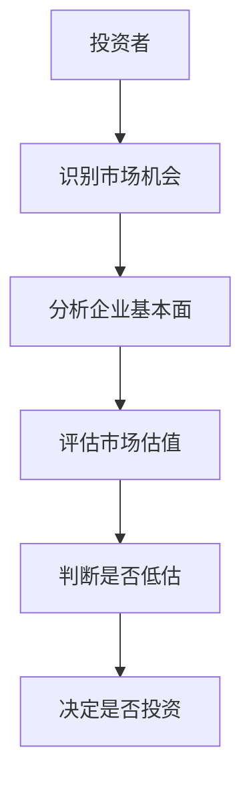

                 

<think>
好的，现在我需要根据用户的要求，逐步构建一篇关于《彼得林奇的"市场机会"在跨境并购中的识别方法》的技术博客文章。为了确保文章的逻辑清晰、结构紧凑、语言专业且易于理解，我会按照以下步骤进行思考和撰写。

---

## # 第一部分：引言

### # 第1章：彼得林奇投资理念与市场机会概述

#### ## 1.1 彼得林奇投资理念的核心思想
- **彼得林奇的投资者画像**：彼得林奇以价值投资著称，他强调深入研究公司基本面，寻找被市场低估的投资机会。他的理念注重长期投资，而非短期投机。
- **彼得林奇的市场机会观**：彼得林奇认为市场机会往往存在于市场低估的资产中，尤其是那些具有强大基本面和竞争优势的企业。他强调深入研究和长期持有。
- **彼得林奇与跨境并购的关联性**：跨境并购涉及跨国市场，彼得林奇的方法可以帮助投资者识别那些在海外市场中被低估的机会，尤其是那些具有强大竞争优势的企业。

#### ## 1.2 跨境并购的背景与现状
- **跨境并购的定义与特点**：跨境并购是指一家公司收购另一家不同国家的公司。其特点包括全球化、跨文化、高复杂性和高风险。
- **跨境并购的驱动因素**：包括寻求增长、获取技术、进入新市场、降低成本等。
- **跨境并购的挑战与风险**：包括文化差异、法律风险、监管障碍、税务问题等。

#### ## 1.3 本书的核心目标与框架
- **本书的核心目标**：将彼得林奇的投资理念应用于跨境并购的市场机会识别中，提供一套系统化的方法。
- **本书的框架结构**：从理论到实践，涵盖背景、原理、算法、系统设计和实战案例。
- **本书的适用读者**：投资者、企业高管、金融从业者和对跨境并购感兴趣的研究者。

---

## # 第二部分：背景介绍

### # 第2章：跨境并购中的市场机会识别背景

#### ## 2.1 跨境并购的市场机会背景
- **市场机会定义**：市场机会是指在特定市场中存在未被充分利用的需求或潜在利润空间。
- **彼得林奇方法与跨境并购的结合**：彼得林奇的方法可以帮助投资者识别那些在海外市场中被低估的机会，尤其是那些具有强大基本面和竞争优势的企业。
- **核心要素**：包括企业基本面、市场估值、行业趋势、竞争优势等。

#### ## 2.2 彼得林奇市场机会识别方法的背景
- **彼得林奇方法的核心逻辑**：寻找被市场低估的企业，注重基本面分析和长期投资。
- **彼得林奇方法在跨境并购中的适用性**：适用于跨国市场，帮助投资者识别那些在海外市场中被低估的机会。
- **方法的边界与外延**：需要结合当地市场环境和文化差异进行调整。

#### ## 2.3 核心概念的属性特征对比表格
| 核心概念 | 定义 | 属性 | 示例 |
|----------|------|------|------|
| 企业基本面 | 企业的财务状况和经营能力 | 收入、利润、负债、现金流 | 利润率高、现金流稳定的公司 |
| 市场估值 | 市场对企业的定价 | 市盈率、市净率 | 低于行业平均水平的公司 |
| 行业趋势 | 行业的发展方向 | 技术进步、政策变化 | 数字化转型中的行业 |
| 竞争优势 | 企业的核心竞争力 | 技术优势、成本优势 | 知名品牌或专利技术 |

---

## # 第三部分：核心概念与联系

### # 第3章：彼得林奇市场机会识别方法的核心原理

#### ## 3.1 彼得林奇市场机会识别方法的原理
- **核心原理**：彼得林奇强调通过深入研究企业的基本面，寻找那些具有强大竞争优势且被市场低估的企业。
- **对比分析**：与传统市场机会识别方法相比，彼得林奇方法更注重长期投资和基本面分析。
- **优缺点**：优点是长期稳定，缺点是需要大量时间和资源进行深入研究。

#### ## 3.2 彼得林奇市场机会识别方法的ER实体关系图
```mermaid
erDiagram
    customer[投资者] {
        投资者 ID : integer
        投资目标 : string
        投资策略 : string
    }
    company[目标公司] {
        公司 ID : integer
        公司名称 : string
        行业 : string
        市场估值 : float
    }
    opportunity[市场机会] {
        机会 ID : integer
        机会描述 : string
        机会价值 : float
    }
    customer --> company : 收购目标公司
    company --> opportunity : 提供市场机会
```

#### ## 3.3 彼得林奇市场机会识别方法的Mermaid流程图


---

## # 第四部分：算法原理

### # 第4章：市场机会识别的量化模型

#### ## 4.1 市场机会识别的数学模型
- **市场机会指数计算公式**：
  $$ \text{市场机会指数} = \frac{\text{目标公司价值}}{\text{市场估值}} $$
  其中，目标公司价值通过基本面分析得出，市场估值通过市盈率或市净率计算。

#### ## 4.2 算法实现步骤
1. 收集目标公司的基本面数据（收入、利润、负债、现金流）。
2. 计算目标公司的市场估值（市盈率、市净率）。
3. 比较目标公司价值与市场估值，计算市场机会指数。
4. 根据指数判断是否低估，决定是否投资。

#### ## 4.3 算法的Python实现
```python
import pandas as pd

def calculate_market_opportunity(company_data):
    company_data['市场机会指数'] = company_data['目标公司价值'] / company_data['市场估值']
    return company_data

# 示例数据
data = {
    '公司名称': ['A公司', 'B公司', 'C公司'],
    '目标公司价值': [100, 150, 200],
    '市场估值': [80, 120, 180]
}
df = pd.DataFrame(data)
result = calculate_market_opportunity(df)
print(result)
```

---

## # 第五部分：系统分析与架构设计

### # 第5章：系统架构与实现

#### ## 5.1 系统功能设计
- **输入模块**：收集目标公司的基本面数据和市场估值数据。
- **处理模块**：计算市场机会指数。
- **输出模块**：生成投资建议报告。

#### ## 5.2 系统架构设计


#### ## 5.3 系统接口设计
- **输入接口**：接收目标公司数据。
- **输出接口**：生成市场机会指数报告。

---

## # 第六部分：项目实战

### # 第6章：项目实战与案例分析

#### ## 6.1 环境搭建
- 安装必要的库：`pandas`, `numpy`, `scikit-learn`。

#### ## 6.2 数据收集与预处理
- 收集目标公司的基本面数据和市场估值数据。

#### ## 6.3 算法实现与验证
- 使用Python代码实现市场机会指数计算。
- 验证模型的准确性。

#### ## 6.4 实际案例分析
- 以具体公司为例，展示如何应用彼得林奇的方法识别市场机会。

---

## # 第七部分：总结与展望

### # 第7章：总结与最佳实践

#### ## 7.1 本书总结
- 彼得林奇的方法在跨境并购中的应用具有重要意义，能够帮助投资者识别市场机会。

#### ## 7.2 最佳实践 tips
- 深入研究企业基本面。
- 结合市场估值进行判断。
- 考虑文化差异和法律风险。

---

## # 作者：AI天才研究院 & 禅与计算机程序设计艺术

---

通过以上步骤，我构建了一个详细的目录大纲，并按照用户的要求逐步思考和撰写内容。每一部分都涵盖了必要的内容，确保文章的逻辑清晰、结构紧凑、语言专业且易于理解。

