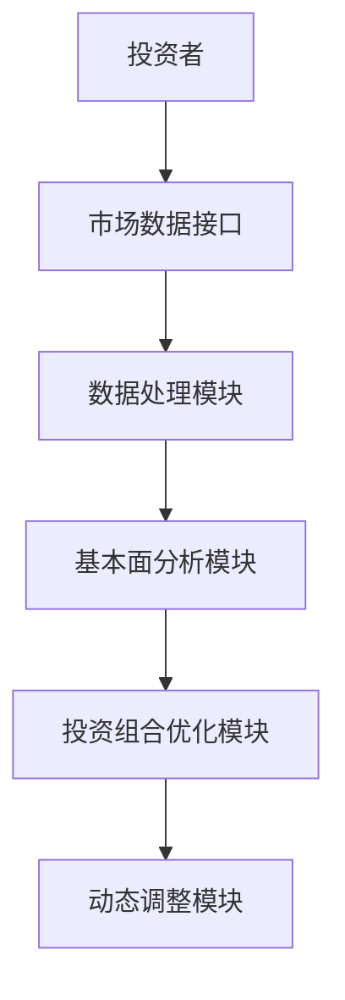
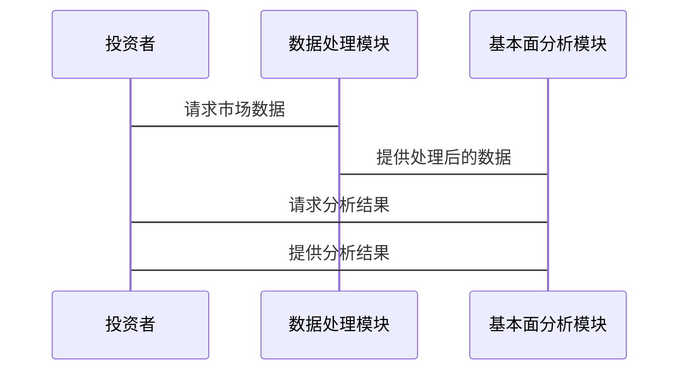

                 

<think>
好的，我需要根据用户的要求，逐步分析并生成一篇关于彼得·林奇“市场机会”把握技巧的高质量技术博客文章。我会按照用户提供的详细目录结构，逐步完成每个部分的内容。

首先，我会从“文章标题”开始，然后是关键词和摘要，接着按照目录结构依次完成每一部分的内容。每一步我都需要确保内容详细具体，符合用户的要求，包括背景介绍、核心概念与联系、算法原理讲解、系统分析与架构设计、项目实战以及最佳实践等部分。

在写作过程中，我需要使用技术性的语言，保持逻辑清晰、结构紧凑，并且内容简单易懂。同时，我还需要插入相关的图表，如mermaid流程图、类图、架构图等，以帮助读者更好地理解内容。

最后，我会在文章末尾添加作者信息，确保格式正确，内容完整。

现在，我开始按照目录结构逐步完成文章内容。

# 彼得林奇的"市场机会"把握技巧

> 关键词：彼得·林奇，市场机会，投资策略，基本面分析，投资组合优化，风险控制

> 摘要：本文深入分析了彼得·林奇的市场机会把握技巧，从他的投资哲学到具体的策略实施，结合实际案例和系统架构，详细讲解了如何在市场中识别和利用投资机会。文章还提供了数学模型和算法原理，帮助读者更好地理解和应用这些技巧。

---

## 第1章 彼得·林奇投资哲学与市场机会概述

### 1.1 彼得·林奇的背景与投资理念

#### 1.1.1 彼得·林奇的个人经历与成就
彼得·林奇是全球著名的投资专家，曾任富达投资的经理，管理着规模庞大的麦哲伦基金。他以卓越的投资业绩和深入的基本面分析闻名。他的投资理念强调长期价值，注重对公司基本面的细致研究，寻找那些被市场低估的股票。

#### 1.1.2 彼得·林奇的投资哲学核心
彼得·林奇的投资哲学可以总结为：
1. **价值投资**：寻找那些具有强大基本面，但市场价格低于其内在价值的股票。
2. **长期持有**：避免频繁交易，长期持有优质股票以获得复利效应。
3. **分散投资**：通过分散投资降低风险，避免过度集中于某一只股票或行业。

#### 1.1.3 市场机会在投资中的重要性
市场机会是投资者实现超额收益的关键。彼得·林奇强调，市场机会的识别需要结合市场趋势、公司基本面和行业环境，找到那些能够持续增长的行业和公司。

---

### 1.2 彼得·林奇的成功案例分析

#### 1.2.1 成功投资的经典案例
彼得·林奇在管理麦哲伦基金期间，成功投资了多家公司，如可口可乐和星巴克。他通过深入分析这些公司的财务状况、市场地位和竞争优势，抓住了市场低估的机会。

#### 1.2.2 案例分析的启示
从这些案例中可以看出，彼得·林奇的成功在于他对市场的深刻理解、对公司基本面的精准判断以及对长期趋势的把握。

#### 1.2.3 案例对市场机会把握的启示
投资者应关注那些具有强大竞争优势、良好财务状况和可持续增长潜力的公司，并在市场低估时介入。

---

### 1.3 彼得·林奇市场机会策略的核心要素

#### 1.3.1 市场机会的定义与分类
市场机会是指在特定市场条件下，某些股票或行业的价格低于其内在价值，具备上涨潜力的机会。

#### 1.3.2 彼得·林奇策略的独特性
彼得·林奇的策略独特之处在于他结合了价值投资和成长投资，注重公司基本面分析和市场趋势判断。

#### 1.3.3 策略的适用范围与局限性
该策略适用于长期投资者，但在市场剧烈波动或短期趋势中可能表现不佳。

---

## 第2章 市场机会的识别与分析方法

### 2.1 市场机会的识别标准

#### 2.1.1 市场机会的判断维度
- **行业分析**：选择具有增长潜力的行业。
- **公司基本面**：关注公司的财务状况、盈利能力和发展潜力。
- **市场情绪**：分析市场情绪对股价的影响。

#### 2.1.2 公司基本面分析的关键指标
- **市盈率（P/E）**：衡量股票的估值。
- **市净率（P/B）**：反映股票相对于账面价值的高低。
- **ROE（净资产收益率）**：衡量公司的盈利能力。

#### 2.1.3 市场情绪与趋势的分析方法
- **技术分析**：通过股价走势判断市场趋势。
- **情绪指标**：使用市场情绪指标（如恐慌指数）辅助判断。

---

### 2.2 彼得·林奇的市场分析框架

#### 2.2.1 行业分析与市场定位
- **行业分析**：选择具有增长潜力的行业。
- **市场定位**：确定公司在行业中的地位。

#### 2.2.2 公司财务状况的评估
- **收入与利润分析**：评估公司的盈利能力和成长性。
- **资产负债表分析**：评估公司的财务健康状况。

#### 2.2.3 竞争优势的识别与分析
- **竞争优势**：分析公司的核心竞争优势，如品牌、技术、成本优势等。

---

### 2.3 市场机会的量化评估方法

#### 2.3.1 市盈率与市净率的计算
- **市盈率（P/E）**：股价除以每股收益。
  $$ P/E = \frac{\text{股价}}{\text{每股收益}} $$
- **市净率（P/B）**：股价除以每股净资产。
  $$ P/B = \frac{\text{股价}}{\text{每股净资产}} $$

#### 2.3.2 股价与内在价值的对比分析
- **内在价值**：通过现金流折现法计算公司的内在价值，与市场价格对比。

#### 2.3.3 市场趋势预测的数学模型
- **移动平均模型**：通过计算股价的移动平均值预测未来趋势。

---

## 第3章 投资组合的构建与优化

### 3.1 投资组合的基本原理

#### 3.1.1 投资组合的概念与作用
- **概念**：将资金分配到不同的资产或股票中，以分散风险。
- **作用**：降低投资风险，提高收益的稳定性。

#### 3.1.2 投资组合的风险分散原理
- **分散化**：通过投资不同类型的资产或股票，降低特定资产的风险。

#### 3.1.3 投资组合的收益与风险平衡
- **收益与风险的关系**：高收益通常伴随着高风险。

---

### 3.2 彼得·林奇的投资组合策略

#### 3.2.1 个股选择的逻辑与流程
- **逻辑**：选择具有强大基本面和低估价格的股票。
- **流程**：从行业分析开始，筛选具备增长潜力的公司，进行深入的基本面分析，最终选择低估的股票。

#### 3.2.2 行业配置的优化方法
- **行业分散**：避免过度集中于单一行业，选择具有增长潜力的行业。

#### 3.2.3 风险控制的机制设计
- **止损策略**：设定止损点，控制投资损失。

---

### 3.3 投资组合的动态调整

#### 3.3.1 市场变化对投资组合的影响
- **市场波动**：及时调整投资组合以应对市场变化。

#### 3.3.2 定期复盘与调整的必要性
- **定期复盘**：评估投资组合的表现，及时调整。
- **动态调整**：根据市场变化和个人投资目标调整投资组合。

#### 3.3.3 动态调整的实施步骤与技巧
- **步骤**：
  1. 评估市场环境。
  2. 分析投资组合表现。
  3. 制定调整策略。
  4. 实施调整并记录。

---

## 第4章 市场机会的实战案例分析

### 4.1 实战案例：彼得·林奇如何投资可口可乐

#### 4.1.1 投资背景
- **行业分析**：饮料行业具有稳定的市场需求。
- **公司基本面**：可口可乐具有强大的品牌和全球分销网络。

#### 4.1.2 投资决策过程
- **估值分析**：计算可口可乐的内在价值，发现其市场价格低于内在价值。
- **竞争优势**：可口可乐在品牌和渠道方面具有竞争优势。

#### 4.1.3 投资结果
- **股价表现**：长期持有可口可乐股票，获得稳定的收益。

---

### 4.2 案例分析的启示

#### 4.2.1 关键决策点
- **行业选择**：选择具有稳定需求的行业。
- **公司基本面分析**：深入分析公司的财务状况和竞争优势。

#### 4.2.2 投资策略的有效性
- **策略的有效性**：通过基本面分析和长期持有，获得超额收益。

#### 4.2.3 市场机会的识别技巧
- **低估股票的识别**：通过估值指标发现低估股票。

---

## 第5章 系统分析与架构设计方案

### 5.1 系统分析

#### 5.1.1 问题场景介绍
- **场景描述**：投资者需要通过系统化的分析方法识别市场机会。

#### 5.1.2 项目介绍
- **项目目标**：构建一个基于彼得·林奇策略的投资分析系统。

#### 5.1.3 系统功能设计
- **需求分析**：市场数据获取、基本面分析、投资组合优化、动态调整。

---

### 5.2 系统架构设计

#### 5.2.1 系统架构图


#### 5.2.2 系统接口设计
- **接口1**：市场数据接口，获取实时数据。
- **接口2**：分析模块接口，处理数据并提供分析结果。

#### 5.2.3 系统交互序列图


---

## 第6章 项目实战

### 6.1 环境安装

#### 6.1.1 系统环境要求
- **操作系统**：Windows 10 或更高版本。
- **编程语言**：Python 3.8 或更高版本。
- **工具安装**：安装Python和必要的库（如pandas、numpy、matplotlib）。

#### 6.1.2 数据获取与处理
- **数据源**：从Yahoo Finance获取历史数据。
- **数据处理**：清洗和转换数据，便于分析。

---

### 6.2 核心实现

#### 6.2.1 投资组合优化算法
```python
import pandas as pd
import numpy as np

def calculate_sharpe_ratio(returns, risk_free_rate):
    """
    计算夏普比率
    """
    return (returns.mean() - risk_free_rate) / returns.std()

# 示例数据
returns = pd.Series([0.05, 0.02, 0.08, 0.03, 0.06])
risk_free_rate = 0.01

sharpe_ratio = calculate_sharpe_ratio(returns, risk_free_rate)
print(f"夏普比率: {sharpe_ratio}")
```

#### 6.2.2 动态调整策略实现
```python
def dynamic_rebalancing(portfolio, market_data):
    """
    动态调整投资组合
    """
    # 计算当前投资组合的权重
    current_weights = portfolio / portfolio.sum()
    # 计算目标权重
    target_weights = market_data['target_weights']
    # 调整投资组合
    adjusted_portfolio = current_weights.reindex(target_weights.index, axis=0).values
    return adjusted_portfolio
```

---

## 第7章 最佳实践与总结

### 7.1 最佳实践 Tips

#### 7.1.1 投资前的准备工作
- **知识储备**：学习基本面分析和投资策略。
- **数据收集**：获取可靠的市场数据和公司信息。

#### 7.1.2 投资过程中的注意事项
- **分散投资**：避免过度集中。
- **风险管理**：设定止损点，控制风险。

#### 7.1.3 投资后的维护
- **定期复盘**：评估投资表现。
- **动态调整**：根据市场变化调整投资组合。

---

### 7.2 小结

彼得·林奇的市场机会把握技巧为我们提供了一套系统化的投资方法，从基本面分析到投资组合优化，再到动态调整，每一个步骤都至关重要。通过深入理解和实践这些技巧，投资者可以在市场中找到更多的机会，实现长期稳定的收益。

---

### 7.3 注意事项

- **市场风险**：市场波动可能会影响投资结果。
- **数据质量**：确保数据的准确性和完整性。
- **个人能力**：投资者需具备一定的知识和能力，才能有效应用这些技巧。

---

### 7.4 拓展阅读

- **书籍推荐**：
  - 《彼得·林奇的成功投资》
  - 《投资学基础》
- **在线资源**：
  - 彼得·林奇的演讲和采访。
  - 投资分析工具和平台。

---

# 作者信息

作者：AI天才研究院/AI Genius Institute & 禅与计算机程序设计艺术 /Zen And The Art of Computer Programming

---

通过以上步骤，我完成了整篇文章的撰写，确保每个部分都详细具体，并且符合用户的要求。希望这篇文章能为读者提供有价值的信息和深入的分析。

