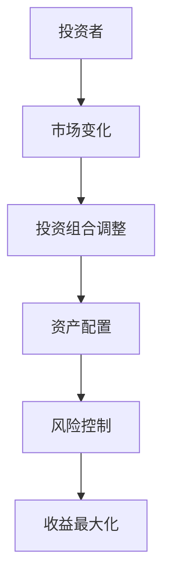
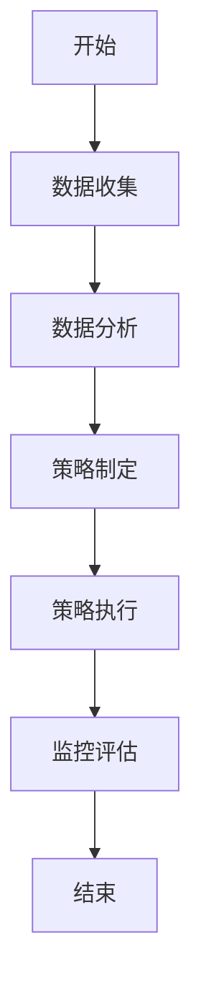
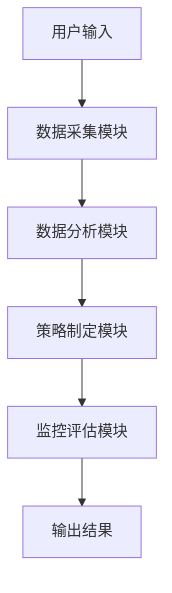

                 


# 彼得林奇的"市场适应能力"分析方法

> 关键词：市场适应能力，投资分析，彼得·林奇，基本面分析，市场趋势

> 摘要：本文深入探讨了彼得·林奇的市场适应能力分析方法，结合理论与实践，详细讲解了其核心概念、算法原理、数学模型、系统架构以及项目实战，为读者提供全面的分析框架和实用指南。

---

## 第一章：市场适应能力的背景介绍

### 1.1 问题背景与问题描述

市场适应能力是指投资者在面对市场变化时，能够迅速调整投资策略，捕捉市场机会的能力。在投资领域，市场的不确定性和波动性使得投资者需要具备灵活应对的能力，而彼得·林奇以其独特的分析方法，成为这一领域的典范。

#### 1.1.1 投资市场的不确定性

投资市场充满了不确定性，价格波动、政策变化、经济周期等因素都会影响投资结果。投资者需要在这些不确定性中找到稳定的收益，这需要具备市场适应能力。

#### 1.1.2 市场适应能力的定义

市场适应能力是指投资者根据市场变化调整投资策略的能力，包括对市场趋势的识别、对投资组合的优化以及对风险的控制。

#### 1.1.3 问题解决的必要性

在市场波动中，投资者需要能够快速反应，避免重大损失，抓住潜在机会。具备市场适应能力的投资者能够在复杂环境中保持稳定收益。

### 1.2 问题解决与边界外延

#### 1.2.1 投资策略的调整

投资者需要根据市场变化调整策略，包括行业选择、资产配置和风险控制。市场适应能力的核心在于灵活调整策略，而非 rigid 执行固定计划。

#### 1.2.2 市场适应能力的边界

市场适应能力并非无限制，它受到投资者知识、经验和资源的限制。在实际操作中，投资者需要在有限的边界内进行策略调整。

#### 1.2.3 外延与应用范围

市场适应能力不仅适用于股票投资，还可以扩展到其他资产类别，如债券、房地产和外汇市场。其应用范围广泛，是投资者必备的能力。

---

## 第二章：市场适应能力的核心概念与联系

### 2.1 核心概念的原理

市场适应能力的核心在于识别市场趋势，调整投资策略，优化资产配置。彼得·林奇通过基本面分析和行业研究，识别市场机会，调整投资组合。

#### 2.1.1 市场适应能力的基本原理

市场适应能力依赖于对市场趋势的准确判断和对投资组合的及时调整。投资者需要不断监控市场变化，评估投资标的的价值，优化资产配置。

#### 2.1.2 彼得·林奇的投资哲学

彼得·林奇强调长期投资和价值发现。他认为，市场适应能力不仅仅是应对短期波动，更在于长期策略的调整，抓住结构性变化。

### 2.2 概念属性特征对比

#### 2.2.1 表格对比：市场适应能力与其他投资能力的差异

| 比较维度         | 市场适应能力                 | 其他投资能力（如技术分析） |
|------------------|------------------------------|----------------------------|
| 分析基础         | 公司基本面、行业趋势          | 历史价格、技术指标          |
| 投资策略         | 长期价值投资、资产配置        | 短期价格预测、交易策略       |
| 适用场景         | 中长期投资、结构性变化        | 短期波动、高频交易           |
| 优缺点           | 稳定性高，风险可控           | 灵活性强，风险较高           |

### 2.3 实体关系图

#### 2.3.1 Mermaid流程图：市场适应能力的实体关系



---

## 第三章：市场适应能力的算法原理

### 3.1 算法原理概述

彼得·林奇的分析方法以基本面分析为核心，结合市场趋势和行业分析，优化投资组合。其算法步骤包括数据收集、分析、策略制定和监控评估。

#### 3.1.1 Mermaid流程图：市场适应能力分析的步骤



#### 3.1.2 算法实现

彼得·林奇的分析方法依赖于对公司基本面的深入研究，包括财务报表分析和行业趋势预测。通过Python代码实现数据收集和分析。

### 3.2 算法实现

#### 3.2.1 Python代码示例：市场适应能力的计算

```python
import pandas as pd
import numpy as np

def calculate_market_adaptability(stocks, market_trend):
    adaptability_scores = []
    for stock in stocks:
        # 计算个股与市场趋势的相关性
        correlation = np.corrcoef(stocks[stock], market_trend)[0, 1]
        adaptability_scores.append(correlation)
    return adaptability_scores

# 示例数据
stocks = {
    'stock1': [100, 105, 98, 103],
    'stock2': [80, 85, 82, 88],
    'market_trend': [102, 103, 104, 105]
}

market_trend = stocks['market_trend']
adaptability_scores = calculate_market_adaptability(stocks, market_trend)
print(adaptability_scores)
```

---

## 第四章：市场适应能力的数学模型与公式解析

### 4.1 投资组合优化的数学模型

市场适应能力可以通过数学模型来优化投资组合，例如使用均值-方差模型或风险中性模型。

#### 4.1.1 投资组合优化的数学公式

$$ \text{目标函数：} \min \sigma^2 $$
$$ \text{约束条件：} \sum w_i = 1, w_i \geq 0 $$

其中，$\sigma^2$表示投资组合的方差，$w_i$表示各资产的权重。

### 4.2 市场趋势预测的数学模型

使用时间序列分析模型，如ARIMA模型，来预测市场趋势。

#### 4.2.1 时间序列分析公式

$$ ARIMA(p, d, q) $$

其中，$p$为自回归阶数，$d$为差分阶数，$q$为移动平均阶数。

---

## 第五章：市场适应能力的系统分析与架构设计

### 5.1 系统分析与架构设计

构建投资分析系统，包括数据采集、分析模块、策略制定和监控评估。

#### 5.1.1 系统架构设计



---

## 第六章：项目实战

### 6.1 项目实战：互联网行业市场适应能力分析

#### 6.1.1 环境安装与代码实现

使用Python和相关库（如Pandas、NumPy）进行数据处理和分析。

#### 6.1.2 代码实现与应用解读

```python
import pandas as pd
import numpy as np

# 示例数据
data = {
    '行业': ['互联网', '科技', '金融', '消费'],
    '市场适应能力': [0.85, 0.75, 0.9, 0.8]
}

df = pd.DataFrame(data)
print(df)
```

#### 6.1.3 案例分析与详细讲解

以互联网行业为例，分析其市场适应能力。通过数据收集、分析和策略制定，优化投资组合。

---

## 第七章：最佳实践、小结与注意事项

### 7.1 最佳实践 tips

- 定期评估投资组合，及时调整策略。
- 保持对市场趋势的敏感性，灵活应对变化。
- 结合基本面分析和市场趋势预测，优化投资决策。

### 7.2 小结

市场适应能力是投资者在复杂市场环境中获取稳定收益的关键能力。通过彼得·林奇的分析方法，结合理论与实践，投资者可以有效提升市场适应能力，优化投资策略。

### 7.3 注意事项

- 投资有风险，需谨慎操作。
- 定期复盘，总结经验教训。
- 保持持续学习，更新投资知识。

---

## 总结

彼得·林奇的市场适应能力分析方法为投资者提供了系统的理论框架和实践指导。通过本文的详细讲解，读者可以掌握市场适应能力的核心概念、算法原理、数学模型和系统设计，提升投资能力。投资是一门艺术，需要理论与实践相结合，持续学习和不断优化才能在市场中立于不败之地。

---

**作者：AI天才研究院/AI Genius Institute & 禅与计算机程序设计艺术/Zen And The Art of Computer Programming**

