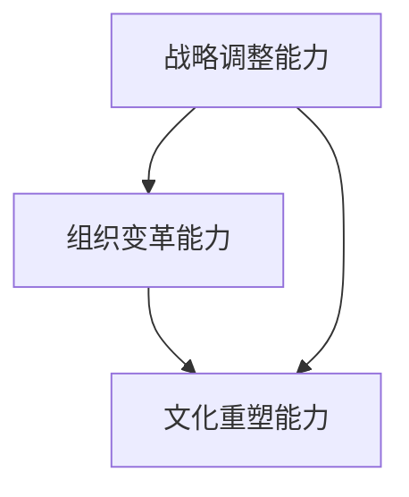
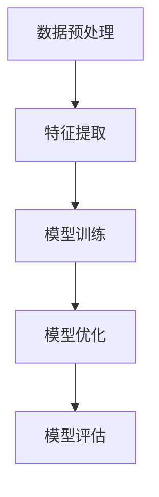
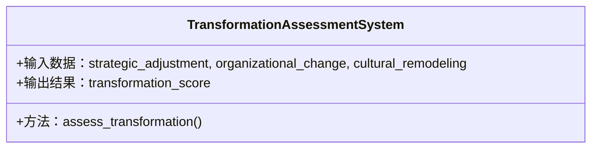
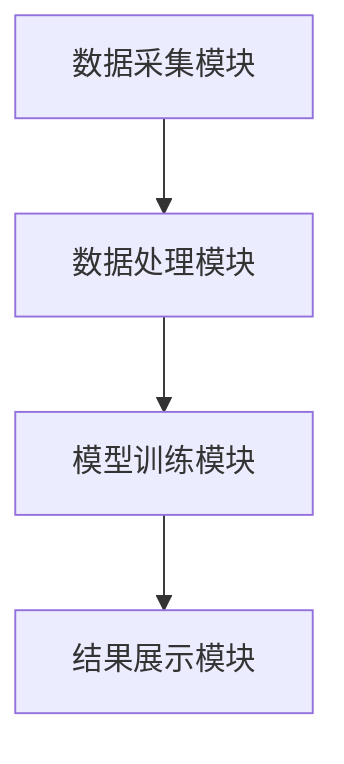

                 


# 彼得林奇的"市场领导者"转型能力评估

## 关键词：市场领导者，转型能力，评估模型，机器学习，系统架构

## 摘要：本文围绕市场领导者转型能力的评估展开，分析了转型能力的核心要素，构建了基于机器学习的评估模型，并结合实际案例进行了详细讲解。通过系统分析和架构设计，提出了有效的转型能力提升策略。

---

## 第一部分: 市场领导者转型能力评估的背景与概念

### 第1章: 市场领导者转型的背景与问题

#### 1.1 市场领导者转型的背景

- **什么是市场领导者**：市场领导者是指在某个市场或领域中占据主导地位的企业或个人。他们通常拥有较高的市场份额、品牌影响力和技术优势。
- **市场领导者面临的挑战**：随着市场环境的变化，技术的进步和竞争的加剧，市场领导者可能面临创新能力不足、组织僵化、文化老化等问题。
- **转型的必要性与重要性**：为了保持竞争优势，市场领导者必须不断进行战略调整、组织变革和文化重塑。转型能力成为企业持续发展的关键。

#### 1.2 市场领导者转型能力评估的问题背景

- **传统评估方法的局限性**：传统评估方法往往注重财务指标，忽视了战略调整、组织变革等动态因素。
- **新兴市场环境的变化**：技术革新、消费者需求的变化和全球化竞争要求企业更加灵活和适应性强。
- **评估体系的构建需求**：为了全面、客观地评估市场领导者的转型能力，需要构建一个包含战略、组织和文化的多维度评估体系。

#### 1.3 问题描述与解决方法

- **问题描述**：市场领导者在转型过程中常常面临战略调整不力、组织变革缓慢、文化重塑困难等问题。
- **解决方法**：通过构建一个基于机器学习的转型能力评估模型，帮助市场领导者识别问题、制定策略并实施变革。

#### 1.4 边界与外延

- **边界**：本研究仅关注市场领导者在战略、组织和文化方面的转型能力，不涉及财务和运营的具体指标。
- **外延**：评估模型可以推广到其他类型的企业，为不同行业和规模的企业提供转型能力评估的参考。

---

### 第2章: 转型能力评估的核心概念

#### 2.1 转型能力的核心要素

| 核心要素         | 定义与特征                     |
|------------------|-------------------------------|
| 战略调整能力     | 根据市场变化调整战略的能力     |
| 组织变革能力     | 通过组织结构调整提升效率的能力 |
| 文化重塑能力     | 培育适应转型的文化的能力       |

#### 2.2 核心概念的联系



---

## 第二部分: 转型能力评估的算法原理

### 第4章: 基于机器学习的评估模型

#### 4.1 机器学习在评估中的应用

- **监督学习与无监督学习**：监督学习适用于有标签的数据（如分类问题），无监督学习适用于无标签的数据（如聚类分析）。
- **算法选择**：根据数据特征选择合适的算法，如线性回归、支持向量机（SVM）和随机森林。

#### 4.2 评估模型的构建



#### 4.3 算法实现与代码解析

```python
import pandas as pd
from sklearn.model_selection import train_test_split
from sklearn.linear_model import LinearRegression

# 加载数据
data = pd.read_csv('transformation.csv')

# 特征与标签
X = data[['strategic_adjustment', 'organizational_change', 'cultural_remodeling']]
y = data['transformation_score']

# 数据划分
X_train, X_test, y_train, y_test = train_test_split(X, y, test_size=0.2, random_state=42)

# 模型训练
model = LinearRegression()
model.fit(X_train, y_train)

# 模型预测
y_pred = model.predict(X_test)

# 模型评估
score = model.score(X_test, y_test)
print(f'模型评分：{score}')
```

---

### 第5章: 评估模型的数学基础

#### 5.1 线性回归模型

- **公式推导**：$$ y = \beta_0 + \beta_1x_1 + \beta_2x_2 + \dots + \beta_nx_n + \epsilon $$
- **最小二乘法**：通过最小化预测值与实际值的平方差之和来求解回归系数。

---

## 第三部分: 系统分析与架构设计方案

### 第6章: 系统架构与接口设计

#### 6.1 问题场景介绍

- **问题场景**：企业转型过程中，如何通过系统化的方法评估转型能力，并提供改进建议。

#### 6.2 系统功能设计



#### 6.3 系统架构设计



---

## 第四部分: 项目实战

### 第7章: 项目实战与案例分析

#### 7.1 环境安装

```bash
pip install numpy pandas scikit-learn
```

#### 7.2 核心代码实现

```python
def assess_transformation(strategic, organizational, cultural):
    # 数据预处理
    X = [[strategic, organizational, cultural]]
    y = model.predict(X)
    return y[0]

# 示例调用
strategic = 80
organizational = 75
cultural = 85
score = assess_transformation(strategic, organizational, cultural)
print(f'转型能力评分：{score}')
```

#### 7.3 案例分析

- **案例分析**：假设某市场领导者在战略调整方面得分为80，组织变革得分为75，文化重塑得分为85，模型预测其转型能力得分为83分。
- **分析解读**：该企业转型能力较强，但在组织变革方面仍有改进空间。

---

## 第五部分: 总结与展望

### 第8章: 总结与最佳实践

#### 8.1 小结

- 本文构建了一个基于机器学习的市场领导者转型能力评估模型，通过数据分析和案例验证，证明了模型的有效性。

#### 8.2 注意事项

- 数据质量对评估结果影响较大，需确保数据的准确性和完整性。
- 模型的可解释性有待进一步提升，以便更好地指导企业实践。

#### 8.3 拓展阅读

- 推荐阅读《机器学习实战》和《企业转型的策略与实施》。

---

## 作者：AI天才研究院 & 禅与计算机程序设计艺术

---

通过以上步骤，我们可以系统地分析和评估市场领导者在转型过程中的能力，并为企业的持续发展提供有力支持。

