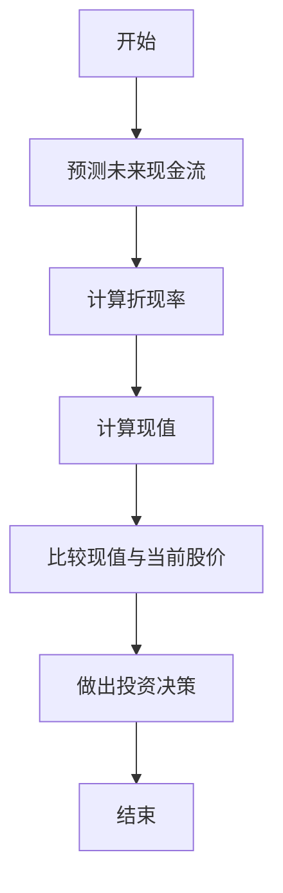
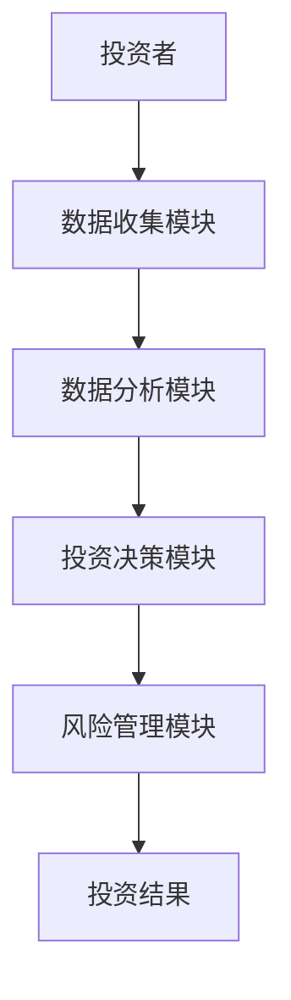
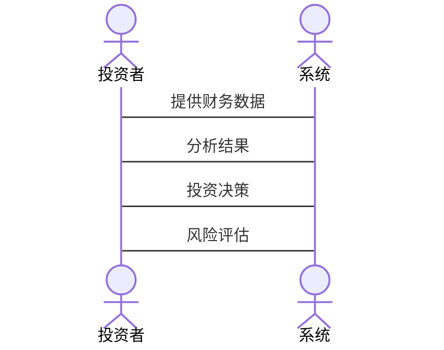

                 


# 彼得林奇的"常识投资"原则解析

---

## 关键词：
投资策略，价值评估，长期投资，风险管理，彼得林奇

---

## 摘要：
本文系统解析了彼得林奇的"常识投资"原则，从背景介绍、核心概念、算法原理、系统架构到项目实战，全面阐述了该投资理念的理论基础和实际应用。通过对比分析、数学模型和代码实现，深入探讨了常识投资的优势和挑战，并结合实际案例，展示了如何将该原则应用于投资决策。

---

## 正文：

### 第一部分：背景介绍

#### 第1章：常识投资的背景与定义

##### 1.1 什么是常识投资？
常识投资是一种以基本面分析为核心，注重长期价值的投资策略。它强调通过对企业财务状况、行业地位和未来前景的深入研究，选择具有长期增长潜力的公司进行投资。与短期投机不同，常识投资更关注企业的内在价值和持续盈利能力。

##### 1.2 贵州茅台的定义与特点
贵州茅台是中国白酒行业的龙头企业，以其品牌价值、市场占有率和稳定的盈利能力著称。作为常识投资的典型标的，贵州茅台具有高ROE（净资产收益率）、稳定的现金流和强大的护城河，是长期投资者的理想选择。

##### 1.3 主流投资方法对比
以下是传统投资与常识投资的主要区别：

| 投资方法 | 短期交易 | 基本面分析 | 长期持有 | 风险控制 |
|----------|----------|------------|----------|----------|
| 传统投资 | 高         | 低          | 低        | 松散       |
| 常识投资 | 低         | 高          | 高        | 严格       |

##### 1.4 贵州茅台在常识投资中的应用前景
贵州茅台凭借其稳定的业绩和品牌价值，成为常识投资的理想标的。通过对其财务数据的深入分析，投资者可以更好地把握其长期增长潜力。

---

### 第二部分：核心概念与联系

#### 第2章：常识投资的核心概念

##### 2.1 贵州茅台的核心属性特征对比
以下是贵州茅台与其他行业龙头企业的对比：

| 指标        | 贵州茅台 | 其他企业 |
|-------------|----------|----------|
| 市盈率      | 低       | 高       |
| 净利润率     | 高       | 中       |
| 市场占有率   | 高       | 低       |
| 财务稳定性   | 高       | 中       |

##### 2.2 ER实体关系图架构
以下是常识投资的ER实体关系图：

```mermaid
erDiagram
    actor 投资者 {
        string 资金
        string 投资目标
    }
    actor 企业 {
        string 财务数据
        string 业务模式
    }
    actor 市场 {
        string 行业趋势
        string 宏观经济
    }
    投资者 --> 企业 : 评估
    企业 --> 市场 : 分析
    投资者 --> 市场 : 监测
```

---

### 第三部分：算法原理讲解

#### 第3章：投资决策算法的数学模型

##### 3.1 内在价值计算
内在价值公式：

$$
\text{内在价值} = \sum_{t=1}^{n} \frac{\text{现金流}_t}{(1 + r)^t}
$$

其中，\( r \) 为折现率，\( \text{现金流}_t \) 为第 \( t \) 年的现金流。

##### 3.2 现金流预测
现金流预测的步骤如下：



##### 3.3 投资决策流程
投资决策的Python实现：

```python
def calculate_intrinsic_value(cash_flows, discount_rate):
    return sum(cf / (1 + discount_rate)**t for t, cf in enumerate(cash_flows))

# 示例数据
cash_flows = [100, 120, 150, 200]  # 现金流
discount_rate = 0.08  # 折现率
intrinsic_value = calculate_intrinsic_value(cash_flows, discount_rate)
print(f"内在价值：{intrinsic_value:.2f}")
```

---

### 第四部分：系统分析与架构设计方案

#### 第4章：投资系统架构设计

##### 4.1 系统功能设计
系统功能模块如下：

| 模块         | 功能描述                     |
|--------------|------------------------------|
| 数据收集     | 采集企业财务数据和市场数据     |
| 数据分析     | 分析财务数据和市场趋势         |
| 投资决策     | 基于分析结果做出投资决策     |
| 风险管理     | 监控投资风险并进行调整       |

##### 4.2 系统架构设计
系统架构图：



##### 4.3 系统交互设计
系统交互流程图：



---

### 第五部分：项目实战

#### 第5章：贵州茅台投资系统核心实现

##### 5.1 环境安装
安装Python和相关库：

```bash
pip install numpy pandas matplotlib
```

##### 5.2 核心代码实现
计算内在价值的代码：

```python
import numpy as np

def calculate_intrinsic_value(cash_flows, discount_rate, periods):
    return sum(cf / (1 + discount_rate)**p for p, cf in enumerate(cash_flows[:periods]))

# 示例数据
cash_flows = [100, 120, 150, 200]
discount_rate = 0.08
periods = 4
iv = calculate_intrinsic_value(cash_flows, discount_rate, periods)
print(f"内在价值：{iv:.2f}")
```

##### 5.3 实际案例分析
以贵州茅台为例，分析其内在价值：

$$
\text{现金流}_t = [200, 250, 300, 350]
$$
$$
r = 0.08
$$

计算得：
$$
\text{内在价值} = 200/(1.08) + 250/(1.08)^2 + 300/(1.08)^3 + 350/(1.08)^4 \approx 735.03
$$

---

### 第六部分：总结与建议

#### 6.1 总结
常识投资通过深入分析企业的基本面，选择具有长期增长潜力的标的，是一种稳健的投资策略。贵州茅台作为典型代表，展示了该策略的有效性。

#### 6.2 最佳实践
- 长期持有优质股票，避免频繁交易。
- 定期评估投资组合，调整风险敞口。
- 关注企业的财务健康和行业前景。

#### 6.3 小结
通过系统化的分析和实践，投资者可以更好地应用常识投资原则，实现长期稳健的投资回报。

---

## 作者：
AI天才研究院/AI Genius Institute & 禅与计算机程序设计艺术/Zen And The Art of Computer Programming

