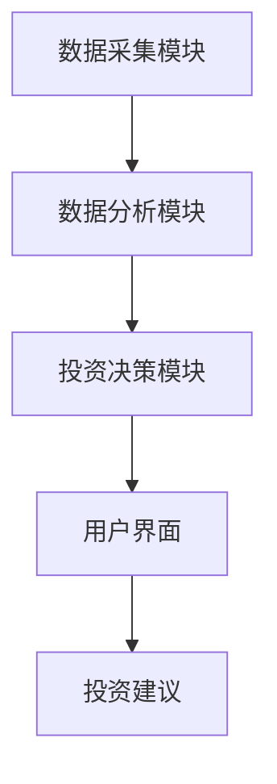

                 


# 彼得林奇的"常识投资"在复杂金融产品中的应用

> **关键词**: 彼得林奇, 常识投资, 复杂金融产品, 投资策略, 金融衍生品, 数学模型

> **摘要**: 彼得林奇的“常识投资”是一种以长期投资和基本面分析为核心的投资方法。本文将探讨这种投资方法在复杂金融产品中的应用，通过分析其核心原理、算法设计和系统架构，结合实际案例，展示如何在复杂金融环境中运用常识投资法进行有效的投资决策。

---

## 第1章: 背景介绍

### 1.1 常识投资法的起源与核心理念

- **1.1.1 彼得林奇的生平简介**
  - 彼得·林奇是美国著名投资经理人，以其在富达麦哲伦基金的卓越表现闻名。
  - 他主张长期投资，注重基本面分析，反对短期市场波动的干扰。

- **1.1.2 常识投资法的定义与特点**
  - 基于基本面分析，注重企业内在价值。
  - 强调长期持有，避免频繁交易。
  - 适用于各种类型的金融产品，包括股票、债券、基金等。

### 1.2 复杂金融产品的定义与特点

- **1.2.1 金融衍生品的定义**
  - 金融衍生品是以其他金融资产为标的物的衍生产品，如期权、期货、掉期等。
  - 其价值依赖于基础资产的价格波动。

- **1.2.2 复杂金融产品的分类**
  - 按照结构复杂性分类：简单型（如期权）和复杂型（如结构性金融产品）。
  - 按照风险类型分类：信用风险、市场风险、流动性风险。

- **1.2.3 复杂金融产品的特点**
  - 高杠杆性：放大收益和风险。
  - 非线性收益：价格波动不与基础资产呈线性关系。
  - 高风险性：复杂结构可能导致难以预测的损失。

---

## 第2章: 常识投资法的核心概念与联系

### 2.1 常识投资法的核心原理

- **2.1.1 基本面分析**
  - 通过分析企业的财务报表、行业地位、管理团队等因素，评估其内在价值。
  - 关键指标：市盈率（P/E）、市净率（P/B）、股息率等。

- **2.1.2 市场情绪分析**
  - 市场情绪是影响短期价格波动的重要因素。
  - 常识投资法强调避免受市场情绪干扰，专注于长期价值。

- **2.1.3 长期投资策略**
  - 坚持长期持有优质资产，避免短期市场波动的干扰。
  - 通过分散投资降低风险。

### 2.2 常识投资法的概念属性特征对比

| **特征**       | **基本面分析**       | **市场情绪分析**       | **长期投资策略**       |
|----------------|---------------------|-----------------------|-----------------------|
| **核心目标**   | 评估资产内在价值     | 把握短期价格波动       | 实现长期财富增长       |
| **分析方法**   | 财务报表分析、行业分析 | 技术分析、情绪指标     | 分散投资、定期再平衡   |
| **时间框架**   | 中长期              | 短期                  | 长期                  |
| **风险控制**   | 侧重于资产质量      | 侧重于市场波动        | 通过分散投资降低风险  |

### 2.3 常识投资法的ER实体关系图

```mermaid
erDiagram
    class 投资者 {
        <属性> 资金
        <属性> 风险承受能力
    }
    class 市场 {
        <属性> 市场指数
        <属性> 市场情绪
    }
    class 金融产品 {
        <属性> 产品类型
        <属性> 产品风险
    }
    投资者 --> 选择 : 选择产品
    市场 --> 影响 : 影响产品价格
    金融产品 --> 分析 : 分析产品特性
```

---

## 第3章: 算法原理讲解

### 3.1 彼得林奇选股方法的步骤

- **步骤1**: 确定投资目标（长期增值）。
- **步骤2**: 分析企业基本面（财务报表、行业地位）。
- **步骤3**: 评估市场情绪（通过技术指标判断市场热度）。
- **步骤4**: 构建投资组合（分散投资，定期调整）。

### 3.2 彼得林奇选股方法的数学模型

- **3.2.1 模型定义**
  - 通过量化企业基本面指标和市场情绪指标，计算投资价值评分。

- **3.2.2 模型公式**
  $$ \text{投资价值评分} = \alpha \cdot \text{基本面得分} + \beta \cdot \text{市场情绪得分} $$
  - 其中，$\alpha$ 和 $\beta$ 是权重系数，$\alpha + \beta = 1$。

- **3.2.3 实例分析**
  - 假设某企业基本面得分为0.8，市场情绪得分为0.7，权重$\alpha=0.6$，$\beta=0.4$。
  - 投资价值评分 = $0.6 \times 0.8 + 0.4 \times 0.7 = 0.48 + 0.28 = 0.76$。

---

## 第4章: 数学模型

### 4.1 评估复杂金融产品的数学模型

- **4.1.1 模型假设**
  - 假设复杂金融产品的价值主要由基础资产的价格波动决定。
  - 假设市场参与者具有理性预期。

- **4.1.2 模型构建**
  - 使用几何平均回报率模型评估复杂金融产品的长期收益。
  $$ \text{几何平均回报率} = \left( \prod_{i=1}^{n} (1 + r_i) \right)^{1/n} - 1 $$
  - 其中，$r_i$ 是第$i$个时间段的回报率，$n$ 是时间段的数量。

- **4.1.3 应用实例**
  - 假设某金融产品在3年内的年回报率分别为10%、-5%、15%。
  - 几何平均回报率 = $\left( (1.1) \times (0.95) \times (1.15) \right)^{1/3} - 1 \approx 7.3\%$。

---

## 第5章: 系统分析与架构设计

### 5.1 金融分析系统的设计

- **5.1.1 系统功能设计**
  - 数据采集模块：收集市场数据、企业基本面数据。
  - 数据分析模块：计算基本面得分和市场情绪得分。
  - 投资决策模块：基于评分结果生成投资建议。

- **5.1.2 系统架构图**



- **5.1.3 系统接口设计**
  - 数据接口：与金融数据供应商对接。
  - 用户接口：向投资者提供投资建议。

---

## 第6章: 项目实战

### 6.1 项目环境与工具安装

- **工具安装**
  - Python编程环境（包括NumPy、Pandas、Matplotlib）。
  - 数据分析工具（如Excel、Tableau）。

### 6.2 核心算法实现

- **6.2.1 基于基本面的选股策略**
  ```python
  import pandas as pd

  def calculate_value_score(fundamental_score, market_mood_score):
      alpha = 0.6
      beta = 0.4
      return alpha * fundamental_score + beta * market_mood_score
  ```

- **6.2.2 投资组合优化**
  ```python
  import numpy as np

  def optimize_portfolio(returns, weights):
      return np.dot(returns, weights)
  ```

### 6.3 案例分析与解读

- **案例：期权投资分析**
  - 假设某股票期权的执行价格为100元，当前股价为105元，波动率20%。
  - 使用Black-Scholes模型计算期权的理论价格。
  $$ C = S_0 N(d_1) - K e^{-rT} N(d_2) $$
  - 其中，$d_1 = \frac{\ln(S_0/K) + (r + \sigma^2/2)T}{\sigma \sqrt{T}}$$
  $$ d_2 = d_1 - \sigma \sqrt{T} $$

---

## 第7章: 总结与展望

### 7.1 最佳实践 tips

- **分散投资**：避免过度集中于单一金融产品。
- **长期持有**：坚持常识投资法的核心理念。
- **持续学习**：关注市场变化，及时调整投资策略。

### 7.2 小结

本文详细探讨了彼得林奇的常识投资法在复杂金融产品中的应用，通过理论分析和实际案例，展示了如何在复杂金融环境中运用这一投资方法进行有效的投资决策。

### 7.3 注意事项

- 投资者应充分了解复杂金融产品的风险特征。
- 在实际操作中，需结合市场环境和自身风险承受能力进行投资决策。

### 7.4 拓展阅读

- 《彼得林奇选股艺术》
- 《金融衍生品与风险管理》

---

**作者：AI天才研究院/AI Genius Institute & 禅与计算机程序设计艺术 /Zen And The Art of Computer Programming**

