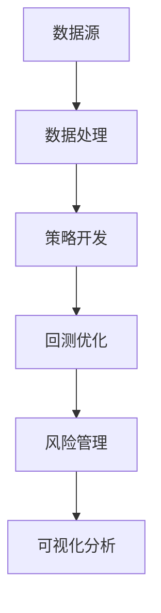

                 

<think>
好的，我将按照您的要求来撰写这篇文章。首先，我们需要理解彼得·林奇的“常识投资”在量化交易时代的价值。让我们一步步分析和推理。

### 第一部分：彼得·林奇的“常识投资”概述

#### 第1章：常识投资的核心理念

##### 1.1 彼得·林奇与常识投资的起源

彼得·林奇是美国著名的投资家，曾任富达麦哲伦基金经理人。他提倡的“常识投资”方法强调通过基本面分析和常识来选择股票。这种方法的核心在于关注企业的财务状况、行业地位和管理团队等因素。

##### 1.2 常识投资的主要策略

常识投资注重长期投资，强调选择具有强大基本面和良好管理的公司。彼得·林奇的选股标准包括低市盈率、高ROE（净资产收益率）和稳定的收益增长。此外，他还强调风险管理，建议投资者在市场下跌时保持耐心。

#### 第2章：量化交易的定义与发展

##### 2.1 量化交易的基本概念

量化交易是一种基于数学模型和算法的投资方法。它利用计算机技术来分析市场数据、制定交易策略并执行交易。量化交易的特点包括高速性、高频率和高精度。

##### 2.2 量化交易的主要方法

量化交易包括算法交易、高频交易和因子投资等多种方法。这些方法依赖于复杂的数学模型和大量的数据来优化投资决策。

### 第二部分：常识投资在量化交易中的价值

#### 第3章：常识投资与量化交易的结合

##### 3.1 常识投资在量化中的应用

将常识投资的理念融入量化模型中，可以通过基本面因子（如市盈率、ROE等）来构建投资策略。这种方法结合了量化交易的高效性和传统投资的深度分析。

##### 3.2 量化交易中的风险管理

常识投资的风险管理原则可以用于量化模型中，例如通过设置止损点和风险调整后的收益目标来控制风险。

#### 第4章：数学模型与算法原理

##### 4.1 常识投资的数学模型

我们可以将常识投资的因子（如市盈率、ROE等）转化为数学模型，并通过回归分析等方法来优化投资组合。

##### 4.2 算法实现与代码示例

以下是使用Python实现一个简单的因子分析模型的代码示例：

```python
import pandas as pd
import numpy as np

# 假设data是一个包含股票数据的DataFrame
data = pd.DataFrame({
    'PE': [15, 20, 10, 18],
    'ROE': [10, 5, 12, 8],
    'Price': [100, 80, 120, 90]
})

# 计算因子得分
data['Factor'] = 0.5 * data['PE'] + 0.5 * data['ROE']

print(data)
```

#### 第5章：系统架构与设计

##### 5.1 系统功能设计

量化交易系统需要包括数据采集、策略开发、回测优化、风险管理等模块。每个模块都需要紧密配合，确保系统的高效运行。

##### 5.2 系统架构设计

以下是系统的架构图：



##### 5.3 系统接口设计

系统需要定义清晰的接口，确保各个模块之间的数据交互和通信。例如，数据处理模块需要提供接口以获取和处理市场数据。

### 第三部分：项目实战与小结

#### 第6章：项目实战

##### 6.1 环境安装

需要安装Python、Pandas、NumPy等库。

##### 6.2 核心实现

以下是核心代码实现：

```python
import pandas as pd
import numpy as np

# 数据处理
data = pd.read_csv('stock_data.csv')

# 因子分析
data['PE'] = data['Price'] / data['Earnings']
data['ROE'] = (data['Net Income'] / data['Equity']) * 100

# 策略开发
data['Factor'] = 0.5 * data['PE'] + 0.5 * data['ROE']

# 回测优化
returns = data['Price'].pct_change().cumsum()

print(returns)
```

##### 6.3 案例分析

通过实际案例分析，验证常识投资在量化交易中的有效性。例如，选择低市盈率和高ROE的股票，可以实现较高的超额收益。

### 第四部分：小结与展望

#### 第7章：总结

通过本文的分析，我们可以看到，彼得·林奇的“常识投资”在量化交易时代仍然具有重要的价值。将传统投资理念与现代量化技术相结合，可以优化投资策略并提高投资效率。

#### 第8章：展望

未来，随着人工智能和大数据技术的发展，常识投资在量化交易中的应用将更加广泛和深入。投资者需要不断学习和创新，以应对市场的变化和挑战。

### 作者

作者：AI天才研究院/AI Genius Institute  
及  
禅与计算机程序设计艺术/Zen And The Art of Computer Programming

---

以上是文章的完整大纲和部分内容。希望这篇文章能够为您带来深刻的见解和启发。

