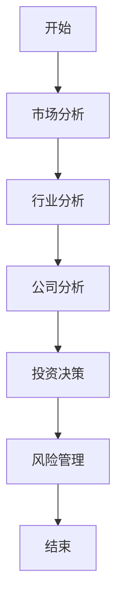

                 


# 彼得林奇的"常识投资"实践指南

> 关键词：常识投资，彼得·林奇，投资策略，系统化方法，风险管理

> 摘要：本文深入探讨了彼得·林奇的常识投资理念，系统地分析了其核心概念、理论基础、系统化方法及其在实际投资中的应用。通过详细的案例分析和系统设计，帮助投资者更好地理解和应用常识投资策略。

---

## 第1章: 什么是常识投资

### 1.1 常识投资的定义与核心理念

常识投资是一种基于个人经验和市场直觉的投资方法，强调利用常识和逻辑分析来做出投资决策。其核心理念在于通过基本面分析和市场趋势判断，寻找具有长期增长潜力的优质企业进行投资。

#### 1.1.1 常识投资的定义

常识投资（Common Sense Investing）是一种投资策略，强调投资者应基于自身的知识、经验以及对市场的理解，做出理性的投资决策。这种方法不同于纯粹依靠数学模型或算法的投资方法，而是更注重对企业的基本面、行业趋势以及市场情绪的综合分析。

#### 1.1.2 常识投资的核心理念

- **基本面分析**：通过对企业的财务状况、盈利能力、管理团队等进行深入分析，评估其投资价值。
- **市场趋势**：关注宏观经济环境、行业发展趋势以及市场周期变化，判断投资机会。
- **风险管理**：注重分散投资、设置止损点等风险管理措施，避免重大损失。

#### 1.1.3 常识投资与其他投资方法的区别

| 投资方法 | 理论基础 | 分析重点 | 适用场景 |
|----------|----------|----------|----------|
| 量化投资 | 数学模型 | 数据、算法 | 适合数据驱动型投资者 |
| 基本面投资 | 财务分析 | 企业财务状况 | 适合长期投资者 |
| 常识投资 | 经验与逻辑 | 市场趋势、企业价值 | 适合个人投资者 |

### 1.2 彼得·林奇与常识投资

#### 1.2.1 彼得·林奇的背景介绍

彼得·林奇（Peter Lynch）是美国著名投资专家，曾任富达投资集团的基金经理。他以独特的投资风格和卓越的投资业绩闻名，管理的基金在任职期间取得了年均29%的回报率。

#### 1.2.2 彼得·林奇的常识投资思想

彼得·林奇强调，投资应基于常识和逻辑，避免过度依赖复杂的模型。他认为，投资者应关注企业的基本面，选择那些具有持续增长潜力且估值合理的公司进行投资。

#### 1.2.3 彼得·林奇的经典投资案例

彼得·林奇曾成功投资于许多优质企业，例如：
- **吉列公司**：通过分析公司市场份额和竞争优势，发现其低估，果断买入。
- **苹果公司**：在苹果推出iPod和iPhone之前，林奇就看好其创新能力，长期持有。

### 1.3 为什么常识投资重要

#### 1.3.1 投资市场的复杂性

投资市场受多种因素影响，包括经济周期、政策变化、行业趋势等。仅依靠数学模型难以全面捕捉这些因素。

#### 1.3.2 常识投资的优势

- **灵活性**：能够快速适应市场变化，及时调整投资策略。
- **可操作性**：适合个人投资者，无需大量资源支持。
- **长期收益**：通过深入分析企业基本面，选择优质企业，实现长期收益。

#### 1.3.3 常识投资的适用场景

- **个人投资者**：适合那些有一定投资知识和经验的个人投资者。
- **中小型企业**：企业可以通过常识投资优化资本配置，实现资产增值。

### 1.4 本章小结

常识投资是一种以经验、逻辑和基本面分析为基础的投资方法，强调对市场趋势和企业价值的深入理解。彼得·林奇的成功实践证明了其有效性，但需要投资者具备较高的市场敏感性和分析能力。

---

## 第2章: 常识投资的核心概念

### 2.1 常识投资的核心要素

#### 2.1.1 市场分析

市场分析是常识投资的第一步，包括对宏观经济环境、行业发展趋势以及市场周期的分析。

#### 2.1.2 行业分析

行业分析关注行业的竞争结构、增长潜力以及政策影响，帮助投资者选择具有竞争优势的行业。

#### 2.1.3 公司分析

公司分析是对企业的财务状况、管理团队、竞争优势等方面进行深入分析，评估其投资价值。

### 2.2 常识投资的关键属性

| 属性 | 描述 |
|------|------|
| 市场敏感性 | 投资者需对市场变化保持敏感，及时调整策略 |
| 公司基本面 | 重点关注企业的财务状况和盈利能力 |
| 行业趋势 | 分析行业的发展前景和竞争格局 |

### 2.3 常识投资的ER实体关系图

```mermaid
er
actor: 投资者
entity: 公司, 行业, 市场
relationship: 投资者-公司, 投资者-行业, 投资者-市场
```

### 2.4 本章小结

常识投资的核心在于对市场、行业和公司的深入分析。通过这些分析，投资者可以更好地识别投资机会，做出理性的投资决策。

---

## 第3章: 常识投资的理论基础

### 3.1 常识投资的算法原理

#### 3.1.1 市场分析模型

$$ P = \text{市场趋势} \times \text{市场情绪} $$

#### 3.1.2 行业分析模型

$$ Q = \text{行业趋势} \times \text{行业竞争} $$

#### 3.1.3 公司分析模型

$$ R = \text{公司基本面} \times \text{公司前景} $$

### 3.2 常识投资的数学模型

通过上述模型，投资者可以量化分析市场、行业和公司的综合情况，从而做出更科学的投资决策。

### 3.3 本章小结

通过数学模型的分析，常识投资能够更系统地评估投资标的的价值，帮助投资者做出更理性的决策。

---

## 第4章: 系统化投资的架构设计

### 4.1 系统化投资的流程



### 4.2 系统化投资的架构设计

```mermaid
classDiagram
class 投资者 {
    市场分析
    行业分析
    公司分析
}
class 系统 {
    数据输入
    数据处理
    数据输出
}
investor -> 系统: 输入投资需求
系统 -> 投资者: 输出投资建议
```

### 4.3 本章小结

系统化投资通过科学的流程和架构设计，能够提高投资决策的效率和准确性。

---

## 第5章: 常识投资的实战应用

### 5.1 常识投资的实战技巧

#### 5.1.1 市场分析

- 关注宏观经济指标，如GDP增长率、利率水平等。
- 分析市场周期，判断市场处于牛市还是熊市。

#### 5.1.2 行业分析

- 选择具有增长潜力的行业，如科技、医疗等。
- 分析行业竞争格局，选择具有竞争优势的企业。

#### 5.1.3 公司分析

- 评估企业的财务状况，如利润率、资产负债率等。
- 关注管理团队的稳定性和发展战略。

### 5.2 风险管理

#### 5.2.1 风险识别

- 识别市场风险、行业风险和公司风险。
- 通过分散投资降低风险。

#### 5.2.2 风险控制

- 设置止损点，避免重大损失。
- 定期评估投资组合，及时调整。

### 5.3 案例分析

#### 5.3.1 案例一：科技行业投资

- **公司选择**：选择具有创新能力的科技企业，如苹果、微软等。
- **分析步骤**：分析公司财务状况、市场地位、竞争能力等。

#### 5.3.2 案例二：医疗行业投资

- **公司选择**：选择具有持续增长潜力的医疗企业，如辉瑞、强生等。
- **分析步骤**：分析行业趋势、公司财务状况、管理团队等。

### 5.4 本章小结

通过实际案例分析，投资者可以更好地理解如何应用常识投资策略，做出更有效的投资决策。

---

## 第6章: 总结与展望

### 6.1 总结

常识投资是一种以经验、逻辑和基本面分析为基础的投资方法，强调对市场趋势和企业价值的深入理解。彼得·林奇的成功实践证明了其有效性，但需要投资者具备较高的市场敏感性和分析能力。

### 6.2 展望

随着投资市场的不断发展，常识投资将更加注重系统化和量化分析。未来，投资者可以通过结合大数据和人工智能技术，进一步提升投资决策的科学性和准确性。

---

## 作者：AI天才研究院/AI Genius Institute & 禅与计算机程序设计艺术 /Zen And The Art of Computer Programming

---

通过本文的系统化分析和实践指导，投资者可以更好地理解和应用彼得·林奇的常识投资理念，做出更理性的投资决策。

