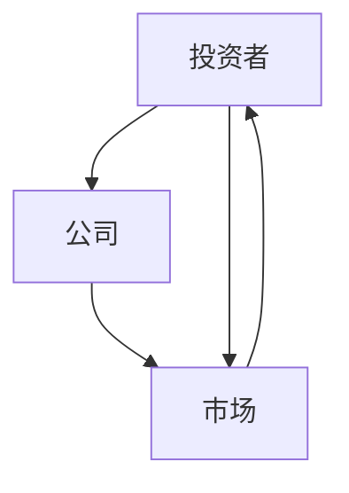
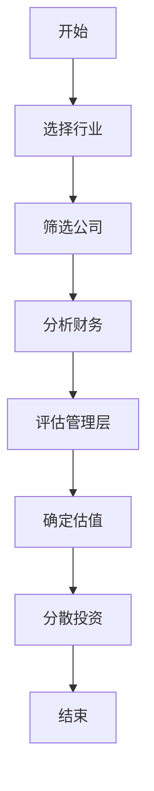

                 


# 彼得林奇的"常识投资"理念

## 关键词：
- 彼得·林奇
- 常识投资
- 投资策略
- 基金管理
- 市场分析

## 摘要：
彼得·林奇是全球著名的投资专家，他提出的“常识投资”理念强调基于基本面分析和长期持有的投资策略。本文详细探讨了常识投资的核心概念、算法原理、系统架构以及实战应用，通过丰富的案例和详细的分析，帮助读者理解和应用这一投资理念。

---

# 第一部分：常识投资概述

## # 第1章：什么是常识投资

### 1.1 投资的基本概念
- **投资定义**：将资金投入特定资产以获取未来收益的行为。
- **投资目标**：实现资产增值，分散风险，获得稳定收益。
- **投资工具**：股票、债券、基金、房地产等。

### 1.2 常识投资的定义
- **基本面分析**：通过分析公司的财务状况、行业地位和管理层能力来评估其价值。
- **长期持有**：不频繁交易，长期持有优质资产以获得复利效应。
- **分散投资**：通过投资不同资产或行业降低风险。

### 1.3 常识投资的特点
- **简单易懂**：避免复杂的技术分析，注重基本逻辑。
- **避免跟风**：不盲目追随市场潮流，坚持独立判断。
- **注重长期**：关注企业的持续盈利能力，而非短期波动。

### 1.4 彼得·林奇的背景
- **生平简介**：彼得·林奇是富达基金的传奇经理人，管理麦哲伦基金长达13年，创造了卓越的投资业绩。
- **投资理念**：强调常识和基本面分析，倡导长期投资。

---

## # 第2章：常识投资的核心概念与联系

### 2.1 常识投资的核心概念
- **公司基本面**：包括收入、利润、资产负债表和现金流等财务指标。
- **行业地位**：公司在行业中的竞争力和市场份额。
- **管理层能力**：管理层的战略眼光和执行力对企业价值的影响。

### 2.2 常识投资的关键要素
- **市场有效性**：认识到市场并非总是有效，存在短期波动和错估的机会。
- **心理因素**：投资者心理（贪婪与恐惧）对市场的影响。
- **市场周期**：经济周期对投资决策的影响。

### 2.3 常识投资的ER实体关系图


### 2.4 常识投资的概念属性特征对比表
| 概念       | 特征                                   |
|------------|--------------------------------------|
| 投资目标    | 长期资本增值                         |
| 投资策略    | 基于基本面分析                       |
| 风险控制    | 分散投资                             |
| 投资周期    | 长期持有                             |

---

## # 第3章：常识投资的算法原理

### 3.1 常识投资的基本原理
- **基本面分析**：通过分析公司财务数据、行业地位和管理层能力，筛选出具有竞争优势的企业。
- **市场情绪分析**：识别市场的非理性波动，寻找被低估的投资机会。
- **投资组合优化**：通过分散投资降低风险，同时提高收益。

### 3.2 常识投资的数学模型
- **期望收益计算**：
  $$E(r) = \sum p_i r_i$$
  其中，\( p_i \) 是各资产的权重，\( r_i \) 是各资产的预期收益。

- **风险评估模型**：
  $$\sigma = \sqrt{\sum p_i (r_i - E(r))^2}$$
  其中，\( \sigma \) 表示投资组合的标准差，衡量风险。

### 3.3 常识投资的流程图


---

# 第二部分：系统分析与架构设计

## # 第4章：常识投资的系统架构

### 4.1 问题场景介绍
- **投资决策系统**：一个帮助投资者基于常识投资理念做出决策的系统。
- **目标用户**：个人投资者和机构投资者。

### 4.2 系统功能设计
- **领域模型**：用类图展示系统的主要功能模块。
  ```mermaid
  classDiagram
  class 投资者 {
    - 资金
    - 投资组合
    - 风险偏好
    + 分析市场()
    + 选择资产()
  }
  class 市场 {
    - 资产价格
    - 市场情绪
    + 获取数据()
  }
  class 公司 {
    - 财务数据
    - 行业地位
    + 提供数据()
  }
  投资者 --> 市场
  投资者 --> 公司
  ```

### 4.3 系统架构设计
- **整体架构**：
  ```mermaid
  graph TD
  A[投资者] --> B[投资决策系统]
  B --> C[市场数据]
  B --> D[公司基本面]
  B --> E[投资组合管理]
  ```
- **功能模块**：
  - 数据采集：获取市场和公司数据。
  - 数据分析：进行基本面分析和估值。
  - 投资组合优化：根据分析结果构建投资组合。

### 4.4 系统接口设计
- **数据接口**：与市场数据源和公司数据库对接。
- **用户界面**：提供直观的投资分析工具。

---

## # 第5章：常识投资的系统实现

### 5.1 项目介绍
- **项目名称**：基于彼得·林奇常识投资理念的投资决策系统。
- **项目目标**：帮助投资者实现长期稳健的投资收益。

### 5.2 核心实现代码
```python
def calculate_expected_return(assets, probabilities, returns):
    return sum(p * r for p, r in zip(probabilities, returns))

def calculate_risk(assets, probabilities, expected_return):
    variance = sum(p * (r - expected_return)**2 for p, r in zip(probabilities, assets))
    return variance ** 0.5

# 示例数据
assets = [10, 20, 30]
probabilities = [0.3, 0.4, 0.3]
returns = [0.05, 0.10, 0.15]

expected_return = calculate_expected_return(assets, probabilities, returns)
risk = calculate_risk(assets, probabilities, expected_return)

print(f"期望收益: {expected_return}")
print(f"风险: {risk}")
```

### 5.3 系统实现解读
- **代码功能**：计算投资组合的期望收益和风险，帮助投资者做出决策。
- **代码应用**：通过输入不同资产的预期收益和概率，计算整体投资组合的期望收益和风险。

---

## # 第6章：项目实战

### 6.1 案例分析
- **案例背景**：假设投资者有100万元，希望通过常识投资理念构建投资组合。
- **分析步骤**：
  1. 选择行业：科技、消费、医疗。
  2. 筛选公司：选择行业龙头，如苹果、可口可乐、强生。
  3. 分析财务：评估公司的盈利能力、债务情况和现金流。
  4. 估值：计算合理市盈率，确定投资价值。
  5. 分散投资：将资金分配到不同资产，降低风险。

### 6.2 投资组合管理
- **动态调整**：定期评估投资组合，根据市场变化进行调整。
- **风险管理**：设定止损点，避免重大损失。

---

## # 第7章：总结与展望

### 7.1 最佳实践 tips
- **持续学习**：关注市场动态，学习新的投资理念。
- **保持纪律**：严格按照投资计划执行，避免情绪化决策。
- **长期视角**：耐心持有优质资产，享受复利效应。

### 7.2 小结
彼得·林奇的常识投资理念强调基本面分析和长期持有，通过系统的分析和分散投资降低风险，实现稳健收益。

### 7.3 注意事项
- **市场风险**：即使基本面优秀，市场波动仍可能影响收益。
- **信息滞后**：财务数据可能存在滞后性，需及时更新信息。
- **人性弱点**：克服贪婪与恐惧，坚持理性投资。

### 7.4 拓展阅读
- 《彼得·林奇的成功投资》
- 《投资最重要的少数事》
- 《价值投资入门》

---

# 作者：AI天才研究院/AI Genius Institute & 禅与计算机程序设计艺术 /Zen And The Art of Computer Programming

---

通过以上详细的内容，我们可以看到，彼得·林奇的常识投资理念是一个系统而科学的方法，结合基本面分析和长期投资策略，帮助投资者在复杂多变的市场中实现稳健的收益。

