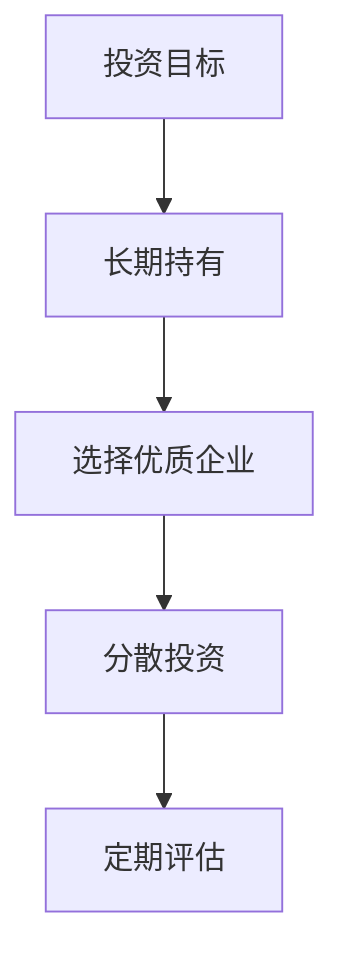
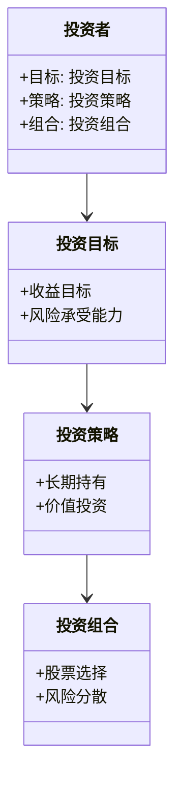

                 


# 彼得林奇的"慢牛"投资哲学

> 关键词：彼得·林奇，投资哲学，慢牛，长期投资，价值投资，风险管理

> 摘要：本文深入探讨了彼得·林奇的“慢牛”投资哲学，分析其核心理念、数学模型、系统架构，并通过项目实战展示其应用。文章结构清晰，内容详实，适合投资领域的专业人士和爱好者阅读。

---

# 引言

## 背景介绍

彼得·林奇是全球著名投资专家，以其长期投资和价值投资理念闻名。本文将探讨他的“慢牛”哲学，强调长期稳健的投资策略。

## 核心概念

“慢牛”哲学强调长期投资，避免短期波动，通过深入分析企业价值寻找投资机会。本文将从背景、核心理念、数学模型等方面展开分析。

---

# 第一部分: "慢牛"投资哲学的核心理念

## 第1章: 投资背景与核心概念

### 1.1 彼得·林奇的背景

- **生平简介**：彼得·林奇是富达投资的传奇经理人，管理基金超过100亿美元。
- **影响力**：他通过长期投资策略，帮助投资者实现财富增长。

### 1.2 "慢牛"哲学的定义

- **定义**：强调长期持有优质股票，避免频繁交易。
- **与传统投资区别**：传统策略关注短期收益，而“慢牛”注重长期价值。

## 第2章: 长期投资的逻辑

### 2.1 长期投资的数学模型

$$ ROI = \frac{最终价值 - 初始价值}{初始价值} $$

### 2.2 投资策略的系统架构



---

# 第二部分: 数学模型与系统架构

## 第3章: 数学模型

### 3.1 投资回报分析

- **市盈率公式**：$$ P/E = \frac{股价}{每股收益} $$
- **市净率公式**：$$ P/B = \frac{股价}{每股净资产} $$$

### 3.2 风险与收益平衡

- **风险调整后收益**：$$ RAR = \frac{收益 - 无风险收益率}{风险} $$

## 第4章: 系统架构设计

### 4.1 投资决策框架



---

# 第三部分: 项目实战

## 第5章: 实战案例分析

### 5.1 环境安装

- **工具**：Python、Pandas、Matplotlib

### 5.2 核心代码实现

```python
import pandas as pd
import matplotlib.pyplot as plt

# 数据加载
data = pd.read_csv('stock_data.csv')

# 计算平均回报率
returns = data['return'].mean()

# 可视化
plt.plot(data['date'], data['value'], label='投资价值')
plt.xlabel('日期')
plt.ylabel('价值')
plt.legend()
plt.show()
```

### 5.3 案例分析

- **选择优质企业**：分析财务指标，选择具有稳定增长的企业。
- **风险管理**：定期评估投资组合，调整持仓。

---

# 结论

彼得林奇的“慢牛”投资哲学强调长期稳健投资，通过深入分析企业价值，避免短期波动。本文从数学模型、系统架构到项目实战，全面解析了这一策略，帮助读者在投资中实现稳健收益。

---

# 作者

**作者：AI天才研究院 & 禅与计算机程序设计艺术**

---

通过以上结构，文章系统地介绍了彼得林奇的“慢牛”投资哲学，结合理论与实践，帮助读者深入理解并应用这一投资策略。

