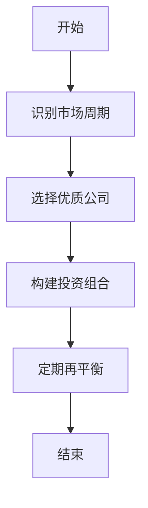
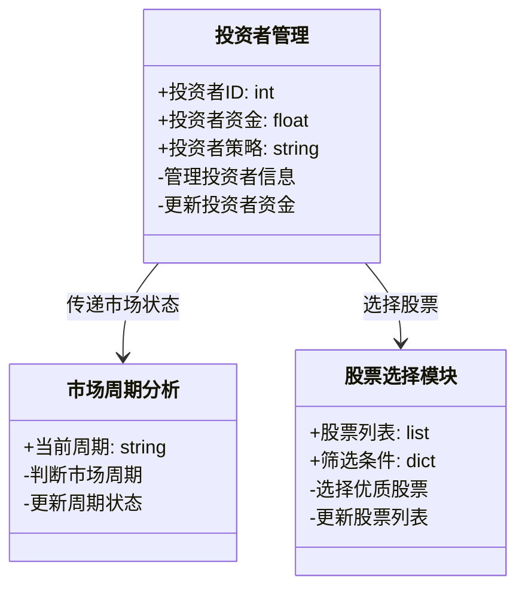

                 


# 彼得林奇的"慢牛"投资在不同市场周期的应用

## 关键词
- 彼得林奇
- 慢牛投资
- 市场周期
- 投资策略
- 价值投资
- 风险管理

## 摘要
本文深入分析了彼得·林奇的“慢牛”投资策略在不同市场周期中的应用。通过探讨其理论基础、策略实现、系统架构、实际案例以及最佳实践，本文为投资者提供了在不同市场环境下如何有效运用“慢牛”策略的全面指导。从核心概念到算法原理，从系统设计到项目实战，文章逐一解析，帮助读者全面理解并掌握这一经典投资策略。

---

## 目录

### 第1章：背景介绍
#### 1.1 投资市场的基本概念
- 1.1.1 什么是投资市场
  - 投资市场的定义和分类
  - 投资市场的基本功能
- 1.1.2 投资市场的分类
  - 股票市场、债券市场、期货市场等的概述
- 1.1.3 投资市场的基本原理
  - 价格波动、供需关系、市场情绪等

#### 1.2 彼得林奇的“慢牛”投资理论
- 1.2.1 “慢牛”策略的定义
  - 长期投资、价值投资的核心理念
- 1.2.2 彼得林奇的投资理念
  - 寻找具有持续增长潜力的公司
  - 避免短期波动，注重长期价值
- 1.2.3 “慢牛”策略的核心要素
  - 公司基本面分析、行业地位、财务状况

#### 1.3 不同市场周期的定义与特点
- 1.3.1 牛市、熊市、震荡市的定义
  - 牛市：市场上涨，投资者信心高涨
  - 熊市：市场下跌，投资者信心低落
  - 震荡市：市场波动剧烈，无明显趋势
- 1.3.2 各种市场周期的特点
  - 牛市：高增长、高波动
  - 熊市：低增长、高风险
  - 震荡市：不确定性高，机会与风险并存
- 1.3.3 市场周期对投资策略的影响
  - 不同周期下策略调整的必要性

---

### 第2章：核心概念与联系
#### 2.1 “慢牛”投资策略的原理
- 2.1.1 长期投资的重要性
  - 避免短期波动，专注长期价值
- 2.1.2 选择优质公司的标准
  - 行业地位、财务状况、管理团队
- 2.1.3 风险管理的方法
  - 分散投资、止损机制、仓位控制

#### 2.2 核心概念对比
- 使用表格对比“慢牛”策略与其他投资策略（如短线交易、指数投资）的优劣势

| 策略类型       | 核心理念                          | 优点                                   | 缺点                                   |
|----------------|-----------------------------------|---------------------------------------|---------------------------------------|
| 短线交易       | 利用短期价格波动获利              | 高流动性，快速获利                    | 风险高，需要频繁操作                 |
| 指数投资       | 通过分散投资追踪市场指数          | 风险低，操作简单                      | 收益有限，无法超越市场                |
| “慢牛”投资    | 长期持有优质股票，追求内在价值    | 稳定收益，风险低                      | 需要较长持有期，期间可能跑输市场      |

#### 2.3 ER实体关系图
- 使用Mermaid图展示“慢牛”策略中的实体关系

```mermaid
erDiagram
    investor "投资者" 
    strategy "投资策略" 
    market_cycle "市场周期" 
    stock "股票" 
    company "公司" 
    investor --> strategy : 选择策略
    strategy --> market_cycle : 适应周期
    strategy --> stock : 选择股票
    stock --> company : 属于公司
```

---

### 第3章：算法原理讲解
#### 3.1 “慢牛”策略的算法实现
- 算法步骤：
  1. 识别市场周期
  2. 选择优质公司
  3. 构建投资组合
  4. 定期再平衡

#### 3.2 使用Mermaid绘制算法流程图



#### 3.3 数学模型与公式
- 股票内在价值计算公式（简化版）：
  $$ V = \frac{E}{r} $$
  其中，\( E \) 是公司的预期收益，\( r \) 是折现率。

- 市场周期判断指标：
  - 市盈率（P/E）
  - 市净率（P/B）
  - 股息率

#### 3.4 Python代码实现
```python
import pandas as pd
import numpy as np

def calculate_intrinsic_value(revenue, growth_rate, discount_rate):
    # 简化版内在价值计算
    return revenue / (discount_rate / (1 + growth_rate))

# 示例数据
revenue = 1000000
growth_rate = 0.1
discount_rate = 0.08

intrinsic_value = calculate_intrinsic_value(revenue, growth_rate, discount_rate)
print(f"内在价值: {intrinsic_value}")
```

---

### 第4章：系统分析与架构设计方案
#### 4.1 系统功能设计
- 使用Mermaid类图展示系统功能模块



#### 4.2 系统架构设计
- 使用Mermaid架构图展示系统架构


---

### 第5章：项目实战
#### 5.1 环境安装
- 安装Python、Pandas、Matplotlib等工具

#### 5.2 核心代码实现
```python
import pandas as pd
import matplotlib.pyplot as plt

# 数据加载
df = pd.read_csv('stock_data.csv')

# 计算内在价值
df['Intrinsic Value'] = df['Revenue'] / (0.08 / (1 + df['Growth Rate']))

# 可视化
plt.plot(df['Date'], df['Intrinsic Value'])
plt.title('股票内在价值变化')
plt.xlabel('日期')
plt.ylabel('内在价值')
plt.show()
```

#### 5.3 案例分析
- 以科技行业为例，分析如何在牛市中应用“慢牛”策略
- 通过具体股票案例说明策略的有效性

---

### 第6章：最佳实践与小结
#### 6.1 投资注意事项
- 风险管理的重要性
- 定期审视投资组合
- 保持耐心和纪律

#### 6.2 小结
- “慢牛”策略的核心在于长期持有优质股票
- 不同市场周期下策略的应用需要灵活调整
- 投资者需具备足够的耐心和风险管理能力

#### 6.3 拓展阅读
- 彼得·林奇的书籍推荐
- 其他长期投资策略的学习

---

## 作者：AI天才研究院/AI Genius Institute & 禅与计算机程序设计艺术 /Zen And The Art of Computer Programming

---

通过以上结构，文章详细探讨了彼得林奇的“慢牛”投资策略在不同市场周期中的应用，从理论到实践，从系统设计到案例分析，为投资者提供了全面的指导。

