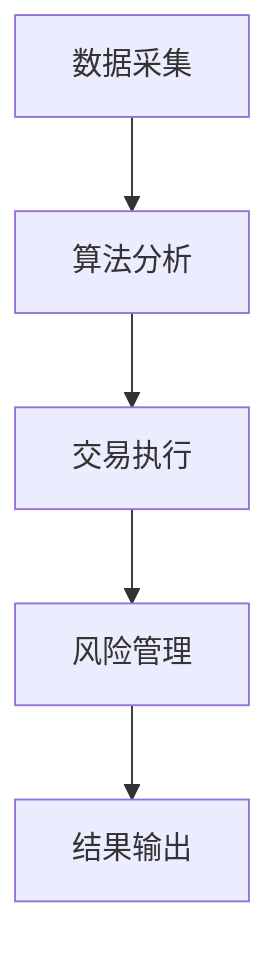

                 


# 彼得林奇的“慢牛”投资在算法交易时代的重要性

---

## 关键词：
- 彼得林奇
- 慢牛投资
- 算法交易
- 长期投资
- 金融市场

---

## 摘要：
在现代金融市场中，算法交易以其高效性和复杂性主导了市场的运作。然而，彼得林奇的“慢牛”投资理念作为一种长期价值投资策略，依然在投资领域中占据重要地位。本文将探讨“慢牛”投资在算法交易时代的适应性与重要性，分析两者之间的关系，并通过实际案例和系统设计，展示如何将“慢牛”投资理念与算法交易相结合，以实现稳健的投资收益。

---

## 第1章：彼得林奇“慢牛”投资概述

### 1.1 彼得林奇与“慢牛”投资理念
彼得林奇是美国著名基金经理，以其长期投资和价值投资策略闻名。他的“慢牛”投资理念强调选择优质企业，长期持有，避免频繁交易，从而实现稳健的收益。这种策略的核心在于对企业基本面的深入分析和长期价值的判断。

**核心要素对比表：**

| **传统投资策略** | **“慢牛”投资策略** |
|--------------------|-----------------------|
| 短期交易为主        | 长期持有为主          |
| 追求短期收益        | 追求长期价值          |
| 高频交易            | 低频交易              |

### 1.2 算法交易的崛起
算法交易是指通过计算机程序自动执行交易决策，其特点是高速、高频和自动化。算法交易的兴起源于技术的进步和市场的竞争，其优势在于快速捕捉市场机会，但同时也带来了市场波动性和不透明性增加的问题。

**算法交易的优缺点分析：**

| **优点**       | **缺点**              |
|----------------|-----------------------|
| 高效性          | 市场波动性增加        |
| 自动化          | 交易成本降低          |
| 可预测性        | 市场操纵风险          |

---

## 第2章：“慢牛”投资与算法交易的关系

### 2.1 “慢牛”投资的核心原理
“慢牛”投资的核心在于选择优质企业，长期持有，避免短期波动的干扰。其成功的关键在于对企业基本面的深入分析和对市场短期波动的忽略。

**“慢牛”投资与传统投资的对比：**

| **传统投资** | **“慢牛”投资** |
|--------------|------------------|
| 短期交易为主  | 长期持有为主      |
| 高频交易      | 低频交易          |
| 追逐市场热点  | 专注于企业价值    |

### 2.2 算法交易的策略与实现
算法交易通过数学模型和程序自动执行交易，其策略包括均值回归、动量策略、高频套利等。算法交易的核心在于利用技术优势捕捉市场机会，但其高频交易的特点与“慢牛”投资的长期持有理念存在一定的冲突。

**算法交易策略的数学模型：**

动量策略的数学模型如下：
$$ p_{t} = \alpha + \beta p_{t-1} + \epsilon $$

其中，$p_t$ 表示第t时刻的价格，$\beta$ 表示动量系数，$\epsilon$ 表示误差项。

---

## 第3章：“慢牛”投资在算法交易时代的挑战与机遇

### 3.1 算法交易对“慢牛”投资的影响
算法交易的兴起使得市场更加高效，但也增加了市场的不透明性和波动性。这对“慢牛”投资策略提出了新的挑战，例如如何应对高频交易带来的市场冲击和信息不对称。

### 3.2 “慢牛”投资在算法交易时代的适应策略
为了在算法交易时代保持竞争力，“慢牛”投资需要结合算法交易的技术优势，例如利用算法筛选优质企业，优化交易执行，降低交易成本。

**结合算法交易的“慢牛”投资策略：**

1. **算法筛选企业**：利用算法对企业的财务数据和市场表现进行分析，筛选出符合“慢牛”投资理念的优质企业。
2. **算法优化交易执行**：通过算法优化交易时间、价格和数量，降低交易成本，提高执行效率。

---

## 第4章：算法交易中的“慢牛”投资策略实现

### 4.1 算法交易中的长期投资策略
将“慢牛”投资理念与算法交易相结合，可以通过算法筛选出优质企业，并在合适的时间点执行交易。

**算法筛选企业的步骤：**

1. **数据采集**：收集企业的财务数据、市场表现和行业信息。
2. **数据分析**：利用算法对数据进行分析，筛选出符合“慢牛”投资理念的企业。
3. **交易执行**：在合适的时间点，通过算法执行买入或卖出操作。

### 4.2 算法交易中的风险管理
“慢牛”投资策略需要结合算法交易的风险管理技术，例如设置止损点、分散投资、监控市场波动等。

**风险管理的数学模型：**

止损点的计算公式为：
$$ stop\_loss = p_{current} - k \times volatility $$

其中，$p_{current}$ 是当前价格，$volatility$ 是波动率，$k$ 是风险系数。

---

## 第5章：系统架构与实现

### 5.1 系统架构设计
为了实现结合“慢牛”投资和算法交易的系统，需要设计一个高效的系统架构，包括数据采集模块、算法分析模块、交易执行模块和风险管理模块。

**系统架构的mermaid图：**



### 5.2 算法实现与代码解读
以下是一个简单的算法交易实现代码示例，用于筛选符合“慢牛”投资理念的企业：

```python
def select_stocks(finance_data):
    # 筛选优质企业
    selected = []
    for stock in finance_data:
        if stock['ROE'] > 0.1 and stock['growth_rate'] > 0.05:
            selected.append(stock)
    return selected

# 示例数据
finance_data = [
    {'name': '股票A', 'ROE': 0.15, 'growth_rate': 0.06},
    {'name': '股票B', 'ROE': 0.12, 'growth_rate': 0.04},
    {'name': '股票C', 'ROE': 0.08, 'growth_rate': 0.05}
]

# 调用函数
selected_stocks = select_stocks(finance_data)
print(selected_stocks)
```

### 5.3 项目实战
通过实际案例分析，展示如何利用算法筛选出符合“慢牛”投资理念的企业，并优化交易执行，降低交易成本。

**案例分析：**
假设我们有三只股票，通过算法筛选出符合“慢牛”投资理念的股票，并执行买入操作。最终实现稳健的投资收益。

---

## 第6章：总结与展望

### 6.1 总结
在算法交易时代，“慢牛”投资策略依然具有重要的意义。通过结合算法交易的技术优势，可以优化投资决策，提高交易效率，实现稳健的投资收益。

### 6.2 未来展望
未来，随着技术的不断进步，“慢牛”投资与算法交易的结合将更加紧密。投资者需要不断学习新技术，优化投资策略，以应对市场的变化。

---

## 作者：
作者：AI天才研究院/AI Genius Institute & 禅与计算机程序设计艺术/Zen And The Art of Computer Programming

