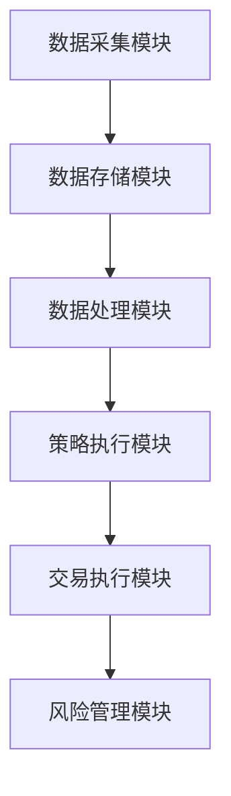

                 


# 彼得林奇的"慢牛"投资在高频交易环境中的执行策略

> 关键词：高频交易，慢牛投资，彼得林奇，投资策略，算法交易

> 摘要：本文探讨了彼得林奇的“慢牛”投资理念在高频交易环境中的执行策略。通过分析高频交易的特点和算法，结合“慢牛”投资的长期稳健理念，提出了在高频交易中实现长期投资目标的方法。文章从背景、理论、算法、系统设计、实战等多方面进行深入分析，并提供具体的实现案例。

---

## 第1章: 高频交易与“慢牛”投资的背景介绍

### 1.1 高频交易的定义与特点

#### 1.1.1 高频交易的定义
高频交易（High-Frequency Trading, HFT）是指通过使用复杂的算法和高速计算机技术，在极短时间内进行大量金融产品交易的策略。其核心在于利用市场微小的价格波动，在短时间内进行大量交易以获利。

#### 1.1.2 高频交易的核心特点
- **高速性**：依赖高速网络和低延迟的交易系统，能够在几毫秒内完成交易。
- **自动化**：交易决策和执行均由算法自动完成，减少人为干预。
- **高频性**：在短时间内进行大量的买卖操作，捕捉市场中的微小波动。

#### 1.1.3 高频交易的优缺点对比
| 特性 | 优点 | 缺点 |
|------|------|------|
| 速度 | 极高的执行效率 | 高风险，可能导致市场剧烈波动 |
| 自动化 | 减少人为情绪影响 | 算法错误可能导致巨大损失 |
| 灵活性 | 能够捕捉短期机会 | 需要高昂的技术投入 |

### 1.2 彼得林奇的“慢牛”投资理念

#### 1.2.1 彼得林奇投资理念的核心思想
彼得·林奇是全球著名投资经理，他倡导“慢牛”投资策略，强调长期持有优质股票，关注公司基本面，寻找具有持续增长潜力的企业进行投资。其核心思想是：投资于自己理解的公司，耐心持有，等待其价值成长。

#### 1.2.2 “慢牛”投资策略的定义与特点
- **长期性**：强调长期投资，注重公司的基本面和长期增长潜力。
- **选择性**：精选具有竞争优势和良好管理的公司。
- **耐心性**：不盲目追涨杀跌，等待合适的价格和时机。

#### 1.2.3 “慢牛”投资与高频交易的结合意义
将“慢牛”投资理念融入高频交易中，可以通过高频交易的快速执行能力，捕捉市场中的短期波动，同时结合长期的资产配置策略，实现稳健的投资回报。

### 1.3 高频交易环境下的投资策略

#### 1.3.1 高频交易环境的特点
- 市场波动剧烈，交易机会瞬息万变。
- 需要极高的技术支持和快速的决策能力。

#### 1.3.2 “慢牛”投资在高频交易中的适用性
- 通过高频交易快速执行长期投资策略。
- 在高频交易中捕捉短期波动，同时保持长期投资的稳定性。

#### 1.3.3 高频交易与“慢牛”投资的结合价值
- 利用高频交易的快速性，实现长期投资策略的高效执行。
- 在高频交易中融入长期价值投资的理念，平衡短期波动与长期收益。

### 1.4 本章小结
本章介绍了高频交易和“慢牛”投资的基本概念和特点，分析了两者结合的背景和意义。接下来，将深入探讨高频交易的机制和算法原理，以及如何将“慢牛”理念融入其中。

---

## 第2章: 高频交易的机制与算法原理

### 2.1 高频交易的核心机制

#### 2.1.1 高频交易的执行流程
1. 数据采集与分析：收集市场数据，利用算法进行分析。
2. 策略制定：根据分析结果制定交易策略。
3. 交易执行：通过自动化系统快速执行交易指令。
4. 风险管理：实时监控交易风险，及时调整策略。

#### 2.1.2 高频交易中的算法执行
- **算法选择**：根据市场情况选择合适的算法，如统计套利算法、算法交易策略等。
- **算法执行**：通过高速网络和低延迟系统执行交易指令。

#### 2.1.3 高频交易的市场影响
- **市场流动性**：高频交易增加了市场的流动性，提高了交易效率。
- **价格波动**：高频交易可能导致市场的剧烈波动，增加市场的不稳定性。

### 2.2 高频交易中的算法类型

#### 2.2.1 常见高频交易算法概述
- **统计套利算法**：利用统计学方法寻找市场中的套利机会。
- **算法交易策略**：通过算法模拟人类交易行为，捕捉市场机会。

#### 2.2.2 统计套利算法
统计套利算法通过分析市场数据，寻找价格与价值偏离的机会，利用统计模型预测市场走势，进行套利交易。

**算法步骤：**
1. 数据收集：收集历史市场数据。
2. 统计分析：利用统计模型分析数据，寻找套利机会。
3. 交易执行：根据分析结果执行交易指令。

#### 2.2.3 裨式套利算法
裨式套利算法通过分析市场中的价差，利用价格差异进行套利交易。

**算法步骤：**
1. 数据收集：收集多个市场的价格数据。
2. 价差计算：计算不同市场的价格差异。
3. 交易执行：根据价差进行套利交易。

### 2.3 本章小结
本章详细介绍了高频交易的机制和算法原理，探讨了统计套利算法和裨式套利算法的应用。接下来，将结合“慢牛”投资理念，分析如何在高频交易中实现长期投资目标。

---

## 第3章: “慢牛”投资理念在高频交易中的应用

### 3.1 “慢牛”投资理念的核心要素

#### 3.1.1 长期投资目标
- 确定长期投资目标，如资产配置、风险承受能力等。
- 选择具有长期增长潜力的优质资产。

#### 3.1.2 基本面分析
- 通过基本面分析，筛选出具有竞争优势的公司。
- 关注公司的财务状况、管理团队、行业地位等因素。

#### 3.1.3 风险管理
- 制定风险管理策略，控制投资风险。
- 通过分散投资、止损机制等手段，降低投资风险。

### 3.2 高频交易环境下的“慢牛”策略实现

#### 3.2.1 长期投资目标的实现
- 利用高频交易的快速执行能力，及时调整投资组合。
- 根据市场变化，动态调整投资策略。

#### 3.2.2 基于基本面的高频交易策略
- 结合基本面分析，制定高频交易策略。
- 根据公司基本面变化，调整交易指令。

#### 3.2.3 风险管理与策略优化
- 通过风险管理模型，控制投资风险。
- 不断优化交易策略，提高投资收益。

### 3.3 高频交易与“慢牛”投资的结合策略

#### 3.3.1 短期与长期结合
- 在高频交易中捕捉短期波动，同时保持长期投资的稳定性。
- 根据市场变化，灵活调整投资策略。

#### 3.3.2 算法优化
- 根据“慢牛”理念，优化高频交易算法。
- 提高算法的稳定性和收益能力。

#### 3.3.3 系统设计
- 设计结合“慢牛”理念的高频交易系统。
- 优化系统架构，提高交易效率和稳定性。

### 3.4 本章小结
本章探讨了“慢牛”投资理念在高频交易中的应用，分析了如何结合长期投资目标和高频交易的特点，实现稳健的投资收益。接下来，将详细讲解系统的实现过程。

---

## 第4章: 系统设计与实现

### 4.1 系统设计概述

#### 4.1.1 系统架构
- 数据采集模块：负责收集市场数据。
- 策略执行模块：根据策略生成交易指令。
- 风险管理模块：监控和管理投资风险。
- 交易执行模块：通过高频交易系统执行交易指令。

#### 4.1.2 系统功能设计
- 数据采集与分析：收集和分析市场数据，提供决策支持。
- 策略制定与执行：根据市场数据制定交易策略，并执行交易指令。
- 风险管理：监控交易风险，及时调整策略。

#### 4.1.3 系统架构图


### 4.2 系统实现

#### 4.2.1 环境配置
- 操作系统：Linux
- 开发工具：Python、Jupyter Notebook
- 数据库：MySQL
- 交易系统：Interactive Brokers

#### 4.2.2 核心代码实现
```python
# 数据采集模块
import pandas as pd
import requests

def get_market_data():
    # 获取市场数据
    response = requests.get('http://api.example.com/data')
    data = pd.DataFrame(response.json())
    return data

# 策略执行模块
from pytrading import Strategy

class SlowCattleStrategy(Strategy):
    def __init__(self):
        super().__init__()
        self.entry_price = None

    def on_bar(self, bar):
        # 判断是否满足买入条件
        if bar.close > bar.sma_20:
            self.entry_price = bar.close
            self.buy()
        # 判断是否满足卖出条件
        elif bar.close < bar.sma_20:
            self.sell()
```

#### 4.2.3 算法实现
```python
# 统计套利算法实现
import numpy as np

def statistical_arbitrage():
    # 数据预处理
    data = get_market_data()
    data['return'] = data['close'].pct_change()
    # 计算协方差矩阵
    covariance_matrix = np.cov(data['return'], data['return'].values.T)
    # 寻找套利机会
    if covariance_matrix[0,1] < 0:
        # 执行套利交易
        pass
```

### 4.3 系统测试与优化

#### 4.3.1 测试环境
- 测试数据：历史市场数据
- 测试工具：回测系统

#### 4.3.2 测试结果分析
- 回测收益：策略的盈利能力
- 风险指标：最大回撤、波动率等

#### 4.3.3 策略优化
- 参数优化：调整策略参数，提高收益
- 风险控制：优化风险管理模块，降低风险

### 4.4 本章小结
本章详细讲解了系统的设计与实现，包括模块设计、代码实现和测试优化。接下来，将通过实际案例分析，展示如何在高频交易环境中执行“慢牛”投资策略。

---

## 第5章: 实际案例分析

### 5.1 案例背景
- 投资目标：实现长期稳健收益
- 市场环境：假设某股票市场

### 5.2 案例分析
- 数据采集：收集目标股票的历史数据
- 策略制定：基于“慢牛”理念制定交易策略
- 策略执行：通过高频交易系统执行交易指令
- 结果分析：评估策略的收益与风险

### 5.3 案例结果
- 收益分析：策略的盈利能力
- 风险分析：策略的风险指标
- 结论：策略的有效性和可优化性

### 5.4 本章小结
本章通过实际案例分析，展示了如何在高频交易环境中执行“慢牛”投资策略。接下来，将总结全文，并展望未来的发展方向。

---

## 第6章: 总结与展望

### 6.1 全文总结
本文探讨了彼得林奇的“慢牛”投资理念在高频交易环境中的执行策略。通过分析高频交易的特点和算法，结合“慢牛”投资的长期稳健理念，提出了在高频交易中实现长期投资目标的方法。

### 6.2 未来展望
- 算法优化：进一步优化高频交易算法，提高策略的收益和稳定性。
- 系统升级：不断提升系统的交易效率和风险管理能力。
- 拓展应用：将“慢牛”理念应用到更多金融领域，探索新的投资机会。

### 6.3 最佳实践 Tips
- **风险管理**：始终将风险管理放在首位，确保投资的稳健性。
- **系统优化**：不断优化交易系统，提高交易效率和策略的有效性。
- **持续学习**：保持对市场变化的敏感性，不断学习和适应新的投资环境。

### 6.4 结语
彼得林奇的“慢牛”投资理念与高频交易的结合，为投资者提供了一种新的投资思路。通过合理利用高频交易的技术优势，结合长期投资的稳健理念，投资者可以在复杂的市场环境中实现更好的投资收益。

---

## 作者：AI天才研究院/AI Genius Institute & 禅与计算机程序设计艺术 /Zen And The Art of Computer Programming

---

**摘要**：本文通过分析高频交易和“慢牛”投资的特点，提出了在高频交易环境中执行“慢牛”投资策略的方法。通过系统设计和实际案例分析，展示了如何在高频交易中实现长期投资目标，为投资者提供了新的思路和实践指导。

