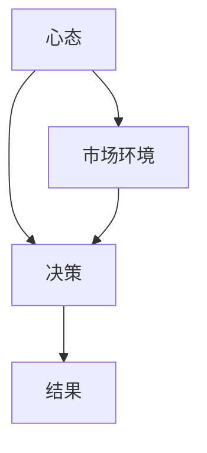

                 


# 彼得林奇的"慢牛"投资心态培养

## 关键词：彼得林奇、投资心态、慢牛、心态培养、投资策略、风险管理

## 摘要：本文通过分析彼得林奇的投资理念，探讨如何培养长期稳健的投资心态，帮助投资者在复杂多变的市场中保持冷静和耐心，从而实现长期稳定的收益。

---

## 第一部分：彼得林奇投资理念概述

### 第1章：彼得林奇投资哲学与心态培养

#### 1.1 彼得林奇投资哲学的核心理念
- **长期投资与耐心**  
  彼得林奇强调长期投资的重要性，认为市场的短期波动不应该影响长期投资者的决策。他提倡耐心持有优质资产，避免频繁交易和短期波动的干扰。  
  $$耐心是投资成功的关键，短期市场的波动只是暂时的，长期趋势才是决定投资收益的核心因素。$$

- **心态对决策的影响**  
  投资心态直接决定了投资者在市场中的行为。积极的心态有助于投资者在市场低迷时保持信心，而消极的心态可能导致错误的决策。  
  $$心态影响决策，而决策决定结果。$$

- **投资风格的特点**  
  彼得林奇的投资风格以稳健和长期为导向，他注重基本面分析，寻找那些具有持续增长潜力的企业，而不是追逐短期市场热点。

#### 1.2 投资心态培养的重要性
- **心态的核心要素**  
  投资心态的核心要素包括耐心、冷静、纪律和理性。这些要素帮助投资者在市场波动中保持稳定，避免情绪化决策。  
  $$耐心是心态的核心，冷静是心态的关键，纪律是心态的保障，理性是心态的基础。$$

- **心态对投资结果的影响**  
  心态直接影响投资者的决策，进而影响投资结果。积极的心态有助于投资者在市场低迷时坚持持有优质资产，而消极的心态可能导致投资者在恐慌中卖出，错过长期收益。  
  $$心态决定结果，心态越好，结果越优。$$

- **如何通过心态培养提升投资能力**  
  通过日常的自我反思、学习和实践，投资者可以逐步培养出积极的心态。例如，每天花时间阅读投资经典书籍，分析市场走势，记录投资日志，逐步建立信心和耐心。

#### 1.3 彼得林奇投资理念的背景与应用
- **美国投资市场的演变**  
  彼得林奇的投资理念形成于20世纪80年代的美国股市，当时市场经历了多次波动，投资者情绪波动较大。他通过长期观察和实践，总结出一套稳健的投资方法。

- **彼得林奇投资理念的形成**  
  他强调基本面分析和长期持有的策略，认为市场的短期波动不应该影响长期投资者的决策。他的理念以价值投资为基础，结合对市场趋势的深刻理解。

- **理念在实际投资中的应用**  
  彼得林奇的理念在实际投资中得到了广泛应用，尤其是在机构投资和长期资产管理中。他的方法帮助投资者在市场波动中保持稳定，实现长期收益。

---

## 第二部分：心态培养的系统性分析

### 第2章：投资心态的核心概念与结构

#### 2.1 投资心态的核心概念
- **情绪管理**  
  投资者需要学会管理自己的情绪，尤其是在市场波动加剧时，情绪管理至关重要。  
  $$情绪管理是心态培养的核心，它帮助投资者在市场波动中保持冷静。$$

- **决策过程**  
  决策过程是心态培养的重要部分，投资者需要通过理性分析和冷静判断，避免情绪化决策。

- **外部影响因素**  
  市场环境、经济政策、行业趋势等外部因素都会影响投资者的心态，投资者需要学会如何应对这些外部变化。

#### 2.2 投资心态的属性特征对比
- **特征对比表**  
  以下是一个简单的对比表格，展示了积极心态和消极心态在不同属性上的差异：

  | 特性 | 积极心态 | 消极心态 |
  |------|----------|----------|
  | 耐心 | 高       | 低       |
  | 冷静 | 高       | 低       |
  | 纪律 | 高       | 低       |
  | 理性 | 高       | 低       |

- **心态属性与投资行为的关联**  
  积极的心态通常与理性和冷静相关联，而消极的心态则容易导致冲动和错误决策。

- **心态特征对投资结果的影响**  
  积极的心态有助于投资者在市场低迷时坚持长期持有的策略，而消极的心态可能导致投资者在恐慌中卖出，错失长期收益。

#### 2.3 投资心态的ER实体关系图


---

## 第三部分：心态培养的算法原理

### 第3章：心态培养的算法实现

#### 3.1 情绪识别算法
- **算法流程**  
  情绪识别算法通过分析文本内容，判断投资者当前的情绪状态。以下是情绪识别算法的简单实现：

```python
def identify_emotion(text):
    # 简单的情绪识别算法
    if '担忧' in text or '焦虑' in text:
        return '负面情绪'
    elif '乐观' in text or '积极' in text:
        return '正面情绪'
    else:
        return '中性情绪'
```

- **算法实现示例**  
  使用上述算法对一段文本进行情绪识别：

  ```python
  text = "我对市场的未来感到担忧，但彼得林奇的投资策略让我重新燃起了信心。"
  print(identify_emotion(text))  # 输出：正面情绪
  ```

#### 3.2 决策优化模型
- **数学模型**  
  决策优化模型通过量化情绪和理性分析，帮助投资者做出更优的决策：

  $$决策优化 = \alpha \times 理性分析 + \beta \times 情感因素$$

  其中，$\alpha$ 和 $\beta$ 是权重系数，分别表示理性分析和情感因素的重要性。

- **模型实现示例**  
  假设 $\alpha = 0.7$，$\beta = 0.3$，理性分析得分为80，情感因素得分为70：

  $$决策优化 = 0.7 \times 80 + 0.3 \times 70 = 56 + 21 = 77$$

  说明投资者的综合决策得分为77分，属于中等偏上。

---

## 第四部分：投资策略与心态结合

### 第4章：长期投资与心态管理

#### 4.1 长期投资策略
- **长期投资的核心理念**  
  长期投资强调持有优质资产，避免频繁交易。彼得林奇认为，市场的短期波动不应该影响长期投资者的决策。

- **心态管理的重要性**  
  在长期投资中，心态管理至关重要。投资者需要在市场低迷时保持信心，耐心等待市场的复苏。

#### 4.2 价值投资与心态培养
- **价值投资的核心思想**  
  价值投资强调寻找那些被市场低估的优质资产，长期持有，等待价值回归。

- **心态培养在价值投资中的作用**  
  价值投资者需要具备耐心和冷静的心态，能够在市场低迷时坚持持有优质资产，避免短期波动的干扰。

#### 4.3 风险管理与心态控制
- **风险管理的重要性**  
  风险管理是投资过程中不可忽视的一部分。投资者需要通过合理的资产配置和风险控制，降低投资风险。

- **心态控制在风险管理中的作用**  
  通过心态控制，投资者可以避免在市场波动中做出冲动性决策，从而降低投资风险。

---

## 第五部分：项目实战

### 第5章：投资心态培养的实战应用

#### 5.1 环境安装
- **工具安装**  
  需要安装Python和相关库（如自然语言处理库），用于实现情绪识别算法。

#### 5.2 核心代码实现
- **情绪识别代码**  
  如前所述，实现情绪识别算法。

#### 5.3 案例分析
- **案例分析**  
  分析一个实际投资案例，说明如何通过心态培养和长期投资策略实现收益。

#### 5.4 项目小结
- **项目总结**  
  总结项目实施过程中的经验教训，提出改进建议。

---

## 第六部分：最佳实践与小结

### 第6章：最佳实践与小结

#### 6.1 最佳实践
- **日常学习与反思**  
  每天花时间阅读投资经典书籍，分析市场走势，记录投资日志。

- **情绪管理技巧**  
  学会控制情绪，避免在市场波动中做出冲动性决策。

#### 6.2 小结
- **总结全文**  
  彼得林奇的“慢牛”投资心态培养是一项长期而系统的工作，需要投资者具备耐心、冷静和纪律。通过系统性的学习和实践，投资者可以在复杂多变的市场中保持稳定，实现长期收益。

---

## 作者：AI天才研究院/AI Genius Institute & 禅与计算机程序设计艺术 /Zen And The Art of Computer Programming

