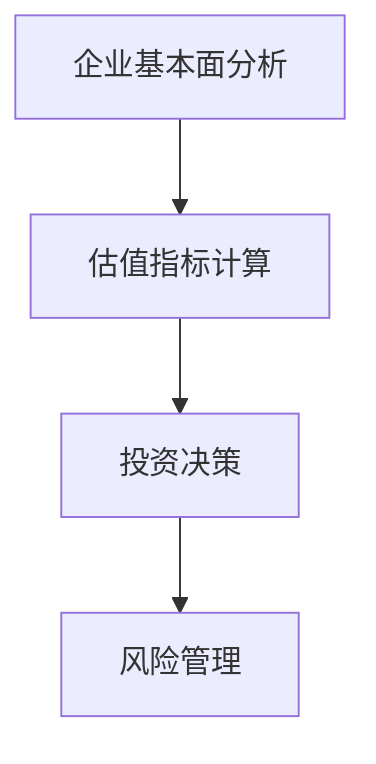
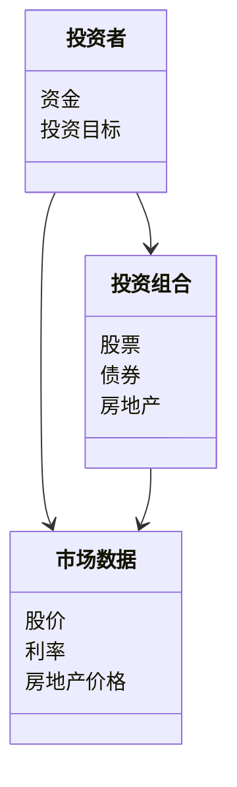
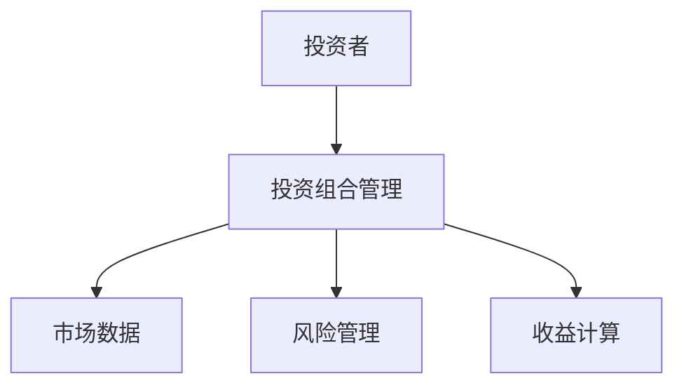

                 


# 彼得林奇的"慢牛"投资策略在不同市场的应用

> 关键词：彼得林奇，慢牛策略，价值投资，风险管理，市场分析，投资组合，系统架构

> 摘要：本文深入探讨了彼得林奇的“慢牛”投资策略在不同市场中的应用，从策略的核心概念、算法原理到系统架构设计，再到实际案例分析，全面解析了如何在股票、债券和房地产市场中应用这一策略，帮助投资者实现稳健收益。

---

## 第一章：彼得林奇与“慢牛”投资策略

### 1.1 彼得林奇投资理念的形成

#### 1.1.1 彼得林奇的生平简介
彼得·林奇是美国著名投资家，曾任富达投资的基金经理。他以价值投资和长期稳健的投资策略闻名，提出了“慢牛”投资理念，强调长期持有优质股票，避免短期波动。

#### 1.1.2 “慢牛”策略的核心思想
“慢牛”策略的核心是寻找那些具有持续增长潜力的企业，长期持有，通过企业成长带来股价的稳步上涨。林奇强调基本面分析，关注企业的盈利能力、成长性和财务健康。

#### 1.1.3 价值投资与成长投资的平衡
林奇的策略在价值投资和成长投资之间寻找平衡，既注重企业的当前价值，又关注其未来的成长潜力。这种平衡使“慢牛”策略在不同市场中具有较强的适应性。

---

### 1.2 “慢牛”策略的定义与特点

#### 1.2.1 “慢牛”策略的定义
“慢牛”策略是指通过长期持有优质股票，逐步积累收益，避免频繁交易和市场波动带来的风险。其核心在于选择那些能够持续增长的企业，而非短期快速上涨的股票。

#### 1.2.2 “慢牛”策略的核心特点
- **长期持有**：避免频繁交易，减少交易成本和市场波动的影响。
- **价值导向**：注重企业的基本面，选择具有持续增长潜力的企业。
- **风险管理**：通过分散投资和严格的风险评估，降低投资组合的整体风险。

#### 1.2.3 “慢牛”策略与传统投资策略的区别
| 投资策略 | 传统策略 | “慢牛”策略 |
|----------|----------|------------|
| 持股时间 | 短期交易 | 长期持有   |
| 风险偏好 | 高风险   | 低风险     |
| 投资目标 | 短期收益 | 长期增长   |

---

## 第二章：“慢牛”投资策略的核心概念

### 2.1 核心概念与联系

#### 2.1.1 价值投资与成长投资的对比
价值投资关注企业的内在价值，寻找被市场低估的股票；成长投资则关注企业的成长潜力，选择高增长的公司。林奇的“慢牛”策略结合了两者的优点，既注重价值，又关注成长。

#### 2.1.2 “慢牛”策略的核心概念原理
- **企业基本面分析**：通过财务报表分析企业的盈利能力、成长性和财务健康。
- **估值指标**：使用市盈率（P/E）、市净率（P/B）等指标评估股票的价值。
- **风险管理**：通过分散投资和止损策略降低风险。

#### 2.1.3 核心概念原理的Mermaid流程图


---

### 2.2 算法原理讲解

#### 2.2.1 “慢牛”策略的算法流程
1. 数据收集：收集目标企业的财务数据和市场数据。
2. 估值计算：计算市盈率、市净率等指标。
3. 基本面分析：评估企业的盈利能力、成长性和财务健康。
4. 投资决策：选择具有低估价值和成长潜力的企业。
5. 风险管理：分散投资，设置止损点。

#### 2.2.2 价值评估模型的数学公式
市盈率（P/E）计算公式：
$$ P/E = \frac{\text{股价}}{\text{每股收益}} $$

市净率（P/B）计算公式：
$$ P/B = \frac{\text{股价}}{\text{每股净资产}} $$

#### 2.2.3 投资组合优化的数学模型
投资组合收益最大化模型：
$$ \max \sum_{i=1}^{n} w_i r_i $$
$$ \text{约束}：\sum_{i=1}^{n} w_i = 1 $$

---

## 第三章：不同市场的特点与策略应用

### 3.1 股票市场的特点与策略应用

#### 3.1.1 股票市场的波动性分析
股票市场波动较大，但长期趋势向上。通过长期持有优质股票，可以规避短期波动带来的风险。

#### 3.1.2 “慢牛”策略在股市中的应用
- 选择具有持续增长潜力的蓝筹股。
- 分散投资，避免集中风险。

#### 3.1.3 成功案例分析
案例：某成长型企业，市盈率低于行业平均水平，且净利润持续增长。通过长期持有，股价稳步上涨。

---

### 3.2 债券市场的特点与策略应用

#### 3.2.1 债券市场的稳定性分析
债券市场波动较小，适合风险厌恶型投资者。通过投资优质债券，可以获得稳定的利息收益。

#### 3.2.2 “慢牛”策略在债市中的应用
- 选择信用评级高的债券。
- 分散投资于不同期限和发行方的债券。

#### 3.2.3 风险管理策略
- 通过分散投资降低信用风险。
- 设置止损点，避免重大损失。

---

### 3.3 房地产市场的特点与策略应用

#### 3.3.1 房地产市场的周期性分析
房地产市场具有周期性，长期趋势向上。通过长期持有优质房地产，可以获得稳定的租金收益和资本增值。

#### 3.3.2 “慢牛”策略在地产中的应用
- 选择地理位置优越、增值潜力大的房地产项目。
- 通过分散投资降低市场波动风险。

#### 3.3.3 投资组合优化
- 结合股票和债券投资，形成多元化投资组合。
- 定期评估投资组合，及时调整配置。

---

## 第四章：系统分析与架构设计方案

### 4.1 投资模型的构建

#### 4.1.1 投资模型的领域模型Mermaid类图


#### 4.1.2 投资模型的系统架构Mermaid图


---

## 第五章：项目实战与案例分析

### 5.1 环境安装与数据准备

#### 5.1.1 投资分析工具的安装
安装财务分析软件，如Excel或Python的Pandas库。

#### 5.1.2 数据源的选择与获取
收集目标企业的财务数据和市场数据，确保数据的准确性和及时性。

---

### 5.2 系统核心实现源代码

#### 5.2.1 数据分析代码
```python
import pandas as pd

# 加载数据
data = pd.read_csv('stock_data.csv')

# 计算市盈率
data['P/E'] = data['股价'] / data['每股收益']

# 找出低估股票
value_stocks = data[data['P/E'] < data['P/E'].mean()]
```

#### 5.2.2 投资组合优化代码
```python
import numpy as np

# 定义目标函数
def portfolio_return(weights):
    return np.dot(weights, returns)

# 定义约束条件
def constraint(weights):
    return np.sum(weights) - 1

# 使用优化算法求解
from scipy.optimize import minimize

result = minimize(portfolio_return, initial_guess, method='SLSQP', constraints=({'type': 'eq', 'fun': constraint}))
```

---

## 总结与展望

本文详细探讨了彼得林奇的“慢牛”投资策略在不同市场中的应用，从策略的核心概念、算法原理到系统架构设计，再到实际案例分析，全面解析了如何在股票、债券和房地产市场中应用这一策略。未来的研究可以进一步探索策略在新兴市场的适用性，以及如何利用人工智能技术优化投资决策。

---

作者：AI天才研究院/AI Genius Institute & 禅与计算机程序设计艺术 /Zen And The Art of Computer Programming

