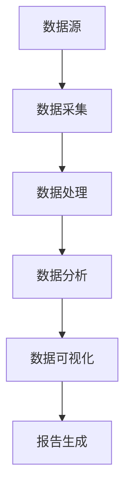
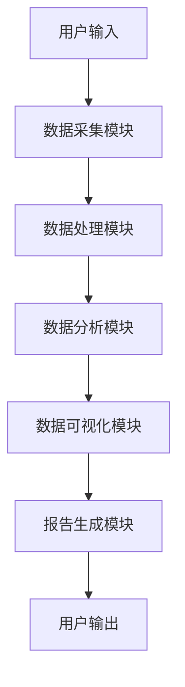
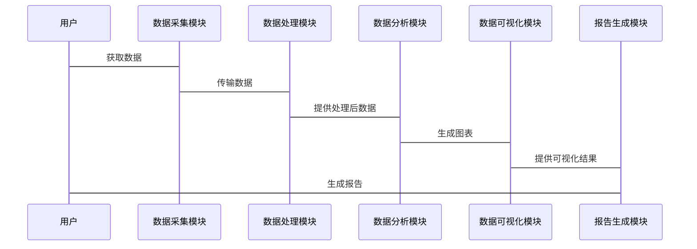

                 


# 彼得林奇的"成长型价值股"在不同经济周期的表现

## 关键词：彼得林奇，成长型价值股，经济周期，股票估值，投资策略

## 摘要：本文详细探讨了彼得林奇的成长型价值股投资理念，分析其在不同经济周期的表现，并结合数学模型和系统架构设计，提供实际投资策略和项目实战指导，帮助读者深入理解如何在不同经济环境下优化投资组合。

---

## 第1章: 背景介绍

### 1.1 彼得林奇及其投资理念

#### 1.1.1 彼得林奇的生平简介
彼得·林奇（Peter Lynch）是美国著名的投资专家，以其在富达投资管理公司的卓越表现闻名。他的投资理念强调长期增长和价值发现，尤其擅长分析公司基本面。

#### 1.1.2 彼得林奇的投资哲学
林奇认为，投资者应选择那些具有持续增长潜力的公司，并长期持有。他强调深入研究公司财务状况，避免短期波动干扰。

#### 1.1.3 成长型价值股的定义
成长型价值股是指那些具有高成长潜力，同时估值合理的公司股票。这类股票在不同经济周期中表现各异。

### 1.2 成长型价值股的特征

#### 1.2.1 高成长潜力
公司收入和利润持续增长，具备良好的行业前景。

#### 1.2.2 合理估值
市盈率和市净率等指标处于合理区间，避免过高或过低。

#### 1.2.3 强大的竞争优势
公司在行业中具备独特优势，如专利、品牌或技术壁垒。

### 1.3 经济周期的表现

#### 1.3.1 经济周期的基本分类
经济周期通常分为繁荣、衰退、复苏和扩张阶段。

#### 1.3.2 不同阶段的成长型价值股表现
在衰退期，价值股可能被低估；在复苏期，成长股开始反弹；在繁荣期，两者均表现良好。

---

## 第2章: 核心概念与联系

### 2.1 成长型价值股的特征分析

#### 2.1.1 财务指标分析
使用ROE、净利润增长率等指标评估公司盈利能力。

#### 2.1.2 企业竞争优势
分析公司的市场地位、产品创新能力和成本优势。

#### 2.1.3 行业地位与市场前景
评估行业趋势和公司在行业中的排名。

### 2.2 经济周期与股票估值的关系

#### 2.2.1 经济周期对估值的影响
经济衰退时，估值可能被低估；繁荣时，估值可能偏高。

#### 2.2.2 成长型价值股的估值模型
采用DCF和DDM模型评估股票内在价值。

#### 2.2.3 市场情绪与价格波动
市场情绪影响短期价格，但长期价值取决于公司基本面。

### 2.3 长期投资策略

#### 2.3.1 长期投资的核心理念
避免短期波动，关注公司长期增长潜力。

#### 2.3.2 选择成长型价值股的步骤
分析财务指标、竞争优势和行业前景，结合经济周期判断。

#### 2.3.3 风险控制与组合管理
分散投资、定期调整持仓，避免过度集中。

---

## 第3章: 算法原理讲解

### 3.1 股票估值模型

#### 3.1.1 股息贴现模型（DDM）
$$ V = \frac{D}{k - g} $$
其中，D为股息，k为折现率，g为股息增长率。

#### 3.1.2 现金流折现模型（DCF）
$$ NPV = \sum_{t=1}^{n} \frac{CF_t}{(1 + r)^t} + \frac{FV}{(1 + r)^n} $$
CF_t为第t年的现金流，r为贴现率，FV为终值。

#### 3.1.3 市盈率与市净率分析
$$ P/E = \frac{Price}{Earnings} $$
$$ P/B = \frac{Price}{Book\ Value} $$

### 3.2 经济周期分析模型

#### 3.2.1 经济周期的量化指标
使用GDP增长率、失业率等指标判断经济周期阶段。

#### 3.2.2 行业周期与股票表现
不同行业在经济周期中的表现差异显著，需结合行业特点制定策略。

#### 3.2.3 前瞻性指标预测
利用PMI、工业产值等前瞻性指标预测未来经济趋势。

### 3.3 成长型价值股的筛选算法

#### 3.3.1 财务指标筛选
筛选高ROE、稳定增长的公司。

#### 3.3.2 市场地位分析
选择行业龙头或具有强大竞争优势的公司。

#### 3.3.3 前瞻性指标预测
结合经济周期预测公司未来增长潜力。

---

## 第4章: 系统分析与架构设计方案

### 4.1 投资分析系统介绍

#### 4.1.1 系统功能模块
数据采集、分析、可视化和报告生成。

#### 4.1.2 数据采集与处理
使用爬虫或API获取实时数据，并进行清洗和预处理。

#### 4.1.3 数据分析与可视化
利用Python的pandas和matplotlib进行数据处理和可视化。

### 4.2 系统架构设计

#### 4.2.1 系统架构图


#### 4.2.2 模块交互流程


### 4.3 系统接口设计

#### 4.3.1 数据接口
定义RESTful API接口，用于数据获取和处理。

#### 4.3.2 模块接口
各功能模块之间通过API进行数据交互。

### 4.4 系统交互序列图



---

## 第5章: 项目实战

### 5.1 环境安装与数据准备

#### 5.1.1 安装Python环境
使用Anaconda或Pyenv安装Python 3.8以上版本。

#### 5.1.2 数据库安装
安装MySQL或MongoDB，用于存储股票数据。

#### 5.1.3 数据来源
通过Yahoo Finance API获取历史数据。

### 5.2 核心实现源代码

#### 5.2.1 数据获取与处理
```python
import pandas as pd
import numpy as np

# 获取数据
def get_stock_data(ticker, start, end):
    data = pd.datareader.data(ticker, start=start, end=end)
    return data

# 数据清洗
def preprocess_data(data):
    data.dropna(inplace=True)
    return data
```

#### 5.2.2 股票估值计算
```python
def calculate_dcf(ticker, financials, discount_rate, growth_rate):
    # 现金流预测
    for _ in range(5):
        financials['Revenue'] *= (1 + growth_rate)
    # DCF计算
    cash_flow = financials['Operating Cash Flow']
    terminal_value = cash_flow * (1 + growth_rate) / (discount_rate - growth_rate)
    dcf_value = terminal_value / (1 + discount_rate)
    return dcf_value
```

#### 5.2.3 经济周期分析
```python
import matplotlib.pyplot as plt

# 绘制经济周期图
def plot_economic_cycle(gdp, unemployment):
    plt.figure(figsize=(10,6))
    plt.plot(gdp, label='GDP Growth Rate')
    plt.plot(unemployment, label='Unemployment Rate')
    plt.xlabel('Year')
    plt.ylabel('Value')
    plt.legend()
    plt.show()
```

### 5.3 实际案例分析

#### 5.3.1 案例选择
以科技行业为例，分析苹果公司在不同经济周期的表现。

#### 5.3.2 数据分析与解读
计算苹果公司的DCF价值，对比市场价，判断其是否为成长型价值股。

#### 5.3.3 投资建议
根据分析结果，提出投资建议，如长期持有或逢低吸纳。

### 5.4 项目总结

#### 5.4.1 成果展示
展示系统输出的报告和可视化图表。

#### 5.4.2 经验与教训
总结项目中的经验，如数据处理的难点和算法优化的方向。

#### 5.4.3 未来改进方向
计划引入更多数据源，优化算法，提升系统性能。

---

## 第6章: 最佳实践

### 6.1 小结

彼得林奇的成长型价值股理念强调长期投资和基本面分析。在不同经济周期中，成长型价值股的表现各异，投资者需灵活调整策略。

### 6.2 注意事项

1. **风险控制**：避免过度集中投资，分散风险。
2. **持续学习**：关注行业动态和经济趋势。
3. **系统支持**：利用技术工具辅助分析，提高效率。

### 6.3 拓展阅读

推荐书籍：
- 《彼得·林奇的成功投资》
- 《股票投资策略》
- 《投资学基础》

---

## 作者：AI天才研究院 & 禅与计算机程序设计艺术

---

以上是文章的详细结构和内容，涵盖了从理论到实践的各个方面，确保读者能够全面理解和应用彼得林奇的成长型价值股投资策略。

