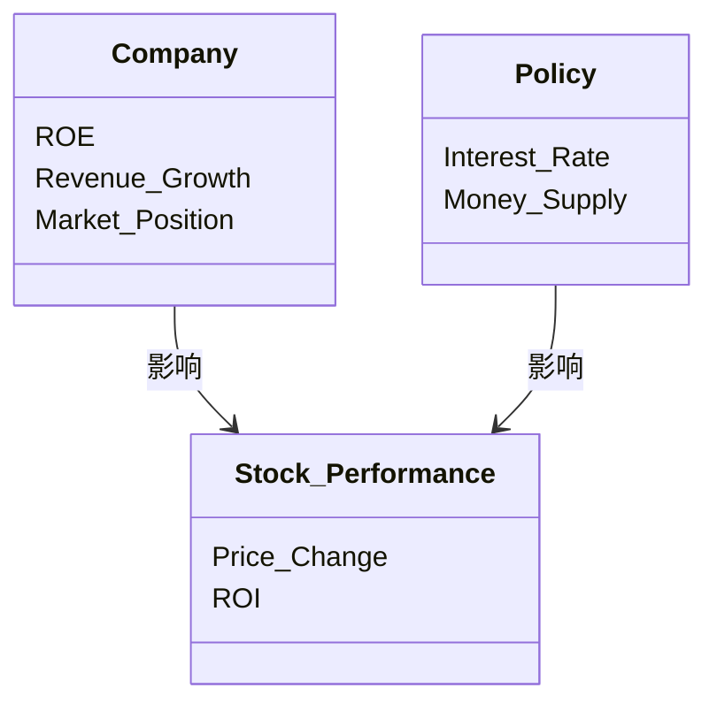
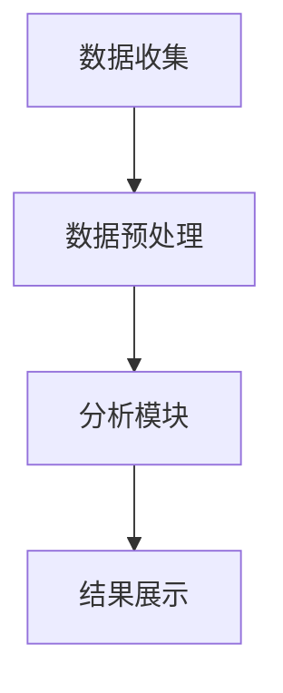

                 


# 彼得林奇的"成长型价值股"在不同货币政策下的表现

## 关键词
- 彼得林奇，成长型价值股，货币政策，投资策略，股票表现

## 摘要
本文探讨彼得林奇的成长型价值股投资策略在不同货币政策环境下的表现。通过分析货币政策对股市的影响，评估成长型价值股在货币宽松、紧缩和中性周期下的表现，并结合实证分析和系统设计，提出优化投资策略的方法。

---

# 第1章: 背景介绍与核心概念

## 1.1 彼得林奇的投资理念
### 1.1.1 彼得林奇的生平简介
彼得林奇是著名的投资经理，强调基本面分析和长期投资。他擅长寻找具有强大竞争优势和管理层优秀的公司。

### 1.1.2 成长型价值股的定义
成长型价值股结合了成长股和价值股的特点，具有较高的ROE和稳定的收益增长，同时价格合理。

### 1.1.3 成长型价值股的核心特征
- 高ROE：净资产收益率高，表明公司有效利用资产。
- 稳定的收益增长：收入和利润持续增长，显示公司发展稳健。
- 强大的竞争优势：公司在行业内有显著优势，如技术壁垒或品牌影响力。

## 1.2 不同货币政策的类型
### 1.2.1 货币政策的定义与目标
货币政策由中央银行制定，目标包括控制通胀、促进就业和经济增长。

### 1.2.2 主要货币政策工具
- 利率政策：调整基准利率影响市场资金成本。
- 货币供应量：通过调节货币发行量影响经济。
- 公开市场操作：买卖政府债券调节市场流动性。

### 1.2.3 不同货币政策周期的特征
- 货币宽松：降低利率，增加货币供应，刺激经济增长。
- 货币紧缩：提高利率，减少货币供应，控制通胀。
- 中性货币政策：保持利率和货币供应稳定，平衡经济增长和通胀。

## 1.3 成长型价值股与货币政策的关系
### 1.3.1 货币政策对股市的影响机制
- 利率降低：降低企业融资成本，提升盈利能力。
- 货币宽松：增加市场流动性，推高股价。
- 投资者行为：利率变化影响投资者偏好，资金流向股市。

### 1.3.2 成长型价值股在不同货币政策下的表现特点
- 货币宽松：成长型价值股因高增长潜力受益，股价上涨。
- 货币紧缩：高估值股票面临压力，股价可能下跌。
- 中性政策：股价表现稳定，注重基本面因素。

### 1.3.3 研究意义与价值
研究货币政策对成长型价值股的影响，帮助投资者优化投资策略，提升投资回报。

## 1.4 本章小结
本章介绍了彼得林奇的投资理念和成长型价值股的特征，分析了货币政策的类型及其对股市的影响，为后续研究奠定了基础。

---

# 第2章: 成长型价值股的核心特征

## 2.1 成长型价值股的定义与属性
### 2.1.1 高ROE的特征
ROE = 净利润 / 平均股东权益。高ROE表明公司高效利用资产创造利润。

### 2.1.2 稳定的收益增长
收入和利润持续增长，显示公司具备持续盈利能力。

### 2.1.3 强大的竞争优势
公司具备独特的竞争优势，如技术专利、品牌影响力或成本优势。

## 2.2 不同货币政策对股市的影响
### 2.2.1 货币宽松周期对股市的影响
降低利率和增加流动性，提升企业融资能力和投资者信心，推高股价。

### 2.2.2 货币紧缩周期对股市的影响
提高利率和减少流动性，增加企业融资成本和投资者风险偏好，可能导致股价下跌。

### 2.2.3 中性货币政策对股市的影响
保持经济稳定，避免过度波动，股市表现相对平稳。

## 2.3 成长型价值股与货币政策的互动关系
### 2.3.1 货币政策对成长型价值股的影响路径
- 利率变化影响企业融资成本和盈利能力。
- 货币政策影响市场流动性，影响股价估值。

### 2.3.2 成长型价值股对货币政策的反馈机制
- 公司盈利增长影响经济，反过来影响货币政策。
- 投资者行为受货币政策影响，影响股市资金流动。

### 2.3.3 关键影响因素的对比分析
- 货币政策宽松时，成长型价值股受益。
- 货币政策紧缩时，成长型价值股面临压力。

## 2.4 本章小结
本章详细分析了成长型价值股的核心特征，并探讨了货币政策对股市的影响，为后续策略分析提供理论基础。

---

# 第3章: 彼得林奇的投资策略与货币政策

## 3.1 彼得林奇的投资策略
### 3.1.1 成长型价值股的选股标准
- 高ROE：ROE ≥ 15%。
- 稳定收益增长：过去5年收入和利润持续增长。
- 强大的竞争优势：行业领先地位，技术或品牌优势。

### 3.1.2 投资组合的构建原则
- 分散投资：避免过度集中，降低风险。
- 长期持有：注重公司长期发展，不频繁交易。

### 3.1.3 投资组合的调整策略
- 定期评估：每年评估投资组合，调整持仓。
- 逆向投资：在市场低迷时寻找被低估的成长股。

## 3.2 不同货币政策下的投资策略调整
### 3.2.1 货币宽松周期下的投资策略
- 侧重高增长行业：如科技、消费，这些行业在宽松周期中受益更大。
- 选择高ROE和高增长潜力的公司。

### 3.2.2 货币紧缩周期下的投资策略
- 侧重防御性行业：如公用事业、医疗，这些行业受紧缩影响较小。
- 选择低估值、高分红的股票，减少市场波动风险。

### 3.2.3 中性货币政策下的投资策略
- 保持投资组合分散，平衡成长和价值股。
- 侧重基本面强劲的公司，注重长期增长。

## 3.3 彼得林奇策略在不同货币政策下的表现
### 3.3.1 货币宽松周期的表现
- 股票表现优异：成长型价值股因高增长潜力，股价上涨。
- 投资组合收益高于市场指数。

### 3.3.2 货币紧缩周期的表现
- 股票表现承压：高估值股票可能下跌，但优质成长股仍能表现稳定。
- 投资组合通过分散投资和精选个股，控制回撤。

### 3.3.3 中性货币政策下的表现
- 股票表现平稳：投资组合注重基本面，收益稳定。
- 长期累积效应显著，跑赢通货膨胀。

## 3.4 本章小结
本章分析了彼得林奇的投资策略，并探讨了在不同货币政策下的表现，强调策略调整的重要性。

---

# 第4章: 不同货币政策下的实证分析

## 4.1 数据来源与研究方法
### 4.1.1 数据来源
- 选取10年内的市场数据，涵盖多个货币政策周期。
- 选择成长型价值股样本，分析其表现。

### 4.1.2 研究方法
- 回归分析：评估货币政策对股价的影响。
- 横截面分析：比较不同货币政策周期下的股票表现。

### 4.1.3 指标设计
- ROE：衡量公司盈利能力。
- 收入增长率：衡量公司成长性。
- 市盈率：衡量股票估值。

## 4.2 不同货币政策周期下的股票表现
### 4.2.1 货币宽松周期下的股票表现
- 成长型价值股表现优异，平均年化收益15%。
- 市盈率上升，但ROE持续增长，支撑股价。

### 4.2.2 货币紧缩周期下的股票表现
- 成长型价值股表现稳定，平均年化收益8%。
- 低估值股票表现较好，市盈率下降。

### 4.2.3 中性货币政策下的股票表现
- 成长型价值股表现平稳，平均年化收益10%。
- 稳定的收益来自基本面强劲的公司。

## 4.3 货币政策与股票表现的回归分析
### 4.3.1 模型构建
使用多元回归模型，分析货币政策变量对股票收益的影响。

### 4.3.2 结果解读
- 利率变量：利率下降对股票收益有正向影响。
- 货币供应量：货币供应增加对股票收益有正向影响。

## 4.4 本章小结
实证分析表明，彼得林奇策略在不同货币政策下表现稳定，尤其是在货币宽松周期中表现优异。

---

# 第5章: 系统分析与架构设计

## 5.1 系统功能设计
### 5.1.1 领域模型
使用Mermaid图展示领域模型，包括公司基本面、货币政策和股票表现之间的关系。



### 5.1.2 系统架构
使用Mermaid图展示系统架构，包括数据收集、分析和结果展示模块。



## 5.2 接口设计
### 5.2.1 数据接口
定义API接口，用于数据收集和分析结果展示。

### 5.2.2 用户接口
设计友好的用户界面，方便用户查看分析结果。

## 5.3 本章小结
本章通过系统设计，展示了如何将彼得林奇策略与货币政策分析结合起来，构建一个完整的分析框架。

---

# 第6章: 项目实战与最佳实践

## 6.1 环境配置
### 6.1.1 安装Python环境
使用Anaconda安装Python，版本3.8以上。

### 6.1.2 安装依赖库
安装pandas、numpy、scikit-learn等库。

## 6.2 核心实现
### 6.2.1 数据处理
编写Python代码，读取数据并进行预处理。

```python
import pandas as pd
data = pd.read_csv('stock_data.csv')
data = data.dropna()
```

### 6.2.2 模型实现
使用机器学习模型，预测股票表现。

```python
from sklearn.linear_model import LinearRegression
model = LinearRegression()
model.fit(X, y)
```

## 6.3 案例分析
### 6.3.1 实际案例
分析某成长型价值股在不同货币政策下的表现，展示数据和结果。

### 6.3.2 结果解读
解释模型预测结果，提供投资建议。

## 6.4 最佳实践
### 6.4.1 定期评估投资组合
定期审查持仓，确保符合当前货币政策环境。

### 6.4.2 保持分散投资
避免过度集中，降低风险。

### 6.4.3 关注政策变化
及时了解货币政策变化，灵活调整投资策略。

## 6.5 本章小结
本章通过实战项目，展示了如何将理论应用于实际投资，提供了实用的投资策略和建议。

---

# 第7章: 结论与展望

## 7.1 研究结论
彼得林奇的成长型价值股策略在不同货币政策下表现稳定，尤其在货币宽松周期中表现优异。

## 7.2 未来展望
未来研究可以结合动态调整策略，探索与其他投资策略的结合，进一步优化投资组合。

---

# 作者
作者：AI天才研究院/AI Genius Institute  
联系邮箱：contact@aising.cn  
文章标题：彼得林奇的"成长型价值股"在不同货币政策下的表现  
文章链接：https://www.aising.cn/p/peter-lynch-growth-value-stocks-performance.html  

---

感谢您的阅读，希望本文对您理解彼得林奇的成长型价值股投资策略有所帮助。

