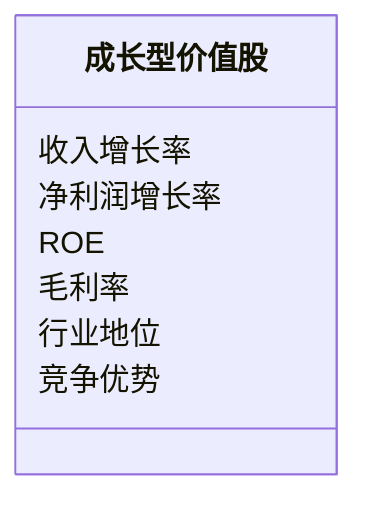
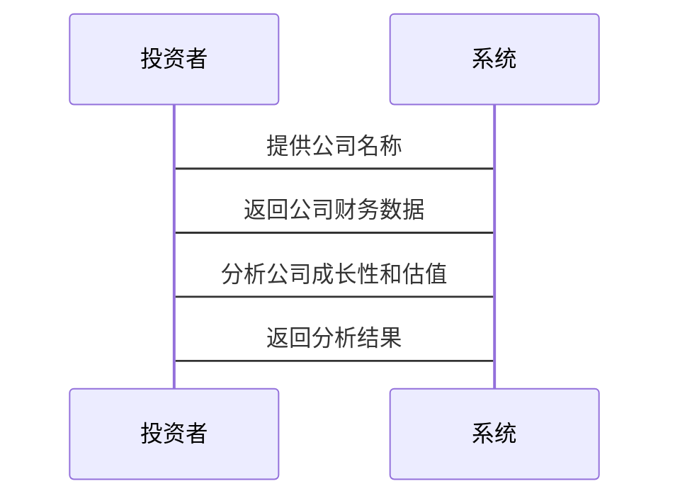

                 


# 彼得林奇的"成长型价值股"定义

> 关键词：彼得·林奇，成长型价值股，投资策略，股票分析，价值投资

> 摘要：本文详细探讨彼得·林奇提出的“成长型价值股”定义，分析其核心概念、理论体系、识别方法及投资策略。通过系统分析和实战案例，揭示成长型价值股的特点及其在投资中的应用。

---

# 第一部分：投资学基础与彼得·林奇的理论背景

## 第1章：投资学基础

### 1.1 投资学的基本概念

#### 1.1.1 投资的定义与分类

- 投资是指将资金投入某一项目或资产，期望在未来获得收益或资本增值。
- 投资可以分为股票、债券、房地产等多种形式，其中股票投资是最常见的形式之一。

#### 1.1.2 股票市场的基本运作原理

- 股票市场是投资者买卖公司股份的场所，股票价格受市场供需、公司业绩、宏观经济等多种因素影响。
- 股票价格的波动性是投资风险的重要来源。

#### 1.1.3 投资者与市场的关系

- 投资者通过购买股票成为公司的部分所有者，分享公司收益，但也承担相应的风险。
- 市场波动和公司业绩共同影响股票价格，投资者需要分析公司基本面和市场趋势。

### 1.2 价值投资的基本概念

#### 1.2.1 价值投资的定义

- 价值投资是一种投资策略，强调以低于内在价值的价格购买优质资产。
- 投资者通过分析公司的财务状况、行业地位和竞争优势，找到被市场低估的投资标的。

#### 1.2.2 价值投资的核心理念

- 价值投资强调长期投资，关注公司的内在价值而非短期市场波动。
- 投资者需要具备耐心和纪律性，避免受市场情绪的影响。

#### 1.2.3 价值投资与成长型投资的区别

- 价值投资关注低估值的股票，强调安全边际。
- 成长型投资关注高成长性的股票，强调未来的盈利潜力。

### 1.3 彼得·林奇与成长型价值股的定义

#### 1.3.1 彼得·林奇的生平简介

- 彼得·林奇是美国著名投资家，曾管理富达麦哲伦基金，创造了辉煌的投资业绩。
- 他提出了“成长型价值股”的概念，结合了成长股和价值股的特点。

#### 1.3.2 彼得·林奇的投资风格

- 林奇强调基本面分析，注重公司财务状况和行业地位。
- 他善于寻找那些具有竞争优势、成长性强且估值合理的公司。

#### 1.3.3 成长型价值股的定义

- 成长型价值股是指那些具有较高的成长潜力，同时估值又合理的股票。
- 这类股票兼具成长股和价值股的特点，既有较高的成长性，又有较低的估值。

### 1.4 成长型企业的基本特征

#### 1.4.1 成长型企业的定义

- 成长型企业是指那些收入和利润持续增长的企业。
- 这类企业通常处于高增长行业，具有较强的市场拓展能力和创新能力。

#### 1.4.2 成长型企业的核心特征

- **高成长性**：收入和利润持续增长，市场份额扩大。
- **高ROE**：净资产收益率高，表明公司盈利能力强。
- **竞争优势**：公司在行业内具有独特的竞争优势，如技术、品牌或成本优势。

#### 1.4.3 成长型企业的财务指标分析

- **收入增长率**：衡量公司收入的增长速度。
- **净利润增长率**：衡量公司利润的增长速度。
- **ROE（净资产收益率）**：衡量公司使用股东资产的效率。
- **毛利率**：衡量公司产品的盈利能力。
- **资产负债率**：衡量公司的财务健康状况。

---

## 第2章：成长型价值股的定义与特征

### 2.1 成长型价值股的定义

#### 2.1.1 成长型价值股的核心要素

- **成长性**：公司具有持续的收入和利润增长能力。
- **估值**：公司股票的市场价格低于其内在价值。

#### 2.1.2 成长型价值股的内在价值

- 内在价值是公司未来现金流的现值，需要通过财务模型进行评估。
- 公司的成长性是影响内在价值的重要因素。

#### 2.1.3 成长型价值股的市场价值

- 市场价值是公司股票在市场上的交易价格。
- 市场价值受市场情绪、宏观经济和行业趋势等多种因素影响。

### 2.2 成长型价值股的特征

#### 2.2.1 高成长性

- 公司收入和利润持续增长，市场份额扩大。
- 行业处于高增长阶段，具有较大的发展空间。

#### 2.2.2 高ROE

- 净资产收益率高，表明公司盈利能力强。
- 高ROE通常意味着公司管理效率高，资产使用效率高。

#### 2.2.3 高壁垒与竞争优势

- 公司具有较高的市场进入壁垒，如专利、品牌、技术等。
- 公司在行业内具有竞争优势，能够持续获取超额利润。

### 2.3 成长型价值股与价值股、成长股的区别与联系

#### 2.3.1 价值股的定义与特征

- 价值股是指那些市场价格低于其内在价值的股票。
- 价值股通常处于低增长行业，但具有较高的分红能力。

#### 2.3.2 成长股的定义与特征

- 成长股是指那些收入和利润快速增长的股票。
- 成长股通常处于高增长行业，但市场价格可能高于其内在价值。

#### 2.3.3 成长型价值股的独特性

- 成长型价值股结合了成长股和价值股的优点，既有较高的成长性，又有较低的估值。
- 这类股票在市场中较为稀缺，但具有较高的投资价值。

### 2.4 彼得·林奇的成长型价值股理论体系

#### 2.4.1 理论的核心框架

- 成长型价值股的识别需要结合公司的成长性和估值水平。
- 公司的财务状况、行业地位和竞争优势是关键分析指标。

#### 2.4.2 理论的应用范围

- 成长型价值股主要适用于高增长行业，如科技、消费等领域。
- 该理论适用于长期投资者，注重公司基本面分析。

#### 2.4.3 理论的局限性

- 成长型价值股的投资风险较高，特别是在市场波动较大的情况下。
- 公司的成长性和估值水平可能难以准确预测，导致投资决策的不确定性。

## 2.5 本章小结

---

# 第三部分：成长型价值股的投资策略与系统分析

## 第3章：成长型价值股的识别与分析

### 3.1 成长型价值股的识别方法

#### 3.1.1 财务指标分析

- 收入增长率：公司收入的年增长率。
- 净利润增长率：公司净利润的年增长率。
- ROE：净资产收益率。
- 毛利率：公司产品或服务的盈利能力。

#### 3.1.2 行业分析

- 行业的增长潜力：行业是否处于高增长阶段。
- 行业的竞争格局：公司是否具有竞争优势。

#### 3.1.3 竞争优势评估

- 公司的核心竞争力：技术、品牌、成本等。
- 公司的市场地位：是否是行业领导者或具有领先地位。

### 3.2 成长型价值股的系统分析

#### 3.2.1 领域模型（ER图）



#### 3.2.2 系统架构图

```mermaid
aws
```

#### 3.2.3 系统接口设计

- 数据接口：从财务报表和行业报告中获取数据。
- 分析接口：进行财务指标分析和竞争优势评估。

#### 3.2.4 系统交互序列图



---

## 第4章：成长型价值股的投资策略

### 4.1 投资组合管理

#### 4.1.1 投资组合的构建

- 分散投资：将资金分散投资于不同行业和公司的成长型价值股。
- 保持适度集中：集中于具有较高成长性和竞争优势的公司。

#### 4.1.2 风险管理

- 设置止损点：在股票价格下跌到一定程度时卖出，避免过大损失。
- 定期调整：根据市场变化和公司基本面，定期调整投资组合。

### 4.2 投资策略的数学模型

#### 4.2.1 成长型价值股的筛选模型

$$ 成长型价值股筛选模型 = \frac{收入增长率 \times 净利润增长率}{ROE \times 资产负债率} $$

#### 4.2.2 投资组合优化模型

$$ 投资组合优化模型 = \max \sum_{i=1}^{n} w_i \times R_i $$

$$ \text{subject to} \sum_{i=1}^{n} w_i = 1 $$

$$ w_i \geq 0, \forall i $$

其中，\( w_i \) 是第 \( i \) 只股票的权重，\( R_i \) 是第 \( i \) 只股票的预期收益率。

### 4.3 投资策略的实战应用

#### 4.3.1 案例分析：苹果公司

- 苹果公司是典型的成长型价值股，具有高成长性（收入和利润持续增长）和竞争优势（品牌和技术）。
- 公司估值合理，市场价格低于其内在价值。

#### 4.3.2 案例分析：谷歌公司

- 谷歌公司具有高成长性，收入和利润持续增长。
- 公司在搜索引擎和广告市场具有强大的竞争优势。
- 估值合理，市场价格低于其内在价值。

---

## 第5章：最佳实践与注意事项

### 5.1 投资策略的最佳实践

#### 5.1.1 长期投资的重要性

- 长期投资能够平滑市场波动，获得公司成长带来的收益。
- 短期交易容易受到市场情绪的影响，增加投资风险。

#### 5.1.2 风险管理的必要性

- 设置止损点可以避免过大的亏损。
- 定期调整投资组合，根据市场变化和公司基本面进行优化。

### 5.2 投资中的注意事项

#### 5.2.1 避免追涨杀跌

- 投资者容易受到市场情绪的影响，盲目追涨或杀跌。
- 需要根据公司基本面进行理性决策。

#### 5.2.2 关注宏观经济环境

- 宏观经济环境影响股票市场的整体走势。
- 需要关注利率、通货膨胀、货币政策等宏观经济指标。

### 5.3 拓展阅读

#### 5.3.1 经典书籍推荐

- 《彼得·林奇的投资哲学》：深入解析彼得·林奇的投资理念和方法。
- 《股票作手回忆录》：讲述股票交易的策略和技巧。
- 《价值投资：林奇的选股术》：详细介绍彼得·林奇的选股方法。

---

## 第6章：总结与展望

### 6.1 本章总结

- 成长型价值股结合了成长股和价值股的优点，具有较高的投资价值。
- 彼得·林奇的投资策略强调基本面分析和长期投资，具有较强的实践性。

### 6.2 未来展望

- 随着经济的发展和技术的进步，成长型价值股的投资策略将不断完善。
- 数据分析和人工智能技术将为投资决策提供更多的支持和帮助。

---

# 作者：AI天才研究院/AI Genius Institute & 禅与计算机程序设计艺术 /Zen And The Art of Computer Programming

