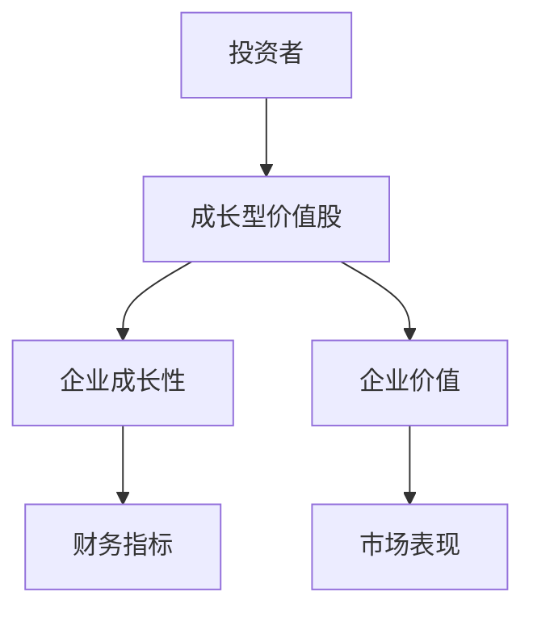

                 


# 彼得林奇的"成长型价值股"概念

> 关键词：成长型价值股，彼得·林奇，投资策略，企业成长性，价值评估

> 摘要：本文详细阐述了彼得·林奇提出的“成长型价值股”概念，从其定义、核心特征、分析方法到数学模型和系统架构设计，进行了全面而深入的分析。文章通过实际案例和系统化的思考，帮助读者理解如何识别和评估成长型价值股，从而在投资中实现长期收益。

---

## 第一部分：彼得·林奇的成长型价值股概念概述

### 第1章：成长型价值股的背景与定义

#### 1.1 彼得·林奇的生平与投资理念

彼得·林奇（Peter Lynch）是全球最著名的投资专家之一，曾任美国富达投资集团麦哲伦基金经理，管理资产规模超过1000亿美元。他的投资理念以“成长型价值股”为核心，强调在长期投资中寻找那些具有持续增长潜力的企业。

- **生平简介**：林奇在投资领域有着卓越的成就，他主张长期投资，注重企业的基本面分析，尤其是企业的成长性和盈利能力。
- **投资哲学**：林奇认为，成功的投资不仅需要对企业的财务状况有深刻的理解，还需要对行业趋势和企业竞争优势有敏锐的洞察力。
- **成长型价值股的核心理念**：成长型价值股是指那些具有稳定增长潜力，同时估值合理的企业。这种投资策略既关注企业的成长性，又注重其价值评估，旨在实现长期稳定的收益。

#### 1.2 成长型价值股的定义与特点

成长型价值股是指那些在行业中具有竞争优势，且具备持续增长潜力的企业。以下是其核心特点：

- **定义**：成长型价值股是那些在行业中具有领先地位，且未来几年内预期收入和利润能够持续增长的企业。
- **特点**：
  - **收入增长**：企业过去几年收入持续增长，且未来预期增长速度高于行业平均水平。
  - **利润率稳定**：企业的利润率保持稳定，且有提升的空间。
  - **竞争优势明显**：企业在行业内具有独特的竞争优势，如技术、品牌、成本优势等。
  - **估值合理**：企业的估值（如市盈率、市净率等）相对于其成长性来说是合理的，没有被市场过度高估。

#### 1.3 成长型价值股的投资策略

- **投资目标**：通过长期持有成长型价值股，实现资本的稳定增长。
- **投资周期**：成长型价值股的投资周期较长，通常需要3-5年甚至更长时间，以充分捕捉企业的成长潜力。
- **市场定位**：成长型价值股通常出现在具有较大增长空间的行业中，如科技、消费、医疗等。

---

### 第2章：成长型价值股的核心概念与联系

#### 2.1 成长型价值股的核心概念

- **企业成长性的定义**：企业成长性是指企业在一定时期内收入和利润的增长能力。成长型价值股的核心在于企业的成长性，即企业能否在未来几年内保持稳定的收入和利润增长。
- **企业价值的评估方法**：企业价值的评估方法包括市盈率、市净率、EV/EBITDA等。成长型价值股的估值需要综合考虑企业的成长性和估值水平。
- **成长与价值的平衡点**：成长型价值股强调的是成长性和估值的平衡。企业必须具备一定的成长潜力，同时其估值又不能过高，否则难以实现长期收益。

#### 2.2 成长型价值股的属性特征对比

以下表格对比了成长型价值股与其他类型股票的核心特征：

| 特性                | 成长型价值股       | 价值股         | 成长股         |
|---------------------|--------------------|----------------|----------------|
| 收入增长            | 高                | 中低           | 高            |
| 利润率              | 稳定且有提升空间  | 高且稳定       | 稳定           |
| 市盈率              | 合理              | 低             | 高             |
| 竞争优势            | 明显              | 明显           | 明显           |
| 投资周期            | 长                | 长             | 中等           |

#### 2.3 成长型价值股的ER实体关系图

以下是成长型价值股的ER实体关系图：



---

### 第3章：成长型价值股的分析方法

#### 3.1 成长型价值股的识别方法

- **识别标准**：
  - 收入连续多年增长，且未来几年预期增长速度高于行业平均水平。
  - 利润率稳定，且有提升空间。
  - 在行业内具有竞争优势，如技术、品牌、成本优势等。
  - 估值合理，市盈率、市净率等指标与行业平均水平相当或略低。

- **识别步骤**：
  1. 收集目标行业内的企业数据，包括收入、利润、增长率等。
  2. 对比企业的财务指标，筛选出收入和利润持续增长的企业。
  3. 分析企业的竞争优势，确定其是否具备持续增长的潜力。
  4. 对比估值指标，确保企业估值合理。

- **案例分析**：以某科技公司为例，分析其收入、利润、竞争优势和估值情况，判断其是否符合成长型价值股的特征。

#### 3.2 成长型价值股的财务分析

- **财务指标分析**：
  - 收入增长率：$$\text{收入增长率} = \frac{\text{当年收入} - \text{基期收入}}{\text{基期收入}} \times 100\%$$
  - 利润率：$$\text{利润率} = \frac{\text{净利润}}{\text{营业收入}} \times 100\%$$
  - 净资产收益率（ROE）：$$\text{ROE} = \frac{\text{净利润}}{\text{净资产}} \times 100\%$$

- **财务指标的权重分配**：
  - 收入增长率：40%
  - 利润率：30%
  - 净资产收益率：20%
  - 其他指标（如现金流）：10%

#### 3.3 成长型价值股的竞争优势分析

- **竞争优势的定义**：竞争优势是指企业在行业内相对于竞争对手的独特优势，包括技术优势、成本优势、品牌优势等。
- **竞争优势的评估**：
  - 技术优势：企业是否拥有核心技术或专利。
  - 成本优势：企业是否在生产或运营成本上具有优势。
  - 市场优势：企业是否在目标市场中占据领先地位。
- **案例分析**：以某消费企业为例，分析其品牌优势和市场占有率，判断其竞争优势是否显著。

---

### 第4章：成长型价值股的数学模型与公式

#### 4.1 成长型价值股的增长潜力分析

- **增长率的计算公式**：
  $$\text{增长率} = \frac{\text{收入增长}}{\text{基期收入}}$$

- **增长潜力的评估方法**：
  - 假设某企业过去三年收入增长分别为15%、20%、25%，平均增长率为20%。
  - 预测未来三年收入将保持15%的年增长率。

- **案例分析**：以某科技公司为例，计算其过去五年的收入增长率，并预测未来三年的增长潜力。

#### 4.2 成长型价值股的估值模型

- **市盈率模型**：
  $$\text{市盈率} = \frac{\text{股价}}{\text{每股收益}}$$

- **市净率模型**：
  $$\text{市净率} = \frac{\text{股价}}{\text{每股净资产}}$$

- **内在价值模型**：
  $$\text{内在价值} = \text{未来现金流的现值}$$

---

### 第5章：成长型价值股的系统分析与架构设计

#### 5.1 系统功能设计

- **领域模型**：
  ```mermaid
  classDiagram
      class 成长型价值股 {
          收入增长率：float
          利润率：float
          市盈率：float
          市净率：float
          净资产收益率：float
      }
  ```

- **系统架构设计**：
  ```mermaid
  context 成长型价值股分析系统 {
      成长型价值股 <--[数据输入]--> 数据库
      数据库 <--[数据处理]--> 分析模块
      分析模块 <--[结果输出]--> 用户界面
  }
  ```

- **系统交互设计**：
  ```mermaid
  sequenceDiagram
      用户 --> 界面：输入企业数据
      界面 --> 分析模块：处理数据
      分析模块 --> 数据库：查询历史数据
      分析模块 --> 界面：显示分析结果
  ```

---

### 第6章：成长型价值股的项目实战

#### 6.1 环境安装

- **工具安装**：安装Python、Pandas、Matplotlib等工具。
- **数据获取**：从金融数据平台获取目标企业的财务数据。

#### 6.2 核心实现

以下是Python代码实现：

```python
import pandas as pd
import matplotlib.pyplot as plt

# 读取数据
data = pd.read_csv('growth_stocks.csv')

# 计算收入增长率
data['收入增长率'] = (data['收入'] - data['收入'].shift(1)) / data['收入'].shift(1) * 100

# 绘制增长率图表
plt.figure(figsize=(10,6))
data['收入增长率'].plot()
plt.title('收入增长率')
plt.xlabel('年份')
plt.ylabel('增长率 (%)')
plt.show()
```

#### 6.3 案例分析

以某科技公司为例，分析其收入增长率、利润率、竞争优势和估值情况，判断其是否符合成长型价值股的特征。

---

### 第7章：总结与展望

#### 7.1 总结

本文详细阐述了彼得·林奇提出的“成长型价值股”概念，从其定义、核心特征、分析方法到数学模型和系统架构设计，进行了全面而深入的分析。通过实际案例和系统化的思考，帮助读者理解如何识别和评估成长型价值股，从而在投资中实现长期收益。

#### 7.2 投资策略建议

- **长期投资**：成长型价值股的投资周期较长，需要耐心持有。
- **分散投资**：避免将所有资金投入到单一股票，分散投资以降低风险。
- **持续学习**：投资市场变化莫测，需要持续学习和关注市场动态。

#### 7.3 注意事项

- **市场风险**：成长型股票在市场波动较大时可能面临较大的价格波动。
- **估值风险**：如果企业的估值过高，可能会导致短期亏损。
- **行业风险**：不同行业的成长型股票受政策和市场环境影响较大。

#### 7.4 拓展阅读

- 《彼得·林奇的成功投资》
- 《价值投资入门》
- 《股票投资策略》

---

## 作者：AI天才研究院/AI Genius Institute & 禅与计算机程序设计艺术 /Zen And The Art of Computer Programming

