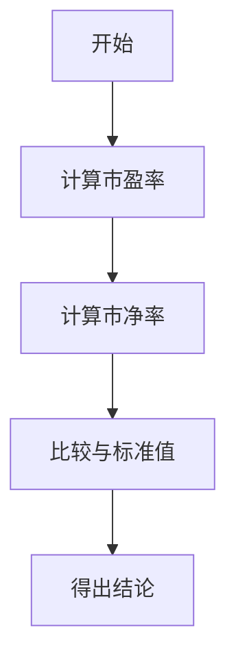
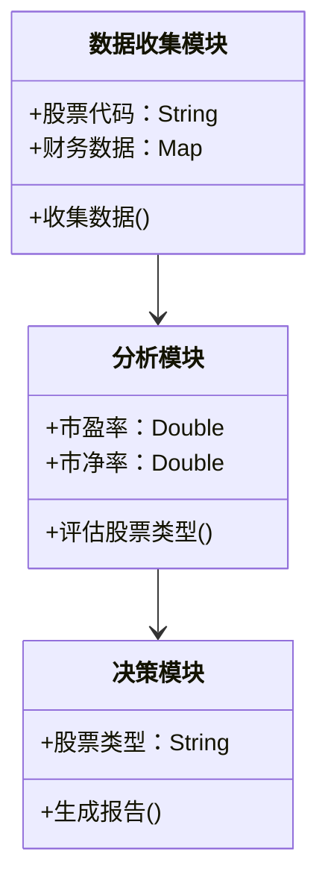

                 


# 彼得林奇的"成长股"vs"价值股"选择策略

## 关键词：彼得林奇，成长股，价值股，投资策略，股票分析

## 摘要：本文深入分析彼得·林奇的成长股和价值股投资策略，探讨两者的定义、特点、优缺点及选择标准。通过对比分析，结合数学模型和系统设计，提供实际投资案例，帮助读者理解如何在不同市场环境下选择合适的股票。

---

## 第一部分：投资基础与背景

### 第1章：投资的基本概念

#### 1.1 什么是股票

股票是投资者对公司的所有权证明，代表持有者有权获得公司利润的一部分。股票分为成长股和价值股，成长股侧重高增长，价值股侧重低估值。

#### 1.2 彼得·林奇及其投资理念

彼得·林奇是著名的投资专家，强调长期投资和基本面分析。他认为，投资应关注公司的财务状况和行业前景，而非短期市场波动。

#### 1.3 成长股与价值股的背景分析

成长股和价值股在不同市场环境下表现各异。成长股在高增长行业表现突出，而价值股在低估值市场中更具吸引力。

---

## 第二部分：成长股与价值股的核心概念

### 第2章：成长股的定义与特点

#### 2.1 成长股的定义

成长股是指收入和利润快速增长的公司股票，通常市盈率较高，适合长期投资者。

#### 2.2 成长股的关键指标

- 营收增长率：衡量公司收入增长速度。
- 净利润增长率：反映公司盈利能力的提升。
- 每股收益（EPS）：每股的净利润，是衡量公司盈利能力的重要指标。

#### 2.3 成长股的优缺点

优点：高增长潜力，回报率高；缺点：高估值风险，波动性大。

### 第3章：价值股的定义与特点

#### 3.1 价值股的定义

价值股是指市场价格低于其内在价值的股票，通常市盈率低，适合风险偏好较低的投资者。

#### 3.2 价值股的关键指标

- 市盈率（P/E）：价格与每股收益的比率，低P/E意味着价值被低估。
- 市净率（P/B）：价格与每股净资产的比率，低P/B表示股票价值被低估。
- 股息率：高股息率的股票通常被视为价值股。

#### 3.3 价值股的优缺点

优点：低估值，风险低；缺点：增长潜力有限，回报率相对较低。

---

## 第三部分：成长股与价值股的对比分析

### 第4章：成长股与价值股的对比

#### 4.1 对比分析表

| 特性         | 成长股                     | 价值股                     |
|--------------|---------------------------|---------------------------|
| 定义         | 收入和利润快速增长的公司股票 | 市场价格低于内在价值的股票 |
| 关键指标     | 收入增长率、净利润增长率     | 市盈率、市净率             |
| 适合投资者   | 高风险承受能力，长期投资   | 低风险承受能力，追求稳定回报 |
| 优缺点       | 高增长潜力，高风险         | 低估值，风险低             |

---

## 第四部分：分析方法与数学模型

### 第5章：成长股与价值股的分析方法

#### 5.1 市盈率分析

市盈率（P/E）= 价格 / 每股收益。成长股通常市盈率较高，而价值股市盈率较低。

#### 5.2 市净率分析

市净率（P/B）= 价格 / 每股净资产。价值股通常市净率较低。

#### 5.3 市盈率与市净率的对比

使用mermaid流程图展示分析过程：



---

## 第五部分：系统分析与架构设计

### 第6章：投资评估系统

#### 6.1 系统功能设计

- 数据收集模块：收集股票的财务数据。
- 分析模块：计算市盈率、市净率等指标。
- 决策模块：根据指标判断股票类型。

#### 6.2 系统架构设计

使用mermaid类图展示系统结构：



---

## 第六部分：项目实战

### 第7章：投资组合构建

#### 7.1 环境安装

- 数据来源：Yahoo Finance API。
- 工具：Python、Pandas、Matplotlib。

#### 7.2 核心实现代码

```python
import pandas as pd
import requests

def get_stock_data(ticker):
    url = f"https://query1.finance.yahoo.com/ws/v1/finance/quote/{ticker}"
    response = requests.get(url)
    data = response.json()
    return data

def calculate_pe(stock_data):
    pe = stock_data['pe']
    return pe

def calculate_pb(stock_data):
    pb = stock_data['pb']
    return pb

def is_growth_stock(pe, pb):
    return pe > 20 and pb > 1.5

def is_value_stock(pe, pb):
    return pe < 15 and pb < 1

# 示例分析
tickers = ['AAPL', 'MSFT', 'GOOGL']
for ticker in tickers:
    data = get_stock_data(ticker)
    pe = calculate_pe(data)
    pb = calculate_pb(data)
    if is_growth_stock(pe, pb):
        print(f"{ticker} is a growth stock")
    elif is_value_stock(pe, pb):
        print(f"{ticker} is a value stock")
```

---

## 第七部分：最佳实践与总结

### 第8章：总结与注意事项

#### 8.1 小结

彼得·林奇的成长股和价值股策略各有优缺点，投资者应根据自身风险偏好和市场环境选择合适策略。

#### 8.2 注意事项

- 定期评估投资组合，根据市场变化调整策略。
- 结合其他分析方法，如技术分析和行业趋势分析，提高决策的准确性。

#### 8.3 拓展阅读

推荐书籍：《彼得·林奇的投资艺术》。

---

## 作者

作者：AI天才研究院/AI Genius Institute & 禅与计算机程序设计艺术/Zen And The Art of Computer Programming

---

通过以上结构，文章详细分析了彼得·林奇的成长股和价值股策略，结合理论与实践，帮助读者掌握投资策略的选择与应用。

