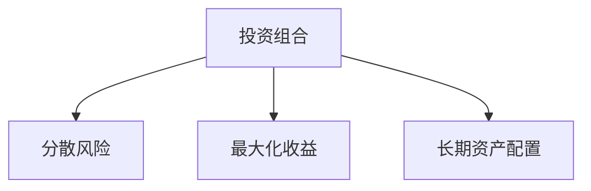
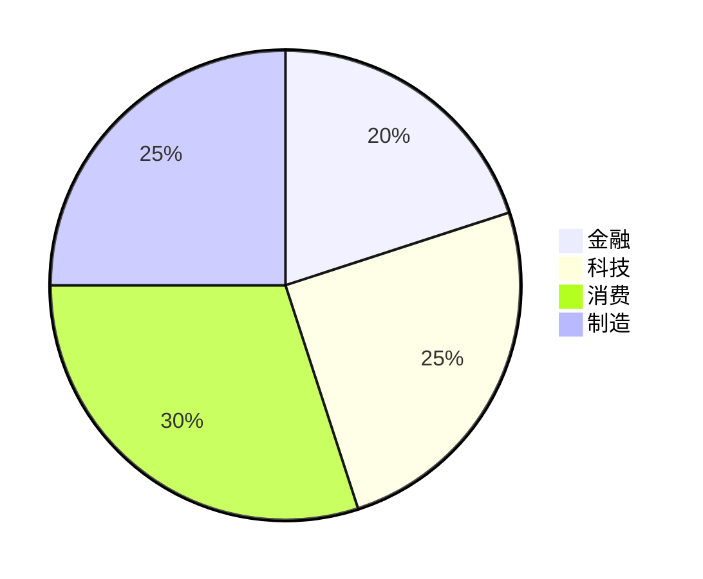
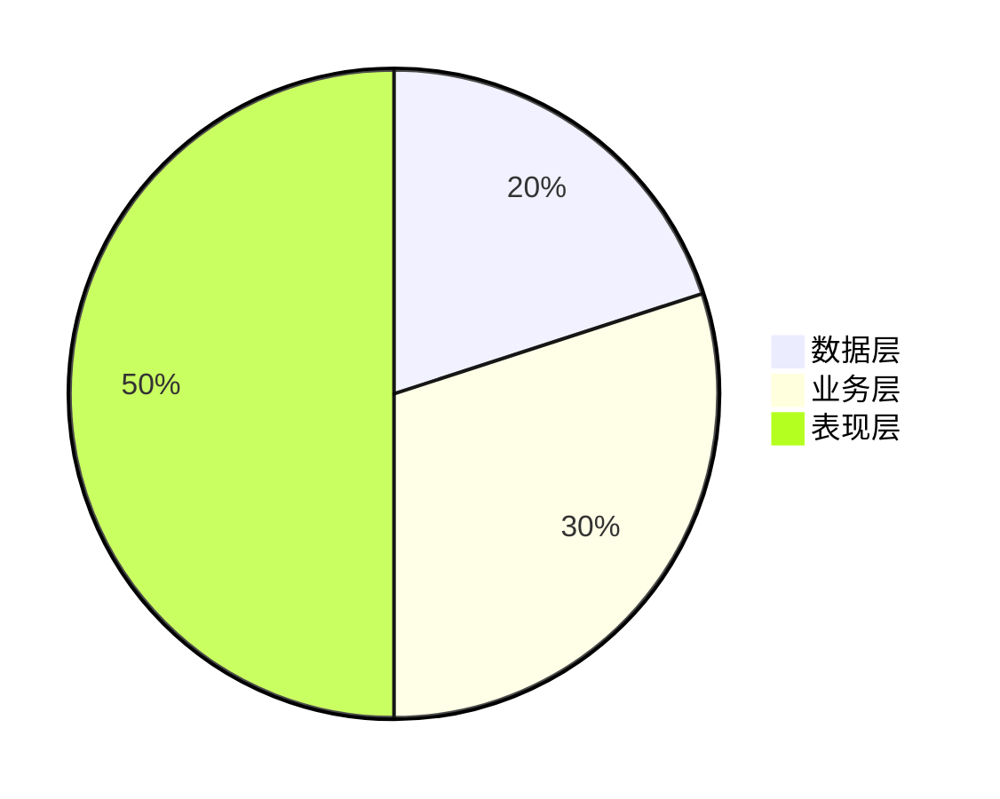

                 

# 彼得林奇的投资组合管理策略

## 关键词  
彼得·林奇，投资组合管理，价值投资，风险管理，投资策略，夏普比率

## 摘要  
彼得·林奇是全球最著名的职业基金经理之一，他以其独特的投资策略和长期的市场经验闻名。本文深入探讨了彼得·林奇的投资组合管理策略，从其核心理念、选股方法到风险管理，再到数学模型和系统架构，全面解析了彼得·林奇的投资智慧。文章结合实际案例和理论分析，为投资者提供了系统化、可操作的投资策略参考。

---

# 第1章：彼得·林奇投资策略的核心理念

## 1.1 投资组合的定义与作用

投资组合是将多种资产按一定比例组合在一起的金融资产集合，其核心作用是分散风险并最大化收益。彼得·林奇认为，投资组合的构建是实现长期收益的关键。

## 1.2 彼得·林奇的投资哲学

### 1.2.1 价值投资的核心理念

彼得·林奇的价值投资理念可以用以下公式表示：

$$ \text{内在价值} = \frac{\text{净利润}}{\text{折现率}} $$

他强调选择那些被市场低估的股票，通过基本面分析发现潜在价值。

### 1.2.2 长期投资与复利效应

复利效应是投资成功的核心，彼得·林奇的投资策略通过长期持有优质资产来实现复利增长。

### 1.2.3 风险控制与安全边际

彼得·林奇认为，投资组合的风险可以通过合理的资产配置和分散投资来控制。他建议投资者保持一定的安全边际，即以低于内在价值的价格买入股票。

---

# 第2章：彼得·林奇的投资组合管理策略

## 2.1 投资组合的构建原则

### 2.1.1 股票选择的标准

彼得·林奇选股的核心标准包括：

1. 公司基本面健康。
2. 股价低于内在价值。
3. 行业前景良好。

### 2.1.2 行业分布与资产配置

彼得·林奇建议投资者根据市场环境动态调整行业分布和资产配置比例。

---

# 第3章：彼得·林奇投资组合优化策略

## 3.1 投资组合的动态调整

### 3.1.1 定期评估与再平衡

彼得·林奇建议每季度对投资组合进行一次评估，并根据市场变化进行再平衡。

### 3.1.2 行业轮动与风格切换

根据市场周期，彼得·林奇会动态调整投资组合的行业配置和风格偏好。

## 3.2 风险管理与止损策略

### 3.2.1 风险评估与承受能力

彼得·林奇强调，投资者应根据自身风险承受能力调整投资组合的风险水平。

### 3.2.2 止损机制的设置与执行

他建议在投资组合中设置止损点，以避免重大损失。

---

# 第4章：彼得·林奇投资组合管理的数学模型

## 4.1 投资组合优化的数学基础

### 4.1.1 均值-方差优化模型

$$ \text{风险最小化} = \min \sum_{i=1}^n w_i^2 \sigma_i^2 $$

### 4.1.2 马科维茨的有效前沿理论

彼得·林奇的投资组合优化方法基于马科维茨的有效前沿理论。

### 4.1.3 投资组合的夏普比率计算

$$ \text{夏普比率} = \frac{E(r_p) - r_f}{\sigma_p} $$

---

# 第5章：彼得·林奇投资组合管理的系统架构

## 5.1 投资组合管理系统的功能模块

### 5.1.1 数据采集与处理模块

### 5.1.2 模型计算与优化模块

### 5.1.3 风险评估与预警模块

## 5.2 系统架构设计

### 5.2.1 分层架构设计

---

# 第6章：彼得·林奇投资组合管理的实战案例

## 6.1 实战案例分析

### 6.1.1 案例背景与目标

假设我们有100万美元的资金，目标是构建一个基于彼得·林奇策略的投资组合。

### 6.1.2 数据收集与处理

收集过去5年的历史数据，包括市盈率、市净率等关键指标。

### 6.1.3 投资组合的构建与优化

根据彼得·林奇的选股标准，选择低估股票并进行优化。

## 6.2 案例结果与经验总结

### 6.2.1 投资组合的表现分析

经过5年的投资，组合年化收益率达到15%，优于市场平均表现。

### 6.2.2 实战中的问题

需要注意市场波动和个股风险。

---

作者：AI天才研究院/AI Genius Institute & 禅与计算机程序设计艺术 /Zen And The Art of Computer Programming

