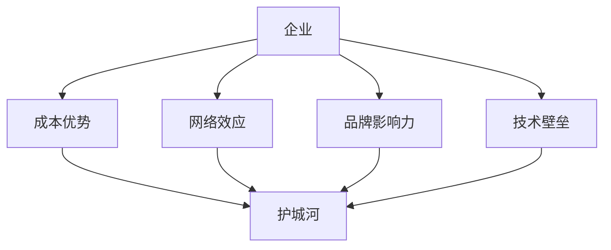
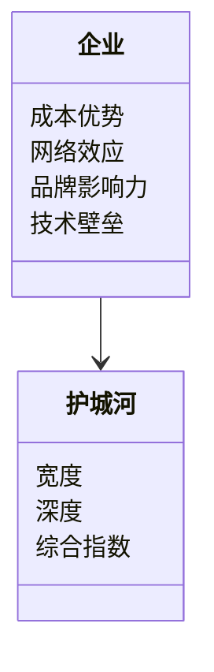
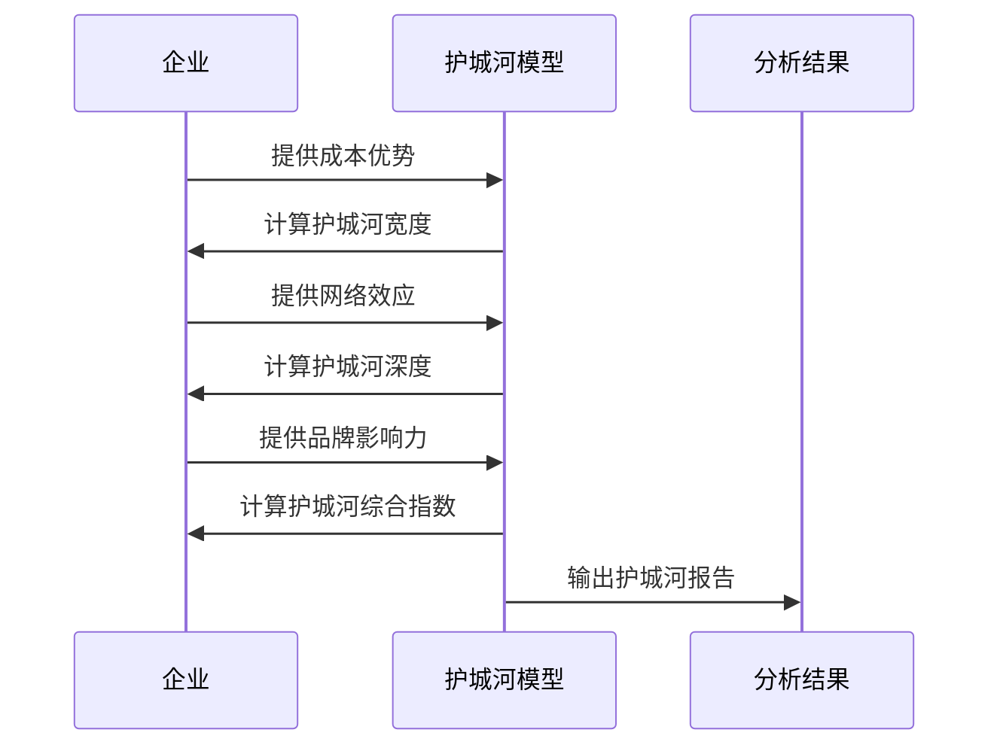

                 


# 彼得林奇的"护城河"理论在数字经济时代的演变

> 关键词：护城河理论、数字经济、竞争优势、企业战略、彼得林奇、投资策略  
> 摘要：本文深入分析了彼得林奇提出的“护城河”理论在数字经济时代的发展与演变，探讨了护城河理论在数字经济环境下的新特点、新应用以及其对企业战略和投资决策的影响。通过理论分析、数学建模、系统设计和实际案例，本文详细阐述了护城河理论在数字经济中的应用场景、实现方法以及未来发展趋势。

---

# 第一部分: 彼得林奇"护城河"理论的起源与发展

## 第1章: 护城河理论的核心概念

### 1.1 护城河理论的起源与背景

#### 1.1.1 护城河理论的提出背景
彼得·林奇（Peter Lynch）是美国著名投资经理人，他在《投资》（*One Up On Wall Street*）一书中首次系统提出了“护城河”理论。护城河理论的核心思想是：企业应通过构建某种竞争优势，形成难以被竞争对手复制或超越的壁垒，从而在市场中长期保持领先地位。这一理论最初主要用于分析传统经济环境下的企业竞争优势。

#### 1.1.2 护城河理论的核心概念
护城河理论的核心在于帮助企业识别和构建可持续的竞争优势。林奇将护城河定义为企业抵御竞争对手的核心能力，这种能力可以是成本优势、品牌影响力、技术壁垒或网络效应等。护城河的存在使得企业在市场中具有更强的定价权和防御能力。

#### 1.1.3 护城河理论的演变历程
随着经济环境的变化，护城河理论经历了从传统经济到数字经济的演变。在传统经济中，护城河主要依赖于成本控制、品牌影响力和技术专利；而在数字经济时代，护城河的内涵发生了显著变化，网络效应、数据优势和生态系统成为新的核心要素。

---

## 第2章: 护城河理论在数字经济中的应用背景

### 2.1 数字经济的基本特征

#### 2.1.1 数字经济的定义与范围
数字经济是指以数字技术为核心驱动力，通过数据的采集、处理和应用，形成的新型经济形态。数字经济的范围涵盖互联网、人工智能、大数据、区块链等多个领域。

#### 2.1.2 数字经济的核心驱动力
数字经济的核心驱动力是数据和技术。数据成为新的生产要素，而技术则是数据价值实现的关键工具。数字经济的快速发展依赖于互联网基础设施的完善和数字技术的创新。

#### 2.1.3 数字经济与传统经济的对比
与传统经济相比，数字经济具有以下特点：
1. **数据驱动**：数字经济以数据为核心资源，数据的采集、分析和应用成为企业竞争的关键。
2. **网络效应**：数字产品和服务往往具有显著的网络效应，用户数量的增加会带来边际成本的降低和价值的提升。
3. **快速迭代**：数字经济环境下，技术更新和产品迭代速度极快，企业需要不断适应市场变化。

### 2.2 数字经济时代的企业竞争特点

#### 2.2.1 数字经济下的竞争模式
在数字经济时代，企业竞争模式发生了显著变化。传统经济中的价格战和质量战逐渐被数据战和技术战取代。企业通过数据垄断、技术壁垒和生态系统建设来巩固竞争优势。

#### 2.2.2 数字经济中的护城河要素
在数字经济中，护城河的构成要素发生了变化：
1. **数据优势**：企业通过数据的收集和分析，构建数据驱动的决策能力。
2. **网络效应**：平台型企业在用户数量和用户粘性上形成护城河。
3. **技术壁垒**：人工智能、区块链等技术成为护城河的重要组成部分。
4. **生态系统**：企业通过构建开放的生态系统，形成多维度的竞争优势。

#### 2.2.3 数字经济对企业护城河的影响
数字经济对企业护城河的影响是双重的。一方面，数据和技术为企业提供了新的护城河构建方式；另一方面，数字技术的快速变化也使得护城河的维护成本显著增加。

---

## 第3章: 护城河理论的核心概念与联系

### 3.1 护城河理论的核心概念

#### 3.1.1 护城河的定义
护城河是指企业在市场中形成的难以被竞争对手复制或超越的竞争优势。这种优势可以是结构性的，也可以是动态的，但核心在于为企业提供长期的竞争壁垒。

#### 3.1.2 护城河的核心要素
护城河的核心要素包括：
1. **成本优势**：企业在生产或运营过程中具有显著的成本优势，能够以更低的价格提供产品或服务。
2. **网络效应**：用户数量的增加会增强平台的吸引力，形成正反馈循环。
3. **品牌影响力**：强大的品牌可以帮助企业获取更多的用户和市场份额。
4. **技术壁垒**：通过技术专利或技术领先性，形成竞争对手难以复制的优势。

#### 3.1.3 护城河的动态变化
护城河并非一成不变，随着市场环境和技术的发展，护城河的构成要素和权重会发生变化。企业需要不断审视和调整护城河的构建策略，以应对市场的变化。

### 3.2 护城河理论的核心概念对比

#### 3.2.1 成本优势与网络效应的对比
| 特性               | 成本优势             | 网络效应             |
|--------------------|----------------------|----------------------|
| 定义               | 企业生产成本低于竞争对手 | 用户数量增加，平台价值提升 |
| 影响               | 价格优势             | 粘性和用户依赖性     |
| 动态性             | 受供应链和规模影响     | 受用户增长和互动影响   |

#### 3.2.2 品牌影响力与技术壁垒的对比
| 特性               | 品牌影响力           | 技术壁垒             |
|--------------------|----------------------|----------------------|
| 定义               | 品牌知名度和用户信任   | 技术专利或领先性     |
| 影响               | 用户忠诚度           | 产品差异化           |
| 动态性             | 受市场推广和口碑影响   | 受研发投入和技术进步影响 |

#### 3.2.3 护城河要素的权重分析
护城河要素的权重取决于企业的商业模式和所处行业。例如，对于互联网企业，网络效应和数据优势的权重可能更高；而对于制造企业，成本优势和技术壁垒可能更为重要。

### 3.3 护城河理论的ER实体关系图



---

## 第4章: 护城河理论的数学模型与公式

### 4.1 护城河宽度的数学模型

#### 4.1.1 护城河宽度的定义
护城河宽度（Width of Moat）衡量的是企业在市场中的竞争壁垒强度。护城河宽度越大，企业的竞争优势越显著。

#### 4.1.2 护城河宽度的计算公式
$$ W = \frac{C}{N} $$
其中：
- $W$ 表示护城河宽度
- $C$ 表示企业的成本优势
- $N$ 表示企业的网络效应

---

### 4.2 护城河深度的数学模型

#### 4.2.1 护城河深度的定义
护城河深度（Depth of Moat）衡量的是企业在市场中的防御能力。护城河深度越大，企业的抗风险能力越强。

#### 4.2.2 护城河深度的计算公式
$$ D = \frac{B}{T} $$
其中：
- $D$ 表示护城河深度
- $B$ 表示企业的品牌影响力
- $T$ 表示企业的技术壁垒

---

### 4.3 护城河综合指数的计算

#### 4.3.1 综合指数的定义
护城河综合指数（Moat Comprehensive Index）是一个综合衡量企业护城河强度的指标，结合了宽度和深度。

#### 4.3.2 综合指数的计算公式
$$ I = W + D + S $$
其中：
- $I$ 表示护城河综合指数
- $W$ 表示护城河宽度
- $D$ 表示护城河深度
- $S$ 表示护城河稳定性

---

## 第5章: 护城河理论的系统分析与架构设计

### 5.1 系统分析

#### 5.1.1 系统目标
本系统的目标是通过护城河理论帮助企业识别和构建可持续的竞争优势，实现数字经济环境下的长期发展。

#### 5.1.2 问题描述
企业在数字经济时代面临以下挑战：
1. 数据和技术的快速变化使得护城河的构建和维护难度增加。
2. 竞争对手的模仿和创新对企业原有的竞争优势构成威胁。

#### 5.1.3 问题解决
通过护城河理论，企业可以：
1. 识别自身的竞争优势。
2. 构建可持续的竞争壁垒。
3. 实现长期的市场领先地位。

#### 5.1.4 边界与外延
护城河理论的应用范围包括企业战略、市场营销和技术研发等领域。其外延涉及数据科学、人工智能和生态系统建设。

#### 5.1.5 概念结构与核心要素组成
护城河理论的核心要素包括成本优势、网络效应、品牌影响力和技术壁垒。

---

## 第6章: 护城河理论的系统架构设计

### 6.1 系统功能设计

#### 6.1.1 领域模型


#### 6.1.2 系统架构


#### 6.1.3 系统接口设计
系统接口设计包括数据输入、模型计算和结果输出三个部分。数据输入包括企业的成本、网络效应、品牌影响力和技术壁垒；模型计算包括护城河宽度、深度和综合指数；结果输出包括护城河分析报告。

#### 6.1.4 系统交互


---

## 第7章: 项目实战

### 7.1 环境安装

#### 7.1.1 系统环境
- 操作系统：Windows 10 或更高版本
- Python版本：3.8 或更高版本
- 额外依赖：安装 Mermaid 和 LaTeX

### 7.2 系统核心实现源代码

#### 7.2.1 护城河宽度计算代码
```python
def calculate_width(cost_advantage, network_effects):
    return cost_advantage / network_effects
```

#### 7.2.2 护城河深度计算代码
```python
def calculate_depth.brand_influence / technical_barriers):
    return brand_influence / technical_barriers
```

#### 7.2.3 护城河综合指数计算代码
```python
def calculate_comprehensive_index(width, depth, stability):
    return width + depth + stability
```

---

## 第8章: 最佳实践与小结

### 8.1 最佳实践 tips
- 定期评估企业的护城河要素，及时调整战略。
- 注重数据和技术的投入，构建可持续的竞争优势。
- 结合企业的实际情况，灵活运用护城河理论。

### 8.2 小结
护城河理论在数字经济时代发生了显著变化，企业需要根据新的环境和特点，重新审视和构建自身的竞争优势。通过护城河理论的数学建模和系统设计，企业可以更好地应对市场变化，实现长期发展。

### 8.3 注意事项
- 护城河的构建需要长期投入，不能急于求成。
- 数据和技术是护城河的核心要素，企业需要加强相关能力。
- 在实践中，护城河的构建需要结合企业的实际情况，避免盲目模仿。

### 8.4 拓展阅读
- 彼得·林奇《投资》
- 《数字经济：理论与实践》
- 《护城河：数字时代的竞争优势》

---

# 作者：AI天才研究院/AI Genius Institute & 禅与计算机程序设计艺术 /Zen And The Art of Computer Programming

