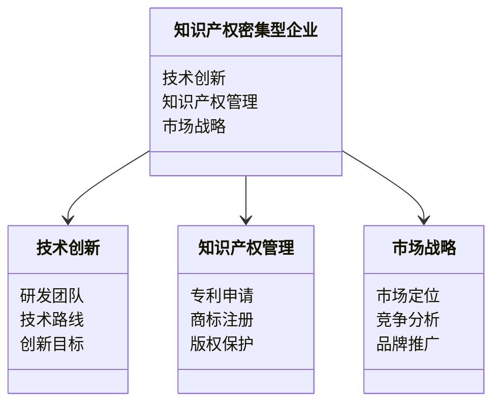
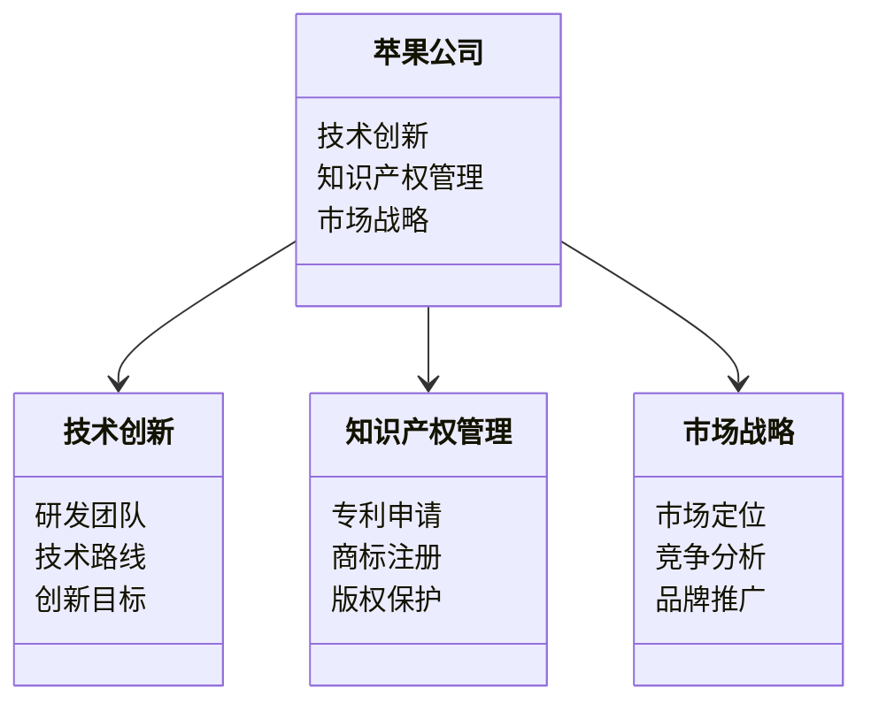

                 


# 彼得林奇的"护城河"理论在知识产权密集型企业中的应用

> **关键词**：彼得林奇，护城河理论，知识产权，知识产权密集型企业，竞争优势，企业战略

> **摘要**：本文探讨了彼得林奇的“护城河”理论在知识产权密集型企业中的应用，分析了知识产权作为企业竞争优势的核心要素，以及如何通过知识产权管理构建和维护企业的“护城河”。文章结合实际案例，从理论到实践，详细阐述了知识产权密集型企业的竞争优势、护城河构建策略、系统架构设计以及项目实战方法，为企业管理者提供了实用的指导和建议。

---

## 第一部分：彼得林奇的"护城河"理论概述

### 第1章：彼得林奇"护城河"理论的核心概念

#### 1.1 护城河理论的起源与发展

**背景介绍**：  
彼得·林奇（Peter Lynch）是美国著名的投资经理人，他的护城河理论源自巴菲特的价值投资理念，强调企业必须具备某种独特的竞争优势，使其能够在市场中长期保持领先地位。这种竞争优势被称为“护城河”，能够有效防御竞争对手的进攻和市场的冲击。

**问题背景**：  
在现代商业环境中，知识产权密集型企业（如科技公司、制药公司等）的核心竞争力往往依赖于其知识产权资产。如何将护城河理论应用到知识产权管理中，成为这些企业面临的重要挑战。

**问题解决**：  
护城河理论为知识产权密集型企业提供了构建竞争优势的框架，通过知识产权布局、保护和运营，企业可以有效防御竞争对手，巩固市场地位。

**边界与外延**：  
护城河理论不仅适用于传统企业，更在知识产权密集型企业中发挥了重要作用。其外延包括专利、商标、版权等多种知识产权形式。

**概念结构**：  
护城河理论由以下核心要素组成：  
1. **经济护城河**：企业通过成本优势、规模效应等构建的竞争优势。  
2. **竞争优势**：企业独有的资源和能力，使其在市场中占据优势地位。  
3. **可持续发展**：企业通过持续创新和优化，保持竞争优势的长期性。

**属性特征对比**：  
| **属性** | **经济护城河** | **竞争优势** | **可持续发展** |  
|----------|----------------|---------------|-----------------|  
| **核心** | 成本与规模      | 独有资源       | 创新与优化      |  
| **作用** | 防御成本优势    | 垄断市场资源    | 保持长期优势    |  

---

#### 1.2 知识产权密集型企业的特点

**问题描述**：  
知识产权密集型企业依赖于专利、商标、版权等知识产权资产，这些资产不仅是企业的核心竞争力，也是其市场价值的重要组成部分。

**问题解决**：  
通过护城河理论，企业可以将知识产权作为竞争优势的核心要素，构建可持续发展的商业模式。

**核心要素**：  
1. **技术创新**：知识产权密集型企业通过技术创新形成核心竞争力。  
2. **法律保护**：专利、商标等知识产权的法律保护是企业防御竞争对手的重要手段。  
3. **市场定位**：知识产权在市场定位中的作用，决定了企业在市场中的地位和影响力。

---

## 第二部分：护城河理论与知识产权管理

### 第2章：护城河理论与知识产权管理的关系

#### 2.1 知识产权作为护城河的必要性

**背景介绍**：  
知识产权是企业的重要资产，也是护城河的重要组成部分。通过知识产权布局，企业可以有效防御竞争对手，巩固市场地位。

**核心概念**：  
1. **防御性保护**：通过专利布局防止竞争对手侵犯企业技术。  
2. **进攻性策略**：利用知识产权主动出击，开拓新市场。  
3. **法律保护**：知识产权的法律保护是企业护城河的重要组成部分。

**ER实体关系图**：  
```mermaid
er
  图片
  class User {
    id
    name
    role
  }
  class Patent {
    patent_id
    title
    description
    owner_id
  }
  class Competitor {
    competitor_id
    name
    industry
  }
  class Market {
    market_id
    size
    growth_rate
  }
  User --> Patent: 拥有
  Patent --> Competitor: 防御
  Patent --> Market: 影响
```

---

#### 2.2 护城河理论在知识产权管理中的应用

**算法原理**：  
通过算法分析知识产权的分布和价值，帮助企业识别核心专利和关键技术。

**数学模型**：  
$$ 护城河强度 = \sum_{i=1}^{n} (p_i \times v_i) $$  
其中，\( p_i \) 是第 \( i \) 项知识产权的保护强度，\( v_i \) 是其价值。

**Python代码实现**：  
```python
def calculate_h护城河强度(patents, value):
    护城河强度 = 0
    for p, v in zip(patents, value):
        护城河强度 += p * v
    return 护城河强度

patents = [1, 2, 3]
value = [100, 200, 300]
print( 护城河强度 = calculate_h护城河强度(patents, value))  # 输出：1000
```

---

## 第三部分：知识产权密集型企业中的护城河构建

### 第3章：知识产权密集型企业的护城河构建策略

#### 3.1 知识产权布局

**系统架构设计**：  


---

## 第四部分：项目实战

### 第4章：护城河理论在知识产权密集型企业中的应用案例

#### 4.1 案例分析：苹果公司的护城河构建

**系统功能设计**：  


---

## 第五部分：总结与展望

### 第5章：总结与最佳实践

#### 5.1 总结

**最佳实践**：  
1. **定期审查知识产权资产**：确保专利和商标的有效性。  
2. **持续创新**：通过技术创新巩固护城河。  
3. **监测竞争对手**：及时发现并应对竞争威胁。  

#### 5.2 未来展望

**技术创新**：人工智能和大数据将推动知识产权管理的智能化。  
**全球布局**：知识产权密集型企业需要在全球范围内构建护城河。  

---

**作者**：AI天才研究院/AI Genius Institute & 禅与计算机程序设计艺术 /Zen And The Art of Computer Programming

