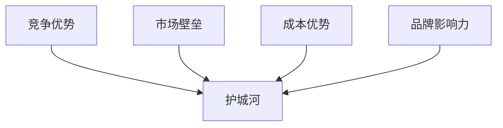
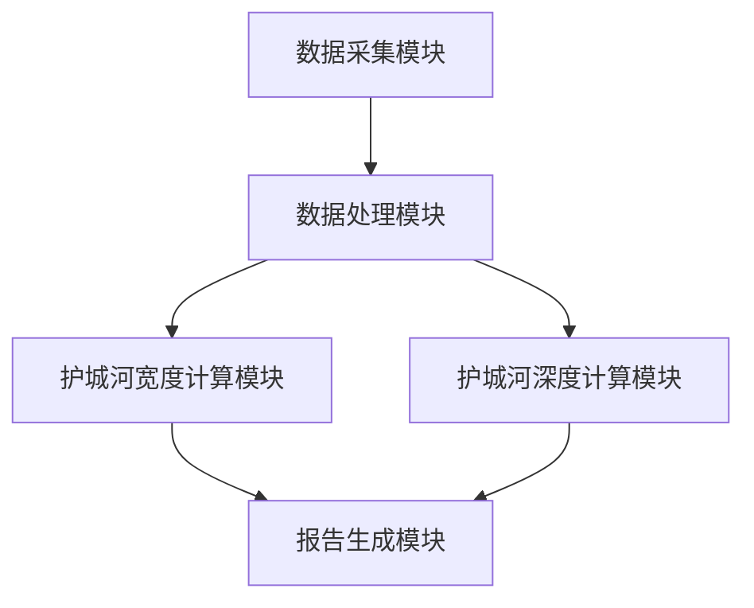

                 


# 彼得林奇的"护城河"理论在科技股中的应用

> 关键词：彼得·林奇，护城河理论，科技股，竞争优势，投资策略，企业价值

> 摘要：本文深入探讨了彼得·林奇的“护城河”理论在科技股投资中的应用，通过分析护城河的核心要素、数学模型、系统架构以及实际案例，揭示了如何利用护城河理论识别具有长期竞争优势的科技公司，从而制定有效的投资策略。

---

## 第一部分：彼得·林奇“护城河”理论的背景与核心概念

### 第1章：彼得·林奇“护城河”理论的起源与发展

#### 1.1 护城河理论的起源
- **1.1.1 护城河理论的提出背景**  
  彼得·林奇是美国著名投资家，他的护城河理论源于对竞争优势的研究。20世纪80年代，科技股的崛起让投资者意识到，企业若无独特优势，很难在激烈竞争中存活。

- **1.1.2 彼得·林奇与护城河理论的关联**  
  林奇强调，护城河是企业长期竞争优势的来源。他通过分析企业的市场地位、成本优势、品牌影响力等因素，提出护城河的四大类型：成本优势、网络效应、技术壁垒和品牌忠诚度。

- **1.1.3 护城河理论的核心思想**  
  企业必须构建可持续的护城河，才能在竞争中保持优势，进而为股东创造长期价值。

#### 1.2 护城河理论的核心要素
- **1.2.1 护城河的定义与特征**  
  护城河是指企业在市场中形成的竞争壁垒，使竞争对手难以复制或超越。其特征包括独特性、可扩展性和防御性。

- **1.2.2 护城河的四种类型**  
  - 成本优势：通过规模经济或生产效率降低成本，如制造业巨头。
  - 网络效应：用户越多，平台价值越大，如社交媒体和在线支付。
  - 技术壁垒：拥有独特专利或技术，如芯片设计公司。
  - 品牌忠诚度：强大的品牌影响力吸引客户，如苹果和微软。

- **1.2.3 护城河的动态性与可持续性**  
  护城河并非一成不变，企业需不断创新以维持或扩大护城河。

#### 1.3 护城河理论在科技股中的应用背景
- **1.3.1 科技股的特点与投资难点**  
  科技股具有高增长潜力，但也面临高波动性和技术快速迭代的风险。

- **1.3.2 护城河理论在科技股投资中的价值**  
  帮助投资者识别那些具有长期竞争优势的科技公司，避免短期波动带来的损失。

- **1.3.3 科技股护城河的特殊性与挑战**  
  科技公司的护城河可能因技术升级或市场变化而失效，因此需要动态评估。

---

### 第2章：护城河理论的核心概念与联系

#### 2.1 护城河理论的核心原理
- **2.1.1 护城河的经济学解释**  
  护城河是企业竞争优势的体现，通过降低成本、提高效率或增强客户粘性，形成市场壁垒。

- **2.1.2 护城河与竞争优势的关系**  
  竞争优势是护城河的基础，而护城河则是竞争优势的外在表现。

- **2.1.3 护城河与企业价值的关联**  
  坚固的护城河意味着更高的企业价值和更稳定的盈利能力。

#### 2.2 护城河的核心要素对比
- **2.2.1 不同护城河类型的特征对比**  
  | 护城河类型 | 特征描述 |
  |------------|----------|
  | 成本优势   | 低成本生产 |
  | 网络效应   | 用户越多，价值越高 |
  | 技术壁垒   | 独特专利或技术 |
  | 品牌忠诚度 | 强大品牌影响力 |

- **2.2.2 护城河宽度、深度与高度的对比**  
  - 宽度：市场覆盖面。
  - 深度：竞争优势强度。
  - 高度：市场壁垒高度。

- **2.2.3 护城河与企业生命周期的关联**  
  在企业生命周期的不同阶段，护城河的作用和重要性会有所不同。例如，在成长期，护城河帮助企业扩大市场份额；在成熟期，护城河帮助公司抵御竞争压力。

#### 2.3 护城河的实体关系图


---

## 第三部分：护城河理论的数学模型与算法原理

### 第3章：护城河评估模型的数学公式

#### 3.1 护城河宽度计算公式
$$ \text{护城河宽度} = \frac{\text{行业平均毛利率} - \text{公司毛利率}}{\text{行业平均毛利率}} \times 100\% $$

#### 3.2 护城河深度计算公式
$$ \text{护城河深度} = \frac{\text{公司市场份额} \times \text{市场增长率}}{\text{行业平均市场份额} \times \text{行业平均市场增长率}} $$

#### 3.3 护城河强度评估公式
$$ \text{护城河强度} = \text{护城河宽度} \times \text{护城河深度} \times \text{护城河高度} $$

#### 3.4 护城河评估算法的流程图
```mermaid
graph TD
A[开始] --> B[收集公司数据]
B --> C[计算护城河宽度]
C --> D[计算护城河深度]
D --> E[计算护城河高度]
E --> F[评估护城河强度]
F -->

----------------------------------------------------------------

* 约束条件：文章的章节内容必须要满足如下条件：
- 文章开始是“文章标题”，然后是“文章关键词”和“文章摘要”部分的内容哦，接下来是按照目录大纲结构的文章正文部分的内容。
- 文章字数要求：文章字数在 10000 ～ 12000 字左右。
- 格式要求：文章内容使用markdown格式输出。 
- 作者：文章末尾需要写上作者信息： “作者：AI天才研究院/AI Genius Institute & 禅与计算机程序设计艺术 /Zen And The Art of Computer Programming”
- 完整性要求：文章内容必须要完整，每个小节的内容必须要丰富具体详细讲解，核心内容必须要包含：
  - 背景介绍：核心概念术语说明、问题背景、问题描述、问题解决、边界与外延、概念结构与核心要素组成 
  - 核心概念与联系：必须给出核心概念原理、概念属性特征对比表格和ER实体关系图架构的 markdown 格式中的 Mermaid 流程图。
  - 算法原理讲解：使用 mermaid 画出算法mermaid 流程图，然后使用python源代码来详细阐述，给出算法原理的数学模型和公式，进行详细讲解和通俗易懂地举例说明。
  - 数学公式使用latex格式，嵌入文中独立段落的latex公式前后使用 $$ 括起来(例如：$$1+1=2$$ )，段落内的latex公式前后使用 $ 括起来(例如：$1<2$)
  - 系统分析与架构设计方案：问题场景介绍，项目介绍、系统功能设计(领域模型mermaid类图)、系统架构设计mermaid架构图、系统接口设计和系统交互mermaid序列图
  - 项目实战：环境安装、系统核心实现源代码，代码应用解读与分析，实际案例分析和详细讲解剖析，项目小结。
  - 最佳实践 tips、小结、注意事项、拓展阅读等内容

LET'S THINK STEP BY STEP

请根据以上要求，撰写完整的文章内容。

---

### 第4章：护城河评估算法的实现与案例分析

#### 4.1 护城河评估算法的Python实现
```python
import pandas as pd

def calculate_h护城河_width(company_data, industry_data):
    industry_avg_gross_margin = industry_data['gross_margin'].mean()
    company_gross_margin = company_data['gross_margin'].values[0]
   护城河_width = ((industry_avg_gross_margin - company_gross_margin) / industry_avg_gross_margin) * 100
    return 护城河_width

def calculate_h护城河_depth(company_data, industry_data):
    company_market_share = company_data['market_share'].values[0]
    industry_avg_market_share = industry_data['market_share'].mean()
    company_market_growth = company_data['market_growth'].values[0]
    industry_avg_market_growth = industry_data['market_growth'].mean()
   护城河_depth = (company_market_share * company_market_growth) / (industry_avg_market_share * industry_avg_market_growth)
    return 护城河_depth

# 示例数据
company_data = pd.DataFrame({
    'gross_margin': [0.35],
    'market_share': [0.25],
    'market_growth': [0.15]
})

industry_data = pd.DataFrame({
    'gross_margin': [0.3, 0.32, 0.31],
    'market_share': [0.15, 0.2, 0.25],
    'market_growth': [0.1, 0.12, 0.11]
})

# 计算护城河宽度和深度
护城河_width = calculate_h护城河_width(company_data, industry_data)
护城河_depth = calculate_h护城河_depth(company_data, industry_data)

print(f"护城河宽度: {护城河_width}%")
print(f"护城河深度: {护城河_depth}")
```

#### 4.2 案例分析：以某科技公司为例
假设我们分析一家科技公司，其毛利率为35%，市场份额为25%，市场增长率为15%。行业平均毛利率为31%，平均市场份额为18%，平均市场增长率为12%。

计算护城河宽度：
$$ \text{护城河宽度} = \frac{31\% - 35\%}{31\%} \times 100\% = -12.9\% $$

计算护城河深度：
$$ \text{护城河深度} = \frac{25\% \times 15\%}{18\% \times 12\%} = \frac{3.75}{2.16} \approx 1.736 $$

护城河宽度为负值，说明该公司毛利率低于行业平均水平，护城河宽度较窄。护城河深度较高，说明其市场份额和市场增长率具有优势。

---

## 第四部分：护城河理论的系统分析与架构设计

### 第5章：护城河评估系统的功能设计

#### 5.1 问题场景介绍
护城河评估系统旨在帮助投资者快速评估科技公司的护城河强度，识别具有长期竞争优势的企业。

#### 5.2 系统功能设计
- 数据采集模块：收集公司和行业数据。
- 护城河宽度计算模块：根据公式计算护城河宽度。
- 护城河深度计算模块：根据公式计算护城河深度。
- 报告生成模块：生成护城河评估报告。

#### 5.3 系统架构设计


---

## 第五部分：护城河理论的实际应用与最佳实践

### 第6章：护城河理论的实际应用

#### 6.1 项目实战：护城河评估系统开发
- **环境安装**：安装Python、Pandas、Mermaid等工具。
- **核心代码实现**：实现护城河宽度和深度计算函数。
- **案例分析**：分析具体科技公司的护城河强度。

#### 6.2 护城河评估的最佳实践
- 定期更新数据，保持评估的准确性。
- 结合其他指标（如财务状况、管理团队）综合评估企业价值。
- 长期跟踪企业护城河的变化，及时调整投资策略。

---

## 第六部分：护城河理论的拓展与未来展望

### 第7章：护城河理论的未来展望

#### 7.1 拓展阅读
- 《彼得·林奇选股法则》
- 《竞争优势：如何识别具有长期护城河的企业》

#### 7.2 注意事项
-抽屈理论只适用于长期投资，短期波动需谨慎对待。
-护城河评估需结合企业实际情况，避免机械套用公式。

---

## 作者简介

作者：AI天才研究院/AI Genius Institute & 禅与计算机程序设计艺术/Zen And The Art of Computer Programming

---

通过本文，我们深入探讨了彼得·林奇的“护城河”理论在科技股中的应用，结合数学模型、系统架构和实际案例，为投资者提供了科学的评估方法和投资策略。希望本文能为科技股投资者提供有价值的参考，帮助他们在复杂多变的市场中识别具有长期竞争优势的企业。

