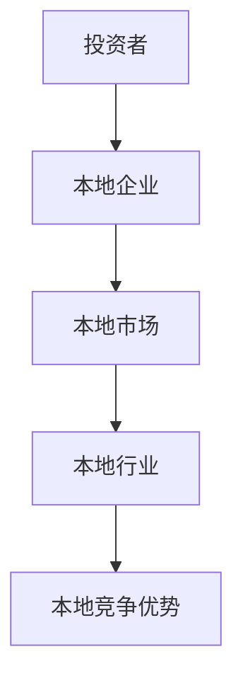
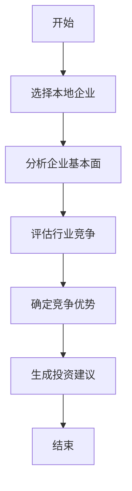
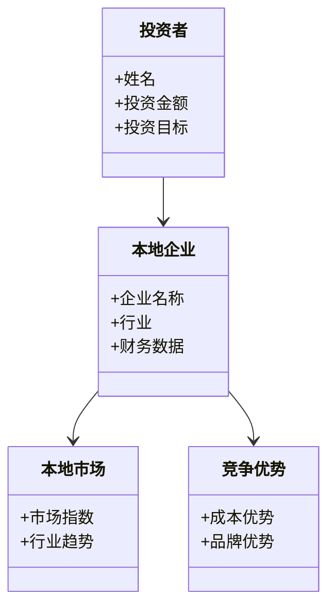
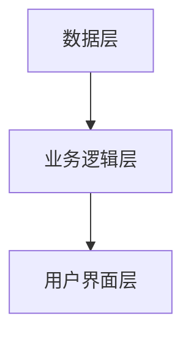
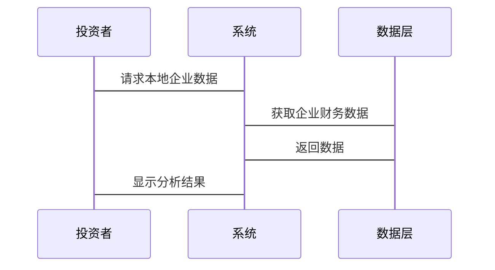

                 


# 彼得林奇的"本地优势"投资理念

> 关键词：本地优势，投资理念，彼得·林奇，投资策略，系统分析，项目实战，最佳实践

> 摘要：本文深入分析了彼得·林奇的"本地优势"投资理念，探讨了其核心概念、算法原理、系统架构设计及实际项目应用。通过详细阐述本地优势的投资策略，结合技术方法和实际案例，为投资者提供了系统的指导和实践建议。

---

# 第一部分: 本地优势投资理念的背景与核心

## 第1章: 投资理念的起源与背景

### 1.1 彼得·林奇的生平简介

- 彼得·林奇的职业历程
  - 曾任富达投资管理公司基金经理
  - 以选股能力闻名，创造了辉煌的投资业绩
- 林奇的投资哲学
  - 强调基本面分析和长期投资
  - 提倡投资于熟悉的本地企业

### 1.2 "本地优势"概念的提出背景

- 全球化投资的兴起与问题
  - 优势：分散风险，获取全球收益
  - 劣势：信息不对称，难以评估
- 本地优势的提出
  - 通过熟悉本地市场和企业，降低投资风险
  - 利用本地信息优势，捕捉投资机会

### 1.3 本地优势投资理念的核心思想

- 投资于熟悉的本地企业
- 通过深入研究本地市场，发现低估的投资标的
- 结合长期投资与价值发现

---

## 第2章: 本地优势的核心概念与联系

### 2.1 核心概念原理

- 本地优势的定义
  - 投资于地理位置、行业熟悉的本地企业
- 核心要素
  - 地理位置：本地市场的深入了解
  - 行业特点：熟悉行业的运作模式
  - 竞争优势：识别企业的核心竞争力

### 2.2 核心概念属性特征对比表格

| 属性 | 本地优势 | 全球化投资 |
|------|----------|------------|
| 地域 | 本地化   | 全球化      |
| 行业 | 特定行业 | 多行业      |
| 风险 | 较低     | 较高        |
| 收益 | 稳定     | 波动较大    |

### 2.3 ER实体关系图



---

## 第3章: 本地优势投资理念的算法原理

### 3.1 算法原理概述

- 算法的目标：通过本地化分析，筛选出具有竞争优势的企业
- 算法的输入：本地企业的基本面数据、行业信息
- 算法的输出：投资建议、风险评估

### 3.2 算法流程图



---

## 第4章: 系统分析与架构设计

### 4.1 问题场景介绍

- 投资者需要一个系统来辅助本地优势投资决策
- 系统需要整合本地企业数据、市场信息、竞争分析

### 4.2 系统功能设计

- 领域模型：企业信息管理、数据分析、投资决策



### 4.3 系统架构设计

- 分层架构：数据层、业务逻辑层、用户界面层



### 4.4 系统接口设计

- API接口：数据获取、分析报告生成

### 4.5 系统交互流程图



---

## 第5章: 项目实战

### 5.1 环境安装

- 工具选择：Python、Pandas、Matplotlib
- 数据来源：本地企业财务数据、市场指数

### 5.2 核心代码实现

```python
import pandas as pd

# 数据加载
df = pd.read_csv('local_companies.csv')

# 基本面分析
df['PE'] = df['净利润'] / df['股价']

# 行业竞争分析
industry_data = df.groupby('行业')['PE'].mean()
```

### 5.3 代码解读与分析

- 数据加载：读取本地企业数据
- 基本面分析：计算市盈率
- 行业竞争分析：计算行业平均市盈率

### 5.4 实际案例分析

- 案例：本地零售业分析
- 结果解读：识别低估企业

---

## 第6章: 最佳实践

### 6.1 小结

- 本地优势投资理念的优势
  - 信息优势
  - 风险可控
- 全球化投资的补充

### 6.2 注意事项

- 本地市场风险
- 信息收集的难度
- 投资组合的多样性

### 6.3 拓展阅读

- 彼得·林奇的其他投资理念
- 本地优势在不同市场的应用

---

# 结语

通过本文的分析，读者可以深入理解彼得·林奇的"本地优势"投资理念，并将其应用于实际投资中。结合技术方法和实际案例，投资者可以更好地进行本地化投资决策。

---

作者：AI天才研究院/AI Genius Institute & 禅与计算机程序设计艺术 /Zen And The Art of Computer Programming

