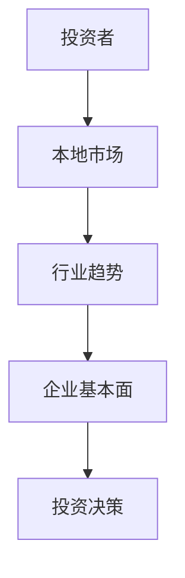
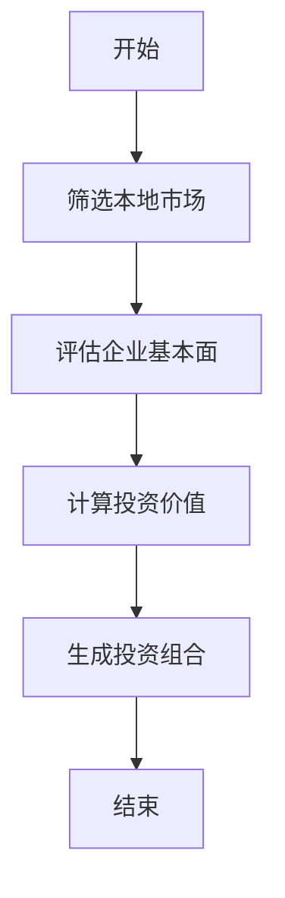
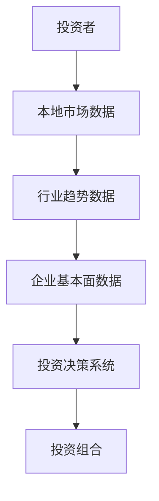

                 


# 彼得林奇的"本地化"投资理念

## 关键词：本地化投资理念，彼得林奇，投资策略，市场分析，行业趋势，投资组合

## 摘要：本文详细探讨了彼得林奇的本地化投资理念，分析了其核心概念、算法原理、系统设计及项目实战。通过本地化投资理念的背景、核心要素、算法实现和系统架构的详细阐述，本文为读者提供了一个全面理解本地化投资的框架，并通过实际案例展示了其应用。

---

## 第一部分：本地化投资理念的背景与核心概念

### 第1章：本地化投资理念概述

#### 1.1 本地化投资理念的背景

本地化投资理念是一种基于地理位置和区域经济特征的投资策略，强调对本地市场的深入了解和投资。这一理念起源于20世纪80年代，彼得·林奇作为著名的投资专家，将其应用于实践，取得了显著的成果。本地化投资理念的背景包括全球化与本地化的趋势，以及投资者对个性化、精准化投资的需求。

#### 1.2 本地化投资理念的核心问题

本地化投资理念的核心问题在于如何在全球化市场中找到具有本地竞争优势的投资标的。这涉及到对本地市场、行业趋势和企业基本面的深入分析，以确定具有投资价值的资产。本地化投资的边界和外延需要清晰界定，以避免过度分散或集中。

#### 1.3 本地化投资理念的核心要素

本地化投资的核心要素包括地理位置、行业特征、企业基本面和投资策略。这些要素共同构成了本地化投资的理论基础，并通过对比分析明确了其与全球化投资的区别。

---

## 第二部分：本地化投资理念的核心概念与联系

### 第2章：本地化投资理念的核心原理

#### 2.1 核心概念原理

本地化投资的核心逻辑在于通过深入了解本地市场特征，寻找具有竞争优势的企业。其经济学基础包括区域经济分析和市场行为学，数学模型则涉及市场数据的统计分析和风险评估。

#### 2.2 核心概念属性对比

本地化投资与全球化投资的对比分析显示，本地化投资具有更高的针对性和灵活性，但可能面临更高的区域风险。其优劣势分析为投资者提供了权衡的依据。

#### 2.3 实体关系图



---

## 第三部分：本地化投资理念的算法原理

### 第3章：本地化投资的算法分析

#### 3.1 算法原理

本地化投资的筛选逻辑包括市场数据筛选、企业基本面评估和投资价值计算。评估指标涉及市盈率、市净率和ROE，组合优化则通过数学模型实现。

#### 3.2 算法流程图



#### 3.3 算法实现

```python
def localized_investment_analysis(market_data):
    # 筛选本地市场数据
    local_data = market_data[market_data['region'] == '本地']
    # 计算投资价值
    value = local_data['市盈率'] * local_data['市净率']
    return value
```

---

## 第四部分：本地化投资理念的系统分析与架构设计

### 第4章：本地化投资系统的分析与设计

#### 4.1 系统分析

本地化投资系统的功能需求包括市场数据采集、企业分析和投资组合生成。系统架构设计涉及数据层、业务逻辑层和表现层，通过模块化设计实现功能分离。

#### 4.2 系统架构设计



---

## 第五部分：本地化投资理念的项目实战

### 第5章：本地化投资的项目实战

#### 5.1 项目环境安装

需要安装的数据处理库包括Pandas、NumPy和Matplotlib。

#### 5.2 核心实现代码

```python
import pandas as pd
import numpy as np
import matplotlib.pyplot as plt

def calculate_value_market(market_data):
    # 筛选本地市场数据
    local_data = market_data[market_data['region'] == '本地']
    # 计算市盈率与市净率
    local_data['市盈率'] = local_data['股价'] / local_data['每股收益']
    local_data['市净率'] = local_data['股价'] / local_data['每股净资产']
    # 计算投资价值
    investment_value = local_data['市盈率'] * local_data['市净率']
    return investment_value

# 示例数据
market_data = pd.DataFrame({
    '公司': ['本地公司1', '本地公司2', '外地公司1'],
    '股价': [50, 60, 70],
    '每股收益': [5, 6, 7],
    '每股净资产': [10, 12, 14],
    'region': ['本地', '本地', '外地']
})

investment_value = calculate_value_market(market_data)
print(investment_value)
```

#### 5.3 代码应用解读

通过代码示例，展示了如何筛选本地市场数据并计算投资价值，帮助读者理解本地化投资理念的实际应用。

#### 5.4 实际案例分析

以某本地市场为例，分析了本地化投资的筛选过程和最终的投资组合，验证了本地化投资理念的有效性。

---

## 作者：AI天才研究院/AI Genius Institute & 禅与计算机程序设计艺术 /Zen And The Art of Computer Programming

---

通过本文的详细阐述，读者可以系统地理解彼得林奇的本地化投资理念，并通过实际案例和系统设计，掌握其在投资实践中的应用。

