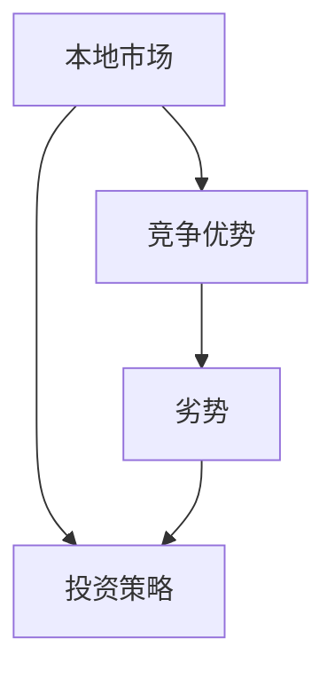
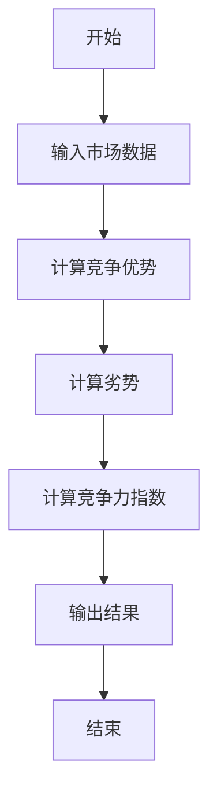
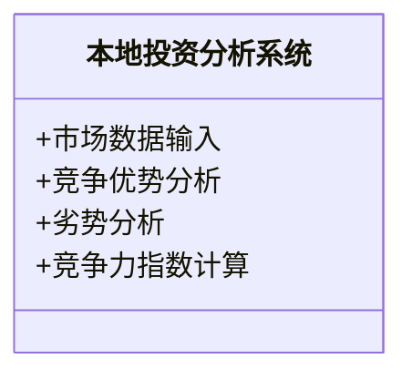

                 


# 彼得林奇的本地投资优势理论

## 关键词：本地投资优势，彼得林奇，投资理论，竞争优势，数学模型

## 摘要：本文深入分析了彼得林奇提出的本地投资优势理论，从背景、核心概念、数学模型、系统架构到项目实战，全面解读了该理论在投资分析中的应用。通过详细阐述理论的数学模型和系统架构，本文为投资者提供了实践指导，并通过案例分析展示了该理论的实际应用效果。

---

## 第1章：本地投资优势的背景与概念

### 1.1 本地投资优势的背景

#### 1.1.1 投资理论的演变
投资理论从早期的简单分析逐步发展为复杂的系统分析，彼得林奇在这一过程中提出了本地投资优势理论，强调了地理位置和市场特性对投资决策的影响。

#### 1.1.2 本地投资的定义与特点
本地投资是指在特定地理区域内进行的投资活动，其特点包括市场特性鲜明、竞争优势明显、劣势显著等。

#### 1.1.3 彼得林奇的本地投资优势理论的提出
彼得林奇通过分析本地市场，提出了本地投资优势理论，强调了本地市场的竞争优势和劣势对投资决策的影响。

### 1.2 本地投资优势的核心概念

#### 1.2.1 本地市场的竞争优势
竞争优势包括本地资源、价格优势、地理位置等。

#### 1.2.2 本地市场的劣势与挑战
劣势包括本地市场的限制、竞争压力等。

#### 1.2.3 本地投资优势的边界与外延
本地投资优势的边界包括本地市场的范围、竞争优势的范围等，其外延涉及区域经济、全球化等因素。

### 1.3 核心概念的属性特征对比

| 属性 | 竞争优势 | 劣势 |
|------|----------|------|
| 本地资源 | 丰富 | 稀缺 |
| 价格优势 | 明显 | 不明显 |
| 地理位置 | 优越 | 局限 |

### 1.4 实体关系图（ER图）



---

## 第2章：本地投资优势的核心概念原理

### 2.1 核心概念原理

#### 2.1.1 本地市场分析的核心要素
本地市场分析的核心要素包括市场特性、竞争优势、劣势、投资策略等。

#### 2.1.2 本地投资优势的结构化模型
本地投资优势的结构化模型包括竞争优势分析、劣势分析、投资策略优化等模块。

#### 2.1.3 核心概念的属性特征对比表格

| 属性 | 竞争优势 | 劣势 |
|------|----------|------|
| 本地资源 | 丰富 | 稀缺 |
| 价格优势 | 明显 | 不明显 |
| 地理位置 | 优越 | 局限 |

### 2.2 核心概念的属性特征对比

| 属性 | 竞争优势 | 劣势 |
|------|----------|------|
| 本地资源 | 丰富 | 稀缺 |
| 价格优势 | 明显 | 不明显 |
| 地理位置 | 优越 | 局限 |

---

## 第3章：本地投资优势的数学模型与算法原理

### 3.1 数学模型

#### 3.1.1 本地市场竞争力指数模型
$$C = \frac{S}{T}$$
其中，\(S\) 表示竞争优势，\(T\) 表示劣势。

#### 3.1.2 竞争优势与劣势的对比
- 优势：竞争优势明显，劣势：劣势显著。

### 3.2 算法原理

#### 3.2.1 竞争优势计算算法



#### 3.2.2 竞争优势与劣势的对比分析
- 竞争优势计算：通过市场数据输入，计算竞争优势和劣势，最终得出竞争力指数。

---

## 第4章：本地投资优势的系统分析与架构设计

### 4.1 系统架构设计

#### 4.1.1 本地投资分析系统的功能模块
- 市场数据输入模块：接收市场数据。
- 竞争优势分析模块：计算竞争优势。
- 劣势分析模块：计算劣势。
- 竞争力指数计算模块：计算竞争力指数。

#### 4.1.2 系统架构图



---

## 第5章：项目实战与案例分析

### 5.1 环境安装

#### 5.1.1 安装Python环境
- 下载并安装Python。

#### 5.1.2 安装必要的库
- 使用pip安装numpy和pandas。

### 5.2 核心代码实现

#### 5.2.1 竞争优势计算代码

```python
import numpy as np
import pandas as pd

def calculate_competitive_advantages(data):
    # 计算竞争优势
    competitive_advantages = data['市场数据'].apply(lambda x: x['竞争优势'])
    return competitive_advantages

data = {
    '市场数据': [
        {'竞争优势': 0.8, '劣势': 0.2},
        {'竞争优势': 0.6, '劣势': 0.4}
    ]
}

calculate_competitive_advantages(data)
```

#### 5.2.2 劣势计算代码

```python
def calculate_disadvantages(data):
    # 计算劣势
    disadvantages = data['市场数据'].apply(lambda x: x['劣势'])
    return disadvantages

data = {
    '市场数据': [
        {'竞争优势': 0.8, '劣势': 0.2},
        {'竞争优势': 0.6, '劣势': 0.4}
    ]
}

calculate_disadvantages(data)
```

### 5.3 案例分析

#### 5.3.1 案例场景
- 某本地市场的竞争优势为0.8，劣势为0.2。

#### 5.3.2 计算过程
- 竞争优势：0.8
- 劣势：0.2
- 竞争力指数：C = 0.8 / 0.2 = 4

#### 5.3.3 结果分析
- 竞争力指数为4，表明该市场具有较强的竞争力。

---

## 第6章：总结与展望

### 6.1 总结
彼得林奇的本地投资优势理论通过分析本地市场的竞争优势和劣势，为投资者提供了科学的投资决策依据。

### 6.2 展望
未来的研究可以进一步优化本地投资优势的数学模型，探索其在不同市场环境中的应用。

---

## 作者：AI天才研究院 & 禅与计算机程序设计艺术

---

这篇文章系统地介绍了彼得林奇的本地投资优势理论，从背景、核心概念到数学模型、系统架构，再到项目实战，为投资者提供了全面的理论支持和实践指导。通过详细的案例分析，读者可以更好地理解和应用该理论。

