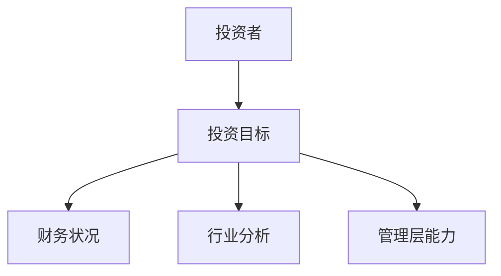
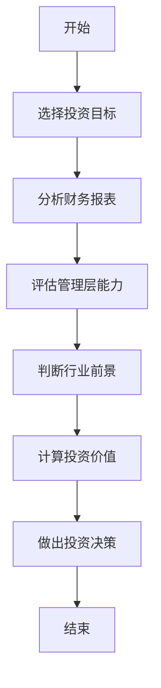
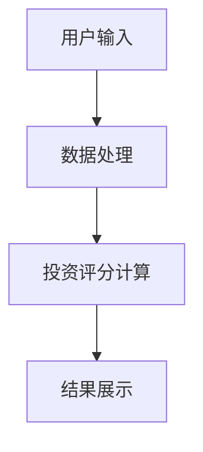
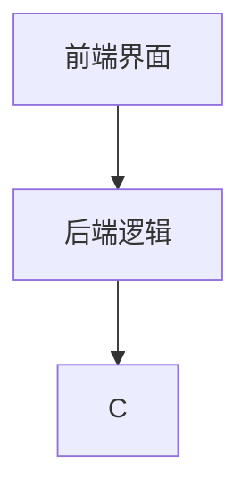

                 


# 彼得林奇的"简单明了"投资哲学

> 关键词：彼得林奇，投资哲学，价值投资，成长股，风险控制，投资决策，投资策略

> 摘要：本文深入解析了彼得·林奇的投资哲学，从背景介绍、核心概念、算法原理到系统架构设计、项目实战及最佳实践，帮助读者全面理解并掌握这一简单明了的投资理念。通过详细的技术分析和实例说明，本文为投资者提供了一套科学的投资决策支持系统设计方案。

---

## 第一部分: 投资哲学的背景与核心思想

### 第1章: 投资的基本概念与背景介绍

#### 1.1 投资的基本概念

投资是一种将资金投入特定资产以期获得未来收益的行为。它不同于投机，更注重长期的、理性的决策。投资的核心在于通过分析资产的内在价值，选择具有持续增长潜力的标的。

- **投资的分类**：包括股票、债券、房地产等多种形式，每种形式都有其独特的风险和收益特征。
- **投资的特点**：具有较高的门槛、需要长期关注、注重基本面分析、强调风险管理。
- **投资与投机的区别**：投资注重长期价值，而投机注重短期价格波动。

#### 1.2 彼得·林奇与他的投资哲学

彼得·林奇是美国著名的基金经理，以其成功的投资业绩和独特的投资哲学闻名。他在任职富达投资集团期间，管理的麦哲伦基金取得了卓越的回报，为他赢得了“股神”之称。

- **林奇的投资哲学**：林奇强调价值投资，注重对公司基本面的深入分析，寻找具有持续增长潜力的公司。他认为，成功的投资取决于对企业的深刻理解，而不是市场的短期波动。
- **投资理念的核心**：长期持有优质股票，关注企业的财务健康和管理层能力，注重风险控制。

---

### 第2章: 林奇投资哲学的核心概念与联系

#### 2.1 核心概念原理

林奇的投资哲学围绕以下几个核心概念展开：

1. **价值投资**：寻找市场价格低于其内在价值的股票。林奇认为，市场先生的情绪波动为理性投资者提供了廉价买入优质资产的机会。
2. **成长股识别**：关注那些具有持续增长潜力的公司，尤其是那些在行业内具有竞争优势的企业。
3. **风险控制**：通过分散投资、深入研究和长期持有，降低投资组合的风险。

#### 2.2 核心概念对比表格

以下是对价值投资和成长股投资的对比：

| 对比维度         | 价值投资                     | 成长股投资                   |
|------------------|------------------------------|------------------------------|
| 投资目标         | 寻找市场价格低于内在价值的股票 | 寻找具有持续增长潜力的股票   |
| 适用场景         | 市场低迷或被低估的资产         | 高增长行业或新兴市场         |
| 投资期限         | 长期持有                     | 中长期                      |
| 风险特征         | 低风险                      | 中高风险                    |

#### 2.3 投资决策的ER实体关系图



---

### 第3章: 林奇投资哲学的算法原理讲解

#### 3.1 投资决策的算法流程



#### 3.2 投资评分算法的数学模型

投资评分公式：

$$ \text{投资评分} = \frac{\text{财务评分} + \text{行业评分} + \text{管理层评分}}{3} $$

#### 3.3 投资评分标准

- **财务评分标准**：包括盈利能力、成长性、负债情况等。
- **行业评分标准**：包括行业前景、竞争格局、政策影响等。
- **管理层评分标准**：包括管理层的稳定性、战略眼光、执行力等。

---

### 第4章: 系统分析与架构设计方案

#### 4.1 投资决策支持系统的功能设计



#### 4.2 系统架构设计



---

### 第5章: 项目实战

#### 5.1 环境安装

需要安装以下工具和库：

1. Python 3.x
2. Jupyter Notebook
3. Pandas、NumPy、Matplotlib等数据分析库

#### 5.2 核心代码实现

```python
import pandas as pd
import numpy as np

def calculate_financial_scores(finance_data):
    # 计算财务评分
    # 示例：ROE（净资产收益率）>=20%得满分，每降低5%减5分
    roe = finance_data['ROE']
    financial_scores = []
    for r in roe:
        if r >= 20:
            financial_scores.append(100)
        else:
            score = (r // 5) * 5 + 50
            financial_scores.append(score)
    return financial_scores

# 示例数据
finance_data = pd.DataFrame({
    'ROE': [30, 25, 15, 20, 10]
})

# 计算财务评分
financial_scores = calculate_financial_scores(finance_data)
print(financial_scores)
```

#### 5.3 代码应用解读与分析

以上代码示例展示了如何根据ROE指标计算财务评分。通过将ROE与基准值进行对比，可以得出每个公司的财务评分。这种评分方法可以量化公司的财务健康状况，为投资决策提供依据。

#### 5.4 实际案例分析

以某公司为例，假设其ROE为25%，则其财务评分为：

$$ \text{财务评分} = 25 // 5 * 5 + 50 = 5 * 5 + 50 = 75 $$

结合其他评分，可以综合评估该公司的投资价值。

---

### 第6章: 最佳实践

#### 6.1 小结

彼得·林奇的投资哲学强调简单明了，注重基本面分析和长期投资。通过本文的系统分析和实战案例，读者可以掌握一套科学的投资决策方法。

#### 6.2 注意事项

- **市场波动**：投资决策需要结合市场环境，避免盲目跟风。
- **风险管理**：合理分散投资，控制单个标的的风险敞口。
- **持续学习**：投资需要不断学习和更新知识，适应市场的变化。

#### 6.3 拓展阅读

推荐书籍：
- 《彼得·林奇的投资哲学》
- 《价值投资：从格雷厄姆到巴菲特》
- 《投资的奥秘》

---

## 第二部分: 结语

彼得·林奇的投资哲学虽然简单，却蕴含着深刻的智慧。通过本文的系统分析和实战案例，读者可以掌握一套科学的投资决策方法。投资不仅是技术的较量，更是心态的修炼。希望本文能为您提供有价值的参考，帮助您在投资道路上走得更稳更远。

作者：AI天才研究院/AI Genius Institute & 禅与计算机程序设计艺术 /Zen And The Art of Computer Programming

