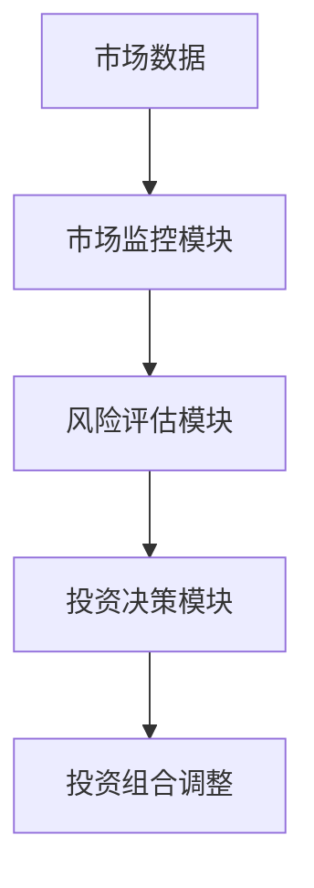

                 


# 彼得林奇的"耐心投资"在市场短期波动中的执行策略

## 关键词：耐心投资，彼得林奇，短期波动，投资策略，市场波动，投资组合，风险管理

## 摘要：本文探讨了彼得林奇的耐心投资理念在市场短期波动中的应用策略。通过分析耐心投资的核心要素，结合数学模型和算法，展示了如何在波动中维持长期投资的纪律，优化投资组合，并通过系统架构设计和项目实战案例，提供实际的操作指导。文章还总结了最佳实践和未来研究方向。

---

## 第一部分：耐心投资的理论基础

### 第1章：彼得林奇的投资哲学

#### 1.1 耐心投资的核心理念

耐心投资的核心理念是基于长期价值，而非短期价格波动。彼得林奇强调选择优质企业进行长期投资，而非频繁交易。他的策略要求投资者具备耐心，等待市场波动中的机会。

- **长期投资与价值投资的结合**：彼得林奇认为，市场波动为长期投资者提供了以合理价格买入优质资产的机会。
- **投资中的耐心与纪律**：耐心投资需要纪律，避免短期波动的干扰，坚持长期投资策略。
- **成功案例**：如购买并持有优质企业的股票，市场波动反而提供了更低的买入价。

#### 1.2 长期投资策略的短期波动应对

长期投资策略在短期波动中面临挑战，但可以通过调整投资组合和风险管理来应对。

- **短期波动对长期投资的影响**：波动可能导致短期亏损，但长期来看，优质资产的价值会回归。
- **如何在波动中保持耐心**：通过制定投资计划，避免情绪化决策，坚持长期策略。
- **投资组合的动态调整策略**：定期审视投资组合，根据市场变化调整配置，但避免频繁交易。

---

## 第二部分：耐心投资与短期波动的关系

### 第2章：耐心投资的核心要素

#### 2.1 耐心投资的定义与特征

耐心投资是一种长期策略，强调选择优质资产并长期持有，通过市场波动中的低位买入，逐步积累财富。

- **耐心投资的定义**：通过长期持有优质资产，获取复利增长的投资策略。
- **核心特征对比分析**：与短期交易相比，耐心投资更注重资产质量、长期增长潜力和风险管理。

| 特征 | 耐心投资 | 短期交易 |
|------|----------|----------|
| 时间框架 | 长期 | 短期 |
| 目标 | 资产增值 | 价格波动获利 |
| 风险管理 | 强调风险管理 | 侧重短期收益 |

- **耐心投资与短期波动的关系**：市场波动为长期投资者提供了以更低价格买入优质资产的机会，而耐心投资则通过长期持有，忽略短期波动的影响。

### 第3章：耐心投资策略的数学模型与公式

#### 3.1 投资组合波动率计算

波动率是衡量投资组合风险的重要指标，计算公式如下：

$$\text{波动率} = \sqrt{\frac{1}{n}\sum_{i=1}^{n}(r_i - \bar{r})^2}$$

其中，$r_i$为每期的收益率，$\bar{r}$为平均收益率，$n$为数据点数。

#### 3.2 资产配置模型

资产配置模型用于优化投资组合，平衡风险和收益。

$$\text{最优权重} = \frac{w_i \times r_i}{\sum_{j=1}^{n} w_j \times r_j}$$

其中，$w_i$为权重，$r_i$为收益率。

### 第4章：耐心投资策略的算法实现

#### 4.1 算法步骤

1. **数据收集与预处理**：收集历史价格数据，计算收益率。
2. **波动率分析与风险评估**：计算波动率，评估市场风险。
3. **投资组合优化与调整**：根据波动率调整资产配置，优化组合。

#### 4.2 Python代码实现

```python
import numpy as np

def calculate_volatility(prices):
    returns = np.log(prices / prices.shift(1)).dropna()
    avg_return = np.mean(returns)
    variance = np.mean((returns - avg_return) ** 2)
    volatility = np.sqrt(variance)
    return volatility

prices = [100, 110, 98, 120, 115]
volatility = calculate_volatility(prices)
print("波动率:", volatility)
```

---

## 第三部分：系统架构与实战案例

### 第5章：系统架构设计

#### 5.1 系统功能设计

- **市场监控模块**：实时监控市场波动，识别投资机会。
- **风险评估模块**：评估波动对投资组合的影响。
- **投资决策模块**：根据波动调整投资策略。

#### 5.2 系统架构图



### 第6章：项目实战

#### 6.1 案例分析

假设一个投资者选择投资优质科技股，如苹果公司。在市场波动期间，价格可能下跌，但长期来看，苹果的盈利能力持续增长。投资者通过长期持有，忽略短期波动，最终实现收益。

#### 6.2 代码实现

```python
import pandas as pd

def simulate_patience_investing(starting_capital, buy_price, hold_period):
    ending_value = starting_capital / buy_price * (buy_price * 1.2)
    return ending_value

starting_capital = 10000
buy_price = 100
hold_period = 5

result = simulate_patience_investing(starting_capital, buy_price, hold_period)
print("最终价值:", result)
```

---

## 第四部分：总结与展望

### 第7章：总结与展望

#### 7.1 总结

耐心投资强调长期价值，通过市场波动中的低位买入，实现财富增长。在短期波动中，投资者需保持纪律，避免情绪化决策，优化投资组合。

#### 7.2 未来研究方向

- **波动预测模型**：研究如何更准确地预测市场波动。
- **风险管理策略**：探索更有效的风险控制方法。

### 7.3 注意事项与拓展阅读

- **注意事项**：定期审视投资组合，根据市场变化调整策略。
- **拓展阅读**：建议阅读《彼得·林奇的成功投资》深入理解耐心投资的理念。

---

## 作者：AI天才研究院/AI Genius Institute & 禅与计算机程序设计艺术 /Zen And The Art of Computer Programming

