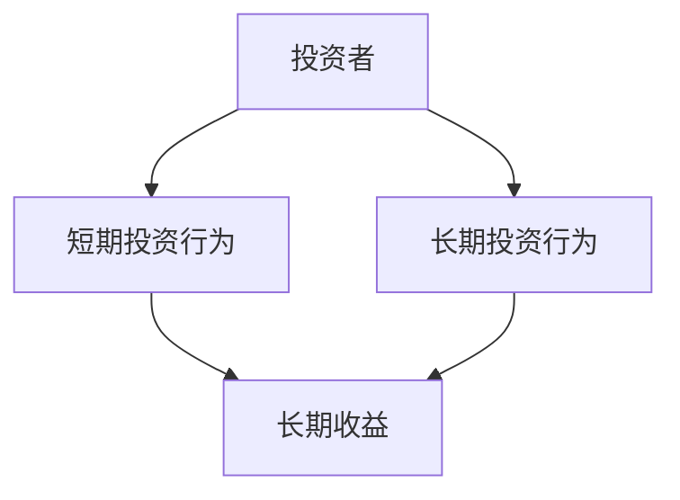
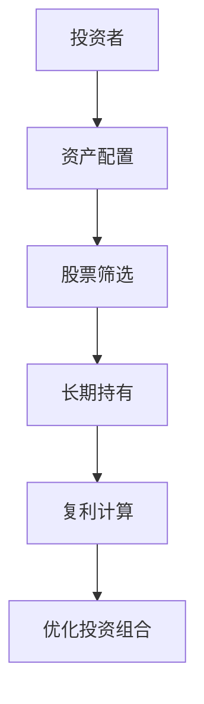
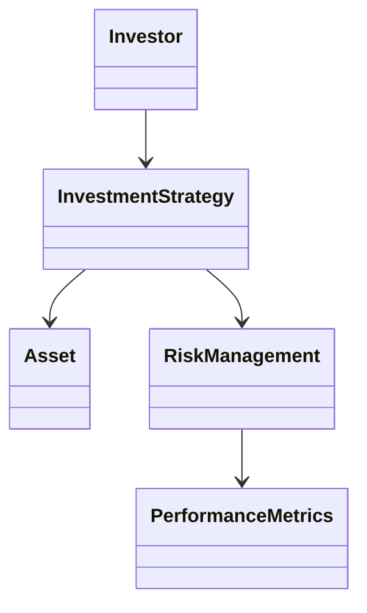
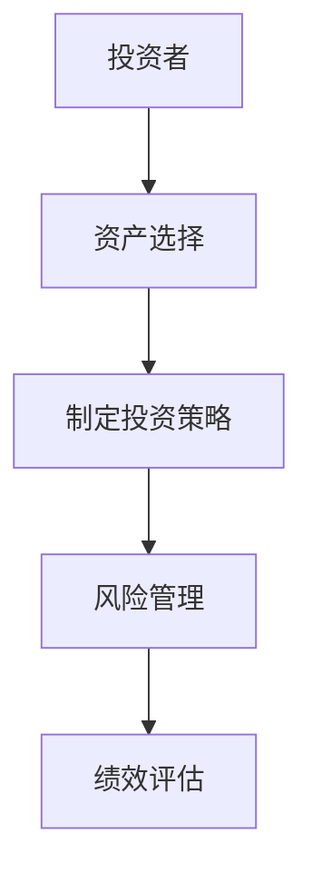

                 


# 彼得林奇的"耐心投资"在短期主义盛行时的价值

---

## 关键词：
- 彼得林奇
- 耐心投资
- 短期主义
- 投资策略
- 长期回报

---

## 摘要：
本文深入探讨了彼得林奇提出的“耐心投资”理念在当前短期主义盛行的投资环境下的独特价值。通过分析短期主义与长期投资的对比，结合数学模型、系统架构设计和实际案例，揭示了耐心投资的核心原理及其在复杂市场中的优势。文章还提供了基于耐心投资策略的算法实现和系统设计，帮助读者理解如何在实际操作中应用这一理念。

---

## 第一部分：引言

### 1.1 投资背景与问题背景

#### 1.1.1 短期主义的盛行及其影响
在当今金融市场中，短期主义已经成为一种普遍现象。投资者往往倾向于关注短期收益，而忽视了长期价值的积累。这种现象导致市场波动加剧，投资决策缺乏深度，企业战略也受到短期业绩压力的影响。短期主义不仅影响了个人投资者的收益，还对整体经济的稳定发展带来了挑战。

#### 1.1.2 投资市场的核心问题与矛盾
投资市场的核心问题在于如何平衡短期收益与长期价值。许多投资者在追求短期高回报的过程中，忽视了风险管理和资产配置的重要性。这种短期导向的投资行为往往导致投资组合的不稳定性和低效性，无法实现长期的财富增长。

#### 1.1.3 彼得林奇投资理念的提出与价值
彼得林奇作为全球著名的投资专家，提出了“耐心投资”的理念，强调长期持有优质资产的重要性。他的投资策略与短期主义形成了鲜明对比，为投资者提供了一种更加稳健和可持续的投资方式。本文将深入分析这一理念的核心要素及其在当前市场环境下的价值。

---

### 1.2 短期主义与长期投资的对比

#### 1.2.1 短期主义的定义与特征
短期主义是指投资者在短时间内追求高回报的投资行为。其主要特征包括频繁交易、关注短期价格波动、忽视长期价值等因素。这种投资方式往往依赖市场情绪，容易受到市场波动的影响。

#### 1.2.2 长期投资的定义与特征
长期投资是指投资者在较长的时间内持有资产，关注企业的基本面和长期发展潜力。其核心特征包括分散投资、长期持有、关注企业价值等因素。长期投资更注重资产的内在价值，而非短期价格波动。

#### 1.2.3 两者的优劣势对比与应用场景
| 对比维度       | 短期主义                     | 长期投资                     |
|----------------|------------------------------|------------------------------|
| 投资期限       | 短期（1-3年）               | 长期（5年以上）               |
| 风险承受能力   | 高风险，波动大               | 低风险，波动小               |
| 投资策略       | 追求短期收益，频繁交易       | 追求长期收益，分散投资       |
| 适用场景       | 短期资金需求，投机性交易     | 长期财富积累，稳健投资       |

---

### 1.3 彼得林奇投资理念的核心要素

#### 1.3.1 耐心投资的定义
耐心投资是指投资者在长期持有优质资产的同时，保持耐心和纪律，避免频繁交易和短期波动的干扰。这种投资策略强调对优质企业的长期支持，追求稳定且可持续的回报。

#### 1.3.2 耐心投资的核心要素与结构
耐心投资的核心要素包括：
1. **优质资产选择**：选择基本面良好、具有长期增长潜力的企业。
2. **分散投资**：通过投资多个行业和企业降低风险。
3. **长期持有**：避免频繁交易，降低交易成本。
4. **纪律性**：坚持投资策略，不受短期市场波动影响。

#### 1.3.3 彼得林奇投资理念的边界与外延
彼得林奇的投资理念不仅适用于股票投资，还可扩展到其他资产类别，如债券、房地产等。其核心思想在于长期持有优质资产，追求稳健的长期回报。

---

## 第二部分：彼得林奇投资理念的核心概念

### 2.1 耐心投资的核心原理

#### 2.1.1 耐心投资的哲学基础
耐心投资的哲学基础在于“时间的价值”。通过长期持有优质资产，投资者能够充分利用复利效应，实现财富的指数级增长。这种投资理念强调对优质企业的信任和长期支持，避免了短期波动的干扰。

#### 2.1.2 耐心投资的数学模型与公式
耐心投资的核心在于复利效应，其数学模型可以表示为：
$$
FV = PV \times (1 + r)^t
$$
其中，$FV$ 是未来价值，$PV$ 是现值，$r$ 是年化收益率，$t$ 是投资时间。

#### 2.1.3 耐心投资的策略与方法
1. **资产配置**：根据个人风险承受能力和投资目标，合理分配股票、债券和其他资产。
2. **优质企业筛选**：选择具有强大竞争优势、良好管理团队和持续增长潜力的企业。
3. **定期复盘**：每年至少复盘一次投资组合，根据市场变化和个人目标进行调整。

---

### 2.2 短期主义与长期投资的对比分析

#### 2.2.1 对比表格：短期主义与长期投资的核心差异
| 对比维度       | 短期主义                     | 长期投资                     |
|----------------|------------------------------|------------------------------|
| 投资目标       | 追求短期收益                 | 追求长期收益                 |
| 风险管理       | 高风险，波动大               | 低风险，波动小               |
| 投资成本       | 高交易成本                   | 低交易成本                   |
| 适用场景       | 适合短期资金需求             | 适合长期财富积累             |

#### 2.2.2 实体关系图：投资行为的ER图架构


---

## 第三部分：耐心投资的算法原理

### 3.1 耐心投资的算法流程

#### 3.1.1 算法流程图：耐心投资的决策路径


#### 3.1.2 算法实现代码：基于耐心投资策略的模拟
```python
def patient_investing():
    import numpy as np
    import matplotlib.pyplot as plt

    # 假设投资组合的年化收益率和波动率
    mu = 0.07  # 年化收益率
    sigma = 0.15  # 波动率
    years = 30
    np.random.seed(42)

    # 生成随机收益率
    returns = np.random.lognormal(mu, sigma, years)
    cumulative_returns = np.cumprod(1 + returns)

    plt.figure(figsize=(10, 6))
    plt.plot(cumulative_returns, label='Patient Investment Strategy')
    plt.xlabel('Years')
    plt.ylabel('Cumulative Returns')
    plt.title('Patience Investment Strategy Performance')
    plt.legend()
    plt.show()

patient_investing()
```

#### 3.1.3 代码解读与分析
上述代码模拟了耐心投资策略的长期表现。通过生成随机收益率，计算累积收益，并绘制出长期投资的收益曲线。结果显示，耐心投资能够有效利用复利效应，实现稳定的长期收益。

---

### 3.2 数学模型与公式

#### 3.2.1 投资回报的数学模型
耐心投资的回报可以通过复利公式计算：
$$
FV = PV \times (1 + r)^t
$$

#### 3.2.2 长期复利计算公式
长期复利计算公式为：
$$
FV = PV \times e^{rt}
$$
其中，$e$ 是自然对数的底数，$r$ 是年化收益率，$t$ 是投资时间。

---

## 第四部分：系统分析与架构设计

### 4.1 问题场景介绍

#### 4.1.1 短期主义投资的典型问题
短期主义投资往往导致以下问题：
1. 高交易成本
2. 高风险和波动性
3. 缺乏长期价值积累

#### 4.1.2 长期投资的挑战与解决方案
长期投资的挑战包括市场波动、信息不对称等。解决方案包括：
1. 分散投资
2. 定期复盘
3. 长期持有优质资产

---

### 4.2 系统功能设计

#### 4.2.1 领域模型：投资行为的类图


#### 4.2.2 系统架构设计：耐心投资的流程图


---

## 第五部分：项目实战

### 5.1 环境安装与配置

#### 5.1.1 环境要求
- Python 3.8+
- Jupyter Notebook
- Matplotlib和NumPy库

#### 5.1.2 核心代码实现
```python
import numpy as np
import matplotlib.pyplot as plt

def simulate_patience_investing(years=30, mu=0.07, sigma=0.15):
    np.random.seed(42)
    returns = np.random.lognormal(mu, sigma, years)
    cumulative_returns = np.cumprod(1 + returns)
    plt.figure(figsize=(10, 6))
    plt.plot(cumulative_returns, label='Patient Investment Strategy')
    plt.xlabel('Years')
    plt.ylabel('Cumulative Returns')
    plt.title('Patience Investment Strategy Performance')
    plt.legend()
    plt.show()

simulate_patience_investing()
```

---

## 第六部分：总结与启示

### 6.1 投资的未来展望
随着市场的不断变化，耐心投资的价值将更加凸显。投资者需要在短期波动和长期收益之间找到平衡，才能实现稳健的财富增长。

### 6.2 最佳实践 tips
1. **长期持有优质资产**：选择基本面良好、具有长期增长潜力的企业。
2. **分散投资**：避免过度集中，降低风险。
3. **定期复盘**：根据市场变化和个人目标进行调整。
4. **保持耐心**：避免短期波动的干扰，坚持长期投资。

---

## 作者：AI天才研究院/AI Genius Institute & 禅与计算机程序设计艺术 /Zen And The Art of Computer Programming

---

本文通过系统分析和实际案例，深入探讨了彼得林奇的耐心投资理念在短期主义盛行时的价值。希望读者能够从中获得启发，制定适合自己的投资策略，实现长期稳健的财富增长。

