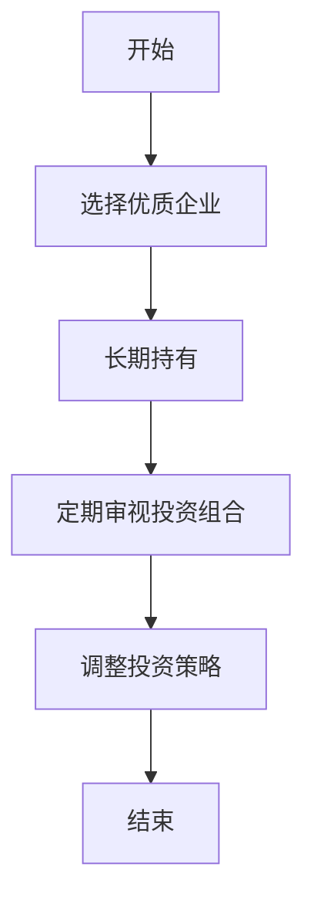
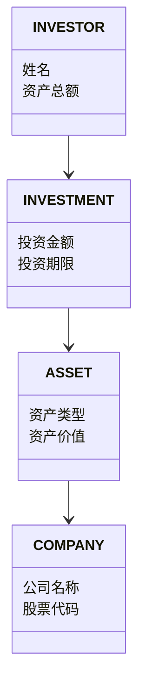

                 


# 彼得林奇的"耐心投资"理念探讨

**关键词**：耐心投资、彼得林奇、投资理念、长期持有、价值投资

**摘要**：本文深入探讨了彼得·林奇的耐心投资理念，分析其核心概念、算法原理、系统架构等，并结合实际案例，详细讲解了如何在投资实践中应用这一理念。通过系统分析和项目实战，本文旨在帮助投资者更好地理解和运用耐心投资策略，实现长期稳定的收益。

---

## 第一章: 耐心投资的背景与定义

### 1.1 投资理念的演变历程

#### 1.1.1 传统投资理念的局限性
传统投资理念往往强调短期收益和频繁交易，这种方法可能导致投资者忽视长期价值，容易受到市场波动的影响，增加投资风险。此外，频繁交易还可能产生较高的交易成本，侵蚀投资收益。

#### 1.1.2 耐心投资的提出背景
彼得·林奇作为全球著名投资专家，提出耐心投资理念的核心是强调长期持有优质股票，避免频繁交易。他认为，优质的公司能够在长期内持续增长，而频繁交易往往会错失这种长期增长的机会。

#### 1.1.3 耐心投资的核心概念与特点
耐心投资的核心概念是通过长期持有优质资产，逐步积累收益。其特点是：
- **长期持有**：避免频繁买卖，减少交易成本和税务负担。
- **价值投资**：选择具有持续增长潜力的公司，而非短期市场波动。
- **风险控制**：通过分散投资和选择优质公司，降低投资风险。

### 1.2 耐心投资与传统投资的区别

#### 1.2.1 传统投资的优缺点
- **优点**：适合短期资金需求，能够快速获取收益。
- **缺点**：容易受到市场波动影响，交易成本较高，难以实现长期稳定的收益。

#### 1.2.2 耐心投资的独特优势
- **优点**：通过长期持有优质资产，享受复利效应，实现资产的长期增值。
- **缺点**：需要较长的时间周期，短期内可能无法获得显著收益。

#### 1.2.3 两者的对比分析
通过对比分析表和ER实体关系图，可以看出耐心投资在长期收益和风险控制方面具有明显优势。

**对比分析表**

| 特性                | 传统投资         | 耐心投资         |
|---------------------|------------------|------------------|
| 投资周期            | 短期             | 长期             |
| 交易频率            | 高               | 低               |
| 风险承受能力        | 高风险           | 中低风险         |
| 收益稳定性          | 波动大           | 稳定             |

**ER实体关系图**

```mermaid
erDiagram
    INVESTOR++<1..N> INVESTMENT
    INVESTMENT++<1..1> ASSET
    ASSET++<1..1> COMPANY
```

---

## 第二章: 耐心投资的核心要素

### 2.1 耐心投资的核心要素

#### 2.1.1 长期持有的投资策略
长期持有是耐心投资的核心策略，投资者需要选择具有持续增长潜力的公司，并耐心等待其价值的实现。

#### 2.1.2 优质企业的选择标准
选择优质企业是耐心投资的关键，具体标准包括：
- 公司具有强大的竞争优势。
- 公司财务状况健康，盈利能力持续。
- 公司管理层稳定且具有良好的治理结构。

#### 2.1.3 风险控制与收益平衡
通过分散投资和定期审视投资组合，耐心投资者能够在控制风险的同时，实现收益的最大化。

### 2.2 耐心投资的内在逻辑

#### 2.2.1 耐心投资的数学模型
耐心投资的收益可以通过复利公式计算：

$$ A = P \times (1 + r)^n $$

其中：
- \( A \)：最终收益
- \( P \)：初始投资
- \( r \)：年化收益率
- \( n \)：投资年数

通过长期持有，投资者能够充分享受复利效应，实现资产的长期增值。

#### 2.2.2 耐心投资的ER实体关系图

```mermaid
erDiagram
    INVESTOR [1]---[0..N] INVESTMENT
    INVESTMENT [1]----[1] ASSET
    ASSET [1]----[1] COMPANY
```

---

## 第三章: 耐心投资的算法原理

### 3.1 耐心投资的算法模型

#### 3.1.1 耐心投资的数学公式
耐心投资的收益可以通过以下公式计算：

$$ \text{收益} = \text{初始投资} \times (1 + \text{年化收益率})^{\text{投资年数}} $$

#### 3.1.2 耐心投资的算法流程图



#### 3.1.3 耐心投资的Python代码实现

```python
def calculate_patience_investment(P, r, n):
    return P * (1 + r) ** n

# 示例
P = 1000  # 初始投资
r = 0.1   # 年化收益率
n = 10    # 投资年数
A = calculate_patience_investment(P, r, n)
print(f"最终收益为：{A:.2f}")
```

---

## 第四章: 耐心投资的系统分析与架构设计

### 4.1 系统分析

#### 4.1.1 投资管理系统的需求分析
投资者需要一个能够长期持有优质资产的投资管理系统，系统需要具备以下功能：
- 资产配置
- 风险评估
- 定期审视投资组合

#### 4.1.2 投资管理系统的领域模型



---

## 第五章: 耐心投资的项目实战

### 5.1 项目实战

#### 5.1.1 环境安装
需要安装Python和相关库，如pandas、numpy等。

#### 5.1.2 核心代码实现

```python
import pandas as pd
import numpy as np

def portfolio_analysis(portfolio, returns):
    return pd.DataFrame({
        '资产名称': portfolio,
        '年化收益率': [returns[i] for i in portfolio]
    }).set_index('资产名称')

# 示例数据
portfolio = ['股票A', '股票B', '债券C']
returns = {'股票A': 0.1, '股票B': 0.08, '债券C': 0.05}

# 分析结果
result = portfolio_analysis(portfolio, returns)
print(result)
```

---

## 第六章: 耐心投资的最佳实践

### 6.1 小结
耐心投资是一种长期有效的投资策略，通过长期持有优质资产，投资者能够实现财富的稳定增长。

### 6.2 注意事项
- **选择优质企业**：投资者需要仔细筛选具有长期增长潜力的企业。
- **分散投资**：避免过度集中，降低投资风险。
- **定期审视**：定期审视投资组合，及时调整策略。

### 6.3 拓展阅读
推荐阅读彼得·林奇的《投资之道》等书籍，深入理解耐心投资的理念和策略。

---

## 结论

彼得·林奇的耐心投资理念强调长期持有优质资产，避免频繁交易，通过复利效应实现财富的长期增值。本文通过详细分析其核心概念、算法原理和系统架构，帮助投资者更好地理解和应用这一理念。在实际投资中，投资者需要结合自身情况，合理配置资产，实现长期稳定的收益。

---

**作者**：AI天才研究院/AI Genius Institute & 禅与计算机程序设计艺术/Zen And The Art of Computer Programming

