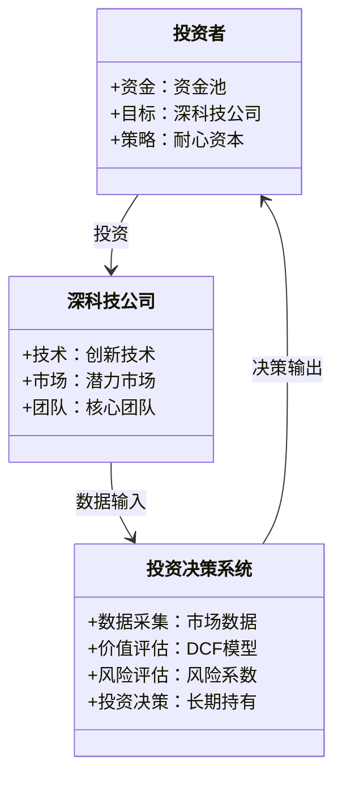

                 


# 彼得林奇的"耐心资本"在深科技投资中的重要性

> 关键词：耐心资本，深科技投资，彼得林奇，投资策略，长期价值

> 摘要：本文探讨了彼得林奇的“耐心资本”理念在深科技投资中的重要性。通过分析耐心资本的核心概念、深科技投资的特点，以及两者结合的优势，本文详细阐述了如何在高风险、高回报的深科技领域中，通过长期持有和价值发现来实现投资目标。文章结合数学模型、系统架构设计和实际案例，为投资者提供了深刻的理论支持和实践指导。

---

## 第一部分: 背景介绍

### 第1章: 彼得林奇的"耐心资本"概述

#### 1.1 耐心资本的核心概念

##### 1.1.1 耐心资本的定义
耐心资本（Patience Capital）是指投资者在面对高潜力但高风险的投资标的时，采取长期持有的策略，不因短期市场波动而频繁买卖。这种资本的核心在于对标的长期价值的坚定信念，以及对短期波动的容忍度。

##### 1.1.2 耐心资本的特点
| 特性 | 描述 |
|------|------|
| 长期性 | 投资周期较长，通常超过5年 |
| 风险承受能力 | 能够容忍较高的波动性和不确定性 |
| 价值导向 | 以标的的内在价值为投资决策的核心 |

##### 1.1.3 耐心资本与传统投资的区别
| 方面 | 耐心资本 | 传统投资 |
|------|----------|----------|
| 投资周期 | 长期 | 短期 |
| 交易频率 | 低 | 高 |
| 风险承受 | 高 | 中低 |
| 目标 | 长期价值增长 | 短期收益 |

#### 1.2 深科技投资的定义与特点

##### 1.2.1 深科技投资的定义
深科技投资是指对那些基于前沿科技（如人工智能、生物技术、量子计算等）的公司或项目进行投资。这类投资通常具有高技术门槛、高风险和高回报的特点。

##### 1.2.2 深科技投资的核心要素
| 要素 | 描述 |
|------|------|
| 技术创新性 | 标的是否具备颠覆性技术 |
| 市场潜力 | 标的是否能在未来市场中占据重要地位 |
| 团队能力 | 标的团队的技术能力和执行力 |

#### 1.3 彼得林奇投资理念与耐心资本的联系

##### 1.3.1 彼得林奇的投资哲学
彼得林奇以其独特的“耐心资本”理念闻名，他主张通过深入研究和长期持有优质股票来实现投资目标。他认为，短期市场波动不应该影响长期价值判断。

##### 1.3.2 耐心资本在彼得林奇投资策略中的地位
耐心资本是彼得林奇策略的核心，他通过长期持有优质股票，避免了频繁交易带来的成本和风险。

##### 1.3.3 深科技投资与彼得林奇理念的结合
深科技投资的高风险和高回报特性，正好适合彼得林奇的耐心资本策略。通过长期持有，投资者能够捕捉到深科技领域的潜在爆发性增长。

---

### 第2章: 深科技投资的背景与现状

#### 2.1 深科技投资的背景分析

##### 2.1.1 科技创新的加速
近年来，人工智能、生物技术等领域的技术进步显著加快，为深科技投资提供了更多机会。

##### 2.1.2 深科技领域的崛起
随着技术门槛的提高，深科技领域的公司逐渐成为投资热点。

##### 2.1.3 投资者对深科技的关注
机构投资者和个人投资者都在加大对深科技领域的关注，希望通过投资获取超额回报。

#### 2.2 深科技投资的现状

##### 2.2.1 当前深科技领域的投资热点
| 领域 | 投资热点 |
|------|----------|
| 人工智能 | 大模型、AI芯片 |
| 生物技术 | 基因编辑、生物制药 |
| 量子计算 | 量子计算机、量子通信 |

##### 2.2.2 深科技投资的主要参与者
| 类型 | 描述 |
|------|------|
| 风险投资 | 早期阶段投资 |
| 私募股权 | 中后期阶段投资 |
| 机构投资者 | 长期战略投资 |

#### 2.3 耐心资本在深科技投资中的重要性

##### 2.3.1 深科技投资的长周期性
深科技领域的技术突破通常需要较长时间，因此需要耐心资本的长期支持。

##### 2.3.2 耐心资本对深科技投资的支持
耐心资本能够为深科技企业提供稳定的资金来源，帮助其度过研发和市场拓展的关键阶段。

##### 2.3.3 耐心资本与深科技投资的匹配性
耐心资本的长期性和风险承受能力，与深科技投资的需求高度契合。

---

### 第3章: 耐心资本与深科技投资的核心概念

#### 3.1 耐心资本的核心要素

##### 3.1.1 长期投资视角
耐心资本的投资周期通常超过5年，适合深科技领域的长周期发展。

##### 3.1.2 价值发现与成长潜力
耐心资本的核心是通过发现标的的内在价值，并长期持有以实现增长。

##### 3.1.3 风险承受能力
耐心资本能够容忍高波动性和不确定性，适合深科技领域的高风险特性。

#### 3.2 深科技投资的核心要素

##### 3.2.1 技术创新性
深科技投资的核心是标的的技术创新性，这决定了其未来的市场潜力。

##### 3.2.2 市场潜力
标的的市场潜力决定了其未来的收益能力，是投资决策的重要依据。

##### 3.2.3 团队能力
团队的技术能力和执行力是深科技投资成功的关键因素。

#### 3.3 耐心资本与深科技投资的关联性

##### 3.3.1 长期价值创造
耐心资本通过长期持有，帮助深科技企业实现技术突破和市场扩展。

##### 3.3.2 风险与回报的平衡
耐心资本能够有效平衡深科技投资中的高风险和高回报，为投资者提供更稳定的收益。

##### 3.3.3 投资策略的协同性
耐心资本的长期性和价值导向，与深科技投资的需求高度协同。

---

## 第4章: 耐心资本在深科技投资中的应用案例

### 第4章: 耐心资本在深科技投资中的应用案例

#### 4.1 彼得林奇的经典投资案例

##### 4.1.1 高通公司的投资
彼得林奇通过长期持有高通股票，成功捕捉到其技术领先地位带来的长期收益。

##### 4.1.2 英特尔公司的投资
通过耐心资本策略，彼得林奇在英特尔的投资中获得了显著的回报。

##### 4.1.3 其他经典案例分析
包括微软、苹果等公司，彼得林奇的长期持有策略都取得了显著成功。

#### 4.2 深科技领域的具体应用

##### 4.2.1 人工智能领域的投资
以深度学习技术为例，耐心资本通过长期支持，帮助人工智能公司实现技术突破。

##### 4.2.2 生物技术领域的投资
通过长期投资，耐心资本支持生物技术公司在基因编辑等领域取得进展。

##### 4.2.3 其他深科技领域的投资
包括量子计算、新能源等领域，耐心资本都发挥了重要作用。

#### 4.3 耐心资本在深科技投资中的成功经验

##### 4.3.1 长期持有策略的优势
通过长期持有，耐心资本能够避免短期波动带来的损失，捕捉长期增长。

##### 4.3.2 价值发现与成长支持的结合
耐心资本不仅发现价值，还通过长期支持帮助标的实现增长。

##### 4.3.3 风险控制与回报优化的平衡
通过耐心资本策略，投资者能够在高风险中实现回报的优化。

---

## 第5章: 耐心资本在深科技投资中的数学模型

### 第5章: 耐心资本在深科技投资中的数学模型

#### 5.1 耐心资本的价值评估模型

##### 5.1.1 贴现现金流模型
贴现现金流模型（DCF）是评估企业内在价值的重要工具。其核心公式为：
$$
V = \sum_{t=1}^{n} \frac{CF_t}{(1 + r)^t}
$$
其中，\( V \) 为内在价值，\( CF_t \) 为第 \( t \) 年的现金流，\( r \) 为贴现率。

##### 5.1.2 内在价值计算公式
内在价值的计算需要考虑企业的未来现金流和贴现率。公式如下：
$$
V = \frac{CF_1}{(1 + r)^1} + \frac{CF_2}{(1 + r)^2} + \cdots + \frac{CF_n}{(1 + r)^n}
$$

#### 5.2 深科技投资的回报预测模型

##### 5.2.1 投资回报率计算公式
投资回报率（ROI）的计算公式为：
$$
ROI = \frac{Net\ Profit}{Investment} \times 100\%
$$

#### 5.3 耐心资本与深科技投资的关联模型

##### 5.3.1 投资周期与回报的关系
长期投资周期与高回报之间存在正相关关系，耐心资本通过延长投资周期，提高了回报率。

##### 5.3.2 风险系数与回报系数的对比
通过耐心资本策略，投资者可以降低风险系数，同时提高回报系数。

##### 5.3.3 数学模型的优化与调整
通过调整贴现率和现金流预测，耐心资本能够优化数学模型，提高评估的准确性。

---

## 第6章: 耐心资本在深科技投资中的系统架构设计

### 第6章: 耐心资本在深科技投资中的系统架构设计

#### 6.1 投资决策系统架构

##### 6.1.1 系统功能模块划分
| 模块 | 功能 |
|------|------|
| 数据采集 | 收集深科技领域的市场数据 |
| 价值评估 | 使用DCF模型评估内在价值 |
| 风险评估 | 评估投资风险 |
| 投资决策 | 基于评估结果做出投资决策 |

##### 6.1.2 系统功能设计（领域模型）


---

## 第7章: 项目实战

### 第7章: 项目实战

#### 7.1 环境安装

##### 7.1.1 安装Python
```bash
# 安装Python
sudo apt-get install python3
```

##### 7.1.2 安装必要的库
```bash
pip install numpy pandas matplotlib
```

#### 7.2 核心实现源代码

##### 7.2.1 DCF模型实现
```python
import numpy as np

def calculate_intrinsic_value(cash_flows, discount_rate):
    present_value = 0
    for t in range(len(cash_flows)):
        cf = cash_flows[t]
        pv = cf / (1 + discount_rate) ** t
        present_value += pv
    return present_value

# 示例数据
cash_flows = [100, 150, 200, 250]
discount_rate = 0.1

intrinsic_value = calculate_intrinsic_value(cash_flows, discount_rate)
print(f"内 在 价 值: {intrinsic_value}")
```

##### 7.2.2 投资决策框架实现
```python
import pandas as pd

def investment_decision(value, risk):
    if value > 100 and risk < 0.5:
        return "投资"
    else:
        return "不投资"

# 示例数据
data = {'内在价值': [120, 90, 110], '风险': [0.4, 0.6, 0.5]}
df = pd.DataFrame(data)
df['决策'] = df.apply(lambda x: investment_decision(x['内在价值'], x['风险']), axis=1)
print(df)
```

#### 7.3 案例分析

##### 7.3.1 人工智能领域的投资
假设我们对一家人工智能公司进行投资，其现金流预测为：100, 150, 200, 250（单位：万元），贴现率为10%。计算其内在价值：
$$
V = \frac{100}{1.1} + \frac{150}{1.1^2} + \frac{200}{1.1^3} + \frac{250}{1.1^4}
$$

计算结果为：
$$
V \approx 423.19 \text{万元}
$$

基于此，投资者可以做出长期持有的决策。

---

## 第8章: 最佳实践

### 第8章: 最佳实践

#### 8.1 小结

耐心资本与深科技投资的结合，为投资者提供了在高风险、高回报领域中实现长期收益的机会。通过深入分析标的的内在价值和市场潜力，耐心资本能够在深科技投资中发挥重要作用。

#### 8.2 注意事项

- **风险控制**：尽管耐心资本强调长期持有，但仍需注意风险控制。
- **价值发现**：投资决策的核心在于标的的内在价值。
- **市场波动**：需关注市场波动对长期投资的影响。

#### 8.3 拓展阅读

- 彼得林奇的《投资最重要的事情》
- 约翰·博格尔的《投资之道》
- 《深科技投资的策略与实践》

---

## 作者：AI天才研究院/AI Genius Institute & 禅与计算机程序设计艺术 /Zen And The Art of Computer Programming

---

### 总结

通过本文的详细分析，我们可以看到，耐心资本在深科技投资中的重要性不可忽视。通过长期持有和价值发现，投资者能够捕捉到深科技领域的潜在回报。同时，结合数学模型和系统架构设计，投资者可以更科学地做出决策，实现投资目标。希望本文的分析能够为深科技投资者提供有价值的参考和指导。

