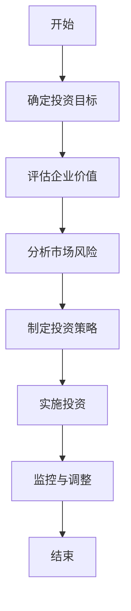
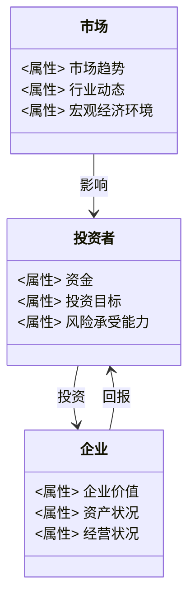

                 


# 彼得林奇的"耐心资本"投资理念

> **关键词**: 投资理念, 耐心资本, 彼得林奇, 风险管理, 长期投资, 价值投资, 股票分析

> **摘要**: 本文深入探讨了彼得林奇的“耐心资本”投资理念，分析其核心概念、算法原理、系统架构，并通过实际案例展示了如何在项目中应用这些理念。文章旨在帮助读者理解耐心资本的内在逻辑，掌握其在投资决策中的应用方法。

---

# 目录

1. **背景介绍**  
   1.1 耐心资本的定义与核心概念  
   1.2 彼得林奇的投资理念背景  
   1.3 耐心资本与传统投资理念的区别  

2. **核心概念与联系**  
   2.1 耐心资本的原理分析  
   2.2 耐心资本的ER实体关系图  

3. **算法原理**  
   3.1 耐心资本的数学模型  
   3.2 耐心资本的算法流程  

4. **系统分析与架构设计**  
   4.1 问题场景介绍  
   4.2 系统功能设计  

5. **项目实战**  
   5.1 环境安装与配置  
   5.2 核心代码实现  
   5.3 实际案例分析  

6. **最佳实践与总结**  
   6.1 小结与注意事项  
   6.2 拓展阅读与深入思考  

---

## 正文

### 1. 背景介绍

#### 1.1 耐心资本的定义与核心概念

耐心资本是一种长期投资策略，强调投资者应以耐心和长期视角看待投资，而非频繁交易或追求短期收益。其核心理念是通过深入分析企业基本面，选择具有长期增长潜力的公司进行投资。

**核心概念：**

- **长期持有**：耐心资本要求投资者在较长的时间内持有优质资产，避免因短期波动而做出错误决策。
- **价值投资**：关注企业的内在价值，而非市场的短期波动。
- **风险管理**：通过分散投资和严格的风险评估，降低投资组合的整体风险。

#### 1.2 彼得林奇的投资理念背景

彼得·林奇是美国著名投资经理人，以其成功的投资业绩和独特的投资理念闻名。他主张通过深入研究和长期持有优质股票，实现财富的稳步增长。他的投资理念强调基本面分析和对管理层的信任，认为优秀的企业能够为股东创造长期价值。

#### 1.3 耐心资本与传统投资理念的区别

传统的投资理念往往侧重于短期收益和技术分析，而耐心资本则强调长期持有和价值发现。以下是两者的区别：

| **比较维度** | **传统投资理念** | **耐心资本理念** |
|--------------|------------------|-------------------|
| 时间跨度     | 短期（1-3年）    | 长期（5年以上）   |
| 分析方法     | 技术分析为主     | 基本面分析为主    |
| 投资策略     | 频繁交易         | 长期持有          |

---

### 2. 核心概念与联系

#### 2.1 耐心资本的原理分析

耐心资本的原理基于以下几点：

- **复利效应**：长期持有优质资产能够带来复利效应，使投资收益呈指数级增长。
- **市场波动**：短期市场波动不可预测，但优质企业的长期价值是可衡量的。
- **价值发现**：通过深入分析企业的财务状况、管理层能力和行业地位，识别具有成长潜力的企业。

**数学模型：**

耐心资本的回报率可以通过以下公式计算：

$$ ROI = \frac{（最终价值 - 初始投资）}{初始投资} \times 100\% $$

其中，最终价值包括股息再投资、资本增值等。

#### 2.2 耐心资本的ER实体关系图

以下是一个简化的ER图，展示了耐心资本涉及的主要实体及其关系：

```mermaid
erDiagram
    投资者 [投资者ID, 资金, 风险承受能力] 
    企业 [企业ID, 企业价值, 资产状况, 经营状况]
    市场 [市场ID, 市场趋势, 行业动态, 宏观经济环境]
    投资者 --> 企业 : 持股
    企业 --> 投资者 : 股息
    市场 --> 投资者 : 影响
```

---

### 3. 算法原理

#### 3.1 耐心资本的数学模型

耐心资本的数学模型主要用于评估企业的内在价值和投资风险。以下是一个简化的企业价值评估模型：

$$ 企业价值 = 营业收入 \times (净利润率 \times 投资资本回报率) $$

其中，净利润率和投资资本回报率是衡量企业盈利能力的关键指标。

#### 3.2 耐心资本的算法流程

以下是一个耐心资本投资的流程图：



---

### 4. 系统分析与架构设计

#### 4.1 问题场景介绍

在实际投资中，投资者需要解决以下问题：

- 如何快速获取企业的基本面数据？
- 如何评估企业的长期成长潜力？
- 如何制定和调整投资策略？

#### 4.2 系统功能设计

以下是一个系统的功能设计图：



---

### 5. 项目实战

#### 5.1 环境安装与配置

为了实现耐心资本的投资策略，我们需要安装以下工具：

- 数据分析工具：Python、Pandas、NumPy
- 可视化工具：Matplotlib、Seaborn
- 数据源：Yahoo Finance API

#### 5.2 核心代码实现

以下是一个Python代码示例，用于分析企业的财务数据：

```python
import pandas as pd
import numpy as np
import yfinance as yf

# 下载股票数据
def get_stock_data(ticker, start_date, end_date):
    data = yf.download(ticker, start=start_date, end=end_date)
    return data['Adj Close']

# 计算移动平均线
def calculate_rolling_mean(data, window):
    return data.rolling(window).mean()

# 示例
if __name__ == "__main__":
    ticker = 'AAPL'
    start_date = '2020-01-01'
    end_date = '2023-01-01'
    stock_data = get_stock_data(ticker, start_date, end_date)
    rolling_mean = calculate_rolling_mean(stock_data, 20)
    print(rolling_mean)
```

---

### 6. 最佳实践与总结

#### 6.1 小结与注意事项

耐心资本是一种长期投资策略，需要投资者具备耐心和纪律性。在实际操作中，投资者应：

- 深入研究企业的基本面
- 分散投资以降低风险
- 避免频繁交易

#### 6.2 拓展阅读与深入思考

建议读者进一步阅读以下书籍，深入了解耐心资本的投资理念：

- 《彼得·林奇的成功投资》
- 《股票作手回忆录》
- 《投资学原理》

---

**作者：AI天才研究院/AI Genius Institute & 禅与计算机程序设计艺术 /Zen And The Art of Computer Programming**

