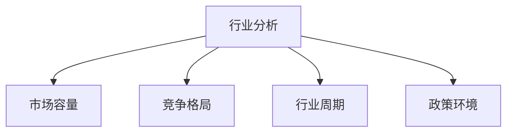
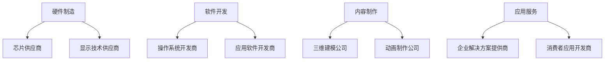

                 

# 彼得林奇的"行业分析"在混合现实产业中的调整

> 关键词：彼得·林奇、行业分析、混合现实、技术调整、投资策略

> 摘要：本文探讨了彼得·林奇的行业分析方法在混合现实产业中的应用，详细分析了混合现实产业的独特属性，并提出了相应的调整策略。通过实际案例和系统架构设计，展示了如何将彼得·林奇的行业分析方法与混合现实产业的特点相结合，以实现更有效的投资和战略决策。

---

# 第一部分: 彼得·林奇的行业分析方法概述

## 第1章: 彼得·林奇行业分析的核心理念

### 1.1 彼得·林奇行业分析的核心理念

#### 1.1.1 行业分析的基本概念
行业分析是投资决策中的关键步骤，通过研究行业的市场结构、竞争格局、增长潜力和风险因素，投资者可以更好地评估企业的投资价值。彼得·林奇在其投资实践中，强调了行业分析的重要性，认为行业分析是企业基本面分析的基础。

**行业分析的核心要素：**
- **市场容量**：行业的市场规模和增长潜力。
- **竞争格局**：行业内主要企业的市场份额和竞争优势。
- **行业周期**：行业的生命周期阶段（初创期、成长期、成熟期、衰退期）。
- **政策环境**：政府政策对行业的影响。

**Mermaid 行业分析框架图：**

#### 1.1.2 彼得·林奇的行业分析框架
彼得·林奇的行业分析框架包括以下几个步骤：
1. **确定行业的基本属性**：了解行业的定义、市场规模和增长潜力。
2. **分析竞争格局**：识别行业内主要竞争对手及其市场份额。
3. **评估行业周期**：判断行业所处的生命周期阶段。
4. **考虑政策影响**：分析政府政策对行业的影响。

#### 1.1.3 行业分析的核心要素
行业分析的核心要素包括市场容量、竞争格局、行业周期和政策环境。这些要素共同决定了行业的投资价值和风险。

### 1.2 彼得·林奇行业分析的哲学基础

#### 1.2.1 投资中的"知行合一"
彼得·林奇强调投资中的"知行合一"，即理论与实践相结合。他认为，行业分析不仅仅是对行业数据的分析，更需要结合实际情况，灵活调整分析框架。

#### 1.2.2 行业分析与企业基本面的关系
行业分析是企业基本面分析的基础。一个企业的投资价值不仅取决于其自身的财务状况，还与其所处行业的市场环境密切相关。

#### 1.2.3 长期投资视角下的行业分析
彼得·林奇提倡长期投资，他认为行业分析需要从长期视角出发，关注行业的长期发展趋势和潜在风险。

---

## 第2章: 混合现实产业的背景与现状

### 2.1 混合现实产业的基本概念

#### 2.1.1 混合现实的定义与特点
混合现实（Mixed Reality，MR）是增强现实（AR）和虚拟现实（VR）的结合，通过将虚拟信息与真实环境相结合，创造一个融合的数字环境。

**混合现实的特点：**
- **沉浸性**：用户可以与虚拟对象进行互动。
- **实时性**：混合现实需要实时渲染和计算。
- **空间性**：混合现实依赖于空间定位和环境感知。

#### 2.1.2 混合现实产业链的构成
混合现实产业链包括硬件制造、软件开发、内容制作和应用服务四个环节。

**Mermaid 混合现实产业链图：**

#### 2.1.3 混合现实与相关技术的对比分析
混合现实与增强现实和虚拟现实的主要区别在于其融合性。AR主要叠加虚拟信息到真实环境中，而VR则是完全虚拟环境，混合现实则是两者的结合。

---

## 第3章: 彼得·林奇行业分析方法的调整策略

### 3.1 混合现实产业的独特属性

#### 3.1.1 技术驱动型行业的特点
混合现实产业是一个技术驱动型行业，其发展主要依赖于技术创新。技术的快速迭代和更新使得行业分析需要具备高度的前瞻性。

#### 3.1.2 混合现实产业的周期性分析
混合现实产业目前处于初创期，市场容量较小，但增长潜力巨大。投资者需要关注行业的周期性变化，避免在行业衰退期进入。

#### 3.1.3 混合现实产业的政策影响
政府政策对混合现实产业的发展有重要影响。例如，政策支持可以促进技术创新和市场扩展，而政策限制则可能抑制行业发展。

### 3.2 行业分析框架的调整策略

#### 3.2.1 从传统行业分析到混合现实产业的转变
在传统行业分析中，彼得·林奇更关注企业的财务数据和市场容量。而在混合现实产业中，还需要考虑技术的前沿性和创新性。

#### 3.2.2 混合现实产业的动态变化分析
混合现实产业的技术更新速度快，行业分析需要具备高度的动态性。投资者需要密切关注技术趋势和市场变化，及时调整分析框架。

#### 3.2.3 行业分析中的技术预见性
由于混合现实产业的技术驱动性，行业分析需要具备一定的技术预见性。投资者需要预测未来的技术发展方向，并据此调整投资策略。

---

## 第4章: 竞争分析的调整

### 4.1 混合现实产业的竞争格局

#### 4.1.1 主要竞争者的分析
混合现实产业的主要竞争者包括苹果、微软、谷歌和Facebook等科技巨头。这些企业在硬件、软件和内容开发方面都有较强的实力。

#### 4.1.2 混合现实产业的技术壁垒
混合现实技术涉及硬件、软件和内容开发等多个领域，技术壁垒较高。企业需要在多个技术领域具备竞争优势。

#### 4.1.3 混合现实产业的市场集中度
目前，混合现实产业的市场集中度较低，但随着技术的发展和市场的扩展，市场集中度可能会逐步提高。

### 4.2 竞争分析的调整策略

#### 4.2.1 竞争对手的技术路线分析
在混合现实产业中，竞争对手的技术路线差异较大。投资者需要分析竞争对手的技术发展方向，并据此制定投资策略。

#### 4.2.2 混合现实产业的创新驱动力
混合现实产业的创新驱动力主要来自技术突破和市场需求。投资者需要关注技术创新和市场需求的变化，及时调整竞争分析框架。

#### 4.2.3 竞争分析中的动态平衡
由于混合现实产业的技术和市场变化迅速，竞争分析需要保持动态平衡。投资者需要定期更新分析框架，确保其与行业变化保持一致。

---

## 第5章: 财务指标与风险管理的调整

### 5.1 混合现实产业的财务指标调整

#### 5.1.1 财务指标的核心要素
在混合现实产业中，财务指标的核心要素包括收入增长、利润率、研发投入和资本支出。

#### 5.1.2 财务指标的动态调整
由于混合现实产业的技术驱动性，财务指标需要动态调整。投资者需要关注企业的研发投入和技术创新能力，而不是仅仅关注短期财务表现。

### 5.2 风险管理策略

#### 5.2.1 技术风险的管理
混合现实产业的技术风险较高，投资者需要制定有效的风险管理策略，如分散投资和风险对冲。

#### 5.2.2 市场风险的管理
市场风险是混合现实产业的主要风险之一。投资者需要通过市场研究和风险评估，制定相应的风险管理策略。

#### 5.2.3 投资策略的优化
在混合现实产业中，投资策略需要进行优化。投资者可以采用组合投资和长期投资策略，以降低投资风险并提高收益。

---

## 第6章: 总结与展望

### 6.1 总结

彼得·林奇的行业分析方法在混合现实产业中具有重要的应用价值。通过调整分析框架和策略，投资者可以更好地把握行业发展趋势和市场机会。

### 6.2 展望

随着混合现实技术的不断发展，行业分析的方法和策略也需要不断创新和调整。未来，投资者需要更加关注技术趋势和市场变化，灵活调整投资策略，以应对行业的快速变化。

---

# 作者信息

作者：AI天才研究院/AI Genius Institute & 禅与计算机程序设计艺术 /Zen And The Art of Computer Programming

