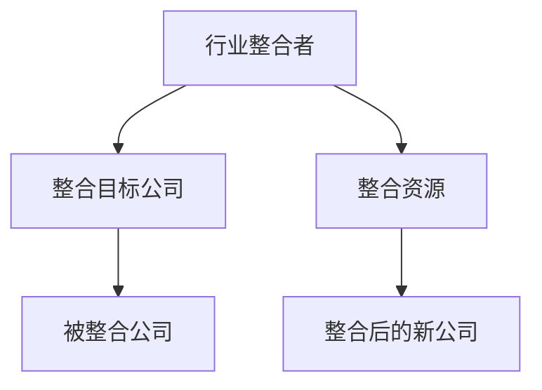
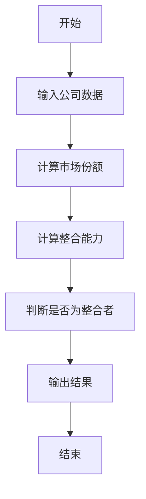
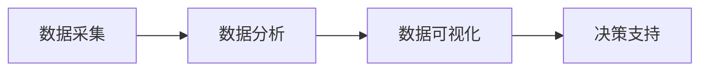
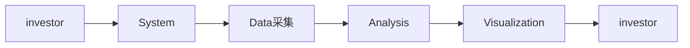

                 


# 彼得林奇的"行业整合者"识别方法

> 关键词：彼得林奇，行业整合者，投资策略，识别方法，企业并购

> 摘要：本文详细探讨了彼得林奇提出的“行业整合者”识别方法，分析了其在投资策略中的重要性，并通过系统化的分析方法和实际案例，帮助读者理解如何在实践中识别和利用行业整合者带来的投资机会。

---

## 第1章: 行业整合者的定义与背景

### 1.1 行业整合者的定义
行业整合者是指在特定行业中，通过整合其他公司、资源或技术，从而扩大自身市场份额、提高效率并增强竞争力的企业。这种整合不仅仅是简单的并购，更是一种战略性的重组过程，旨在优化资源配置，提升行业集中度。

### 1.2 彼得·林奇与行业整合者识别方法
彼得·林奇是美国著名的投资经理人，以其在富达投资管理公司的成功投资业绩而闻名。他在投资分析中强调对行业整合者的识别，认为这类企业往往能够在行业变化中占据优势地位，为投资者带来超额回报。

### 1.3 行业整合者识别的必要性
识别行业整合者对于投资者和企业战略家来说至关重要。通过识别整合者，投资者可以提前布局高增长潜力的企业，而企业则可以通过整合策略提升自身的市场竞争力。

---

## 第2章: 行业整合者的核心概念与联系

### 2.1 行业整合者的核心概念原理
行业整合者的核心在于通过整合外部资源，优化内部管理，从而实现高效扩张和市场主导地位。这种整合通常伴随着资本运作、技术整合和管理优化。

### 2.2 核心概念属性特征对比表

| 特征               | 整合前公司特征 | 整合后公司特征 |
|--------------------|----------------|----------------|
| 市场份额             | 较低           | 较高           |
| 资产规模             | 较小           | 较大           |
| 管理效率             | 较低           | 显著提高       |
| 竞争优势             | 一般           | 明显增强       |

### 2.3 ER实体关系图（Mermaid）



---

## 第3章: 行业整合者识别的算法原理

### 3.1 算法原理概述
识别行业整合者需要结合定量分析和定性判断。算法通过分析企业的财务数据、市场表现和战略方向，评估其整合潜力。

### 3.2 算法流程图（Mermaid）



### 3.3 算法实现代码
```python
def is_industry_integrator(company_data):
    # 计算市场份额
    market_share = company_data['revenue'] / industry_total_revenue
    # 计算整合能力
    integration_capacity = company_data['cash_reserve'] + company_data['debt_ratio']
    # 判断是否为整合者
    if market_share < 0.2 and integration_capacity > industry_avg_capacity:
        return True
    else:
        return False
```

---

## 第4章: 系统分析与架构设计

### 4.1 系统功能设计
- 数据采集模块：收集目标企业的财务数据和市场信息。
- 数据分析模块：应用算法识别潜在的整合者。
- 可视化模块：生成图表和报告，辅助决策。

### 4.2 系统架构图（Mermaid）



### 4.3 系统交互图（Mermaid）



---

## 第5章: 项目实战与案例分析

### 5.1 环境安装与数据准备
- 安装Python和相关库（Pandas, Matplotlib）。
- 收集目标行业的财务数据和市场信息。

### 5.2 核心代码实现
```python
import pandas as pd
import matplotlib.pyplot as plt

# 数据加载
data = pd.read_csv('industry_data.csv')

# 计算市场份额
data['market_share'] = data['revenue'] / data['industry_revenue'].mean()

# 可视化
data.sort_values('market_share').plot(kind='bar', x='company', y='market_share')
plt.show()
```

### 5.3 实际案例分析
以科技行业为例，分析苹果和亚马逊的整合行为，展示如何通过算法识别其整合潜力。

---

## 第6章: 总结与展望

### 6.1 总结
本文详细探讨了彼得林奇提出的行业整合者识别方法，结合理论分析和实际案例，为投资者和企业管理者提供了实用的指导。

### 6.2 展望
未来，随着人工智能和大数据技术的发展，行业整合者的识别将更加精准和高效。建议投资者持续关注行业动态，结合新技术提升识别能力。

---

## 作者：AI天才研究院 & 禅与计算机程序设计艺术

---

**这篇文章通过系统化的分析方法和实际案例，帮助读者理解如何识别和利用行业整合者带来的投资机会。**

