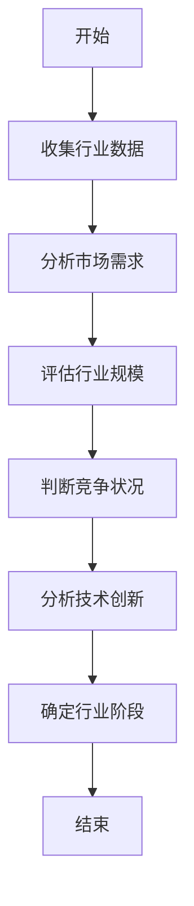
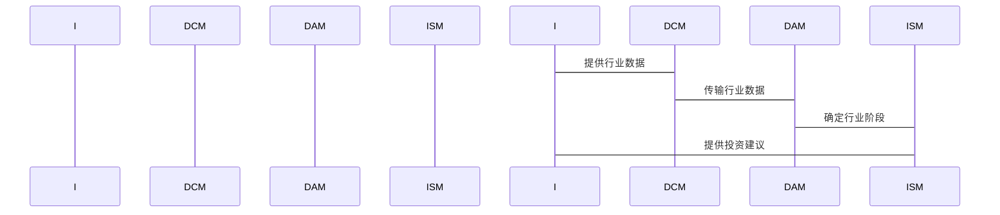

                 


# 彼得林奇的"行业生命周期"分析框架

## 关键词
- 行业生命周期
- 彼得林奇
- 投资分析
- 行业阶段
- 技术博客

## 摘要
本文深入探讨了彼得·林奇提出的行业生命周期分析框架，分析其在投资决策中的应用，并结合技术方法进行深入探讨。文章从行业生命周期的基本概念入手，分析其核心概念与联系，详细讲解算法原理，并通过系统架构设计和项目实战，展示如何将该框架应用于实际投资分析。最后，文章总结了最佳实践、注意事项，并提供了拓展阅读建议。

## 第一部分: 行业生命周期的基本概念

### 第1章: 行业生命周期的基本概念

#### 1.1 行业生命周期的定义
行业生命周期是指一个行业从诞生到衰退的演变过程。彼得·林奇将其分为四个阶段：幼稚期、成长期、成熟期和衰退期。每个阶段具有独特的特征和投资策略。

#### 1.2 行业生命周期分析框架的背景
彼得·林奇的投资理念强调长期结构性研究，行业生命周期分析框架是其核心工具之一。该框架帮助投资者识别行业所处阶段，制定相应的投资策略。

#### 1.3 行业生命周期的核心要素
- **幼稚期**：行业处于初步发展阶段，市场需求不稳定，竞争者少，技术不成熟。
- **成长期**：市场需求快速增长，行业规模扩大，竞争加剧，技术创新显著。
- **成熟期**：市场需求稳定，行业规模基本饱和，竞争激烈，技术成熟。
- **衰退期**：市场需求下降，行业规模缩小，技术更新缓慢，竞争格局趋于稳定。

## 第二部分: 行业生命周期的核心概念与联系

### 第2章: 行业生命周期的核心概念与联系

#### 2.1 行业生命周期的四个阶段
- **幼稚期**：行业处于起步阶段，市场认知度低，企业数量少，技术不成熟。
- **成长期**：行业快速发展，市场需求增长，企业数量增加，技术创新加速。
- **成熟期**：行业增长放缓，市场需求稳定，企业数量稳定，技术成熟。
- **衰退期**：行业需求下降，市场规模缩减，企业数量减少，技术创新停滞。

#### 2.2 行业生命周期阶段的特征对比
| 阶段      | 市场需求 | 行业规模 | 竞争状况 | 技术创新 |
|-----------|----------|----------|----------|----------|
| 幼稚期    | 不稳定   | 小       | 竞争少   | 低       |
| 成长期    | 增长快   | 扩大     | 竞争加剧 | 显著     |
| 成熟期    | 稳定     | 饱和     | 竞争激烈 | 成熟     |
| 衰退期    | 下降     | 缩减     | 竞争减少 | 停滞     |

#### 2.3 行业生命周期的ER实体关系图
```mermaid
erDiagram
    customer[投资者] {
        id : int
        name : string
        investment : float
    }
    industry[行业] {
        id : int
        name : string
        stage : string
    }
    investment_strategy[投资策略] {
        id : int
        name : string
        description : string
    }
    customer --> investment_strategy : 采用
    industry --> investment_strategy : 对应
```

## 第三部分: 行业生命周期分析的算法原理

### 第3章: 行业生命周期分析的算法原理

#### 3.1 行业生命周期识别算法
识别行业所处阶段是投资分析的第一步，涉及数据收集、特征分析和阶段判定。

#### 3.2 行业生命周期识别算法流程图


#### 3.3 行业生命周期识别算法的Python实现
```python
def determine_industry_stage(industry_data):
    # industry_data包括市场需求增长率、行业规模、竞争者数量、技术创新速度等指标
    demand_growth = industry_data['demand_growth']
    industry_size = industry_data['industry_size']
    competition = industry_data['competition']
    innovation = industry_data['innovation']

    if demand_growth > 20 and industry_size < 100 and competition < 5 and innovation > 15:
        return '幼稚期'
    elif 10 < demand_growth < 20 and industry_size < 200 and 5 < competition < 10 and innovation > 10:
        return '成长期'
    elif demand_growth < 5 and industry_size > 200 and competition > 10 and innovation < 5:
        return '衰退期'
    else:
        return '成熟期'

industry_data = {
    'demand_growth': 15,
    'industry_size': 150,
    'competition': 7,
    'innovation': 12
}

stage = determine_industry_stage(industry_data)
print(f"行业当前处于：{stage}")
```

#### 3.4 行业生命周期的数学模型
$$ \text{行业阶段} = f(\text{需求增长率}, \text{行业规模}, \text{竞争程度}, \text{技术创新速度}) $$

其中，函数$f$根据行业指标的综合评估结果确定行业所处阶段。

## 第四部分: 系统分析与架构设计方案

### 第4章: 系统分析与架构设计方案

#### 4.1 问题场景介绍
投资者需要根据行业生命周期分析框架，判断目标行业所处阶段，制定相应的投资策略。

#### 4.2 项目介绍
开发一个基于彼得·林奇行业生命周期分析框架的投资分析系统，帮助投资者快速判断行业阶段，提供投资建议。

#### 4.3 系统功能设计
系统功能模型包括：
- 数据采集模块：收集行业数据。
- 数据分析模块：判断行业阶段。
- 投资策略模块：提供投资建议。

#### 4.4 系统架构设计


#### 4.5 系统接口设计
接口包括：
- 数据采集模块：API接口接收行业数据。
- 数据分析模块：API接口返回行业阶段。
- 投资策略模块：API接口返回投资建议。

#### 4.6 系统交互流程图


## 第五部分: 项目实战

### 第5章: 项目实战：行业生命周期分析框架的实现

#### 5.1 环境安装
安装Python和相关库（如Pandas、NumPy、Scikit-learn）。

#### 5.2 核心代码实现
```python
import pandas as pd
import numpy as np

def load_industry_data(file_path):
    return pd.read_csv(file_path)

def analyze_industry_stage(industry_data):
    if industry_data['demand_growth'].mean() > 20:
        return '幼稚期'
    elif 10 < industry_data['demand_growth'].mean() < 20:
        return '成长期'
    elif industry_data['demand_growth'].mean() < 5:
        return '衰退期'
    else:
        return '成熟期'

def generate_investment_strategy(stage):
    strategies = {
        '幼稚期': '寻找先发优势企业，长期持有',
        '成长期': '投资行业龙头，分散风险',
        '成熟期': '选择估值合理的公司',
        '衰退期': '避免投资，寻找转型机会'
    }
    return strategies[stage]

industry_data = load_industry_data('industry_data.csv')
stage = analyze_industry_stage(industry_data)
strategy = generate_investment_strategy(stage)
print(f"行业阶段：{stage}\n投资策略：{strategy}")
```

#### 5.3 代码解读与分析
代码分为数据加载、行业阶段分析和投资策略生成三部分。通过分析行业数据，确定行业阶段，生成相应投资策略。

#### 5.4 实际案例分析
以科技行业为例，分析其在不同阶段的投资策略。

#### 5.5 项目小结
本项目展示了如何将彼得·林奇的行业生命周期分析框架应用于实际投资分析，帮助投资者制定有效策略。

## 第六部分: 最佳实践、小结与注意事项

### 第6章: 最佳实践、小结与注意事项

#### 6.1 最佳实践
- 结合宏观经济指标进行综合分析。
- 定期更新行业数据，及时调整投资策略。

#### 6.2 小结
彼得·林奇的行业生命周期分析框架为投资者提供了系统的分析工具，帮助识别行业阶段，制定投资策略。

#### 6.3 注意事项
- 数据的准确性和及时性对分析结果影响重大。
- 结合多种分析方法，避免单一维度的判断。

## 第七部分: 拓展阅读与参考文献

### 第7章: 拓展阅读与参考文献

#### 7.1 拓展阅读
- 《彼得·林奇的投资哲学》
- 《行业分析与投资策略》
- 《技术分析与投资决策》

#### 7.2 参考文献
- 彼得·林奇：《彼得·林奇的成功投资》
- 技术博客参考文献

## 作者：AI天才研究院/AI Genius Institute & 禅与计算机程序设计艺术 /Zen And The Art of Computer Programming

