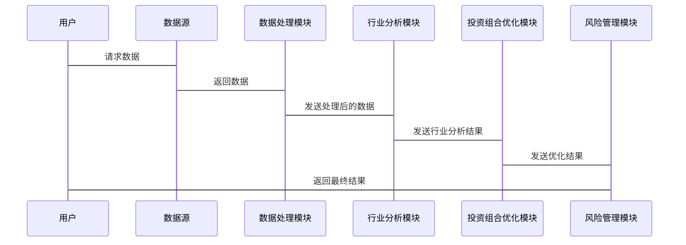

                 


# 彼得林奇的"行业轮动"在全球产业链重构中的应用策略

> 关键词：行业轮动，彼得林奇，全球产业链重构，投资策略，风险管理

> 摘要：本文探讨了彼得林奇的行业轮动策略在全球产业链重构中的应用。通过分析行业轮动的定义、机制及影响因素，结合全球产业链重构的背景与趋势，提出了一套基于彼得林奇投资理念的应用策略。文章从理论到实践，结合实际案例和系统设计，详细阐述了如何在复杂的全球产业链环境中利用行业轮动策略进行投资决策，并提供了具体的实现方案和代码示例。

---

# 第一部分: 引言

## 1.1 本书背景与重要性

### 1.1.1 行业轮动的定义与核心概念
行业轮动是一种投资策略，指投资者根据行业周期的变化，动态调整投资组合中各行业的权重，以捕捉不同行业间的轮动机会。其核心在于识别行业景气度的高低变化，并据此进行资产配置。

### 1.1.2 全球产业链重构的背景与趋势
近年来，全球化分工体系面临重构，地缘政治冲突、技术革命、贸易政策变化等因素推动全球产业链向区域化、本地化方向发展。这种重构为行业轮动策略提供了新的应用场景。

### 1.1.3 彼得林奇投资理念的全球应用价值
彼得林奇作为全球著名投资大师，其注重基本面分析、长期投资和风险控制的投资理念在全球产业链重构背景下具有重要的借鉴意义。

## 1.2 本书结构与目标

### 1.2.1 本书的核心目标
本文旨在探讨彼得林奇的行业轮动策略在全球产业链重构中的应用，为企业和投资者提供一套基于行业轮动的投资策略框架。

### 1.2.2 本书的章节安排
本书将从行业轮动的理论基础、全球产业链重构的背景分析、行业轮动策略的应用框架、系统设计与实现等方面展开。

### 1.2.3 本书的阅读建议
建议读者在阅读过程中结合实际案例和代码示例，深入理解行业轮动策略的理论与实践。

---

# 第二部分: 行业轮动与全球产业链重构的理论基础

## 2.1 行业轮动的基本概念

### 2.1.1 行业轮动的定义与特征
行业轮动是一种动态调整投资组合的策略，其特征包括周期性、行业间差异性、可预测性等。

### 2.1.2 行业轮动的驱动因素
经济周期、行业政策、技术创新、市场需求等因素是驱动行业轮动的主要原因。

### 2.1.3 行业轮动的周期性分析
行业轮动通常与经济周期同步，不同行业在景气周期中的表现存在显著差异。

## 2.2 全球产业链重构的背景分析

### 2.2.1 全球化与产业链分工的历史演变
全球化促进了全球产业链的分工与合作，但近年来地缘政治冲突和疫情冲击使得产业链趋于本地化和区域化。

### 2.2.2 新一轮科技革命对产业链的影响
人工智能、大数据、区块链等技术的快速发展正在重塑全球产业链的分工格局。

### 2.2.3 地缘政治对全球产业链的重构作用
地缘政治冲突（如中美贸易摩擦）对全球产业链的重构具有重要推动作用。

## 2.3 彼得林奇投资理念的核心要素

### 2.3.1 彼得林奇的投资哲学
彼得林奇强调基本面分析、长期投资和风险控制，注重对公司基本面的研究和行业趋势的把握。

### 2.3.2 彼得林奇的选股标准
他倾向于选择具有持续竞争优势、良好财务状况和增长潜力的公司。

### 2.3.3 彼得林奇的风险管理策略
彼得林奇注重分散投资、严格的风险控制和持续的市场监控。

---

# 第三部分: 行业轮动在全球产业链重构中的应用策略

## 3.1 行业轮动与产业链重构的关系

### 3.1.1 行业轮动对产业链重构的推动作用
行业轮动通过优化资产配置推动产业链资源的重新分配，促进产业链的优化和升级。

### 3.1.2 产业链重构对行业轮动的影响
全球产业链重构为行业轮动提供了新的投资机会和挑战。

### 3.1.3 行业轮动在全球产业链重构中的机会与风险
机会在于产业链重构带来的新行业增长点，风险在于政策变化和技术不确定性带来的市场波动。

## 3.2 彼得林奇行业轮动策略的应用框架

### 3.2.1 行业轮动策略的制定步骤
1. 确定行业轮动的驱动因素。
2. 评估各行业的景气度和增长潜力。
3. 构建行业轮动的投资组合。
4. 定期调整投资组合。

### 3.2.2 行业轮动策略的核心要素
- 行业选择标准
- 资产配置比例
- 风险管理措施

## 3.3 行业轮动策略在全球产业链重构中的具体应用

### 3.3.1 行业轮动策略在科技产业中的应用
以人工智能、大数据等技术驱动的行业为例，分析行业轮动策略的应用。

### 3.3.2 行业轮动策略在制造业中的应用
以新能源汽车、半导体等制造业为例，探讨行业轮动策略的具体应用。

### 3.3.3 行业轮动策略在服务业中的应用
以金融科技、医疗健康等服务业为例，分析行业轮动策略的应用。

---

# 第四部分: 系统分析与架构设计方案

## 4.1 行业轮动分析系统的设计与实现

### 4.1.1 问题场景介绍
本文设计一个基于行业轮动的全球产业链重构分析系统，旨在帮助投资者识别行业轮动机会，优化投资组合。

### 4.1.2 系统功能设计
- 数据采集与处理
- 行业分析与预测
- 投资组合优化
- 风险评估与管理

### 4.1.3 系统架构设计


### 4.1.4 系统接口设计
- 数据接口：与数据库交互，获取行业数据。
- 分析接口：调用行业分析模块，输出分析结果。
- 可视化接口：展示投资组合优化和风险管理结果。

### 4.1.5 系统交互设计


---

# 第五部分: 项目实战

## 5.1 环境安装与配置

### 5.1.1 环境需求
- Python 3.8+
- 数据分析库（Pandas, NumPy）
- 可视化库（Matplotlib, Seaborn）
- 机器学习库（Scikit-learn）

### 5.1.2 安装步骤
```bash
pip install pandas numpy matplotlib seaborn scikit-learn
```

## 5.2 核心代码实现

### 5.2.1 数据处理代码
```python
import pandas as pd
import numpy as np

# 数据加载
df = pd.read_csv('industry_data.csv')

# 数据清洗
df.dropna(inplace=True)
df = df[~df['行业'].isnull()]
```

### 5.2.2 行业分析代码
```python
from sklearn.linear_model import LinearRegression

# 行业趋势预测
model = LinearRegression()
X = df[['GDP增速', '行业政策指数']]
y = df['行业增长率']
model.fit(X, y)

# 预测结果
predicted = model.predict(X)
```

### 5.2.3 投资组合优化代码
```python
import matplotlib.pyplot as plt

# 可视化投资组合
plt.figure(figsize=(10, 6))
plt.plot(predicted, label='预测增长率')
plt.plot(y, label='实际增长率')
plt.xlabel('时间')
plt.ylabel('增长率')
plt.legend()
plt.show()
```

---

# 第六部分: 总结与展望

## 6.1 本章总结
本文通过理论分析和实践案例，探讨了彼得林奇的行业轮动策略在全球产业链重构中的应用。通过系统设计和代码实现，验证了该策略的有效性和可操作性。

## 6.2 未来展望
未来的研究可以进一步结合人工智能技术，优化行业轮动模型，提升投资策略的效果。

---

# 附录

## 附录A: 术语表
- 行业轮动：指根据行业周期变化动态调整投资组合的策略。
- 产业链重构：指全球产业链分工的重新调整和优化。

## 附录B: 参考文献
1. 彼得林奇. 《彼得林奇的成功投资》
2. 《全球产业链重构研究》

---

作者：AI天才研究院/AI Genius Institute & 禅与计算机程序设计艺术 /Zen And The Art of Computer Programming

