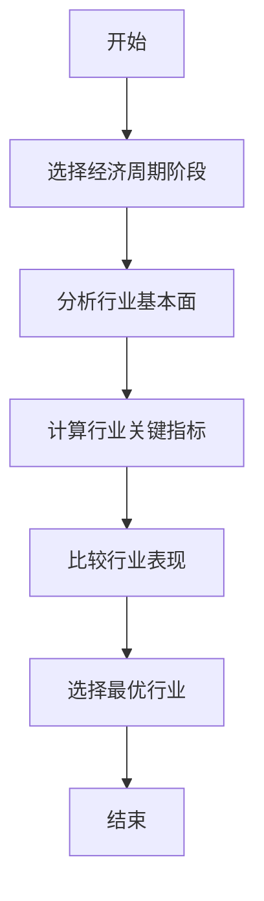

                 


# 彼得林奇的"行业轮动"在全球化背景下的策略

> **关键词**：彼得林奇，行业轮动，全球化，投资策略，经济周期，投资模型  
> **摘要**：本文深入分析了彼得林奇的行业轮动策略在全球化背景下的应用，探讨了行业轮动的基本原理、全球化对投资策略的影响，以及如何构建支持行业轮动的投资系统。文章结合实际案例和数学模型，详细阐述了行业轮动的实现方法，并提供了系统架构设计和项目实战指导。

---

## 第一章：彼得林奇投资理念概述

### 1.1 彼得林奇的生平与投资风格

#### 1.1.1 彼得林奇的生平简介
彼得·林奇（Peter Lynch）是美国著名的投资专家，被誉为“股神”之一。他在富达投资集团（Fidelity）管理麦哲伦基金期间取得了卓越的投资业绩，基金规模从1977年的2000万美元增长到1990年的140亿美元。他的投资理念以“逆向思维”和“价值发现”为核心，注重长期投资和对企业的深入研究。

#### 1.1.2 彼得林奇的投资理念
彼得林奇强调投资的长期性，主张买入并持有优质股票。他认为，成功的投资取决于对企业基本面的深入分析，包括企业的财务状况、行业地位和竞争优势。他还提出“行业轮动”策略，认为不同行业在经济周期中的表现不同，投资者可以通过行业轮动在不同阶段选择最优的投资标的。

#### 1.1.3 彼得林奇的成功案例
彼得林奇在管理麦哲伦基金期间，成功投资了许多优质企业，如可口可乐、英特尔等。他的投资策略不仅帮助投资者实现了超额收益，也为投资理论的发展做出了重要贡献。

---

### 1.2 行业轮动策略的基本概念

#### 1.2.1 行业轮动的定义
行业轮动是指在不同的经济周期阶段，投资者根据行业表现的差异性，选择具有较高增长潜力的行业进行投资，以实现超额收益。行业轮动的核心在于对经济周期的准确判断和对行业基本面的深入分析。

#### 1.2.2 行业轮动的基本原理
行业轮动的原理基于经济周期的波动性。在不同的经济周期阶段，不同行业的表现会出现显著差异。例如，在经济衰退期，防御性行业（如公用事业、医疗保健）表现相对较好，而在经济复苏期，周期性行业（如房地产、汽车制造）则可能表现更优。

#### 1.2.3 行业轮动在投资中的作用
行业轮动策略可以帮助投资者在不同经济周期中优化资产配置，降低投资风险，同时捕捉行业增长的潜在机会。通过行业轮动，投资者可以避免在单一行业上过度集中，从而实现更稳健的投资回报。

---

### 1.3 全球化背景下的投资策略

#### 1.3.1 全球化对投资策略的影响
全球化背景下，资本的流动性增强，行业轮动的范围也从单一市场扩展到全球市场。投资者可以通过全球化视角，选择具有竞争优势的跨国企业或新兴市场中的优质行业进行投资。

#### 1.3.2 全球化背景下的行业轮动特点
全球化背景下，行业轮动策略需要考虑的因素更加复杂。投资者需要关注全球宏观经济趋势、国际贸易政策变化以及不同国家和地区的行业发展趋势。

#### 1.3.3 全球化背景下行业轮动的挑战与机遇
全球化为行业轮动提供了更多机会，但也带来了更大的挑战。例如，汇率波动、政策变化和地缘政治风险等因素可能对行业轮动策略产生重大影响。

---

## 第二章：行业轮动的核心概念与联系

### 2.1 行业轮动的原理与机制

#### 2.1.1 经济周期与行业轮动的关系
经济周期的波动性是行业轮动的核心驱动因素。在不同的经济周期阶段，行业轮动的策略也会有所不同。例如，在经济繁荣期，周期性行业表现较好；而在经济衰退期，防御性行业可能更具有投资价值。

#### 2.1.2 行业轮动的驱动因素
行业轮动的驱动因素包括宏观经济环境、行业基本面、政策变化、技术进步等。这些因素共同作用，决定了不同行业在经济周期中的表现。

#### 2.1.3 行业轮动的数学模型
行业轮动的数学模型可以通过时间序列分析和因子分析等方法构建。例如，可以使用回归分析来预测不同行业在经济周期中的表现。

---

### 2.2 行业轮动的属性对比分析

#### 2.2.1 不同行业的轮动周期对比
通过对比不同行业的轮动周期，可以发现防御性行业和周期性行业的轮动周期存在显著差异。例如，公用事业行业的轮动周期较长，而科技行业的轮动周期相对较短。

#### 2.2.2 行业轮动的波动性分析
行业轮动的波动性与行业的市场地位、行业集中度等因素密切相关。波动性较高的行业通常具有更强的周期性，而波动性较低的行业则具有更强的防御性。

#### 2.2.3 行业轮动的风险与收益对比
高收益通常伴随着高风险。周期性行业的收益可能较高，但波动性较大；而防御性行业的收益相对稳定，但增长潜力较小。

---

### 2.3 行业轮动的ER实体关系图

```mermaid
er
  entity 行业轮动策略 {
    <行业ID, 关键指标, 经济周期>
  }
  entity 经济周期 {
    <周期阶段, 时间区间>
  }
  entity 行业 {
    <行业ID, 行业名称, 行业分类>
  }
  行业轮动策略 --> 经济周期
  行业轮动策略 --> 行业
```

---

## 第三章：行业轮动的算法原理与实现

### 3.1 行业轮动的数学模型

#### 3.1.1 时间序列分析
时间序列分析是行业轮动的重要工具。通过分析历史数据，可以预测未来行业的表现。

#### 3.1.2 因子分析
因子分析可以帮助识别影响行业表现的关键因素，例如经济指标、行业基本面等。

#### 3.1.3 聚类分析
聚类分析可以将相似的行业进行分组，帮助投资者更好地理解行业轮动的规律。

---

### 3.2 行业轮动的算法流程图



---

### 3.3 行业轮动的Python实现

```python
import pandas as pd
import numpy as np
from sklearn.cluster import KMeans

# 示例数据：行业表现数据
data = {
    '行业': ['科技', '金融', '医疗', '制造', '公用事业'],
    '收益': [15, 10, 8, 12, 5],
    '波动性': [20, 15, 10, 18, 8],
    '市盈率': [25, 18, 15, 12, 10]
}

df = pd.DataFrame(data)

# 数据预处理
features = df[['收益', '波动性', '市盈率']]
features_standardized = (features - features.mean()) / features.std()

# 聚类分析
kmeans = KMeans(n_clusters=3, random_state=0)
clusters = kmeans.fit_predict(features_standardized)

# 找出最优行业
best_industry = df[clusters == clusters.max()].iloc[0]['行业']
print(f"最优行业为：{best_industry}")
```

---

## 第四章：全球化背景下的行业轮动策略

### 4.1 全球宏观经济分析

#### 4.1.1 全球经济周期
全球化背景下，全球经济周期对行业轮动的影响更加显著。投资者需要关注全球宏观经济指标，如GDP增长率、通胀率、利率等。

#### 4.1.2 跨国公司分析
跨国公司在全球市场中的表现受到多种因素的影响，包括汇率波动、国际贸易政策、地缘政治风险等。

---

### 4.2 全球行业轮动模型

#### 4.2.1 全球行业轮动的驱动因素
全球化背景下的行业轮动需要考虑的因素包括全球经济趋势、国际贸易政策、技术进步、资源分布等。

#### 4.2.2 全球行业轮动的数学模型
通过构建全球行业轮动的数学模型，投资者可以更好地预测不同行业在全球经济周期中的表现。

---

## 第五章：系统架构与投资策略

### 5.1 系统架构设计

#### 5.1.1 系统功能设计
系统需要具备数据收集、分析、决策支持等功能，帮助投资者实现行业轮动策略。

#### 5.1.2 系统架构图


---

## 第六章：项目实战与案例分析

### 6.1 环境安装与数据准备

#### 6.1.1 环境安装
需要安装Python、Pandas、NumPy等工具。

#### 6.1.2 数据准备
收集全球主要行业的历史数据，包括收益、波动性、市盈率等指标。

---

### 6.2 核心代码实现

#### 6.2.1 行业轮动模型实现
```python
# 行业轮动模型
def industry_rotation_model(data):
    # 数据预处理
    features = data[['收益', '波动性', '市盈率']]
    features_standardized = (features - features.mean()) / features.std()
    
    # 聚类分析
    kmeans = KMeans(n_clusters=3, random_state=0)
    clusters = kmeans.fit_predict(features_standardized)
    
    # 找出最优行业
    best_industry = data[clusters == clusters.max()].iloc[0]['行业']
    return best_industry
```

---

## 第七章：最佳实践与总结

### 7.1 小结
行业轮动策略在全球化背景下具有重要意义。通过深入分析经济周期和行业基本面，投资者可以实现资产的优化配置，捕捉行业增长的潜在机会。

### 7.2 注意事项
投资者在实际操作中需要注意风险控制，避免过度集中投资于单一行业或市场。同时，需要密切关注全球经济和政策变化，及时调整投资策略。

### 7.3 拓展阅读
推荐阅读彼得林奇的《投资最重要的ことは、企業研究だ》等书籍，深入了解行业轮动策略的具体应用。

---

## 作者：AI天才研究院/AI Genius Institute & 禅与计算机程序设计艺术 /Zen And The Art of Computer Programming

