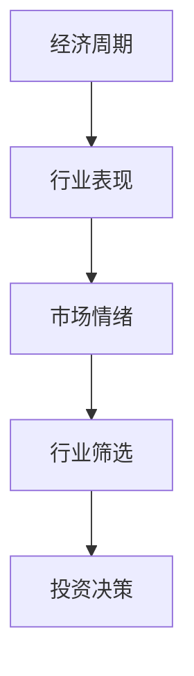

                 

# 彼得林奇的"行业轮动"时机把握

## 关键词：彼得·林奇，行业轮动，投资策略，市场周期，风险管理

## 摘要：彼得·林奇作为投资界的传奇人物，以其独特的行业轮动策略闻名。本文深入分析了行业轮动的基本概念、市场周期的影响、行业筛选方法、时机把握原则以及风险管理策略。通过具体的案例分析和实证研究，揭示了彼得·林奇行业轮动策略的成功奥秘，并为投资者提供了实用的操作建议。

---

# 第一部分: 彼得·林奇的行业轮动投资理念

## 第1章: 彼得·林奇投资理念概述

### 1.1 彼得·林奇的背景与投资风格

#### 1.1.1 彼得·林奇的生平简介
彼得·林奇（Peter Lynch）是美国著名的投资经理和作家，被誉为“普通投资者的最佳基金经理”。他在富达投资公司管理麦哲伦基金期间（1977-1990），取得了令人瞩目的成绩，年化回报率达到29%。林奇的投资风格以价值投资和行业轮动为核心，强调对行业和公司基本面的深入研究。

#### 1.1.2 林奇的投资哲学与成功秘诀
林奇认为，投资的核心在于选择具有增长潜力的行业和公司，同时关注市场的周期性变化。他的成功秘诀包括：
1. **深入研究行业和公司基本面**：林奇强调对行业和公司的深入了解，尤其是在行业轮动中，选择具有增长潜力的行业至关重要。
2. **关注市场周期**：林奇善于根据经济周期的变化调整投资策略，抓住行业轮动的时机。
3. **分散投资，控制风险**：林奇注重分散投资，避免过度集中在单一行业或公司，从而降低风险。

#### 1.1.3 林奇对行业轮动的独特见解
林奇认为，行业轮动是市场周期性变化的结果，不同行业在不同经济周期中的表现差异显著。他提出了“行业轮动时机把握”的策略，即在特定经济周期中，选择表现较好的行业进行投资。

---

## 第2章: 市场周期与行业轮动分析

### 2.1 经济周期对行业轮动的影响

#### 2.1.1 经济周期的定义与阶段划分
经济周期通常分为四个阶段：衰退、复苏、过热和滞胀。每个阶段对应不同的行业表现：
1. **衰退阶段**：公用事业和防御性行业表现较好。
2. **复苏阶段**：周期性行业如制造业和房地产开始复苏。
3. **过热阶段**：科技和成长性行业表现突出。
4. **滞胀阶段**：防御性行业和必需品行业表现较好。

#### 2.1.2 不同经济周期下行业的表现
林奇认为，行业轮动的核心在于识别经济周期的变化，并根据周期选择相应的行业。例如：
- 在衰退阶段，防御性行业（如公用事业、医疗保健）较为稳定。
- 在复苏阶段，周期性行业（如房地产、汽车）逐渐回暖。
- 在过热阶段，成长性行业（如科技、半导体）表现优异。
- 在滞胀阶段，必需品行业（如食品、日用品）需求稳定。

#### 2.1.3 林奇对经济周期的判断方法
林奇通过观察宏观经济指标（如GDP增长率、失业率、通胀率）和市场情绪来判断经济周期的变化。他认为，行业轮动的关键在于准确判断经济周期的转折点。

---

### 2.2 市场情绪与行业轮动的关系

#### 2.2.1 市场情绪的定义与测量
市场情绪是指投资者对市场的整体看法和态度，通常通过市场参与度、成交量、投资者信心指数等指标来衡量。

#### 2.2.2 市场情绪对行业轮动的影响
市场情绪的波动会影响行业的表现。例如，市场情绪高涨时，成长性行业可能被过度炒作；市场情绪低落时，防御性行业可能成为资金避风港。

#### 2.2.3 林奇对市场情绪的分析技巧
林奇认为，市场情绪是行业轮动的重要参考因素。他建议投资者关注市场情绪的变化，并结合宏观经济指标进行综合判断。

---

### 2.3 技术分析与行业轮动的结合

#### 2.3.1 技术分析的基本原理
技术分析通过研究价格走势、成交量等指标，预测市场的未来走势。常用的技术指标包括移动平均线（MA）、相对强弱指数（RSI）和MACD等。

#### 2.3.2 技术分析在行业轮动中的应用
林奇将技术分析与行业轮动结合，通过分析行业指数的走势，判断行业的强弱变化。例如，当行业指数突破长期均线时，可能意味着行业进入上升周期。

#### 2.3.3 林奇对技术分析的评价
林奇认为，技术分析是行业轮动的重要工具，但需要结合基本面分析和宏观经济指标综合判断。

---

## 第3章: 行业分析与筛选方法

### 3.1 行业分析的基本步骤

#### 3.1.1 确定行业分析的目标
行业分析的目标是识别具有增长潜力的行业。林奇通常关注以下几个方面：
1. 行业的市场规模和增长率。
2. 行业的竞争结构（如波特五力模型）。
3. 行业的政策环境和法规变化。

#### 3.1.2 收集行业数据与信息
林奇强调对行业数据的深入研究，包括行业收入、利润、市场份额等指标。常用数据来源包括政府报告、行业研究报告和公司财报。

#### 3.1.3 分析行业基本面与财务指标
林奇通过分析行业的财务指标（如ROE、毛利率、资产负债率）来评估行业的健康状况。

---

### 3.2 行业筛选的标准与策略

#### 3.2.1 行业增长潜力的评估
林奇认为，具有持续增长潜力的行业更值得投资。他通常关注行业的市场需求、技术创新和竞争优势。

#### 3.2.2 行业竞争结构的分析
林奇使用波特五力模型分析行业的竞争结构，重点关注行业的进入壁垒、竞争对手的强度、供应商的议价能力等。

#### 3.2.3 行业政策环境的影响
林奇认为，政策环境对行业的影响不可忽视。例如，政府政策可能影响行业的市场需求、成本结构和竞争格局。

---

### 3.3 林奇的行业筛选框架

#### 3.3.1 林奇的行业轮动框架图

#### 3.3.2 林奇对行业前景的判断标准
林奇提出了以下行业筛选标准：
1. **行业需求稳定**：选择需求刚性、市场空间大的行业。
2. **行业竞争格局清晰**：选择市场集中度高、竞争有序的行业。
3. **行业政策支持**：选择政策鼓励或支持的行业。

#### 3.3.3 林奇行业筛选的实战案例
林奇在管理麦哲伦基金期间，成功投资了多个具有增长潜力的行业，如科技、金融和医疗保健行业。

---

## 第4章: 行业轮动时机的把握

### 4.1 时机选择的基本原则

#### 4.1.1 行业轮动的启动信号
林奇认为，行业轮动的启动信号包括：
1. 行业指数突破长期均线。
2. 行业成交量显著增加。
3. 行业基本面改善。

#### 4.1.2 行业轮动的持续性判断
林奇通过分析行业趋势和市场情绪，判断行业轮动的持续性。例如，行业轮动通常会持续数月甚至数年，具体取决于行业的增长潜力和市场环境。

#### 4.1.3 行业轮动的退出条件
林奇认为，行业轮动的退出条件包括：
1. 行业指数回落至长期均线以下。
2. 行业基本面恶化。
3. 市场情绪转为负面。

---

### 4.2 宏观经济指标与行业轮动

#### 4.2.1 主要宏观经济指标对行业轮动的影响
主要宏观经济指标包括GDP增长率、通胀率、失业率等。这些指标的变化会影响行业的市场需求和成本结构。

#### 4.2.2 宏观经济指标的解读与应用
林奇通过分析宏观经济指标的变化，判断行业的增长潜力和风险。例如，高通胀可能导致行业成本上升，从而影响行业利润。

#### 4.2.3 林奇对宏观经济指标的分析方法
林奇认为，宏观经济指标是行业轮动的重要参考。他通常结合宏观经济指标和市场情绪，判断行业的轮动时机。

---

### 4.3 市场情绪与行业轮动的结合

#### 4.3.1 市场情绪的量化与分析
市场情绪可以通过投资者信心指数、成交量和市场参与度等指标量化。林奇认为，市场情绪的波动是行业轮动的重要驱动因素。

#### 4.3.2 市场情绪对行业轮动的指导作用
市场情绪的高涨可能推动行业轮动，而市场情绪的低落可能导致行业轮动的暂停或逆转。

#### 4.3.3 林奇对市场情绪的实战应用
林奇在实践中，通常通过观察市场情绪的变化，判断行业的轮动时机。例如，当市场情绪高涨时，他可能会增加对成长性行业的投资。

---

## 第5章: 行业轮动投资策略与风险管理

### 5.1 行业轮动的投资组合构建

#### 5.1.1 投资组合的分散化
林奇建议投资者通过分散化降低风险。例如，将资金分配到多个具有不同周期性特征的行业。

#### 5.1.2 行业权重的调整
林奇认为，根据行业轮动的时机，动态调整投资组合中各行业的权重，可以提高投资收益。

#### 5.1.3 行业轮动的投资组合优化
林奇通过优化投资组合的行业配置，实现收益与风险的最优平衡。

---

### 5.2 风险管理与心理控制

#### 5.2.1 风险管理的重要性
林奇认为，风险管理是行业轮动投资成功的关键。他强调投资者需要控制投资风险，避免过度集中投资。

#### 5.2.2 心理控制与纪律性
林奇强调，投资者需要保持纪律性，避免贪婪和恐惧情绪的干扰。例如，当市场情绪高涨时，投资者需要保持冷静，避免盲目追涨杀跌。

#### 5.2.3 风险提示与操作建议
林奇建议投资者：
1. 定期评估投资组合的风险敞口。
2. 设置止损点，避免过度亏损。
3. 避免频繁交易，保持投资策略的稳定性。

---

## 第6章: 案例分析与实证研究

### 6.1 案例分析

#### 6.1.1 案例背景介绍
选择一个具体的行业轮动案例，分析林奇的投资策略和实际表现。

#### 6.1.2 案例分析与解读
通过分析案例，揭示林奇行业轮动策略的有效性和局限性。

#### 6.1.3 案例总结与启示
总结案例的经验和教训，为投资者提供实际操作的启示。

---

## 第7章: 总结与展望

### 7.1 总结
本文系统介绍了彼得·林奇的行业轮动投资理念，包括行业分析、时机把握、投资策略和风险管理等方面。林奇的行业轮动策略成功地将宏观经济分析、行业基本面研究和市场情绪分析相结合，为投资者提供了实用的操作指南。

### 7.2 展望
未来，随着市场的变化和技术的发展，行业轮动策略也将不断演变。投资者需要结合新的市场环境和技术创新，灵活调整投资策略，以应对新的挑战和机遇。

---

## 作者：AI天才研究院/AI Genius Institute & 禅与计算机程序设计艺术 /Zen And The Art of Computer Programming

