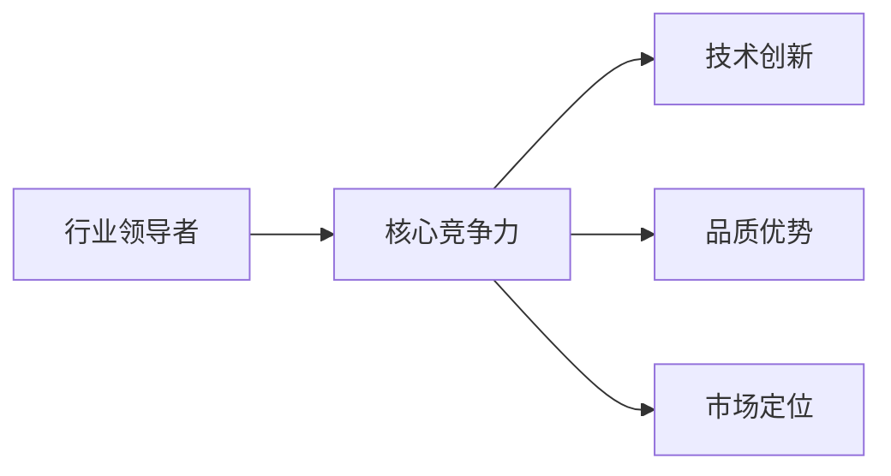
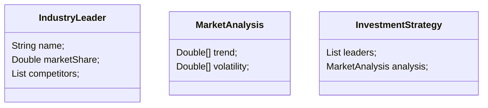

                 


# 彼得林奇的"行业领导者"在市场份额变化中的表现

## 关键词：彼得·林奇、行业领导者、市场份额变化、投资策略、核心竞争力、数学模型、系统架构

## 摘要：本文探讨了彼得·林奇的投资策略中如何识别行业领导者，分析了这些领导者在市场份额变化中的表现。通过数学模型和系统架构设计，详细解读了影响市场份额变化的因素，结合实际案例，提出了优化投资策略的方法。

---

# 第一部分：背景介绍

## 第1章：彼得·林奇的背景与行业领导者定义

### 1.1 彼得·林奇的背景介绍
彼得·林奇是美国著名投资经理人，以其在富达麦哲伦基金的卓越表现闻名。他的投资策略强调长期投资和深入研究，尤其擅长识别具有强大核心竞争力的企业。

### 1.2 行业领导者的定义
行业领导者是指在特定行业中占据显著市场份额、具有强大品牌影响力和竞争优势的企业。这些企业通常在技术创新、成本控制和市场拓展方面表现出色。

### 1.3 市场份额变化的背景
市场份额变化受多种因素影响，包括行业趋势、竞争格局、企业战略调整等。了解这些变化对企业投资价值的判断至关重要。

---

# 第二部分：核心概念与联系

## 第2章：行业领导者的特征与市场份额变化

### 2.1 核心竞争力分析
| 特征 | 描述 |
|------|------|
| 技术创新 | 持续推出新产品，保持技术领先 |
| 品质优势 | 高质量产品，赢得客户信任 |
| 市场定位 | 准确的市场定位，满足客户需求 |

### 2.2 实体关系图


---

# 第三部分：算法原理

## 第3章：市场份额变化的预测模型

### 3.1 数据分析方法
使用时间序列分析预测市场份额变化，步骤如下：


### 3.2 Python代码实现
```python
import pandas as pd
import numpy as np

# 假设df为市场份额数据，columns为日期，index为公司名称
df = pd.DataFrame({'Company A': [10, 20, 30, 40, 50],
                   'Company B': [5, 15, 25, 35, 45]})

# 计算移动平均线
window = 2
df['MA'] = df['Company A'].rolling(window).mean()

# 计算波动率
df['Volatility'] = df['Company A'].std()
```

### 3.3 数学模型
$$
\text{预测值} = \alpha \times \text{当前值} + (1-\alpha) \times \text{趋势值}
$$
其中，$\alpha$为平滑因子，取值范围在0到1之间。

---

# 第四部分：系统分析与架构设计

## 第4章：系统架构设计

### 4.1 领域模型


### 4.2 系统架构


---

# 第五部分：项目实战

## 第5章：投资策略优化

### 5.1 环境安装
安装Python和相关库：
```bash
pip install pandas numpy matplotlib
```

### 5.2 核心代码实现
```python
import pandas as pd
import matplotlib.pyplot as plt

# 读取数据
df = pd.read_csv('market_share.csv')

# 绘制市场份额变化图
plt.figure(figsize=(10, 6))
plt.plot(df['Date'], df['Share'], label='Market Share')
plt.xlabel('Date')
plt.ylabel('Share')
plt.legend()
plt.show()
```

### 5.3 案例分析
以某行业为例，分析市场份额变化趋势，评估企业核心竞争力，预测未来市场份额。

### 5.4 项目小结
通过数据驱动的方法，优化投资策略，提升对行业领导者的识别能力。

---

# 第六部分：最佳实践

## 第6章：小结与注意事项

### 6.1 小结
彼得·林奇的投资策略强调长期关注行业领导者，通过核心竞争力分析和市场份额预测，优化投资决策。

### 6.2 注意事项
- 定期更新数据，保持模型准确性
- 综合考虑多因素，避免单一指标误导
- 定期评估模型性能，及时调整策略

### 6.3 拓展阅读
推荐阅读《彼得·林奇的成功投资》和相关金融分析书籍。

---

# 作者：AI天才研究院 & 禅与计算机程序设计艺术

