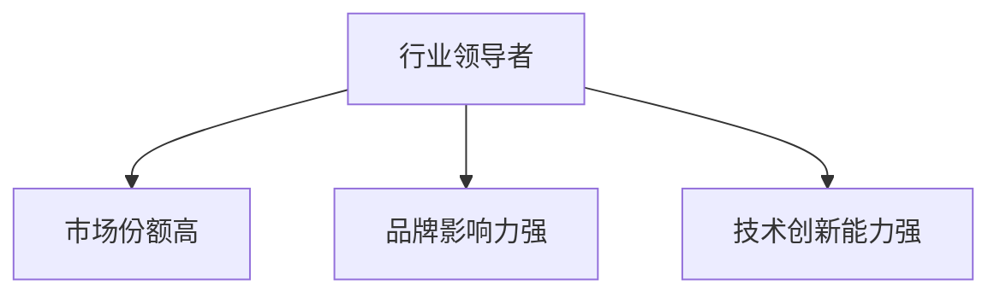

                 

# 彼得林奇的"行业领导者"在技术变革中的适应性

## 关键词：
- 彼得林奇
- 行业领导者
- 技术变革
- 适应性
- 系统架构
- 技术创新

## 摘要：
本文探讨彼得·林奇提出的“行业领导者”在面对技术变革时的适应性问题。通过分析技术变革的类型、行业领导者的定义及其核心竞争力，构建适应性评估模型，并提出技术驱动和管理驱动的适应性提升策略。文章结合系统架构设计和实战案例，深入剖析行业领导者在技术变革中的应对之道，为企业提供实用的参考和启示。

---

# 引言

在当今快速发展的科技时代，技术变革对企业的影响日益显著。彼得·林奇在其投资理论中提出的“行业领导者”概念，为企业在竞争激烈的市场中提供了重要的指导。然而，随着技术的不断进步和市场的变化，行业领导者如何在技术变革中保持领先地位，成为企业面临的重要课题。本文将从理论、模型、系统架构等多个维度，探讨行业领导者在技术变革中的适应性问题。

---

# 第1章: 彼得林奇的行业领导者理论

## 1.1 彼得林奇的行业领导者定义

### 1.1.1 行业领导者的定义

行业领导者是指在特定行业中占据主导地位，拥有显著市场份额、品牌影响力和技术创新能力的企业。这些企业通常在行业中具有领先地位，能够引领行业的发展趋势。

图1.1展示了行业领导者的定义：

### 1.1.2 行业领导者的特征

行业领导者的特征可以归纳为以下几点：

1. **市场占有率高**：行业领导者通常拥有较高的市场份额，能够对市场趋势产生影响。
2. **品牌影响力强**：行业领导者往往具有强大的品牌影响力，能够吸引更多的消费者和合作伙伴。
3. **技术创新能力强**：行业领导者通常具备强大的研发能力，能够引领行业的技术发展。

### 1.1.3 行业领导者的核心竞争力

行业领导者的竞争力主要体现在以下几个方面：

- **技术优势**：行业领导者通常拥有领先的技术，能够在技术变革中占据优势。
- **成本优势**：行业领导者通过规模化生产或技术创新，能够实现成本优势。
- **市场优势**：行业领导者通常具有广泛的市场网络和客户资源。

---

## 1.2 技术变革的背景与影响

### 1.2.1 技术变革的定义

技术变革是指由于技术进步或创新导致的生产方式、商业模式或产业结构的变化。技术变革可以是渐进的，也可以是革命性的。

### 1.2.2 技术变革对企业的影响

技术变革对企业的影响是多方面的，包括：

1. **生产方式的改变**：技术变革可能导致生产流程的优化或自动化，从而提高生产效率。
2. **商业模式的创新**：技术变革可能催生新的商业模式，例如电子商务、共享经济等。
3. **竞争优势的重塑**：技术变革可能改变企业的竞争优势，使某些传统优势企业面临挑战。

### 1.2.3 技术变革中的行业领导者

行业领导者在技术变革中扮演着关键角色。他们不仅需要适应技术变革，还需要引领技术变革，推动行业的发展。

---

# 第2章: 行业领导者在技术变革中的适应性

## 2.1 技术变革中的适应性概念

### 2.1.1 适应性的定义

适应性是指企业能够在技术和市场环境变化中，灵活调整自身战略和运营模式的能力。适应性是企业生存和发展的关键能力。

### 2.1.2 适应性的关键要素

适应性的关键要素包括：

- **战略调整能力**：企业能够根据技术变革调整战略方向。
- **组织灵活性**：企业组织结构能够适应变化，快速响应市场和技术的变化。
- **技术创新能力**：企业能够持续创新，适应技术变革带来的挑战。

### 2.1.3 适应性与行业领导者的关系

行业领导者在技术变革中的适应性对其维持领先地位至关重要。适应性强的行业领导者能够在技术变革中抓住机会，巩固其领导地位。

---

## 2.2 行业领导者适应性评估模型

### 2.2.1 模型的构建

适应性评估模型包括以下几个关键维度：

1. **战略适应性**：企业战略是否能够适应技术变革。
2. **组织适应性**：组织结构和管理是否能够支持适应性。
3. **技术适应性**：技术能力是否能够支持适应性。

### 2.2.2 模型的评估指标

适应性评估模型的指标包括：

- **战略适应性指标**：战略调整频率、战略目标与技术变革的契合度。
- **组织适应性指标**：组织结构的灵活性、员工的适应性。
- **技术适应性指标**：技术创新能力、技术更新速度。

### 2.2.3 模型的验证与应用

模型的验证可以通过实际案例分析进行。例如，分析某行业领导者在技术变革中的适应性表现，验证模型的有效性。

---

# 第3章: 技术变革中的行业领导者分析

## 3.1 技术变革的类型与特点

### 3.1.1 技术变革的类型

技术变革可以分为以下几种类型：

- **渐进式变革**：技术变革是渐进的，逐步改变现有技术和模式。
- **颠覆性变革**：技术变革是革命性的，可能彻底改变现有技术和模式。
- **局部变革**：技术变革仅影响企业的一部分业务。

### 3.1.2 技术变革的特点

技术变革的特点包括：

- **不确定性**：技术变革的结果往往不确定。
- **快速性**：技术变革往往迅速，企业需要快速响应。
- **复杂性**：技术变革可能涉及多个方面，复杂性强。

### 3.1.3 技术变革对企业的影响

技术变革对企业的影响包括：

- **竞争优势的变化**：技术变革可能导致竞争优势的变化。
- **商业模式的创新**：技术变革可能催生新的商业模式。
- **组织结构的调整**：技术变革可能需要企业调整组织结构。

---

## 3.2 行业领导者在技术变革中的应对策略

### 3.2.1 策略的定义

行业领导者在技术变革中的应对策略是指企业为了适应技术变革而采取的一系列措施和行动。

### 3.2.2 策略的分类

应对策略可以分为以下几类：

- **技术驱动策略**：通过技术创新来应对技术变革。
- **管理驱动策略**：通过组织和管理的调整来应对技术变革。
- **合作与并购策略**：通过合作或并购来获取新技术和资源。

### 3.2.3 策略的实施与效果

策略的实施需要企业具备相应的资源和能力。例如，技术驱动策略需要企业具备强大的研发能力，而管理驱动策略需要企业具备灵活的组织结构。

---

# 第4章: 行业领导者适应性提升的路径

## 4.1 技术驱动的适应性提升

### 4.1.1 技术创新对适应性的影响

技术创新是提升企业适应性的关键因素。通过技术创新，企业能够不断优化产品和服务，适应市场需求的变化。

### 4.1.2 技术驱动的适应性提升策略

技术驱动的适应性提升策略包括：

- **持续创新**：企业需要持续进行技术创新，保持技术领先。
- **技术储备**：企业需要储备核心技术，以应对未来的技术变革。
- **技术合作**：企业可以与外部机构合作，获取外部技术资源。

### 4.1.3 技术驱动的适应性提升案例

案例：某高科技公司在人工智能领域的技术创新，通过持续创新和技术合作，成功提升了其在行业中的领先地位。

---

## 4.2 管理驱动的适应性提升

### 4.2.1 管理创新对适应性的影响

管理创新是提升企业适应性的另一个关键因素。通过管理创新，企业能够优化组织结构和流程，提高运营效率。

### 4.2.2 管理驱动的适应性提升策略

管理驱动的适应性提升策略包括：

- **组织结构优化**：企业需要调整组织结构，使其更加灵活和高效。
- **流程优化**：企业需要优化业务流程，提高效率。
- **文化创新**：企业需要塑造创新文化，鼓励员工提出新的想法和建议。

### 4.2.3 管理驱动的适应性提升案例

案例：某传统制造企业通过引入敏捷管理模式，成功提高了其在技术变革中的适应性。

---

# 第5章: 行业领导者适应性提升的系统架构

## 5.1 系统架构设计

### 5.1.1 系统架构概述

系统架构设计是企业适应性提升的重要组成部分。通过设计合理的系统架构，企业能够更好地应对技术变革带来的挑战。

### 5.1.2 系统架构的组成部分

系统架构的组成部分包括：

- **数据层**：数据的采集、存储和处理。
- **业务层**：业务逻辑的实现。
- **应用层**：用户界面和功能实现。
- **接口层**：系统与其他系统之间的接口。

### 5.1.3 系统架构的实现方式

系统架构的实现方式包括：

- **模块化设计**：将系统分解为多个模块，每个模块独立实现功能。
- **微服务架构**：通过微服务架构实现系统的灵活性和可扩展性。

---

## 5.2 系统功能设计

### 5.2.1 系统功能概述

系统功能设计包括以下几个方面：

- **用户管理**：对系统用户进行管理。
- **权限管理**：对用户的权限进行管理。
- **数据管理**：对系统的数据进行管理。

### 5.2.2 系统功能的实现模块

系统功能的实现模块包括：

- **用户登录模块**：实现用户登录功能。
- **用户注册模块**：实现用户注册功能。
- **数据查询模块**：实现数据的查询功能。

### 5.2.3 系统功能的实现流程

系统功能的实现流程包括：

1. 用户登录系统。
2. 系统验证用户的身份。
3. 用户执行相应的操作。
4. 系统处理用户的操作并返回结果。

---

# 第6章: 行业领导者适应性提升的实战案例

## 6.1 实战案例分析

### 6.1.1 案例背景

某行业领导者在面对技术变革时，通过技术创新和管理优化，成功提升了其在市场中的地位。

### 6.1.2 案例分析

案例分析包括以下几个方面：

- **技术创新**：企业通过技术创新，提升了产品的竞争力。
- **管理优化**：企业通过优化管理，提高了运营效率。
- **市场扩展**：企业通过技术创新和管理优化，成功扩展了市场。

### 6.1.3 案例总结

案例总结包括：

- **成功经验**：企业的成功经验可以为其他企业提供借鉴。
- **教训与启示**：案例中的一些教训可以为其他企业提供启示。

---

## 6.2 实战案例的启示

### 6.2.1 案例的启示

案例的启示包括：

- **技术创新的重要性**：技术创新是提升企业适应性的关键。
- **管理优化的必要性**：管理优化是提升企业适应性的另一个关键因素。

### 6.2.2 案例的借鉴

案例的借鉴包括：

- **技术创新的实现**：企业可以通过技术创新实现竞争优势。
- **管理优化的实现**：企业可以通过管理优化实现运营效率的提升。

---

# 结论

彼得·林奇的“行业领导者”在技术变革中的适应性是一个复杂而重要的问题。通过分析技术变革的类型、行业领导者的定义及其核心竞争力，构建适应性评估模型，并提出技术驱动和管理驱动的适应性提升策略，企业可以在技术变革中保持领先地位。本文通过理论分析、模型构建和实战案例，为行业领导者提供了实用的参考和启示。

---

# 作者

作者：AI天才研究院/AI Genius Institute & 禅与计算机程序设计艺术 /Zen And The Art of Computer Programming

