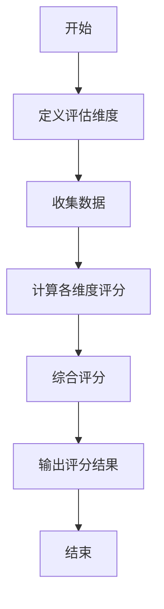
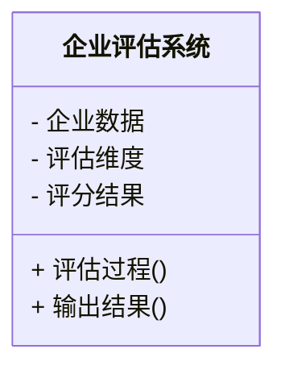
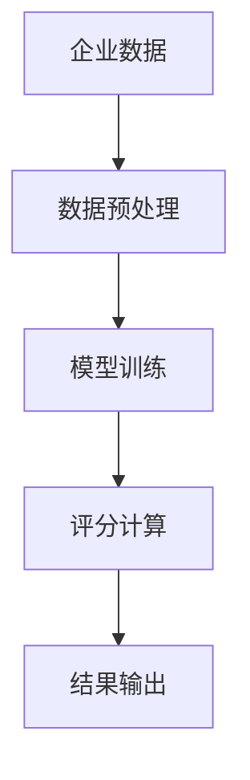
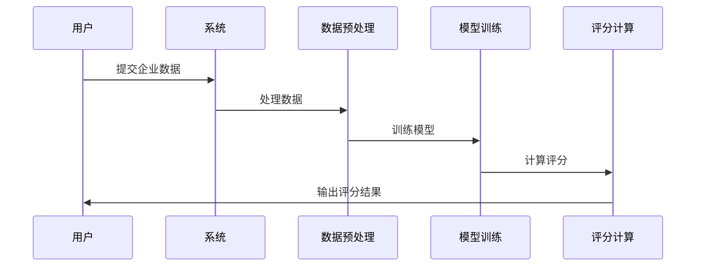

                 


# 彼得林奇的"行业领导者"在技术变革中的适应性评分模型

> 关键词：适应性评分模型，行业领导者，技术变革，彼得林奇，企业评估

> 摘要：本文介绍了一种基于彼得林奇投资理念的行业领导者适应性评分模型，旨在帮助企业评估其在技术变革中的适应能力。模型通过定义关键评估维度，使用数据驱动的方法，结合定量分析和定性分析，为企业提供适应性评分。该模型不仅适用于现有技术变革环境，还能帮助企业预测未来技术变革中的表现，从而优化战略决策。

---

## 目录

1. [背景介绍](#背景介绍)
2. [核心概念与联系](#核心概念与联系)
3. [算法原理讲解](#算法原理讲解)
4. [系统分析与架构设计](#系统分析与架构设计)
5. [项目实战](#项目实战)
6. [最佳实践与小结](#最佳实践与小结)
7. [附录](#附录)

---

## 1. 背景介绍

### 1.1 问题背景

技术变革对企业的影响日益显著，企业能否适应技术变革决定了其在市场中的生存和发展。彼得林奇在其投资理论中强调，投资成功的关键在于选择那些能够在市场中持续表现优秀的公司。然而，在技术快速变革的时代，仅仅选择行业领导者并不足够，还需要评估这些领导者如何适应技术变革。

### 1.2 问题描述

- **技术变革的不确定性**：新技术的出现可能导致市场格局的变化，企业需要灵活应对。
- **行业领导者的定义**：行业领导者通常是指在市场份额、创新能力、品牌影响力等方面处于领先地位的企业。
- **适应性的重要性**：企业能否快速调整战略、技术、组织结构以适应技术变革，决定了其长期竞争力。

### 1.3 问题解决

本文提出了一种适应性评分模型，用于量化评估行业领导者在技术变革中的适应能力。该模型结合了定量分析和定性分析，能够帮助企业识别适应能力强的行业领导者。

### 1.4 边界与外延

- **边界**：模型主要适用于技术驱动的行业，如科技、金融、制造等。
- **外延**：模型不仅适用于当前的技术变革，还能预测未来的技术趋势，帮助企业提前布局。

### 1.5 核心要素

- **适应性评分模型**：量化评估企业适应技术变革的能力。
- **关键评估维度**：技术能力、组织结构、市场反应速度等。
- **数据驱动**：使用历史数据和市场数据进行分析。

---

## 2. 核心概念与联系

### 2.1 评分模型的原理

适应性评分模型通过定义多个评估维度，对企业的适应能力进行评分。评分结果分为五个等级：不适应（1分）、勉强适应（2分）、适应（3分）、良好适应（4分）、优秀适应（5分）。

#### 2.1.1 评分标准

| 维度         | 评估指标               | 评分标准                                                                 |
|--------------|------------------------|--------------------------------------------------------------------------|
| 技术能力     | R&D投入               | 数据来源：企业研发投入占比、专利数量                                       |
| 组织结构     | 管理层灵活性           | 数据来源：企业组织结构调整频率、管理层决策速度                           |
| 市场反应速度  | 市场份额变化           | 数据来源：市场份额变化率、新产品推出速度                                   |
| 供应链管理    | 供应链弹性             | 数据来源：供应链中断恢复时间、供应商多样性                               |
| 企业文化     | 创新文化               | 数据来源：企业文化调研、员工创新积极性                                     |

#### 2.1.2 评估维度对比表

| 维度         | 高适应性特征           | 低适应性特征           |
|--------------|------------------------|------------------------|
| 技术能力     | 高研发投入，多专利     | 低研发投入，少专利     |
| 组织结构     | 灵活，快速决策         | 僵化，决策缓慢         |
| 市场反应速度  | 快速推出新产品         | 缓慢推出新产品         |
| 供应链管理    | 多元化供应商，弹性高     | 供应商单一，弹性低     |
| 企业文化     | 鼓励创新，员工积极性高   | 抵制创新，员工积极性低   |

#### 2.1.3 实体关系图

使用 Mermaid 绘制的实体关系图如下：

```mermaid
er
actor(企业, "被评估的企业")
actor(评估维度, "技术能力、组织结构等")
actor(评分结果, "适应性评分")
```

---

## 3. 算法原理讲解

### 3.1 算法流程

使用 Mermaid 绘制的算法流程图如下：



### 3.2 代码实现

以下是 Python 实现的适应性评分模型：

```python
def adaptive_score(company_data):
    # 定义评估维度及其权重
    dimensions = {
        '技术能力': 0.3,
        '组织结构': 0.2,
        '市场反应速度': 0.2,
        '供应链管理': 0.15,
        '企业文化': 0.15
    }
    
    # 计算各维度评分
    scores = {}
    for dim in dimensions:
        weight = dimensions[dim]
        score = company_data[dim] * weight
        scores[dim] = score
    
    # 综合评分
    total_score = sum(scores.values())
    
    return total_score
```

### 3.3 数学模型与公式

适应性评分模型的数学公式如下：

$$ \text{总评分} = \sum (\text{各维度评分} \times \text{权重}) $$

其中，各维度评分通过以下公式计算：

$$ \text{维度评分} = \text{维度指标值} \times \text{权重} $$

例如，技术能力的评分计算为：

$$ \text{技术能力评分} = \text{研发投入占比} \times 0.3 $$

---

## 4. 系统分析与架构设计

### 4.1 系统功能设计

使用 Mermaid 绘制的系统功能设计类图如下：



### 4.2 系统架构设计

使用 Mermaid 绘制的系统架构图如下：



### 4.3 接口设计与交互

使用 Mermaid 绘制的交互序列图如下：



---

## 5. 项目实战

### 5.1 环境安装

需要安装以下 Python 库：

```bash
pip install pandas numpy matplotlib
```

### 5.2 核心代码实现

以下是实现适应性评分模型的代码：

```python
import pandas as pd
import numpy as np

# 定义适应性评分函数
def compute_adaptive_score(company_data):
    dimensions = ['技术能力', '组织结构', '市场反应速度', '供应链管理', '企业文化']
    weights = [0.3, 0.2, 0.2, 0.15, 0.15]
    scores = []
    for i in range(len(dimensions)):
        score = company_data[dimensions[i]] * weights[i]
        scores.append(score)
    total_score = np.sum(scores)
    return total_score

# 示例数据
data = {
    '技术能力': [0.8, 0.6, 0.7],
    '组织结构': [0.7, 0.5, 0.6],
    '市场反应速度': [0.9, 0.4, 0.5],
    '供应链管理': [0.6, 0.5, 0.4],
    '企业文化': [0.8, 0.7, 0.6]
}
df = pd.DataFrame(data)

# 计算评分
for index in df.index:
    score = compute_adaptive_score(df.iloc[index])
    print(f"企业 {index+1} 的适应性评分为：{score}")
```

### 5.3 案例分析

以某科技公司为例，数据如下：

| 维度         | 技术能力 | 组织结构 | 市场反应速度 | 供应链管理 | 企业文化 |
|--------------|----------|----------|-------------|-----------|----------|
| 企业 A       | 0.8      | 0.7      | 0.9         | 0.6       | 0.8      |

计算总评分为：

$$ 0.8 \times 0.3 + 0.7 \times 0.2 + 0.9 \times 0.2 + 0.6 \times 0.15 + 0.8 \times 0.15 = 0.24 + 0.14 + 0.18 + 0.09 + 0.12 = 0.81 $$

评分结果为 0.81，属于良好适应（4分）。

---

## 6. 最佳实践与小结

### 6.1 最佳实践

- **数据收集**：确保数据的准确性和完整性。
- **模型优化**：根据实际情况调整权重和评估维度。
- **定期评估**：技术变革快速变化，企业应定期重新评估。

### 6.2 小结

适应性评分模型为企业评估行业领导者在技术变革中的适应能力提供了科学的方法。通过量化评估各维度的适应能力，帮助企业识别潜在的风险和机会，优化战略决策。

### 6.3 注意事项

- 模型结果仅供参考，需结合实际情况进行调整。
- 数据质量和模型的适用性直接影响评分结果，需谨慎处理。

### 6.4 拓展阅读

- 彼得林奇的《投资之道》
- 技术变革对企业战略的影响
- 供应链管理的最佳实践

---

## 7. 附录

### 7.1 术语表

- **适应性评分模型**：量化评估企业适应技术变革能力的模型。
- **行业领导者**：在市场份额、创新能力等方面处于领先地位的企业。

### 7.2 参考文献

- 彼得林奇. 《投资之道》
- 技术变革对企业战略的影响研究

### 7.3 索引

- 适应性评分模型：第3章
- 技术变革：第1章

---

作者：AI天才研究院 & 禅与计算机程序设计艺术

