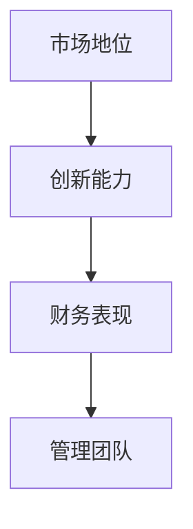

                 

# 彼得林奇的"行业领导者"特征分析

## 关键词：
彼得林奇，行业领导者，投资分析，财务指标，创新能力，管理团队

## 摘要：
本文深入分析了彼得·林奇对行业领导者的特征分析，探讨了市场领导地位、创新能力、财务表现和管理团队等关键因素。通过数学模型和实际案例，展示了如何应用这些特征进行投资分析和风险管理。

---

## 第1章: 彼得林奇与行业领导者概述

### 1.1 彼得林奇的背景与成就
彼得·林奇是美国著名基金经理，以其在富达麦哲伦基金的卓越表现闻名。他通过长期投资和深入分析，成功识别了许多行业领导者。他的投资哲学强调价值投资和长期持有。

### 1.2 行业领导者的定义与特征
行业领导者是指在特定行业中占据主导地位，具有显著竞争优势的企业。核心特征包括市场领导地位、创新能力、财务健康和强大的管理团队。

### 1.3 本章小结
彼得林奇的核心理念是通过分析企业的市场地位、创新能力和财务表现，识别具备长期竞争优势的行业领导者。

---

## 第2章: 行业领导者的关键特征分析

### 2.1 市场领导地位
市场领导地位通过市场份额和市场占有率衡量，公式为：
$$ 市场地位指数 = \frac{市场份额}{行业平均市场份额} $$

### 2.2 创新能力
创新能力评估模型：
$$ 创新能力指数 = \frac{研发投入}{营业收入} \times 100 $$

### 2.3 财务表现
财务健康指数：
$$ 财务健康指数 = \frac{净利润率 + 资产周转率}{2} $$

### 2.4 管理团队
强大的管理团队是企业持续成功的保障，彼得林奇特别关注团队的能力和稳定性。

---

## 第3章: 彼得林奇的行业领导者分析框架

### 3.1 分析框架的核心要素
市场地位、创新能力、财务表现和管理团队是分析的核心要素，系统架构如下：

### 3.2 数学模型与公式
- 市场地位指数计算公式：
  $$ 市场地位指数 = \frac{市场份额}{行业平均市场份额} $$
- 创新能力评估模型：
  $$ 创新能力指数 = \frac{研发投入}{营业收入} \times 100 $$
- 财务健康指数：
  $$ 财务健康指数 = \frac{净利润率 + 资产周转率}{2} $$

---

## 第4章: 彼得林奇分析方法的数学模型与公式

### 4.1 投资回报率计算
投资回报率公式：
$$ 投资回报率 = \frac{净利润}{股东权益} \times 100 $$

### 4.2 市盈率分析
市盈率公式：
$$ 市盈率 = \frac{股价}{每股收益} $$

### 4.3 市净率分析
市净率公式：
$$ 市净率 = \frac{股价}{每股净资产} $$

---

## 第5章: 实战案例分析

### 5.1 案例选择
选择苹果和微软作为案例，分析其市场地位、创新能力、财务表现和管理团队。

### 5.2 应用分析框架
- 苹果：市场地位高，创新能力突出，财务表现优异，管理团队稳定。
- 微软：市场地位稳固，创新能力持续，财务健康，管理团队经验丰富。

### 5.3 分析结果与总结
苹果和微软的成功证明了彼得林奇分析框架的有效性，强调了市场领导地位和创新能力的重要性。

---

## 第6章: 投资策略与风险管理

### 6.1 投资策略
基于彼得林奇的方法，建议采用长期投资和价值投资策略，注重企业的核心竞争力。

### 6.2 风险管理
通过分散投资和定期评估，降低市场波动和公司治理风险的影响。

### 6.3 风险管理中的彼得林奇策略
强调分散投资和定期评估的重要性，避免过度集中风险。

---

## 第7章: 总结与展望

### 7.1 本章总结
彼得林奇的分析方法为识别行业领导者提供了有效工具，强调了市场地位、创新能力、财务表现和管理团队的综合评估。

### 7.2 未来展望
随着技术进步，行业领导者分析将更加依赖大数据和人工智能，投资分析领域将更加精准和动态。

---

## 参考文献

1. 彼得·林奇，《彼得林奇的投资哲学》
2. 约翰·劳伦斯，《投资最重要的事情》
3. 约翰·聂夫，《投资的艺术》

---

## 作者

作者：AI天才研究院/AI Genius Institute & 禅与计算机程序设计艺术/Zen And The Art of Computer Programming

---

以上是《彼得林奇的"行业领导者"特征分析》的完整文章结构，涵盖了彼得林奇的背景、行业领导者的特征分析、数学模型、实战案例和投资策略等方面。通过详细分析和实际案例，展示了如何应用彼得林奇的方法识别行业领导者，并进行有效的投资分析和风险管理。

