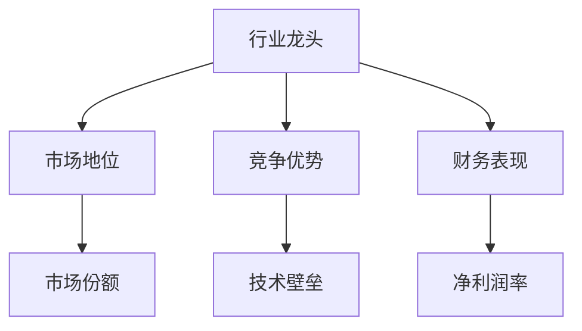
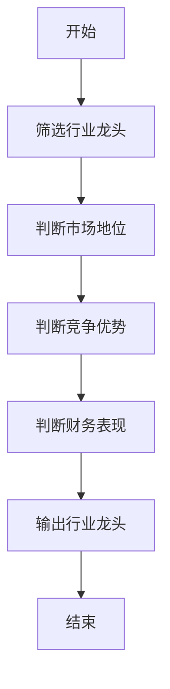
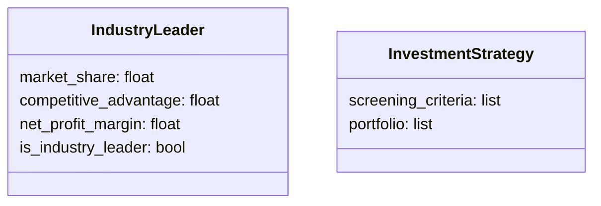
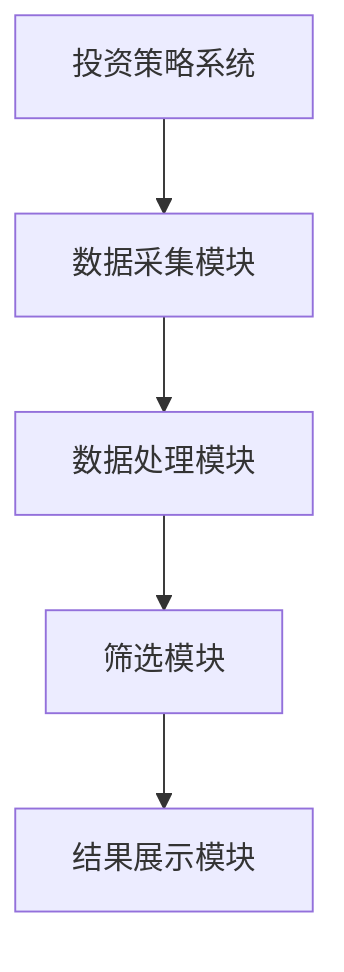

                 


# 彼得林奇的"行业龙头"识别方法

## 关键词：彼得林奇、行业龙头、投资方法、财务分析、竞争优势

## 摘要：本文详细探讨了彼得·林奇识别行业龙头的方法，包括其核心概念、算法原理、数学模型及实际案例分析，帮助读者掌握如何在投资中识别和选择行业龙头企业。

---

# 第一部分：背景介绍

## 第1章：彼得·林奇与行业龙头识别方法

### 1.1 彼得·林奇及其投资理念

- **1.1.1 彼得·林奇的生平简介**
  - 彼得·林奇（Peter Lynch）是美国著名投资家，被誉为“股神”之一，曾任富达麦哲伦基金的经理，创造了卓越的投资业绩。
  - 他强调长期投资和深入研究企业基本面，反对短期投机。

- **1.1.2 林奇的投资哲学与方法**
  - 林奇主张投资于自己了解的公司，关注企业的财务状况和竞争优势。
  - 他认为，行业龙头是那些在各自领域具有强大市场地位和竞争优势的企业。

- **1.1.3 林奇对行业龙头的定义与理解**
  - 行业龙头是指在特定行业中占据主导地位，具有较高市场份额和盈利能力的企业。
  - 这类企业通常具有强大的竞争优势，能够持续为股东创造价值。

### 1.2 行业龙头的定义与特征

- **行业龙头的定义**
  - 行业龙头是指在某一行业中占据领先地位，具有显著竞争优势和市场份额的企业。

- **行业龙头的核心特征**
  - 市场地位：高市场份额，行业影响力大。
  - 竞争优势：技术、成本、品牌等方面的优势。
  - 盈利能力：持续稳定的高利润率和ROE（净资产收益率）。

- **行业龙头的边界与外延**
  - 行业龙头并非固定不变，随着市场变化，新的龙头企业可能会出现。
  - 外延包括朝阳行业的新兴龙头和成熟行业的稳定龙头。

---

# 第二部分：核心概念与联系

## 第3章：行业龙头识别的核心概念

### 3.1 行业龙头的识别标准

- **3.1.1 财务指标分析**
  - 主要关注盈利能力（如ROE）、成长性（如营收增长率）和财务健康状况（如资产负债率）。

- **3.1.2 市场地位与竞争优势**
  - 市场地位：市场份额、品牌影响力。
  - 竞争优势：技术壁垒、成本优势、商业模式创新。

- **3.1.3 行业周期与龙头企业的关系**
  - 行业周期不同阶段，行业龙头的表现和策略也会有所不同。

### 3.2 核心概念对比表

| 特性            | 行业龙头                   | 一般企业                   |
|-----------------|---------------------------|---------------------------|
| 市场地位         | 高市场份额，行业影响力大   | 市场份额小，行业影响力弱   |
| 竞争优势         | 技术、成本、品牌等显著优势 | 竞争优势不明显             |
| 盈利能力         | 高利润率，ROE较高          | 盈利能力较低              |

### 3.3 ER实体关系图



---

# 第三部分：算法原理讲解

## 第4章：行业龙头筛选算法

### 4.1 算法概述

- **筛选逻辑：从市场地位到财务表现**
  - 优先筛选市场地位高的企业，再评估其竞争优势和财务表现。

- **算法目标：最大化投资收益**
  - 通过多维度筛选，找到具有持续盈利能力的行业龙头企业。

### 4.2 算法流程图



### 4.3 算法实现代码

```python
def industry_leader_screening(market_share, competitive_advantage, net_profit_margin):
    if market_share > 0.2 and competitive_advantage > 0.8 and net_profit_margin > 0.15:
        return True
    else:
        return False

# 示例使用
market_share = 0.25
competitive_advantage = 0.9
net_profit_margin = 0.18

result = industry_leader_screening(market_share, competitive_advantage, net_profit_margin)
print(f"行业龙头筛选结果：{result}")
```

### 4.4 算法中的数学模型

- **ROE（净资产收益率）公式**
  $$ \text{ROE} = \frac{\text{净利润}}{\text{净资产}} $$

- **市盈率（P/E）公式**
  $$ \text{P/E} = \frac{\text{股价}}{\text{每股收益}} $$

---

# 第四部分：数学模型与公式

## 第5章：数学模型与公式

### 5.1 财务指标分析公式

- **净利润率**
  $$ \text{净利润率} = \frac{\text{净利润}}{\text{营业收入}} \times 100\% $$

- **ROE（净资产收益率）**
  $$ \text{ROE} = \frac{\text{净利润}}{\text{股东权益}} \times 100\% $$

### 5.2 竞争优势评估模型

- **技术壁垒评估**
  $$ \text{技术壁垒} = \frac{\text{研发投入占比} + \text{专利数量}}{2} $$

---

# 第五部分：系统分析与架构设计

## 第6章：系统分析与架构设计方案

### 6.1 问题场景介绍

- 投资者希望通过系统筛选行业龙头，辅助投资决策。

### 6.2 系统功能设计

- **领域模型类图**



### 6.3 系统架构设计



### 6.4 系统接口设计

- 数据接口：从数据库获取企业数据。
- 筛选接口：根据标准筛选行业龙头。
- 展示接口：以图表形式展示筛选结果。

---

# 第六部分：项目实战

## 第7章：项目实战

### 7.1 环境安装

- **工具安装**
  - 安装Python和相关库（pandas、numpy、matplotlib）。

### 7.2 核心代码实现

```python
import pandas as pd

def load_data(file_path):
    return pd.read_csv(file_path)

def calculate_roe(df):
    df['ROE'] = df['净利润'] / df['股东权益']
    return df

def screen_industry_leaders(df, threshold_roe=0.15, threshold_margin=0.18):
    mask = (df['ROE'] > threshold_roe) & (df['净利率'] > threshold_margin)
    return df[mask]

# 示例运行
data = load_data('industry_data.csv')
data_with_roe = calculate_roe(data)
leaders = screen_industry_leaders(data_with_roe)
print(leaders.head())
```

### 7.3 案例分析

- **案例：假设某行业数据**
  - 筛选出ROE > 15%且净利率 > 18%的企业。

---

# 第七部分：总结

## 第8章：总结与展望

### 8.1 最佳实践 tips

- 持续关注行业动态，及时更新筛选标准。
- 结合宏观经济环境调整投资策略。

### 8.2 小结

- 彼得林奇的方法提供了系统化的行业龙头识别框架，投资者应结合市场变化灵活运用。

### 8.3 注意事项

- 避免仅依赖单一指标，需综合评估企业基本面。
- 定期复盘，及时调整投资组合。

### 8.4 拓展阅读

- 《彼得·林奇的成功投资》
- 《投资之道》

---

# 作者：AI天才研究院 & 禅与计算机程序设计艺术

---

**注：** 以上内容为示例，实际文章需根据具体数据和案例进一步补充完善，确保逻辑清晰、数据准确、案例详实。

