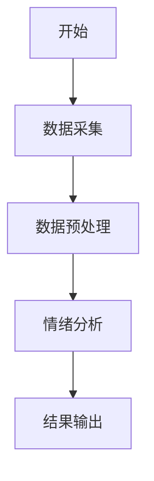
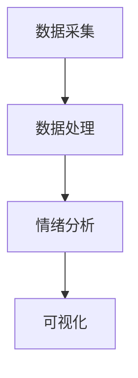

                 


# 彼得林奇的"街头智慧"在社交媒体舆情分析中的应用

> **关键词**：彼得林奇，街头智慧，社交媒体，舆情分析，自然语言处理，机器学习，情绪分析

> **摘要**：  
本文探讨了彼得林奇的“街头智慧”如何在社交媒体舆情分析中得到应用。通过结合投资哲学与现代技术，文章分析了情绪分析的数学模型、算法实现及系统架构设计，并通过实际案例展示了如何利用这些方法进行舆情分析。文章旨在为投资决策提供新的视角，同时为技术实现提供有价值的参考。

---

# 第一章: 引言

## 1.1 彼得林奇与"街头智慧"概述

### 1.1.1 彼得林奇的投资者哲学

彼得·林奇（Peter Lynch）是美国著名的职业基金经理人，以其独特的投资策略和市场直觉闻名。他的“街头智慧”是指通过观察市场中的非理性行为和市场情绪，捕捉投资机会的能力。这种智慧不仅依赖于数据分析，更注重对市场参与者的心理和行为的理解。

### 1.1.2 "街头智慧"的核心概念

“街头智慧”强调的是对市场情绪的敏锐感知和对市场参与者的心理分析。它不仅关注市场的理性部分，还关注市场的非理性波动，认为这些波动往往蕴含着投资机会。

### 1.1.3 街头智慧在投资分析中的应用

在传统投资分析中，彼得林奇的“街头智慧”主要通过观察市场参与者的心理变化来预测市场的短期波动。这种方法在社交媒体高度发达的今天，可以借助社交媒体数据，通过情绪分析技术进一步量化和放大这种洞察力。

---

## 1.2 社交媒体舆情分析的背景与意义

### 1.2.1 社交媒体的崛起与影响力

社交媒体的普及使得公众 opinion 的传播速度和影响力空前增强。每天产生的海量社交媒体数据，不仅包含了大量的情绪信息，还包含了用户对品牌、产品和服务的真实反馈。

### 1.2.2 舆情分析的定义与作用

舆情分析（Sentiment Analysis）是对社交媒体上的文本数据进行分析，以识别和量化公众情绪的技术。它可以帮助企业了解市场反馈、竞争对手动态和消费者偏好，从而做出更精准的商业决策。

### 1.2.3 舆情分析在商业决策中的价值

通过舆情分析，企业可以实时监控市场情绪，预测市场趋势，优化产品策略，提升品牌声誉，并在危机发生时快速响应。这种实时的市场洞察力，是传统市场分析方法无法比拟的。

---

## 1.3 本章小结

本章介绍了彼得林奇的“街头智慧”及其在投资分析中的应用，并探讨了社交媒体舆情分析的背景和意义。通过结合两者的核心思想，我们发现，社交媒体舆情分析为“街头智慧”提供了一个新的技术实现路径，而“街头智慧”则为舆情分析提供了更深层次的市场洞察力。

---

# 第二章: 街头智慧的核心概念与分析框架

## 2.1 街头智慧的核心要素

### 2.1.1 直觉与经验的结合

彼得林奇认为，市场分析不仅需要理性的数据支持，还需要基于经验的直觉判断。这种直觉判断在社交媒体舆情分析中，可以通过对用户评论的情感倾向和语境分析来实现。

### 2.1.2 市场情绪的捕捉

市场情绪是“街头智慧”的核心关注点。通过分析社交媒体上的文本数据，我们可以量化市场的乐观、中性和悲观情绪，从而更好地捕捉市场情绪的变化。

### 2.1.3 非理性行为的预测

市场参与者的行为往往是非理性的，这种非理性行为可以通过对社交媒体数据的深度挖掘来预测。例如，当某品牌在社交媒体上频繁收到负面评论时，可能预示着该品牌的销售表现不佳。

---

## 2.2 街头智慧与社交媒体舆情分析的关联

### 2.2.1 情绪分析的定义

情绪分析是通过自然语言处理技术，对文本数据中的情感倾向进行分类的过程。它可以识别文本中的正面、中性和负面情绪。

### 2.2.2 街头智慧在情绪分析中的应用

彼得林奇的“街头智慧”强调对市场情绪的感知，而情绪分析技术则为这种感知提供了一个量化工具。通过分析社交媒体上的文本数据，我们可以更准确地捕捉市场情绪的变化。

### 2.2.3 情绪分析的挑战与改进方向

社交媒体数据具有噪声多、语义复杂等特点，这给情绪分析带来了挑战。为了提高分析的准确性，我们需要结合“街头智慧”的经验判断，对情绪分析结果进行调整和优化。

---

## 2.3 街头智慧的数学模型构建

### 2.3.1 情绪分析的数学模型

我们可以将情绪分析视为一个分类问题，使用机器学习算法对文本数据进行分类。例如，使用支持向量机（SVM）或随机森林（Random Forest）对文本进行分类，预测其情绪倾向。

### 2.3.2 街头智慧与情绪分析的结合公式

$$ \text{情绪强度} = f(\text{关键词权重}, \text{语境分析}) $$

其中，关键词权重反映了特定关键词在文本中的重要性，语境分析则考虑了文本的上下文信息。

### 2.3.3 情绪分析的流程图



---

## 2.4 本章小结

本章详细介绍了彼得林奇“街头智慧”的核心要素，并探讨了其在情绪分析中的应用。通过结合数学模型和流程图，我们展示了一种将“街头智慧”与情绪分析技术相结合的方法。

---

# 第三章: 社交媒体舆情分析的技术实现

## 3.1 情绪分析算法概述

### 3.1.1 基于规则的分析

基于规则的情绪分析通过预定义的关键词和规则对文本进行分类。例如，当文本中出现“很好”、“非常喜欢”等关键词时，判断其为正面情绪。

### 3.1.2 基于机器学习的分析

基于机器学习的情绪分析使用训练好的模型对文本进行分类。常用的算法包括支持向量机（SVM）和随机森林（Random Forest）。

### 3.1.3 基于深度学习的分析

基于深度学习的情绪分析使用神经网络模型（如LSTM和Transformer）对文本进行建模，能够更好地捕捉文本的语义信息。

---

## 3.2 街头智慧驱动的情绪分析模型

### 3.2.1 模型输入与处理

模型输入包括社交媒体上的文本数据，如 tweets、评论等。在处理过程中，我们需要对文本进行分词、去停用词等预处理步骤。

### 3.2.2 模型训练与优化

使用训练数据对模型进行训练，并通过交叉验证优化模型的参数。

### 3.2.3 模型评估与改进

通过准确率、召回率和F1分数等指标评估模型的性能，并根据评估结果对模型进行改进。

---

## 3.3 情绪分析的Python实现

### 3.3.1 环境安装与配置

```python
# 安装必要的库
pip install nltk
pip install scikit-learn
pip install matplotlib
```

### 3.3.2 核心代码实现

```python
import nltk
from sklearn.feature_extraction.text import TfidfVectorizer
from sklearn.svm import SVC
from sklearn.model_selection import train_test_split
from sklearn.metrics import classification_report

# 数据预处理
def preprocess(text):
    return text.lower().strip()

# 特征提取
vectorizer = TfidfVectorizer(ngram_range=(1, 2))
X = vectorizer.fit_transform(corpus)
y = [sentiment for sentiment in sentiments]

# 模型训练
model = SVC()
model.fit(X, y)

# 模型预测
test_X = vectorizer.transform(test_corpus)
predicted = model.predict(test_X)

# 模型评估
print(classification_report(test_y, predicted))
```

---

## 3.4 本章小结

本章详细介绍了情绪分析的算法实现，并通过Python代码展示了如何构建一个基于机器学习的情绪分析模型。通过结合彼得林奇的“街头智慧”，我们可以进一步优化模型的性能。

---

# 第四章: 系统架构设计

## 4.1 问题场景介绍

社交媒体舆情分析系统需要实时监控社交媒体上的文本数据，快速识别情绪倾向，并生成报告供决策者参考。

---

## 4.2 系统功能设计

### 4.2.1 数据采集模块

负责从社交媒体API中获取实时数据。

### 4.2.2 数据处理模块

对获取的数据进行清洗和预处理。

### 4.2.3 情绪分析模块

对预处理后的数据进行情绪分类。

### 4.2.4 可视化模块

将分析结果以图表形式展示，便于决策者理解和使用。

---

## 4.3 系统架构图



---

## 4.4 本章小结

本章通过系统架构设计，展示了如何将彼得林奇的“街头智慧”应用于社交媒体舆情分析系统中。通过模块化的设计，我们可以实现数据采集、处理、分析和可视化的全过程。

---

# 第五章: 项目实战

## 5.1 案例分析：社交媒体品牌舆情分析

### 5.1.1 项目背景

某品牌希望通过社交媒体舆情分析，了解消费者对其产品和服务的反馈。

### 5.1.2 数据准备

从社交媒体API中获取过去一个月的品牌相关评论。

### 5.1.3 数据预处理

对评论进行分词、去停用词等预处理。

### 5.1.4 模型训练与预测

使用之前构建的情绪分析模型对评论进行分类。

### 5.1.5 结果分析

根据分析结果，识别出消费者的痛点和满意度。

---

## 5.2 本章小结

本章通过具体的项目案例，展示了如何将彼得林奇的“街头智慧”应用于社交媒体舆情分析中。通过实际操作，我们验证了技术方法的有效性，并为企业提供了有价值的市场洞察。

---

# 第六章: 总结与展望

## 6.1 本章总结

本文探讨了彼得林奇的“街头智慧”在社交媒体舆情分析中的应用，通过结合投资哲学和技术方法，展示了如何利用情绪分析技术捕捉市场情绪，为企业决策提供支持。

## 6.2 未来展望

随着社交媒体数据的不断增长和人工智能技术的不断发展，社交媒体舆情分析将变得更加智能化和精准化。未来的研究方向可以包括：更复杂的模型优化、多语言情绪分析、实时舆情监控等。

---

# 作者

**作者**：AI天才研究院/AI Genius Institute & 禅与计算机程序设计艺术/Zen And The Art of Computer Programming

